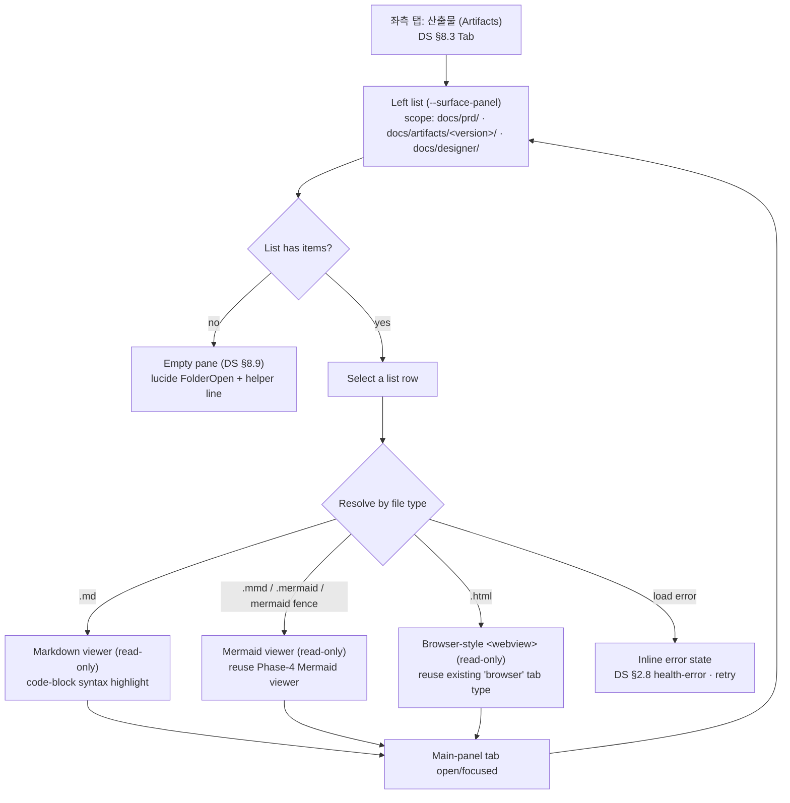

# T-002 · A2 Artifacts viewer — User flow (chunk 1 of 2)

> Ticket: `docs/tickets/v0.5/T-002.md` · PRD: `docs/prd/productune.md` → **A2 — Artifacts tab (new)**
> Scope: **user flow only**. The hi-fi mockup (`docs/artifacts/v0.5/T-002-a2-mockup.html`) is a separate next dispatch.
> Design system: reuse v0.4 (`docs/designer/design-system.md`) — **no net-new DS**.
> Constraints this version: **read-only** (no edit affordance) · **no rich nav / TOC** (→ v0.6).

---

## EN (master)

### Surface model

- **Entry** — a new left-rail tab labeled `산출물` (Artifacts). Tab styling = DS §8.3 Tab (vertical rail, active `--text-emphasis` + 2px `--accent` underline).
- **Left list** — a scoped file list living in the left pane (`--surface-panel`). Sources, in fixed order: `docs/prd/`, `docs/artifacts/<version>/`, `docs/designer/`. List items use `--border-default` separators; row label = `body-dense` recipe; a per-row type glyph (lucide, `--icon-sm`, stroke 2, `currentColor`) signals md / mermaid / html.
- **Main-panel viewer** — selecting a list item opens (or focuses) a main-pane tab whose viewer type is chosen by file extension. The viewer is **read-only** — no edit button, no inline editor, no save.

### Type → viewer routing

| File type | Viewer | Reuse |
|---|---|---|
| `.md` | Markdown viewer with code-block syntax highlight | new md-viewer tab type (DS tokens reused; render tokens land via A9/T-004 — see token-gap flag) |
| `.mmd` / `.mermaid` / fenced ` ```mermaid ` | Mermaid viewer | **reuse the Phase-4 Mermaid viewer** |
| `.html` | Browser-style `<webview>` | **reuse the existing `browser` tab type** (`TabContent.tsx`) |

### Flow diagram



### Numbered step list

1. **Open the tab** — user clicks the left-rail `산출물` tab. The tab activates per DS §8.3 (active `--text-emphasis` + `--accent` underline). The left pane switches to the Artifacts list. No project/terminal/OS-file-explorer step is required to reach this. → maps PRD-AC "reachable GUI-only".
2. **Render the scoped list** — the list shows only files under the three scoped roots, in fixed order `docs/prd/` → `docs/artifacts/<version>/` → `docs/designer/`. Each row shows a type glyph + filename (`body-dense`). Out-of-scope paths never appear. → maps PRD-In "left list scoped to the three roots".
3. **Empty branch** — if the scope resolves to zero files, the pane renders the DS §8.9 Empty pane (lucide `FolderOpen`, `--icon-2xl`, `--text-faint`; headline `heading-section`/`--text-secondary`; one helper line `body-dense`/`--text-muted`). Per DS §1.5.3 the empty state is the Empty component, not a bare placeholder. (No edit/create CTA this version — read-only.)
4. **Select a row** — user clicks a list row. The selection routes by file extension (step 5) and opens or focuses a main-panel tab. Active row = `--surface-subpanel` + left selection treatment consistent with existing list selection.
5. **Resolve viewer by type**:
   - **5a · md →** Markdown viewer. Long-form body uses `--leading-relaxed`; **code blocks render in `--font-mono` with syntax highlight**. Read-only: no edit toggle. (The exact code-block / markdown render color tokens are owned by A9/T-004 — this viewer **reuses** them; see token-gap flag below — no invented tokens here.)
   - **5b · mermaid →** Mermaid viewer. **Reuses the Phase-4 Mermaid viewer** as-is (pan/zoom/render behavior inherited; nothing net-new). Applies to `.mmd` / `.mermaid` files and to ` ```mermaid ` fences encountered inside an md file's render (delegated to the same Phase-4 renderer).
   - **5c · html →** Browser-style view. **Reuses the existing `browser` tab type** (`<webview>`, per `TabContent.tsx`). The html artifact renders as a sandboxed page exactly like the browser tab; no bespoke html renderer is added.
6. **Viewer is read-only** — none of the three viewers expose an edit affordance (no edit button, no editable surface, no save). Read-only is the version-wide invariant. → maps PRD-Out "editing artifacts (read-only this version)".
7. **No rich nav / TOC** — the viewer renders the document body only; no auto-generated table of contents, no heading-jump rail, no cross-doc nav tree. That template is explicitly v0.6. → maps PRD-Out "rich nav / TOC template (→ v0.6)".
8. **Return / switch** — closing or switching away from a viewer tab returns focus to the list; re-selecting a row focuses the already-open tab rather than duplicating it.
9. **Load-error branch** — if a file fails to load/parse, the viewer shows an inline error state using DS §2.8 health-error tokens (lucide `AlertOctagon`, `--icon-sm`) with a retry, per DS §1.5.4 feedback. (Pending vs error vs empty are distinct states per DS §1.5.3 / §8.9.)

### Reverse-map — flow step → PRD A2 acceptance criteria

PRD A2 AC: *"each of md / mermaid / html opens in its correct viewer from the list; html renders in `<webview>`; no terminal or OS file explorer needed to reach any listed artifact."*

| Flow step | PRD A2 criterion satisfied |
|---|---|
| 1 (open tab), 2 (scoped list) | "no terminal or OS file explorer needed to reach any listed artifact" — reachable GUI-only |
| 4 (select) + 5a (md → md viewer) | "md … opens in its correct viewer from the list" |
| 4 (select) + 5b (mermaid → Mermaid viewer) | "mermaid … opens in its correct viewer from the list" (reuse Phase-4 viewer) |
| 4 (select) + 5c (html → `<webview>`) | "html … opens in its correct viewer" + "html renders in `<webview>`" (reuse `browser` tab type) |
| 6 (read-only) | PRD-Out: editing excluded this version |
| 7 (no TOC) | PRD-Out: rich nav / TOC → v0.6 |
| 3 (empty), 9 (error) | DS §1.5.3 / §1.5.4 / §8.9 compliance (state coverage; not a net-new AC) |

---

## (KR)

### 표면 모델

- **진입** — 좌측 레일에 `산출물` 새 탭. 탭 스타일 = DS §8.3 Tab (세로 레일, active `--text-emphasis` + 2px `--accent` underline).
- **좌측 목록** — left pane(`--surface-panel`) 안의 스코프 파일 목록. 소스 고정 순서: `docs/prd/`, `docs/artifacts/<version>/`, `docs/designer/`. 행 구분선 `--border-default`, 행 라벨 `body-dense` recipe, 행마다 타입 글리프(lucide, `--icon-sm`, stroke 2, `currentColor`)로 md / mermaid / html 구분.
- **메인 패널 뷰어** — 목록 행 선택 시 확장자에 따른 뷰어 타입의 메인 패널 탭을 열거나 포커스. 뷰어는 **읽기 전용** — 편집 버튼·인라인 에디터·저장 없음.

### 타입 → 뷰어 라우팅

| 파일 타입 | 뷰어 | 재사용 |
|---|---|---|
| `.md` | 코드블록 syntax highlight 마크다운 뷰어 | 신규 md-viewer 탭 타입 (DS token 재사용; 렌더 token 은 A9/T-004 에서 확정 — token-gap flag 참조) |
| `.mmd` / `.mermaid` / ` ```mermaid ` fence | Mermaid 뷰어 | **Phase-4 Mermaid 뷰어 재사용** |
| `.html` | 브라우저형 `<webview>` | **기존 `browser` 탭 타입 재사용** (`TabContent.tsx`) |

### 흐름도

> 위 EN 블록의 `flowchart TD` mermaid 다이어그램을 동일하게 참조 (단일 SoT, KR 중복 미생성).

### 단계 목록 (번호)

1. **탭 열기** — 좌측 레일 `산출물` 탭 클릭. DS §8.3 대로 활성화(active `--text-emphasis` + `--accent` underline), left pane 이 Artifacts 목록으로 전환. 여기 도달에 프로젝트/터미널/OS 파일 탐색기 단계 불필요. → PRD-AC "GUI 만으로 도달".
2. **스코프 목록 렌더** — 3개 스코프 루트 하위 파일만, 고정 순서 `docs/prd/` → `docs/artifacts/<version>/` → `docs/designer/`. 각 행 = 타입 글리프 + 파일명(`body-dense`). 스코프 밖 경로는 노출 안 됨. → PRD-In "3개 루트로 스코프된 좌측 목록".
3. **빈 상태 분기** — 스코프 결과 0건이면 DS §8.9 Empty pane (lucide `FolderOpen`, `--icon-2xl`, `--text-faint`; headline `heading-section`/`--text-secondary`; helper 1줄 `body-dense`/`--text-muted`). DS §1.5.3 대로 placeholder 단독 금지. (읽기 전용이라 편집/생성 CTA 없음.)
4. **행 선택** — 목록 행 클릭. 확장자로 라우팅(5단계) 후 메인 패널 탭을 열거나 포커스. 활성 행 = `--surface-subpanel` + 기존 list selection 정합.
5. **타입별 뷰어 결정**:
   - **5a · md →** 마크다운 뷰어. 장문 본문 `--leading-relaxed`, **코드블록은 `--font-mono` + syntax highlight**. 읽기 전용(편집 토글 없음). (정확한 코드블록/마크다운 렌더 색 token 은 A9/T-004 소유 — 본 뷰어는 그것을 **재사용**, 아래 token-gap flag 참조, 여기서 token 신규 발명 안 함.)
   - **5b · mermaid →** Mermaid 뷰어. **Phase-4 Mermaid 뷰어 그대로 재사용** (pan/zoom/render 동작 상속, 신규 0). `.mmd`/`.mermaid` 파일 및 md 본문 내 ` ```mermaid ` fence 모두 동일 렌더러에 위임.
   - **5c · html →** 브라우저형 뷰. **기존 `browser` 탭 타입 재사용** (`<webview>`, `TabContent.tsx`). html 산출물을 browser 탭과 동일한 sandboxed 페이지로 렌더; 전용 html 렌더러 추가 안 함.
6. **뷰어 읽기 전용** — 3개 뷰어 모두 편집 affordance 없음(편집 버튼·편집 가능 표면·저장 없음). 읽기 전용 = 버전 전체 불변식. → PRD-Out "편집 제외(읽기 전용)".
7. **rich nav / TOC 없음** — 본문만 렌더; 자동 목차·heading 점프 레일·문서 간 nav 트리 없음. 해당 템플릿은 v0.6. → PRD-Out "rich nav / TOC → v0.6".
8. **복귀 / 전환** — 뷰어 탭을 닫거나 전환하면 목록으로 포커스 복귀. 동일 행 재선택 시 새 탭 중복 생성 없이 기존 탭 포커스.
9. **로드 에러 분기** — 파일 로드/파싱 실패 시 DS §2.8 health-error token (lucide `AlertOctagon`, `--icon-sm`) + retry 인라인 에러, DS §1.5.4 정합. (pending / error / empty 는 DS §1.5.3 / §8.9 대로 별개 상태.)

### 역매핑 — 흐름 단계 → PRD A2 acceptance

PRD A2 AC: *"md / mermaid / html 각각 목록에서 올바른 뷰어로 열린다; html 은 `<webview>` 로 렌더; 어떤 산출물도 터미널/OS 파일 탐색기 없이 도달."*

| 흐름 단계 | 충족 PRD A2 기준 |
|---|---|
| 1 (탭 열기), 2 (스코프 목록) | "터미널/OS 파일 탐색기 불필요" — GUI 만으로 도달 |
| 4 (선택) + 5a (md → md 뷰어) | "md … 목록에서 올바른 뷰어로 열림" |
| 4 (선택) + 5b (mermaid → Mermaid 뷰어) | "mermaid … 올바른 뷰어로 열림" (Phase-4 뷰어 재사용) |
| 4 (선택) + 5c (html → `<webview>`) | "html … 올바른 뷰어" + "html 은 `<webview>` 로 렌더" (`browser` 탭 재사용) |
| 6 (읽기 전용) | PRD-Out: 편집 제외 |
| 7 (TOC 없음) | PRD-Out: rich nav / TOC → v0.6 |
| 3 (빈 상태), 9 (에러) | DS §1.5.3 / §1.5.4 / §8.9 정합 (상태 커버리지) |

---

### Token-gap flag (A9 / T-004 dependency)

The md viewer's **code-block / markdown render color tokens** (syntax-highlight palette, inline-code bg, blockquote rule, link color) are **not present** in v0.4 design-system.md §2. Per `[ctx].dep_note`, A9 (T-004) sets these markdown-render DS tokens, which this A2 md-viewer **reuses**. Not invented here — see `next_question`.
