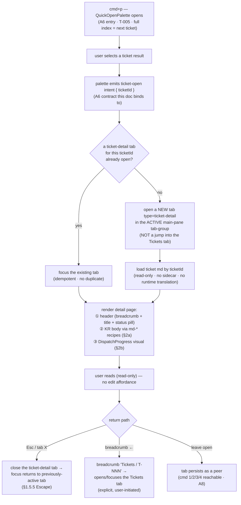

# T-003 · A7 Ticket detail view — User flow (chunk 1 of 2)

> Ticket: `docs/tickets/v0.5/T-003.md` · PRD: `docs/prd/productune.md` → **A7 — Ticket detail view**
> Scope (this doc): **user flow + detail-page content model only**. The hi-fi mockup
> (`docs/artifacts/v0.5/T-003-a7-mockup.html`) is a separate next dispatch — **not authored here**.
> Design system: reuse v0.4 (`docs/designer/design-system.md`) — **no net-new primitives**. Palette
> updated per T-006 Option B: **PO violet `#8B5CF6` · designer orange `#FB923C` · dev sky `#38BDF8` ·
> qa emerald `#34D399`** (§2.5).
> Markdown body renders via the **`md-*` named recipes** owned by `T-004-a9-flow.md §1.1` — reused
> **by name** here, never re-derived (that doc is the single source).
> Out (PRD A7-Out): editing the ticket from the detail view — **read-only render this version**.
> Dependency on A6 (T-005): cmd+p is the **entry**. This doc assumes cmd+p emits a `ticket-open`
> intent and designs the **select → detail routing** only; the full A6 search index is the next ticket.

---

## EN (master)

## 1 · User flow — cmd+p select → ticket detail in the MAIN PANEL

**Core rule (PRD A7 Intent):** selecting a ticket opens a **real detail page in the main panel** —
it does **not** switch the workspace to the Tickets tab. The ticket-detail page is its own
**main-pane tab type** (`ticket-detail`), a peer of the Tickets tab, not a sub-view of it.

### 1.1 Numbered steps

1. **cmd+p entry (A6)** — the user presses cmd+p; the `QuickOpenPalette` opens. *Full A6 search
   spec is the next ticket (T-005); here we bind only to its output.*
2. **Select a ticket** — the user picks a ticket row from the palette results.
3. **`ticket-open` intent** — the palette emits a `ticket-open` intent carrying `{ ticketId }`. This
   is the A6→A7 contract: A7 owns everything **after** this event.
4. **De-dup guard** — if a `ticket-detail` tab for the same `ticketId` is already open in the
   workspace, **focus it** instead of opening a duplicate (idempotent; §1.5.3 Predictability).
5. **Open in the MAIN PANEL** — otherwise open a **new tab of `type: ticket-detail`** in the
   **active main-pane tab-group**. This is the crux of PRD A7: it does **not** switch the workspace
   to the Tickets tab and is **not** a sub-view of it — it is a peer main-pane tab.
6. **Load (read-only)** — load the ticket md by `ticketId`. No sidecar file, no runtime translation
   (per PRD decision-2); the KR body is read straight from the ticket md.
7. **Render the detail page** — three regions: ① a header (breadcrumb `Tickets / T-NNN` + ticket
   title + `status` pill), ② the **KR body** via `md-*` recipes (§2a), ③ the **DispatchProgress**
   visual (§2b).
8. **Read-only** — the page exposes **no edit affordance** this version (PRD A7-Out). Any "edit"
   surface is explicitly absent; the page is a viewer.
9. **Return path / relation to the Tickets tab** — three exits, none a dead-end (§1.5.5 Escape):
   - **Esc or tab `X`** → close the `ticket-detail` tab; focus returns to the previously-active tab.
   - **Breadcrumb `←` (`Tickets / T-NNN`)** → opens/focuses the **Tickets tab** — the *only*
     coupling to it, and only on an explicit, user-initiated click (never automatic).
   - **Leave open** → the tab persists as a peer and is reachable via cmd 1/2/3/4 (A8).
10. **Tickets-tab parity** — a ticket row clicked **inside the Tickets tab** emits the *same*
    `ticket-open` intent (step 3), so both entry points converge on one routing path and one tab
    type. The Tickets tab is a **list**; `ticket-detail` is the **detail** — distinct tabs, never
    merged (§1.5.1 one type per pane).

---

## 2 · Detail-page content model

Three stacked regions inside the `ticket-detail` tab. Surface = `--surface-panel` (§2.1, main-pane
column). Read-only throughout.

### 2.0 Header region

| Element | Recipe / token |
|---|---|
| Breadcrumb `Tickets / T-NNN` | `metadata` recipe (§4.6) · `--text-muted` · `←` lucide `ChevronLeft` `--icon-sm` · the back/Tickets-tab affordance (§1 step 9) |
| Ticket title | `heading-pane` recipe (§4.6) · `--text-emphasis` |
| `status` pill | `pill` recipe + §8.2 **status** variant · color = `--status-<status>` (§2.7) |
| (read-only marker) | a `Lock` lucide glyph `--icon-sm` + `metadata` "읽기 전용" — signals no-edit (§1.5.3) |

### 2a · Korean ticket body — rendered via `md-*` recipes (reuse by name)

The body is the ticket md `## Request (KR)`-style section (PRD A7: authored by designer, **inside**
the ticket md — no sidecar, no runtime translation). It is rendered with the **named `md-*` recipes
from `T-004-a9-flow.md §1.1`** — referenced **by name only**, never re-derived or renamed here.

| Body element | Recipe (source: `T-004-a9-flow.md §1.1`) |
|---|---|
| Section headings (`##`, `###`) | `md-h2`, `md-h3` |
| Paragraphs | `md-body` |
| Bold / strong | `md-strong` |
| Links | `md-link` |
| Inline code (`slug`, `pdt-*`, paths) | `md-code-inline` |
| Fenced code block | `md-code-block` + `md-code-fg` + `md-syntax-*` (mono-leaning subset) |
| Bullet / numbered lists | `md-ul`, `md-ol` |
| Blockquote (the `>` ticket notes) | `md-blockquote` |
| Tables (acceptance grids etc.) | `md-table` / `md-table-th` / `md-table-td` / `md-table-row` |
| Horizontal rule | `md-hr` |

> Protected vocab inside the KR body (`PRD`, `slug`, `status`, `pdt-*`, `T-NNN`) stays English per
> §10.1 — the renderer does not translate; it only styles. The `md-syntax-*` subset inherits
> `T-004-a9-flow.md` OQ-A9-1 (multi-hue palette deferred) — A7 adds no new color here.

### 2b · DispatchProgress visual — persona session state + next action

A compact panel below the body that answers *"where is this ticket in its dispatch, who is on it
now, and what happens next?"* It is **derived/read-only** — it renders state, it does not drive it.

**Fields it reads** (source of truth → render):

| Field | Source | Renders as |
|---|---|---|
| `status` | ticket frontmatter | the header `status` pill (§2.0) + colors the "next action" line |
| `assignee` | ticket frontmatter (`pdt-<persona>`) | highlights **which persona currently owns** the ticket (its dot gets the active treatment) |
| `persona_sessions` | runtime PO state (per-persona session) | the **persona rail**: each persona's live state `active` / `working` / `idle` |
| `qa_status`, `qa_loops` | ticket frontmatter | a small `metadata` line when `type` involves QA (`qa_status` ≠ `n/a`) — orientation only |
| **next action** | **derived** from `status` + `assignee` (+ `qa_status`) | the one-line "다음" statement (see derivation below) |

**Persona rail** — reuses the PersonaPresenceBar pattern (§8.6): one row of four persona markers,
each a `--radius-full` dot + `label` name + `metadata` state. **Persona colors (the four hexes,
T-006 Option B §2.5):**

| Persona | Token | Hex |
|---|---|---|
| `PO` | `--persona-po` | `#8B5CF6` (violet) |
| `designer` | `--persona-designer` | `#FB923C` (orange) |
| `developer` | `--persona-dev` | `#38BDF8` (sky) |
| `qa` | `--persona-qa` | `#34D399` (emerald) |

Per-persona state mapping (driven by `persona_sessions` × `assignee`):

| State | Visual | Source token / motion |
|---|---|---|
| `active`/`working` (this is the `assignee` and its session is live) | full-opacity dot + `persona-blink` | §9.2 `persona-blink` (reduced-motion → static) |
| `idle` (has a session but not currently the owner) | full-opacity dot, no blink | static `--persona-*` |
| `off` (no session) | dot at `--text-faint`, `metadata` "—" | §2.3 `--text-faint` |

> §1.2 color-count: the rail shows up to 4 persona hues. To stay within "≤4 colored element types
> per screen", the rest of the page is monochrome-first — the only other hue is the single `status`
> pill (status and persona share no hue conflict; the pill is one type, the rail is one type).

**Next-action line** — a single derived sentence (e.g. *"다음: developer 가 구현 착수 대기"*,
*"다음: qa 검증 대기 (`qa_status: pending`)"*, *"완료 — 다음 action 없음"*). Derivation precedence:

1. `status: blocked` → "차단 — <blocker> 해소 대기" (`--status-blocked` accent).
2. `status: review` / `qa_status: pending` → "<assignee 다음 persona> 검증/리뷰 대기".
3. `status: in-progress` → "<assignee> 진행 중".
4. `status: todo` → "<assignee> 착수 대기".
5. `status: done` → "완료 — 다음 action 없음".

> The next-action line is **informational** (read-only) — it surfaces state for orientation
> (§1.5.2 progressive info) but exposes **no action button** this version (consistent with A7-Out).
> When a ticket has no live `persona_sessions` yet, the rail shows all-`off` + next-action from
> `status`/`assignee` alone — never an empty dead panel (§1.5.3 Empty vs Pending).

---

## 3 · Reverse-map — each flow step → PRD A7 acceptance criteria

PRD A7 AC: *"cmd+p ticket-select opens the detail page in the main panel (does **not** switch to the
Tickets tab); the page shows the KR body and the dispatch/persona progress visual."*

| Flow step / model piece | PRD A7 criterion satisfied |
|---|---|
| §1.1 steps 1–3 (cmd+p → select → `ticket-open` intent) | "cmd+p ticket-select …" (entry; A6 contract) |
| §1.1 step 5 (open `type: ticket-detail` in active main-pane group) | "opens the detail page **in the main panel**" |
| §1.1 step 5 + step 10 (peer tab; Tickets tab stays a separate list) | "does **not** switch to the Tickets tab" (Intent: "not a jump into the Tickets tab") |
| §1.1 step 4 (de-dup focus) | Predictability (§1.5.3) — no duplicate detail tabs |
| §1.1 step 6 + §2a (load ticket md, render KR body via `md-*`) | "the page shows the **KR body**" |
| §2b (DispatchProgress: persona rail + next-action) | "the dispatch/**persona progress visual**" |
| §1.1 step 8 + §2.0 read-only marker | PRD A7-Out "editing … from the detail view" (excluded — read-only) |
| §1.1 step 9 (Esc / breadcrumb / leave-open exits) | §1.5.5 Escape — no dead-end (UX doctrine compliance) |

> **Reuse note** — §2a renders the KR body strictly via the `md-*` recipes owned by
> `T-004-a9-flow.md §1.1`; this doc references them **by name** and re-derives nothing. The
> mockup dispatch (T-003 chunk 2) will instantiate these regions in HTML — no new tokens.

---

## (KR)

## 1 · 사용자 흐름 — cmd+p 선택 → 메인 패널 티켓 상세

> mermaid 다이어그램은 위 EN §1 `flowchart TD` 동일 참조(단일 SoT, KR 중복 미생성).

**핵심 규칙 (PRD A7 Intent)**: 티켓 선택 시 **메인 패널에 실제 상세 페이지**가 열린다 —
워크스페이스가 Tickets 탭으로 **전환되지 않는다**. 티켓 상세는 자체 **메인 패널 탭 타입**
(`ticket-detail`)으로, Tickets 탭의 하위 뷰가 아니라 **동급 탭**이다.

### 1.1 단계

1. **cmd+p 진입 (A6)** — cmd+p 로 `QuickOpenPalette` 오픈. *A6 검색 전체 spec 은 다음 티켓(T-005);
   여기서는 그 출력에만 바인딩.*
2. **티켓 선택** — palette 결과에서 티켓 행 선택.
3. **`ticket-open` intent** — palette 가 `{ ticketId }` 를 담은 `ticket-open` intent 발행. 이것이
   A6→A7 계약이며, A7 은 이 이벤트 **이후** 전부를 소유.
4. **중복 방지 가드** — 같은 `ticketId` 의 `ticket-detail` 탭이 이미 열려 있으면 새로 열지 않고
   **포커스**(idempotent; §1.5.3).
5. **메인 패널에 오픈** — 아니면 **활성 메인 패널 탭 그룹**에 **`type: ticket-detail` 새 탭**을 연다.
   PRD A7 의 핵심: Tickets 탭으로 **전환하지 않으며** 그 하위 뷰도 **아니다** — 동급 메인 패널 탭.
6. **로드 (읽기 전용)** — `ticketId` 로 ticket md 로드. sidecar 없음, 런타임 번역 없음(PRD
   decision-2); KR 본문은 ticket md 에서 직접 읽음.
7. **상세 페이지 렌더** — 3 영역: ① 헤더(breadcrumb `Tickets / T-NNN` + 제목 + `status` pill),
   ② **KR 본문** `md-*` recipe(§2a), ③ **DispatchProgress** 시각화(§2b).
8. **읽기 전용** — 이번 버전은 **편집 affordance 없음**(PRD A7-Out). 편집 표면은 명시적으로 부재; 뷰어.
9. **복귀 경로 / Tickets 탭 관계** — 막다른 골목 없는 3 출구(§1.5.5 Escape):
   - **Esc / 탭 `X`** → `ticket-detail` 탭 닫고 직전 활성 탭으로 포커스 복귀.
   - **breadcrumb `←`(`Tickets / T-NNN`)** → **Tickets 탭** 오픈/포커스 — Tickets 탭과의 *유일한*
     연결이며, 명시적 사용자 클릭 시에만(자동 전환 절대 없음).
   - **그대로 두기** → 동급 탭으로 잔존, cmd 1/2/3/4(A8) 로 접근 가능.
10. **Tickets 탭 정합** — Tickets 탭 **안의** 티켓 행 클릭도 *동일* `ticket-open` intent(3 단계) 발행 →
    두 진입점이 하나의 라우팅·하나의 탭 타입으로 수렴. Tickets 탭 = **목록**, `ticket-detail` =
    **상세** — 별개 탭, 병합 금지(§1.5.1 한 pane 한 type).

## 2 · 상세 페이지 콘텐츠 모델

`ticket-detail` 탭 안 3 영역 스택. surface = `--surface-panel`(§2.1). 전반 읽기 전용.

### 2.0 헤더 영역

| 요소 | recipe / token |
|---|---|
| breadcrumb `Tickets / T-NNN` | `metadata`(§4.6) · `--text-muted` · `←` lucide `ChevronLeft` `--icon-sm` · 뒤로/Tickets 탭 affordance(§1 9단계) |
| 티켓 제목 | `heading-pane`(§4.6) · `--text-emphasis` |
| `status` pill | `pill` + §8.2 **status** 변형 · 색 `--status-<status>`(§2.7) |
| (읽기 전용 표식) | `Lock` lucide `--icon-sm` + `metadata` "읽기 전용" — 편집 불가 신호(§1.5.3) |

### 2a · 한국어 본문 — `md-*` recipe 로 렌더(이름으로 재사용)

본문은 ticket md `## Request (KR)` 형 섹션(PRD A7: designer 작성, ticket md **내부** — sidecar 없음,
런타임 번역 없음). **`T-004-a9-flow.md §1.1` 의 named `md-*` recipe** 로 렌더 — **이름으로만** 참조,
여기서 재유도/재명명 안 함.

| 본문 요소 | recipe (source: `T-004-a9-flow.md §1.1`) |
|---|---|
| 섹션 제목(`##`, `###`) | `md-h2`, `md-h3` |
| 단락 | `md-body` |
| 굵게 | `md-strong` |
| 링크 | `md-link` |
| 인라인 코드(`slug`, `pdt-*`, 경로) | `md-code-inline` |
| 펜스 코드블록 | `md-code-block` + `md-code-fg` + `md-syntax-*`(mono-leaning subset) |
| 목록(불릿/번호) | `md-ul`, `md-ol` |
| 인용(`>` 노트) | `md-blockquote` |
| 표(acceptance 그리드 등) | `md-table` / `md-table-th` / `md-table-td` / `md-table-row` |
| 수평선 | `md-hr` |

> KR 본문 내 보호어(`PRD`, `slug`, `status`, `pdt-*`, `T-NNN`)는 §10.1 대로 영문 유지 — 렌더러는
> 번역하지 않고 스타일만. `md-syntax-*` subset 은 `T-004-a9-flow.md` OQ-A9-1(다중 hue 보류) 상속,
> A7 은 신규 색 추가 안 함.

### 2b · DispatchProgress 시각화 — 페르소나 세션 상태 + 다음 action

본문 아래 compact 패널. *"이 티켓이 dispatch 어디쯤, 지금 누가, 다음은 무엇"* 에 답한다.
**파생/읽기 전용** — 상태를 렌더할 뿐 구동하지 않음.

**읽는 필드** (SoT → 렌더):

| 필드 | source | 렌더 |
|---|---|---|
| `status` | ticket frontmatter | 헤더 `status` pill(§2.0) + "다음 action" 라인 색 |
| `assignee` | ticket frontmatter(`pdt-<persona>`) | **현재 소유 페르소나** 강조(해당 dot active 처리) |
| `persona_sessions` | 런타임 PO 상태(페르소나별 세션) | **페르소나 레일**: 각 페르소나 live 상태 `active`/`working`/`idle` |
| `qa_status`, `qa_loops` | ticket frontmatter | QA 관여 시(`qa_status` ≠ `n/a`) 소형 `metadata` 라인 — orientation only |
| **다음 action** | `status` + `assignee`(+ `qa_status`) **파생** | 한 줄 "다음" 진술(아래 도출) |

**페르소나 레일** — PersonaPresenceBar 패턴(§8.6) 재사용: 4 페르소나 마커 1 행, 각 `--radius-full`
dot + `label` 이름 + `metadata` 상태. **페르소나 색(4 hex, T-006 Option B §2.5):**

| 페르소나 | token | hex |
|---|---|---|
| `PO` | `--persona-po` | `#8B5CF6`(violet) |
| `designer` | `--persona-designer` | `#FB923C`(orange) |
| `developer` | `--persona-dev` | `#38BDF8`(sky) |
| `qa` | `--persona-qa` | `#34D399`(emerald) |

페르소나별 상태 매핑(`persona_sessions` × `assignee` 구동):

| 상태 | 시각 | token / motion |
|---|---|---|
| `active`/`working`(이 티켓 `assignee` + 세션 live) | full-opacity dot + `persona-blink` | §9.2 `persona-blink`(reduced-motion → 정적) |
| `idle`(세션 있으나 현 소유 아님) | full-opacity dot, blink 없음 | 정적 `--persona-*` |
| `off`(세션 없음) | dot `--text-faint`, `metadata` "—" | §2.3 `--text-faint` |

> §1.2 색 개수: 레일은 최대 4 페르소나 hue. "한 화면 색 요소 ≤ 4" 유지 위해 나머지 페이지는
> monochrome-first — 다른 hue 는 `status` pill 하나뿐(status 와 persona hue 충돌 없음; pill 1 종,
> 레일 1 종).

**다음-action 라인** — 파생 한 문장(예: *"다음: developer 가 구현 착수 대기"*, *"다음: qa 검증
대기(`qa_status: pending`)"*, *"완료 — 다음 action 없음"*). 도출 우선순위:

1. `status: blocked` → "차단 — <blocker> 해소 대기"(`--status-blocked` accent).
2. `status: review` / `qa_status: pending` → "<다음 persona> 검증/리뷰 대기".
3. `status: in-progress` → "<assignee> 진행 중".
4. `status: todo` → "<assignee> 착수 대기".
5. `status: done` → "완료 — 다음 action 없음".

> 다음-action 라인은 **정보 전용**(읽기 전용) — orientation(§1.5.2)을 위해 상태를 노출하나 이번
> 버전은 **action 버튼 없음**(A7-Out 정합). `persona_sessions` 가 아직 없으면 레일은 전부 `off` +
> `status`/`assignee` 만으로 다음-action 표시 — 빈 죽은 패널 금지(§1.5.3 Empty vs Pending).

## 3 · 역매핑 — 각 단계 → PRD A7 acceptance

PRD A7 AC: *"cmd+p 티켓 선택이 메인 패널에 상세 페이지를 연다(Tickets 탭으로 전환 안 함); 페이지가
KR 본문 + dispatch/persona 진행 시각화를 표시."*

| 흐름 단계 / 모델 조각 | 충족 PRD A7 기준 |
|---|---|
| §1.1 1–3 (cmd+p → 선택 → `ticket-open`) | "cmd+p 티켓 선택 …"(진입; A6 계약) |
| §1.1 5 (활성 메인 패널 그룹에 `type: ticket-detail`) | "**메인 패널에** 상세 페이지를 연다" |
| §1.1 5 + 10 (동급 탭; Tickets 탭은 별도 목록 유지) | "Tickets 탭으로 **전환 안 함**"(Intent: "Tickets 탭으로 점프 아님") |
| §1.1 4 (중복 포커스) | Predictability(§1.5.3) — 상세 탭 중복 없음 |
| §1.1 6 + §2a (ticket md 로드, `md-*` 로 KR 본문) | "페이지가 **KR 본문** 표시" |
| §2b (DispatchProgress: 페르소나 레일 + 다음-action) | "dispatch/**persona 진행 시각화**" |
| §1.1 8 + §2.0 읽기 전용 표식 | PRD A7-Out "상세 뷰 편집"(제외 — 읽기 전용) |
| §1.1 9 (Esc / breadcrumb / 그대로 두기 출구) | §1.5.5 Escape — 막다른 골목 없음(UX doctrine) |

> **재사용 노트** — §2a 는 KR 본문을 `T-004-a9-flow.md §1.1` 소유 `md-*` recipe 로만 렌더; 본 문서는
> 이름으로 참조하고 재유도 없음. mockup dispatch(T-003 chunk 2)가 이 영역을 HTML 로 인스턴스화 —
> 신규 token 없음.

---

## Notes for the mockup dispatch (T-003 chunk 2 — not authored here)

- Instantiate the three regions (§2.0 header / §2a KR body / §2b DispatchProgress) in HTML using
  lucide-react icons (`ChevronLeft`, `Lock`, persona dots) — **no color emoji** (§7.1).
- The KR body recipes (`md-*`) come from `T-004-a9-flow.md` — the mockup must reuse, not redefine.
- DispatchProgress persona rail = the four T-006 Option B hexes; `active` owner dot uses
  `persona-blink` (§9.2), reduced-motion static.
