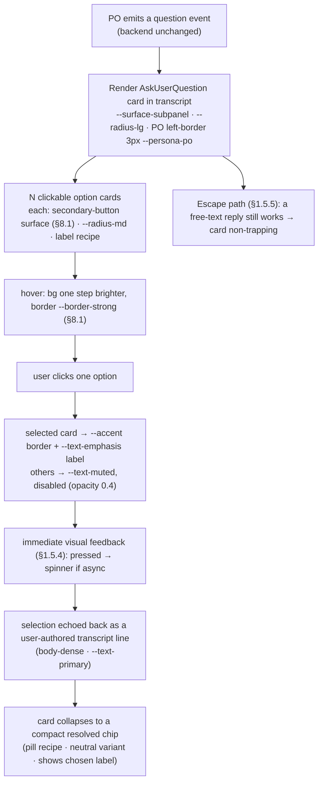
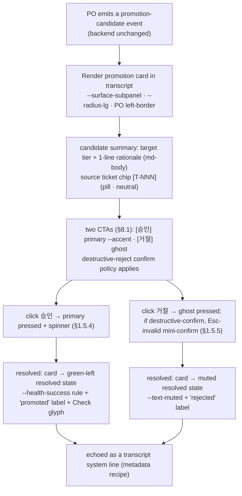

# T-004 · A9 PO chat upgrade — User flow + markdown-token mapping (chunk 1 of 2)

> Ticket: `docs/tickets/v0.5/T-004.md` · PRD: `docs/prd/productune.md` → **A9 — PO chat upgrade**
> Scope: **markdown render + inline-action interaction surface only**. The hi-fi mockup
> (`docs/artifacts/v0.5/T-004-a9-mockup.html`) is a separate next dispatch — not authored here.
> Design system: reuse v0.4 (`docs/designer/design-system.md`) — **no net-new color primitives**.
> Out: chat backend / streaming / markdown-engine swap (PRD A9-Out). Render + interaction only.
>
> **This doc's token mapping is the SOURCE that A2 (T-002 md-viewer) and A7 (T-003 ticket-detail)
> reuse.** It resolves the `token-gap flag` raised at the bottom of `T-002-a2-flow.md`. The recipes
> below are **named** so downstream tickets reference the name, not a re-derived token list.

---

## EN (master)

## 1 · Markdown-render token mapping (the source for A2 / A7)

Principle: A9 invents **no new color primitive**. Each markdown element maps to a **named recipe**
composed only from v0.4 §2/§3/§4/§5 tokens. Where a v0.4 primitive genuinely does not exist
(multi-hue code syntax-highlight palette), it is **flagged as `next_question`**, not invented — see §1.3.

### 1.1 Named recipes (compose from v0.4 tokens)

| # | Markdown element | Recipe name | Composition (v0.4 tokens only) |
|---|---|---|---|
| R1 | **Heading h1** | `md-h1` | `heading-section` recipe (§4.6, `--text-lg`/semibold) · color `--text-emphasis` · margin-top `--space-5`, bottom `--space-2` |
| R2 | **Heading h2** | `md-h2` | `--text-md-plus`/`--weight-semibold`/`--leading-tight` · color `--text-primary` · margin-top `--space-4`, bottom `--space-2` |
| R3 | **Heading h3** | `md-h3` | `label` recipe (§4.6, `--text-md`/medium) · color `--text-secondary` · margin-top `--space-3` |
| R4 | **Body paragraph** | `md-body` | `body-dense` recipe (§4.6, `--text-base`/regular) · color `--text-primary` · `--leading-normal` · paragraph gap `--space-2` |
| R5 | **Bold / strong** | `md-strong` | inherit `md-body` · `--weight-semibold` · color `--text-emphasis` |
| R6 | **Link** | `md-link` | color `--accent` · underline on hover only · focus-visible outline `2px --accent` offset `2px` (§8.1 focus convention) |
| R7 | **Inline code** | `md-code-inline` | `--font-mono` · `--text-sm` · color `--text-primary` · bg `color-mix(--surface-subpanel)` (= §2.1 `--surface-subpanel`) · padding `--space-0-5` × `--space-1` · `--radius-xs` |
| R8 | **Fenced code block — container** | `md-code-block` | `--font-mono` · `--text-sm` · `--leading-snug` · bg `--surface-base` (one step deeper than message bubble `--surface-subpanel`, satisfies §2.1 ≥4% delta) · border `--border-default` · `--radius-lg` · padding `--space-3` |
| R8b | **Code block — default token color** | `md-code-fg` | color `--text-secondary` (all code text when highlight is OFF / unknown lang) |
| R9 | **Code block — syntax highlight** | `md-syntax-*` | **see §1.2 — mono-leaning subset mapped now; full multi-hue palette is `next_question` OQ-A9-1** |
| R10 | **Unordered list** | `md-ul` | `md-body` text · marker color `--text-muted` · marker = `•` glyph (no color emoji) · indent `--space-4` · item gap `--space-1` |
| R11 | **Ordered list** | `md-ol` | `md-body` text · number color `--text-muted` · `--font-mono` numerals for alignment · indent `--space-4` · item gap `--space-1` |
| R12 | **Blockquote** | `md-blockquote` | left rule `3px solid --border-strong` · bg `--surface-subpanel` · text `body-dense`/`--text-secondary` · padding `--space-2` × `--space-3` · `--radius-md` (mirrors §8.4 Banner left-bar pattern, neutral variant) |
| R13 | **Table — wrapper** | `md-table` | border-collapse · outer border `--border-default` · `--radius-lg` clip · `--text-sm` |
| R14 | **Table — header row** | `md-table-th` | bg `--surface-subpanel` · text `label` recipe/`--text-emphasis` · `--weight-semibold` · bottom border `--border-strong` · padding `--space-1-5` × `--space-3` |
| R15 | **Table — body cell** | `md-table-td` | text `body-dense`/`--text-primary` · padding `--space-1-5` × `--space-3` |
| R16 | **Table — row border / zebra** | `md-table-row` | row separator `--border-subtle` · optional zebra = alternate `--surface-panel` (one step off bubble bg) |
| R17 | **Horizontal rule (hr)** | `md-hr` | `1px solid --border-default` · margin `--space-3` 0 |

> All 17 recipes draw only from existing v0.4 primitives. The **only** primitive that does not exist
> in v0.4 is a dedicated multi-hue **code syntax-highlight palette** — handled in §1.2 / §1.3, not invented here.

### 1.2 Syntax-highlight (`md-syntax-*`) — what maps now vs. what is flagged

v0.4 §2 has neutrals + persona/status/stage/health hues, but **no dedicated code-syntax palette**, and
§1.2 caps "colored element types per screen ≤ 4" + "monochrome-first". A full 6-hue highlighter would be a
net-new primitive **and** risks the §1.2 color-count rule inside a code block. So A9 ships a **monochrome-leaning
subset now** (zero new primitives) and **defers the optional multi-hue palette to `next_question` OQ-A9-1**.

| Syntax token | Recipe (subset shipped now) | v0.4 source |
|---|---|---|
| `md-syntax-default` | code default text | `--text-secondary` |
| `md-syntax-comment` | comments / muted | `--text-faint` |
| `md-syntax-keyword` | keywords / control | `--text-emphasis` + `--weight-semibold` (weight-coded, not hue-coded) |
| `md-syntax-string` | strings / literals | `--health-success` `#34D399` (reused as the single hue accent; ≤1 colored type in-block) |
| `md-syntax-number` | numbers | `--text-primary` |
| `md-syntax-punctuation` | punctuation / operators | `--text-muted` |

> This subset keeps the code block within §1.2 (≤1 hue beyond neutrals). The richer multi-hue
> developer-grade palette (keyword/type/function/string each its own hue) is **OQ-A9-1** below — a PO
> decision, not a designer invention. A2/A7 reuse `md-syntax-*` by name; if OQ-A9-1 later adds hues, the
> recipe names stay stable and only their hex backings change (same pattern as v0.4 §2.6 stage TBD slots).

### 1.3 Net-new-primitive flag (genuinely missing in v0.4)

- **Missing**: a developer-grade **multi-hue syntax-highlight palette** (distinct hues for
  keyword / type / function / string / number / comment). v0.4 §2 has none, and adding 5-6 hues would
  (a) be net-new primitives and (b) collide with §1.2 "≤4 colored types per screen".
- **Not invented here.** Shipped now = the monochrome-leaning `md-syntax-*` subset (§1.2), which composes
  only from existing tokens. The richer palette is raised as **`next_question` OQ-A9-1** for PO.

---

## 2 · Interaction flow — two inline-action surfaces

Both surfaces render **inside the chat transcript** as a card (`--surface-subpanel`, `--radius-lg`,
PO-border-left `3px --persona-po` matching ChatPanel message border, §8.6 / References). Neither changes
the chat backend or streaming — they are render + click surfaces bound to existing PO question / promotion events.

### 2.1 Surface A — native AskUserQuestion option-card

**Numbered steps (Surface A)**

1. **Render** — on a PO question event, an AskUserQuestion card renders in the transcript. Card = `--surface-subpanel`, `--radius-lg`, left border `3px --persona-po` (matches existing ChatPanel persona message border). Prompt text = `md-body`. → maps PRD-AC "a PO question renders clickable option cards".
2. **Option cards** — each answer is a clickable card styled as a `secondary` button (§8.1: `--surface-subpanel` bg, `--border-default`, `--radius-md`, `label` recipe). Cards laid out as a vertical stack (or 2-col grid if ≥4 short options). Per §1.2 keep colored element types ≤ 4.
3. **Hover** — hover brightens bg one step + border → `--border-strong` (§8.1, §1.5.3 predictable hover). `--motion-fast` 120ms.
4. **Click → selection state** — clicked card gets `--accent` border + `--text-emphasis` label (the selected affordance). Unselected cards go `--text-muted` + disabled (opacity 0.4, §8.1 disabled). This is the immediate ≤100ms feedback (§1.5.4 tier 1).
5. **Async feedback** — if dispatching the answer is async, the selected card shows an inline `Loader2` (`pdt-spin`, §9.2) until ack (§1.5.4 tier 2).
6. **Echo into transcript** — the chosen option is appended to the transcript as a **user-authored line** (`body-dense` / `--text-primary`), so the conversation reads naturally and the answer is part of history. (§1.5.4 tier 3 completion.) → maps PRD-AC "act inline" + "first-class surface".
7. **Collapse to resolved chip** — after echo, the card collapses to a compact resolved state: a neutral `pill` (§8.2 neutral variant) showing the chosen label + a `Check` glyph (`--icon-xs`, `--health-success`). Re-rendering the transcript shows the resolved chip, not live buttons (idempotent history).
8. **Escape** — per §1.5.5, the card is **non-trapping**: the user may ignore the cards and type a free-text reply in the chat composer; the question card then resolves to a "answered by text" muted state. No dead-end.

### 2.2 Surface B — inline promotion approve/reject card

**Numbered steps (Surface B)**

1. **Render** — on a promotion-candidate event, a promotion card renders in the transcript (same card shell as 2.1: `--surface-subpanel`, `--radius-lg`, PO left-border `3px --persona-po`). → maps PRD-AC "promotion approve/reject is actionable inline from chat".
2. **Card body** — shows the candidate: target tier + 1-line rationale (`md-body`), plus a source-ticket chip `[T-NNN]` (`pill`, neutral §8.2). Keeps the user oriented (§1.5.2 progressive info).
3. **Two CTAs** — `[승인]` = `primary` button (`--accent`, §8.1) bottom-right; `[거절]` = `ghost` button to its left. CTA count = 2 (§1.5.1 modal/card CTA ≤ 2). Button position fixed per §1.5.3 (primary right).
4. **Approve click** — `[승인]` shows pressed state + inline `Loader2` (§9.2) while the promotion commits (§1.5.4 tiers 1–2).
5. **Reject click** — `[거절]` is treated as mildly destructive: pressed state, then a compact inline confirm ("거절하면 candidate 가 사라집니다 — 거절?") whose Esc is invalid and which has an explicit `[Cancel]` (§1.5.5 destructive policy). On confirm, reject commits.
6. **Resolved — approve** — card transitions to a resolved state: left rule recolors to `--health-success`, label "promoted ✓" (`Check` glyph `--icon-xs`, `--health-success`), CTAs removed (§1.5.4 tier 3 completion).
7. **Resolved — reject** — card transitions to a muted resolved state: `--text-muted`, label "rejected", CTAs removed. dismiss-but-recoverable note per §1.5.5 (the candidate is gone, but the transcript line persists as a record — no silent loss).
8. **Echo into transcript** — both outcomes append a `metadata`-recipe (§4.6) system line into the transcript so history reads as a record. Re-render shows the resolved card, never live buttons (idempotent).

---

## 3 · Reverse-map — flow / mapping → PRD A9 acceptance criteria

PRD A9 AC: *"tables/code/list/blockquote render on design-system tokens; a PO question renders clickable
option cards; promotion approve/reject is actionable inline from chat."*

| Deliverable piece | PRD A9 criterion satisfied |
|---|---|
| §1.1 R13–R16 (`md-table*`) | "tables … render on design-system tokens" (the "currently ugly" table → DS-token recipe) |
| §1.1 R7–R9 + §1.2 (`md-code-inline` / `md-code-block` / `md-syntax-*`) | "code … render on design-system tokens" |
| §1.1 R10–R11 (`md-ul` / `md-ol`) | "list … render on design-system tokens" |
| §1.1 R12 (`md-blockquote`) | "blockquote … render on design-system tokens" |
| §2.1 steps 1–2 (AskUserQuestion render + option cards) | "a PO question renders clickable option cards" |
| §2.1 steps 4–7 (selection → echo → resolved chip) | "act inline" + "first-class surface" (PRD A9 Intent) |
| §2.2 steps 1–3 (promotion card + 승인/거절 CTAs) | "promotion approve/reject is actionable inline from chat" |
| §2.2 steps 6–8 (resolved + echo) | inline actionability completes a full round-trip (Intent: "act inline") |
| §1.3 / OQ-A9-1 | flags the one genuinely-missing primitive instead of inventing — DS §1 token-driven compliance |

> **A2 / A7 reuse note** — `T-002-a2-flow.md` §5a + its token-gap flag, and the T-003 A7 ticket-detail
> viewer, both reuse §1.1 recipes **by name** (`md-table*`, `md-code-block`, `md-syntax-*`, …). This doc
> is their single source; downstream viewers must not re-derive or rename.

---

## (KR)

## 1 · 마크다운 렌더 token 매핑 (A2 / A7 의 source)

원칙: A9 는 **신규 색 primitive 를 발명하지 않는다**. 각 마크다운 요소를 v0.4 §2/§3/§4/§5 token 만으로
조합한 **named recipe** 에 매핑한다. v0.4 에 primitive 가 실제로 없는 경우(다중 hue 코드 syntax-highlight
palette)는 **발명하지 않고 `next_question` 으로 flag** — §1.3 참조.

### 1.1 Named recipe (v0.4 token 조합)

| # | 마크다운 요소 | Recipe 명 | 구성 (v0.4 token 만) |
|---|---|---|---|
| R1 | **Heading h1** | `md-h1` | `heading-section`(§4.6) · 색 `--text-emphasis` · margin-top `--space-5`, bottom `--space-2` |
| R2 | **Heading h2** | `md-h2` | `--text-md-plus`/`--weight-semibold`/`--leading-tight` · 색 `--text-primary` · margin-top `--space-4` |
| R3 | **Heading h3** | `md-h3` | `label`(§4.6, `--text-md`/medium) · 색 `--text-secondary` · margin-top `--space-3` |
| R4 | **본문 단락** | `md-body` | `body-dense`(§4.6, `--text-base`/regular) · 색 `--text-primary` · `--leading-normal` · 단락 간격 `--space-2` |
| R5 | **굵게 / strong** | `md-strong` | `md-body` 상속 · `--weight-semibold` · 색 `--text-emphasis` |
| R6 | **링크** | `md-link` | 색 `--accent` · hover 시에만 underline · focus-visible `2px --accent` offset `2px`(§8.1) |
| R7 | **인라인 코드** | `md-code-inline` | `--font-mono` · `--text-sm` · 색 `--text-primary` · bg `--surface-subpanel`(§2.1) · padding `--space-0-5` × `--space-1` · `--radius-xs` |
| R8 | **펜스 코드블록 — 컨테이너** | `md-code-block` | `--font-mono` · `--text-sm` · `--leading-snug` · bg `--surface-base`(버블 `--surface-subpanel` 보다 한 단 깊음, §2.1 ≥4% delta 충족) · border `--border-default` · `--radius-lg` · padding `--space-3` |
| R8b | **코드블록 — 기본 색** | `md-code-fg` | 색 `--text-secondary`(highlight OFF / unknown lang 시 코드 전체) |
| R9 | **코드블록 — syntax highlight** | `md-syntax-*` | **§1.2 참조 — mono-leaning subset 지금 매핑; 다중 hue palette 는 `next_question` OQ-A9-1** |
| R10 | **순서 없는 목록** | `md-ul` | `md-body` 텍스트 · marker 색 `--text-muted` · marker `•`(컬러 emoji 금지) · indent `--space-4` · item gap `--space-1` |
| R11 | **순서 있는 목록** | `md-ol` | `md-body` 텍스트 · 번호 색 `--text-muted` · 정렬용 `--font-mono` 숫자 · indent `--space-4` |
| R12 | **인용(blockquote)** | `md-blockquote` | 좌측 rule `3px solid --border-strong` · bg `--surface-subpanel` · 텍스트 `body-dense`/`--text-secondary` · padding `--space-2` × `--space-3` · `--radius-md`(§8.4 Banner 좌측 bar 패턴 neutral 변형) |
| R13 | **표 — wrapper** | `md-table` | border-collapse · outer border `--border-default` · `--radius-lg` clip · `--text-sm` |
| R14 | **표 — 헤더 행** | `md-table-th` | bg `--surface-subpanel` · 텍스트 `label`/`--text-emphasis` · `--weight-semibold` · 하단 border `--border-strong` · padding `--space-1-5` × `--space-3` |
| R15 | **표 — 본문 셀** | `md-table-td` | 텍스트 `body-dense`/`--text-primary` · padding `--space-1-5` × `--space-3` |
| R16 | **표 — 행 구분 / zebra** | `md-table-row` | 행 구분선 `--border-subtle` · zebra(선택) = 교차 `--surface-panel` |
| R17 | **수평선(hr)** | `md-hr` | `1px solid --border-default` · margin `--space-3` 0 |

> 17개 recipe 모두 기존 v0.4 primitive 만 사용. v0.4 에 **없는** 유일한 primitive = 전용 다중 hue
> **코드 syntax-highlight palette** — §1.2 / §1.3 처리, 여기서 발명 안 함.

### 1.2 Syntax-highlight (`md-syntax-*`) — 지금 매핑 vs flag

v0.4 §2 에는 neutral + persona/status/stage/health hue 만 있고 **전용 코드 syntax palette 가 없으며**,
§1.2 가 "한 화면 색 요소 ≤ 4" + "monochrome-first" 를 강제한다. 6-hue highlighter 는 net-new primitive 이자
코드블록 내부에서 §1.2 색 개수 규칙과 충돌한다. 그래서 A9 는 **mono-leaning subset 을 지금 제공**(신규 0)하고
**선택적 다중 hue palette 는 `next_question` OQ-A9-1 로 보류**.

| Syntax token | Recipe (지금 제공 subset) | v0.4 source |
|---|---|---|
| `md-syntax-default` | 코드 기본 텍스트 | `--text-secondary` |
| `md-syntax-comment` | 주석 / muted | `--text-faint` |
| `md-syntax-keyword` | 키워드 / 제어 | `--text-emphasis` + `--weight-semibold`(hue 아닌 weight 코딩) |
| `md-syntax-string` | 문자열 / 리터럴 | `--health-success` `#34D399`(블록 내 단일 hue accent ≤1) |
| `md-syntax-number` | 숫자 | `--text-primary` |
| `md-syntax-punctuation` | 구두점 / 연산자 | `--text-muted` |

> 이 subset 은 코드블록을 §1.2(neutral 외 hue ≤1) 안에 둔다. developer 급 다중 hue palette
> (keyword/type/function/string 각 hue)는 아래 **OQ-A9-1** — designer 발명 아닌 PO 결정. A2/A7 은
> `md-syntax-*` 를 이름으로 재사용; OQ-A9-1 이 hue 를 추가해도 recipe 명은 그대로, hex backing 만 교체
> (v0.4 §2.6 stage TBD 슬롯과 동일 패턴).

### 1.3 Net-new-primitive flag (v0.4 에 실제 없음)

- **없음**: developer 급 **다중 hue syntax-highlight palette**(keyword/type/function/string/number/comment
  각각 hue). v0.4 §2 에 없고, 5-6 hue 추가는 (a) net-new primitive 이고 (b) §1.2 "색 요소 ≤ 4" 와 충돌.
- **여기서 발명 안 함.** 지금 제공 = mono-leaning `md-syntax-*` subset(§1.2, 기존 token 만 조합). 풍부한
  palette 는 **`next_question` OQ-A9-1** 로 PO 에 제기.

---

## 2 · 인터랙션 흐름 — 인라인 액션 표면 2종

두 표면 모두 **chat transcript 안**에 카드로 렌더(`--surface-subpanel`, `--radius-lg`, PO 좌측 border
`3px --persona-po` — ChatPanel 메시지 border 정합, §8.6 / References). 둘 다 chat backend / streaming 변경
없음 — 기존 PO question / promotion 이벤트에 바인딩된 렌더 + 클릭 표면.

### 2.1 표면 A — 네이티브 AskUserQuestion 옵션 카드

> mermaid 다이어그램은 위 EN §2.1 `flowchart TD` 동일 참조(단일 SoT, KR 중복 미생성).

**단계 (표면 A)**

1. **렌더** — PO question 이벤트 시 transcript 에 AskUserQuestion 카드 렌더. 카드 = `--surface-subpanel`,
   `--radius-lg`, 좌측 border `3px --persona-po`(기존 ChatPanel persona border 정합). prompt 텍스트 =
   `md-body`. → PRD-AC "PO 질문 시 클릭 가능 옵션 카드".
2. **옵션 카드** — 각 답변은 `secondary` 버튼(§8.1: `--surface-subpanel` bg, `--border-default`,
   `--radius-md`, `label` recipe) 스타일의 클릭 카드. 세로 스택(짧은 옵션 ≥4 면 2-col grid). §1.2 색 요소 ≤ 4.
3. **hover** — hover 시 bg 한 단 밝게 + border → `--border-strong`(§8.1, §1.5.3 예측 가능 hover).
   `--motion-fast` 120ms.
4. **클릭 → 선택 상태** — 클릭 카드는 `--accent` border + `--text-emphasis` 라벨(선택 affordance). 미선택
   카드는 `--text-muted` + disabled(opacity 0.4, §8.1). ≤100ms 즉시 feedback(§1.5.4 tier 1).
5. **비동기 feedback** — 답변 전송이 비동기면 선택 카드에 inline `Loader2`(`pdt-spin`, §9.2) ack 까지 표시
   (§1.5.4 tier 2).
6. **transcript echo** — 선택한 옵션을 **사용자 작성 라인**(`body-dense`/`--text-primary`)으로 transcript 에
   append → 대화가 자연스럽게 읽히고 답변이 history 의 일부가 됨(§1.5.4 tier 3 완료). → PRD-AC "act inline" +
   "first-class surface".
7. **resolved chip 로 축소** — echo 후 카드는 compact resolved 로 축소: 선택 라벨 + `Check` 글리프
   (`--icon-xs`, `--health-success`)를 가진 neutral `pill`(§8.2). transcript 재렌더 시 live 버튼 아닌
   resolved chip 표시(idempotent history).
8. **Escape** — §1.5.5 대로 카드는 **non-trapping**: 사용자는 카드 무시하고 chat composer 에 자유 텍스트로
   답해도 됨; 그러면 질문 카드는 "텍스트로 답함" muted 상태로 resolve. 막다른 골목 없음.

### 2.2 표면 B — 인라인 promotion 승인/거절 카드

> mermaid 다이어그램은 위 EN §2.2 `flowchart TD` 동일 참조(단일 SoT, KR 중복 미생성).

**단계 (표면 B)**

1. **렌더** — promotion-candidate 이벤트 시 transcript 에 promotion 카드 렌더(2.1 과 동일 카드 쉘:
   `--surface-subpanel`, `--radius-lg`, PO 좌측 border `3px --persona-po`). → PRD-AC "promotion 승인/거절을
   chat 에서 인라인 actionable".
2. **카드 본문** — candidate 표시: target tier + 1줄 rationale(`md-body`) + source-ticket chip
   `[T-NNN]`(`pill`, neutral §8.2). 사용자 orientation 유지(§1.5.2 점진적 정보).
3. **CTA 2종** — `[승인]` = `primary` 버튼(`--accent`, §8.1) 우하단; `[거절]` = 그 왼쪽 `ghost` 버튼.
   CTA 수 = 2(§1.5.1 카드 CTA ≤ 2). 버튼 위치 §1.5.3 고정(primary 우측).
4. **승인 클릭** — `[승인]` pressed + inline `Loader2`(§9.2) promotion commit 까지(§1.5.4 tier 1–2).
5. **거절 클릭** — `[거절]` 은 약한 destructive: pressed 후 compact inline confirm("거절하면 candidate 가
   사라집니다 — 거절?") — Esc 무효 + 명시 `[Cancel]`(§1.5.5 destructive 정책). confirm 시 reject commit.
6. **resolved — 승인** — 카드 resolved 전환: 좌측 rule 을 `--health-success` 로 recolor, 라벨 "promoted ✓"
   (`Check` 글리프 `--icon-xs`, `--health-success`), CTA 제거(§1.5.4 tier 3 완료).
7. **resolved — 거절** — 카드 muted resolved 전환: `--text-muted`, 라벨 "rejected", CTA 제거. §1.5.5
   dismiss-but-recoverable: candidate 는 사라지나 transcript 라인은 기록으로 잔존(무성 손실 없음).
8. **transcript echo** — 두 결과 모두 `metadata` recipe(§4.6) system 라인을 transcript 에 append → history
   가 기록으로 읽힘. 재렌더 시 live 버튼 아닌 resolved 카드 표시(idempotent).

---

## 3 · 역매핑 — 흐름 / 매핑 → PRD A9 acceptance

PRD A9 AC: *"tables/code/list/blockquote 가 design-system token 으로 렌더; PO 질문이 클릭 가능 옵션 카드로
렌더; promotion 승인/거절이 chat 에서 인라인 actionable."*

| 산출물 조각 | 충족 PRD A9 기준 |
|---|---|
| §1.1 R13–R16 (`md-table*`) | "tables … DS token 렌더"(기존 "안 이쁜" 표 → DS-token recipe) |
| §1.1 R7–R9 + §1.2 (`md-code-inline`/`md-code-block`/`md-syntax-*`) | "code … DS token 렌더" |
| §1.1 R10–R11 (`md-ul`/`md-ol`) | "list … DS token 렌더" |
| §1.1 R12 (`md-blockquote`) | "blockquote … DS token 렌더" |
| §2.1 단계 1–2 (AskUserQuestion 렌더 + 옵션 카드) | "PO 질문이 클릭 가능 옵션 카드로 렌더" |
| §2.1 단계 4–7 (선택 → echo → resolved chip) | "act inline" + "first-class surface"(PRD A9 Intent) |
| §2.2 단계 1–3 (promotion 카드 + 승인/거절 CTA) | "promotion 승인/거절이 chat 에서 인라인 actionable" |
| §2.2 단계 6–8 (resolved + echo) | 인라인 actionability 가 full round-trip 완료(Intent: "act inline") |
| §1.3 / OQ-A9-1 | 발명 대신 누락 primitive 1건을 flag — DS §1 token-driven 정합 |

> **A2 / A7 재사용 노트** — `T-002-a2-flow.md` §5a + token-gap flag, 그리고 T-003 A7 ticket-detail 뷰어가
> §1.1 recipe 를 **이름으로** 재사용(`md-table*`, `md-code-block`, `md-syntax-*` …). 본 문서가 단일 source;
> 하위 뷰어는 재유도/재명명 금지.

---

## Open question (raised to PO)

- **OQ-A9-1** — Code syntax-highlight: ship only the monochrome-leaning `md-syntax-*` subset (§1.2, zero
  new primitives, stays within DS §1.2 "≤4 colored types"), or authorize a **net-new developer-grade
  multi-hue palette** (distinct hues for keyword / type / function / string / number / comment)? The
  multi-hue option is the only piece requiring a net-new v0.4 color primitive and a §1.2 color-count
  exception for code blocks — a PO call, not invented here. Recipe names stay stable either way.
