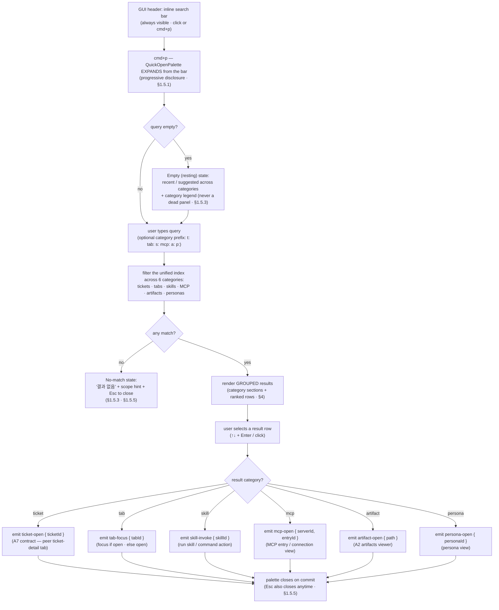

# T-005 · A6 cmd+p header search — User flow (chunk 1 of 2)

> Ticket: `docs/tickets/v0.5/T-005.md` · PRD: `docs/prd/productune.md` → **A6 — cmd+p header expansion**
> Scope (this doc): **user flow + per-category result/routing model only**. The hi-fi mockup
> (`docs/artifacts/v0.5/T-005-a6-mockup.html`) is a separate next dispatch — **not authored here**.
> Design system: reuse v0.4 (`docs/designer/design-system.md`) — **no net-new primitives**. Palette
> updated per T-006 Option B: **PO violet `#8B5CF6` · designer orange `#FB923C` · dev sky `#38BDF8` ·
> qa emerald `#34D399`** (§2.5). The header search bar + palette inherit `--accent` `#8B5CF6` for
> focus ring / active-row highlight (§2.4).
> **Reuse, not net-new** — A6 **extends the existing `QuickOpenPalette`** (already indexes
> files / tickets / personas / skills). This doc only adds **3 new index sources** (tabs / MCP /
> artifacts) and binds the palette to the header bar. No new search engine.
> **A7 seam (honored, not re-derived)** — selecting a **ticket** result emits exactly the
> `ticket-open { ticketId }` intent defined in `docs/artifacts/v0.5/T-003-a7-flow.md §1.1 step 3`
> (opens a `type: ticket-detail` **peer** main-pane tab — **NOT** a jump into the Tickets tab).
> A6 owns *emitting* that intent; A7 owns everything after it.
> Out (PRD A6-Out): **full-text content search inside artifact contents** — artifacts are indexed by
> **path / title / metadata only** this version.

---

## EN (master)

## 1 · User flow — header bar → cmd+p expand → 6-category filter → route

**Core rule (PRD A6 Intent):** *one* VS Code-style search entry covers everything navigable. The
GUI header carries a **always-visible inline search bar**; `cmd+p` expands that same bar into the
**`QuickOpenPalette`** overlay. Typing filters across **6 categories** in one list; selecting a
result emits **one category-typed routing intent** — A6 routes, it does not render the destination.

### 1.1 Numbered steps

1. **Header search bar (resting)** — the GUI header carries an **always-visible inline search bar**
   (placeholder e.g. *"검색 — cmd+p"*). It is the single, predictable entry point (§1.5.3); a
   non-engineer can click it, a developer can hit `cmd+p` — both land in the same place (§1.5.2 IDE
   pattern + familiarity).
2. **cmd+p expands the bar → palette** — `cmd+p` (or clicking the bar) **expands that same bar** into
   the `QuickOpenPalette` overlay — it does not open a separate window. Advanced search is hidden
   until invoked (§1.5.1 progressive disclosure). The palette is dismissible by `Esc`, backdrop
   click, or the header `X` (§1.5.5 — Quick Open Esc is mandatory).
3. **Empty (resting) state** — with an empty query the palette shows **recent + suggested** rows
   across categories plus a one-line category legend — never a blank dead panel (§1.5.3 Empty vs
   Pending; this is *resting*, not *loading*).
4. **Type to filter** — typing filters the **unified index across all 6 categories** at once. An
   optional **category prefix** narrows scope: `t:`/`tab:`/`s:`/`mcp:`/`a:`/`p:` (see §4.3); with no
   prefix all 6 categories compete in one ranked list (§4.2).
5. **No-match state** — if nothing matches, show a single *"결과 없음"* row + a scope hint
   (*"티켓 · 탭 · 스킬 · MCP · 산출물 · 페르소나 전체에서 검색했어요"*) + `Esc` to close. Never an
   empty void, never a spinner-forever (§1.5.3 / §1.5.4 friendly non-threatening copy).
6. **Grouped, ranked results** — matches render in **category-grouped sections**, each section's rows
   **ranked** (§4.1–4.2). Keyboard `↑/↓` moves across the flattened list (skipping section headers);
   `Enter` commits the active row; mouse click commits directly.
7. **Select → emit ONE category-typed intent** — committing a row emits exactly one routing intent
   keyed by the result's category (§2). **A6's job ends at the intent** — it does not render the
   destination surface; each downstream feature owns its own render (seam discipline, §1.5.1
   one-type-per-pane).
8. **Commit closes the palette** — on commit the palette closes and focus moves to the routed
   surface. `Esc` closes at any point without routing (returns focus to the prior surface, §1.5.5).

---

## 2 · Per-category result behavior + routing target (the 6 categories)

Each row's **commit** emits one intent. A6 binds the **ticket** category to the **A7 contract**
verbatim; the other five emit their own category intents to the surfaces that own them. A6 defines
the *emit*; the named owner defines the *render*.

| # | Category | Index source | Row shows | On commit → intent | Routes to (owner) |
|---|---|---|---|---|---|
| 1 | **tickets** | existing (already indexed) | `T-NNN` id + title + `status` pill (§8.2) + `assignee` dot | **`ticket-open { ticketId }`** | **A7 `ticket-detail` peer tab in the main panel** — the **exact** intent from `T-003-a7-flow.md §1.1 step 3`. De-dup/focus, render, read-only body, return paths are **all A7's** (§1.1 steps 4–9 there). A6 does **not** jump to the Tickets tab. |
| 2 | **tabs** | **NEW** (open main-pane tabs) | tab title + tab `type` glyph + group hint | `tab-focus { tabId }` | **Focus the already-open tab** in its tab-group (A8 cmd 1/2/3/4 surface). If a closeable tab was closed, re-open it. No duplicate (mirrors A7 de-dup intent, §1.5.3). |
| 3 | **skills** | existing (already indexed) | skill / command name + 1-line description | `skill-invoke { skillId }` | **Run the skill / command action** (the command-palette action surface). A6 only triggers; the skill owns its own UX. |
| 4 | **MCP** | **NEW** (connected MCP servers + entries) | server name + entry/tool name + connection state dot | `mcp-open { serverId, entryId }` | **MCP entry / connection view** — opens the MCP entry (server detail or tool entry). A6 routes to the entry, it does not invoke the tool. |
| 5 | **artifacts** | **NEW** (`docs/artifacts/<version>/*` by path/title/meta) | file name + version + type glyph (`.md` / `.html`) | `artifact-open { path }` | **A2 artifacts viewer** (the existing artifacts viewer surface). **Path/title/metadata match only** — full-text content match is A6-Out (header note). |
| 6 | **personas** | existing (already indexed) | persona name + `--persona-*` dot (§2.5 hexes) + live state | `persona-open { personaId }` | **Persona view** (the persona surface). Dot color = the four T-006 Option B hexes (PO violet / designer orange / dev sky / qa emerald). |

> **Seam discipline.** A6 emits a category-typed intent and stops. The five non-ticket intents
> (`tab-focus` / `skill-invoke` / `mcp-open` / `artifact-open` / `persona-open`) are A6-owned names;
> the **ticket** intent is **not** A6's to name — it reuses A7's `ticket-open { ticketId }` exactly,
> so the two entry points (cmd+p result **and** a row inside the Tickets tab) converge on one routing
> path and one tab type (`T-003-a7-flow.md §1.1 step 10`).

---

## 3 · Index extension — what A6 ADDS (reuse callout)

A6 is **not a new search system** — it **extends the existing `QuickOpenPalette` index**.

| Index source | State before A6 | A6 action |
|---|---|---|
| files | already indexed | unchanged (not a PRD-A6 target category; stays available) |
| **tickets** | already indexed | **reuse** — re-routed to the A7 `ticket-open` seam (§2 row 1) |
| **personas** | already indexed | **reuse** — routes to persona view (§2 row 6) |
| **skills** | already indexed | **reuse** — routes to skill action (§2 row 3) |
| **tabs** | — | **NEW index source #1** — open main-pane tabs (§2 row 2) |
| **MCP** | — | **NEW index source #2** — connected MCP servers + entries (§2 row 4) |
| **artifacts** | — | **NEW index source #3** — `docs/artifacts/<version>/*` by path/title/meta (§2 row 5) |

> **3 new index sources: tabs · MCP · artifacts.** The other categories (tickets / personas /
> skills, plus files) are existing palette index reuse. The artifacts source indexes
> **path + title + metadata only** — indexing artifact *contents* (full-text) is **A6-Out**.

---

## 4 · Grouping · ranking · empty + no-match states

### 4.1 Grouping
Results render in **category-grouped sections** in a fixed, predictable order (§1.5.3): **tickets →
tabs → skills → MCP → artifacts → personas**. Each section has a small `metadata`-recipe header
(`--text-muted`, §4.6) + a count. A section with zero matches is **omitted** (not shown empty).
Section order is fixed regardless of scores, so a user always finds a category in the same place.

### 4.2 Ranking (within + across sections)
Per-row score precedence, highest first:
1. **Exact id / name match** (e.g. `T-005`, exact tab title) — pinned to the top of its section.
2. **Prefix match** on id / title / name.
3. **Subsequence (fuzzy) match** on title / name.
4. **Recency / active boost** — recently-opened tabs, recently-touched artifacts, the live
   `assignee` persona float up within their tier.
Within a tier, **shorter target wins** (tighter match). Across sections with no category prefix, the
**top row of each section competes** for the global first row by score, but section *order* on screen
stays fixed (§4.1) — ranking decides the **default-active** row (the one `Enter` commits), not the
section layout.

### 4.3 Category-scoping prefixes
A leading token scopes the search to one category (familiar VS Code pattern, §1.5.2):
`t:` tickets · `tab:` tabs · `s:` skills · `mcp:` MCP · `a:` artifacts · `p:` personas. With a prefix
only that section renders; without one, all 6 compete (§4.2). The prefix legend appears in the
resting empty state (§4.4) so the affordance is discoverable, not hidden knowledge.

### 4.4 Empty (resting) state — query is empty
Not a dead panel (§1.5.3 Empty ≠ Pending). Shows: **recent / suggested** rows across categories +
the **category legend** (the 6 names + their prefixes). Communicates "여기서 무엇을 찾을 수 있는지"
at a glance.

### 4.5 No-match state — query typed, zero results
A single friendly row: *"결과 없음"* + scope hint (*"티켓 · 탭 · 스킬 · MCP · 산출물 · 페르소나
전체에서 검색했어요"*) + `Esc` 닫기 affordance. Non-threatening copy (§1.5.4); never a blank void,
never an endless spinner. If a category prefix is active, the hint names the scoped category and
offers "전체 검색으로 전환" (drop the prefix).

### 4.6 Escape (every state)
`Esc` / backdrop click / header `X` close the palette from **any** state and return focus to the
prior surface (§1.5.5 — Quick Open Esc is mandatory). No state is a dead-end.

---

## 5 · Reverse-map — each flow step → PRD A6 acceptance criteria

PRD A6 AC: *"cmd+p expands the header search; each of the 6 target categories is reachable and
returns results; selecting a result routes to the right surface."*

| Flow step / model piece | PRD A6 criterion satisfied |
|---|---|
| §1.1 steps 1–2 (header bar → `cmd+p` expands it into the palette) | "**cmd+p expands the header search**" |
| §3 (3 new index sources + 3 reused) + §2 (6 category rows) | "**each of the 6 target categories is reachable**" |
| §1.1 steps 4–6 + §4.1–4.2 (filter → grouped, ranked results per category) | "… **and returns results**" |
| §1.1 step 7 + §2 (commit emits one category-typed routing intent) | "**selecting a result routes to the right surface**" |
| §2 row 1 (ticket → `ticket-open { ticketId }`) | "routes to the right surface" — **A7 seam honored** (peer `ticket-detail` tab, not a Tickets-tab jump) |
| §2 rows 2–6 (tab-focus / skill-invoke / mcp-open / artifact-open / persona-open) | "routes to the right surface" — one correct destination per category |
| Header note + §2 row 5 + §3 (artifacts indexed by path/title/meta only) | PRD A6-Out "**full-text content search inside artifacts**" (excluded) |
| §1.1 steps 3,5 + §4.4–4.6 (empty / no-match / Esc states) | §1.5.3 Predictability + §1.5.5 Escape (UX doctrine compliance — no dead-end) |

> **Reuse note** — A6 extends the existing `QuickOpenPalette` (§3) and binds the **ticket** category
> to A7's `ticket-open { ticketId }` intent **by name** (`T-003-a7-flow.md §1.1 step 3`) — it
> re-derives no routing for tickets. The mockup dispatch (T-005 chunk 2) will instantiate the header
> bar + expanded palette (6 grouped sections, empty / no-match states) in HTML — no new tokens.

---

## (KR)

## 1 · 사용자 흐름 — 헤더 바 → cmd+p 확장 → 6 카테고리 필터 → 라우팅

> mermaid 다이어그램은 위 EN §1 `flowchart TD` 동일 참조(단일 SoT, KR 중복 미생성).

**핵심 규칙 (PRD A6 Intent)**: *하나의* VS Code 식 검색 진입점이 모든 navigable 대상을 덮는다. GUI
헤더에 **항상 보이는 인라인 검색바**가 있고, `cmd+p` 가 그 **같은 바**를 **`QuickOpenPalette`**
오버레이로 확장한다. 입력 시 **6 카테고리**를 한 리스트에서 필터하고, 결과 선택 시 **카테고리별
라우팅 intent 하나**를 발행한다 — A6 은 라우팅만 하고, 목적지 렌더는 하지 않는다.

### 1.1 단계

1. **헤더 검색바(휴지 상태)** — GUI 헤더에 **항상 보이는 인라인 검색바**(placeholder 예 *"검색 —
   cmd+p"*). 단일·예측 가능한 진입점(§1.5.3); non-engineer 는 클릭, developer 는 `cmd+p` — 둘 다
   같은 곳에 도착(§1.5.2 IDE 패턴 + 익숙함).
2. **cmd+p 가 바를 팔레트로 확장** — `cmd+p`(또는 바 클릭)가 **그 같은 바**를 `QuickOpenPalette`
   오버레이로 **확장**한다 — 별도 창이 아니다. 고급 검색은 호출 시에만 등장(§1.5.1 progressive
   disclosure). `Esc` / backdrop click / 헤더 `X` 로 닫힘(§1.5.5 — Quick Open Esc 필수).
3. **빈(휴지) 상태** — 쿼리가 비면 카테고리 전반의 **최근 + 추천** 행 + 카테고리 범례 표시 — 빈 죽은
   패널 금지(§1.5.3 Empty vs Pending; 이건 *휴지*이지 *로딩* 아님).
4. **입력 → 필터** — 입력 시 **6 카테고리 통합 색인**을 한 번에 필터. 선택적 **카테고리 접두사**로
   범위 좁힘: `t:`/`tab:`/`s:`/`mcp:`/`a:`/`p:`(§4.3); 접두사 없으면 6 카테고리가 한 ranked 리스트에서
   경쟁(§4.2).
5. **무결과 상태** — 매치 없으면 *"결과 없음"* 행 + 범위 힌트(*"티켓 · 탭 · 스킬 · MCP · 산출물 ·
   페르소나 전체에서 검색했어요"*) + `Esc` 닫기. 빈 void 금지, 영원한 spinner 금지(§1.5.3 / §1.5.4
   친근·non-threatening 카피).
6. **그룹·랭킹 결과** — 매치는 **카테고리 그룹 섹션**으로, 각 섹션 행은 **랭킹**(§4.1–4.2). 키보드
   `↑/↓` 는 평탄화된 리스트를 이동(섹션 헤더 skip), `Enter` 가 active 행 commit, 클릭은 직접 commit.
7. **선택 → 카테고리별 intent 하나 발행** — commit 시 결과 카테고리에 따른 라우팅 intent **하나**만
   발행(§2). **A6 의 일은 intent 에서 끝난다** — 목적지 표면 렌더는 안 함, 각 하위 feature 가 자기
   렌더 소유(seam 규율, §1.5.1 한 pane 한 type).
8. **commit 시 팔레트 닫힘** — commit 하면 팔레트 닫히고 포커스가 라우팅된 표면으로 이동. `Esc` 는
   라우팅 없이 언제든 닫고 직전 표면으로 포커스 복귀(§1.5.5).

## 2 · 카테고리별 결과 동작 + 라우팅 대상 (6 카테고리)

각 행 **commit** 은 intent 하나 발행. A6 은 **ticket** 카테고리를 **A7 계약** 그대로 바인딩; 나머지
5 종은 각자 소유 표면으로 카테고리 intent 발행. A6 은 *발행*을 정의, 명명된 owner 가 *렌더*를 정의.

| # | 카테고리 | 색인 소스 | 행 표시 | commit → intent | 라우팅 대상(owner) |
|---|---|---|---|---|---|
| 1 | **tickets** | 기존(이미 색인) | `T-NNN` id + 제목 + `status` pill(§8.2) + `assignee` dot | **`ticket-open { ticketId }`** | **A7 `ticket-detail` 동급 탭(메인 패널)** — `T-003-a7-flow.md §1.1 3단계`의 **그** intent. 중복/포커스·렌더·읽기전용 본문·복귀 경로는 **전부 A7**(거기 §1.1 4–9단계). A6 은 Tickets 탭으로 점프 **안 함**. |
| 2 | **tabs** | **신규**(열린 메인 패널 탭) | 탭 제목 + 탭 `type` glyph + 그룹 힌트 | `tab-focus { tabId }` | **이미 열린 탭 포커스**(A8 cmd 1/2/3/4 표면). 닫힌 closeable 탭이면 재오픈. 중복 없음(A7 de-dup intent 정합, §1.5.3). |
| 3 | **skills** | 기존(이미 색인) | 스킬/커맨드 이름 + 1줄 설명 | `skill-invoke { skillId }` | **스킬/커맨드 action 실행**(command-palette action 표면). A6 은 트리거만, 스킬이 자기 UX 소유. |
| 4 | **MCP** | **신규**(연결된 MCP 서버 + 엔트리) | 서버명 + 엔트리/툴명 + 연결 상태 dot | `mcp-open { serverId, entryId }` | **MCP 엔트리/연결 뷰** — MCP 엔트리(서버 상세 또는 툴 엔트리) 오픈. A6 은 엔트리로 라우팅, 툴 호출 안 함. |
| 5 | **artifacts** | **신규**(`docs/artifacts/<version>/*` path/title/meta) | 파일명 + version + type glyph(`.md`/`.html`) | `artifact-open { path }` | **A2 산출물 뷰어**(기존 artifacts viewer 표면). **path/title/metadata 매치만** — 전문(full-text) 매치는 A6-Out(헤더 노트). |
| 6 | **personas** | 기존(이미 색인) | 페르소나명 + `--persona-*` dot(§2.5 hex) + live 상태 | `persona-open { personaId }` | **페르소나 뷰**(persona 표면). dot 색 = T-006 Option B 4 hex(PO violet / designer orange / dev sky / qa emerald). |

> **Seam 규율.** A6 은 카테고리 intent 발행하고 멈춘다. 비-ticket 5 intent(`tab-focus` /
> `skill-invoke` / `mcp-open` / `artifact-open` / `persona-open`)는 A6 소유 이름; **ticket** intent 는
> A6 이 명명하지 **않고** A7 의 `ticket-open { ticketId }` 를 그대로 재사용 — 두 진입점(cmd+p 결과 +
> Tickets 탭 안 행)이 하나의 라우팅·하나의 탭 타입으로 수렴(`T-003-a7-flow.md §1.1 10단계`).

## 3 · 색인 확장 — A6 이 ADD 하는 것 (재사용 callout)

A6 은 **새 검색 시스템이 아니다** — 기존 `QuickOpenPalette` 색인을 **확장**한다.

| 색인 소스 | A6 이전 | A6 조치 |
|---|---|---|
| files | 이미 색인 | 변경 없음(PRD-A6 대상 카테고리 아님; 가용 유지) |
| **tickets** | 이미 색인 | **재사용** — A7 `ticket-open` seam 으로 라우팅(§2 1행) |
| **personas** | 이미 색인 | **재사용** — 페르소나 뷰 라우팅(§2 6행) |
| **skills** | 이미 색인 | **재사용** — 스킬 action 라우팅(§2 3행) |
| **tabs** | — | **신규 색인 소스 #1** — 열린 메인 패널 탭(§2 2행) |
| **MCP** | — | **신규 색인 소스 #2** — 연결된 MCP 서버 + 엔트리(§2 4행) |
| **artifacts** | — | **신규 색인 소스 #3** — `docs/artifacts/<version>/*` path/title/meta(§2 5행) |

> **신규 색인 3종: tabs · MCP · artifacts.** 나머지(tickets / personas / skills + files)는 기존 색인
> 재사용. artifacts 소스는 **path + title + metadata 만** 색인 — 산출물 *내용*(전문) 색인은 **A6-Out**.

## 4 · 그룹 · 랭킹 · 빈/무결과 상태

### 4.1 그룹
결과는 고정·예측 순서(§1.5.3)의 **카테고리 그룹 섹션**: **tickets → tabs → skills → MCP →
artifacts → personas**. 각 섹션에 소형 `metadata` 헤더(`--text-muted`, §4.6) + 카운트. 0 매치 섹션은
**생략**(빈 채로 노출 안 함). 점수와 무관하게 섹션 순서 고정 — 사용자는 항상 같은 자리에서 카테고리를
찾는다.

### 4.2 랭킹(섹션 내 + 섹션 간)
행 점수 우선순위(높은 순):
1. **정확 id/이름 매치**(예 `T-005`, 정확 탭 제목) — 섹션 최상단 고정.
2. **접두 매치**(id/제목/이름).
3. **부분열(fuzzy) 매치**(제목/이름).
4. **최근/활성 boost** — 최근 연 탭, 최근 만진 산출물, live `assignee` 페르소나가 tier 내 상승.
같은 tier 면 **짧은 타깃 우선**(더 타이트한 매치). 접두사 없으면 섹션 간 **각 섹션 최상단 행이**
글로벌 첫 행을 두고 경쟁하나, 화면 섹션 *순서*는 고정(§4.1) — 랭킹은 **default-active**(Enter 가
commit 하는) 행을 정하지 섹션 레이아웃을 바꾸지 않는다.

### 4.3 카테고리 범위 접두사
선행 토큰이 한 카테고리로 범위 한정(익숙한 VS Code 패턴, §1.5.2): `t:` 티켓 · `tab:` 탭 · `s:` 스킬 ·
`mcp:` MCP · `a:` 산출물 · `p:` 페르소나. 접두사 있으면 그 섹션만 렌더, 없으면 6 종 경쟁(§4.2). 접두사
범례는 휴지 빈 상태(§4.4)에 노출 — affordance 가 숨은 지식 아닌 발견 가능.

### 4.4 빈(휴지) 상태 — 쿼리 비어있음
죽은 패널 아님(§1.5.3 Empty ≠ Pending). 표시: 카테고리 전반 **최근/추천** 행 + **카테고리 범례**(6
이름 + 접두사). "여기서 무엇을 찾을 수 있는지" 한눈에 전달.

### 4.5 무결과 상태 — 입력했으나 0 결과
친근한 단일 행: *"결과 없음"* + 범위 힌트(*"티켓 · 탭 · 스킬 · MCP · 산출물 · 페르소나 전체에서
검색했어요"*) + `Esc` 닫기 affordance. non-threatening 카피(§1.5.4); 빈 void 금지, 무한 spinner 금지.
접두사 활성 시 힌트가 범위 카테고리를 명시하고 "전체 검색으로 전환"(접두사 제거) 제안.

### 4.6 Escape(모든 상태)
`Esc` / backdrop click / 헤더 `X` 가 **어떤** 상태에서도 팔레트를 닫고 직전 표면으로 포커스 복귀
(§1.5.5 — Quick Open Esc 필수). 막다른 골목 없음.

## 5 · 역매핑 — 각 단계 → PRD A6 acceptance

PRD A6 AC: *"cmd+p 가 헤더 검색을 확장; 6 대상 카테고리 각각 도달 가능하고 결과 반환; 결과 선택이 올바른
표면으로 라우팅."*

| 흐름 단계 / 모델 조각 | 충족 PRD A6 기준 |
|---|---|
| §1.1 1–2(헤더 바 → `cmd+p` 가 팔레트로 확장) | "**cmd+p 가 헤더 검색을 확장**" |
| §3(신규 색인 3 + 재사용 3) + §2(6 카테고리 행) | "**6 대상 카테고리 각각 도달 가능**" |
| §1.1 4–6(필터 → 카테고리별 그룹·랭킹 결과) | "… **결과 반환**" |
| §1.1 7 + §2(commit 시 카테고리별 라우팅 intent 하나) | "**결과 선택이 올바른 표면으로 라우팅**" |
| §2 1행(ticket → `ticket-open { ticketId }`) | "올바른 표면으로 라우팅" — **A7 seam 준수**(동급 `ticket-detail` 탭, Tickets 탭 점프 아님) |
| §2 2–6행(tab-focus / skill-invoke / mcp-open / artifact-open / persona-open) | "올바른 표면으로 라우팅" — 카테고리당 정확한 목적지 하나 |
| 헤더 노트 + §2 5행 + §3(산출물 path/title/meta 만 색인) | PRD A6-Out "**산출물 내부 전문 검색**"(제외) |
| §1.1 3,5 + §4.4–4.6(빈/무결과/Esc 상태) | §1.5.3 Predictability + §1.5.5 Escape(UX doctrine — 막다른 골목 없음) |

> **재사용 노트** — A6 은 기존 `QuickOpenPalette` 색인을 확장(§3)하고 **ticket** 카테고리를 A7 의
> `ticket-open { ticketId }` intent 에 **이름으로** 바인딩(`T-003-a7-flow.md §1.1 3단계`) — 티켓
> 라우팅을 재유도하지 않음. mockup dispatch(T-005 chunk 2)가 헤더 바 + 확장 팔레트(6 그룹 섹션,
> 빈/무결과 상태)를 HTML 로 인스턴스화 — 신규 token 없음.

---

## Notes for the mockup dispatch (T-005 chunk 2 — not authored here)

- Instantiate two states: (a) the **header inline search bar** in the GUI header (resting), and
  (b) the **expanded `QuickOpenPalette`** overlay with the 6 grouped result sections.
- Use lucide-react glyphs per category (e.g. `Ticket`, `PanelTop`/`SquareDashed` for tabs, `Zap` for
  skills, `Plug`/`Server` for MCP, `FileText` for artifacts, persona dots) — **no color emoji**
  (§7.1). Persona dots = the four T-006 Option B hexes; `status` pill on ticket rows = §8.2 status
  variant.
- Focus ring / active-row highlight = `--accent` `#8B5CF6` (§2.4). Modal-overlay surface, Esc/
  backdrop/X exits per §8.5 + §1.5.5.
- Render all three states the flow defines: **empty/resting** (recent + legend), **results**
  (grouped + ranked, one default-active row), **no-match** (friendly row + scope hint). No
  full-text/contents preview for artifacts (A6-Out).
