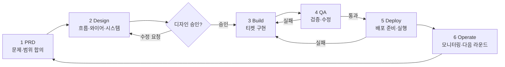
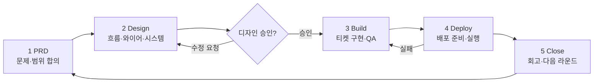

# T-P4-065 sub-e — PRD / service-flow / mockup 5단 정정 plan

**Slug**: `t-p4-065-sub-e-prd-flow-mockup`  **Created**: 2026-05-07  **Status**: Plan only — code/markdown 변경 없음
**PRD anchor**: [docs/prd/productune.md#phase-4--terminal-무의존-gui-풀-사이클-future](../prd/productune.md#phase-4--terminal-무의존-gui-풀-사이클-future)
**Companion**: T-P4-065 sub-a (Phase 1~5 doctrine), sub-b (PhaseStrip 5단), sub-c (ChatPanel selector 제거), sub-d (stage→type rename), sub-f (po-state slim)
**Scope**: 사용자 가시 5단 = `PRD > Design > Build > Deploy > Close` 로 PRD §L235 / service-flow §2.2 / mockup HTML 정정. 6단 잔재 (PRD/Design/Build/QA/Deploy/Operate) 폐기.

---

## §1 Decision

### 1.1 5단 통일 결정 (2026-05-08 사용자 directive)

사용자 가시 phase 는 5단으로 고정:

| # | Phase | 사용자 표현 | 비고 |
|---|---|---|---|
| 1 | PRD | PRD | 문제·범위 합의 |
| 2 | Design | 디자인 | 흐름·와이어·시스템 |
| 3 | Build | 빌드 | 티켓 구현 (QA 는 ticket type 으로 흡수) |
| 4 | Deploy | 배포 | 배포 준비·실행 |
| 5 | Close | 마무리 | retrospective + 다음 라운드 (Operate 흡수) |

### 1.2 폐기 영역

- **"QA" phase** 폐기 — sub-d 의 stage→type rename 으로 ticket type (`type:qa`) 이 됨. ticket 흐름 안에서 QA verification 발생, phase strip 에서는 별도 단계 X.
- **"Operate" phase** 폐기 — sub-a 의 Phase 5 Close 의 retrospective sequence (5a/5b/5c/5d) 가 흡수. 모니터링 / 다음 라운드 진입은 Close 의 retrospective 결과로 자연스럽게 연결.

### 1.3 Decision log entry

본 plan 의 §6 마이그레이션 5번 단계로 decision log 1줄 추가:

```
2026-05-08 — 사용자 가시 phase 5단 통일 (PRD / Design / Build / Deploy / Close).
6단 (PRD/Design/Build/QA/Deploy/Operate) 폐기 — QA 는 ticket type 으로,
Operate 는 Close phase 의 retrospective 가 흡수. T-P4-065 전체 (sub-a~f).
```

위치는 §8 open question 1 의 결정으로 확정 — **PRD `## Activity log` 1행 + service-flow `## 변경 이력` 1행 모두 append** (변경 영역이 둘 다 걸쳐 있음).

---

## §2 PRD `docs/prd/productune.md` 정정

### 2.1 §L235 Phase 4 acceptance #9

**현재 (L235)**:
```
- [ ] 풀 사이클 UI 에서 사용자가 현재 단계 (PRD / Design / Build / QA / Deploy / Operate)
  를 Project 탭 stage strip + PO Chat ctx chip 으로 한눈에 인지 + 다음 단계 액션 버튼 제공
```

**정정 후**:
```
- [ ] 풀 사이클 UI 에서 사용자가 현재 단계 (PRD / Design / Build / Deploy / Close)
  를 Project 탭 phase strip + PO Chat ctx chip 으로 한눈에 인지 + 다음 단계 액션 버튼 제공
```

변경 포인트: (a) 6단 → 5단 어휘, (b) "stage strip" → "phase strip" (sub-d rename 정합).

### 2.2 다른 § 의 6단 잔재 grep + 정정

impl 단계에서 designer 가 다음 grep 명령으로 발견된 모든 hit 정정:

```bash
# QA / Operate 가 phase 어휘로 쓰인 곳 (ticket type 인 'qa' 와 구분)
grep -nE 'PRD.*Design.*Build.*QA' docs/prd/productune.md
grep -nE 'Operate' docs/prd/productune.md
grep -nE '6.*stage|6.*단계|6-stage' docs/prd/productune.md

# stage strip 어휘 (phase strip 으로)
grep -nE 'stage.strip|stage strip' docs/prd/productune.md
```

발견 시 다음 규칙 적용:
- 사용자 가시 phase 나열에서 "QA" → 제거 (ticket type 으로 분리됨을 명시 필요 시 별도 문장)
- 사용자 가시 phase 나열에서 "Operate" → "Close" 로 교체 (의미 변경 명시: "마무리 + 회고 + 다음 라운드 진입")
- "stage strip" UI 어휘 → "phase strip" (sub-b 와 정합)
- doctrine 영역의 `stage:` field name (코드/frontmatter) → 그대로 유지 (sub-d 의 stage→type rename 은 ticket type 영역만, lifecycle stage 는 별도)

### 2.3 §결정 history (Activity log) 1줄 추가

`## Activity log` 섹션 끝에 §1.3 의 decision log entry append.

---

## §3 service-flow `docs/design/service-flow-and-screens.md` 정정

### 3.1 §2.2 mermaid 6-stage cycle → 5-phase cycle

**현재 (L45–L59)**:


**정정 후**:


변경 포인트:
- QA 노드 제거 — Build 노드 라벨에 "·QA" 추가 (ticket type 으로 흡수됨을 시각화)
- Operate → Close (회고·다음 라운드)
- BUILD → QA → BUILD 루프 제거 (Build 내부에서 ticket cycling)

### 3.2 §2.2 헤더 텍스트

**현재**: `### 2.2 한 라운드의 6-stage 사이클`
**정정**: `### 2.2 한 라운드의 5-phase 사이클`

### 3.3 §2.2 직전 섹션 §1 표 (L20)

**현재 L20**: `Project 탭의 sub-items (PRD / Design Gate / Tickets / QA Verdict)`

검토 결과 — `QA Verdict` 는 ticket type=qa 의 verdict 산출물로 여전히 화면 노출되므로 어휘 자체는 유지. 다만 phase 나열이 아니라 sub-item 이므로 5단 결정과 충돌 없음. **변경 없음**.

### 3.4 §2.0 페이지 첫 paragraph (L8)

**현재 L8**:
```
> Phase 4 GUI 구현 전 합의해야 하는 **서비스 전체 UX 흐름**. 범위는 install/auth 만이 아니라
> 프로젝트 시작부터 PRD → Design → Build → QA → Deploy → Operate 한 사이클 전체다.
```

**정정 후**:
```
> Phase 4 GUI 구현 전 합의해야 하는 **서비스 전체 UX 흐름**. 범위는 install/auth 만이 아니라
> 프로젝트 시작부터 PRD → Design → Build → Deploy → Close 한 사이클 전체다.
```

### 3.5 §3.1 표 / §4.1 Project 탭 / §4.3 Right panel

**§3.1 표 (L102)**:
```
SidePanel --> Project[Project 탭<br/>Stage strip + Rounds + Sub-items + Preview + Recent Activity]
```
→ `Stage strip` → `Phase strip` (sub-b 정합).

**§4.1 Project 탭 본문 (L239–L242)**:
```
- **Stage** (`pp-sec-hdr` + `stage-strip`):
  - 6 stage `sdot-item` (PRD / Design / Build / QA / Deploy / Operate).
```
정정:
```
- **Phase** (`pp-sec-hdr` + `phase-strip`):
  - 5 phase `pdot-item` (PRD / Design / Build / Deploy / Close).
```
변수명 (`sdot-item` → `pdot-item`, `stage-strip` → `phase-strip`) 은 sub-b plan 의 CSS class 와 정합. designer 가 sub-b plan 확인 후 일치하는 이름으로 재정정.

**§4.3 Right panel ctx 라인 (L329, L350)**:
```
│ rp-ctx — [Build chip] round-3 · T-001 in review │
...
- `stage-chip` — 현재 stage pill (Build = `#1f2a3a` bg + `var(--stage-build)` text).
```
정정:
```
│ rp-ctx — [Build chip] round-3 · T-001 in review │  ← Build 자체는 5단 중 하나라 유지
...
- `phase-chip` — 현재 phase pill (Build = `#1f2a3a` bg + `var(--phase-build)` text).
```
CSS 변수 `--stage-build` → `--phase-build` (sub-b 의 5 hex token 명명 정합).

### 3.6 §4 화면 카탈로그 (L191) 표

**§4 표의 "단계" 컬럼 — 검토**:
- A1/A2/A3/A4 = "최초 실행 1회" / "시작" — 사용자 가시 phase 외 영역, 변경 없음
- B1/B2 = "전체" — 변경 없음
- C1~C5 = "Design" — 변경 없음 (5단 중 하나)
- D1 = "Build" — 변경 없음
- **E1 = "QA"** → "Build (QA ticket)" 또는 "Build" 로 정정. QA verdict 가 type=qa ticket 의 산출물로 Build phase 안에서 발생함을 명시.
- F1/F2 = "Deploy" — 변경 없음
- **G1 = "Operate"** → "Close" 로 정정. "Operate dashboard" 명칭 → "Close / 회고 dashboard" 또는 "Retrospective dashboard" 로 의미 변경. Project tab 의 Recent Activity sec + Status bar 의 vercel dot 이라는 위치는 유지 (운영 모니터링 자체는 Close phase 의 retrospective 데이터로 활용).

### 3.7 §4 표의 G1 entry 의미 갱신

**현재 L209**:
```
| G1 | Operate dashboard | Operate | Project tab Recent Activity sec + Status bar 의 vercel dot. |
```

**정정 후**:
```
| G1 | Close / Retrospective dashboard | Close | Project tab Recent Activity sec (회고 source) + Status bar 의 vercel dot (배포 결과 모니터링). retrospective 산출물 = `docs/retrospectives/<version>.md` (sub-a 의 Phase 5 Close 5c). |
```

### 3.8 다른 § 의 6단 잔재 grep

```bash
grep -nE 'PRD.*Design.*Build.*QA' docs/design/service-flow-and-screens.md
grep -nE 'Operate' docs/design/service-flow-and-screens.md
grep -nE '6.*stage|6-stage|6 stage' docs/design/service-flow-and-screens.md
grep -nE 'stage.strip|stage-strip|stage_strip' docs/design/service-flow-and-screens.md
```

발견 시 §3.1–§3.7 의 규칙 동일 적용.

### 3.9 §변경 이력 1줄 추가

문서 끝 `## 변경 이력` (또는 동등 섹션) 에 §1.3 의 decision log entry append.

---

## §4 mockup `docs/design/productune/mockups/mockup.html` + `showcase.html` 정정

### 4.1 결정 — update mockup (option a)

§7 sub-e prompt 의 두 옵션 중 **(a) update mockup HTML — 항상 정합 유지** 선택.

근거:
- mockup 은 service-flow §3.1 에서 "mockup-as-source" (진실의 출처) 로 명시됨 (L6 / L107)
- doctrine 와 mockup 이 충돌하면 사용자 멘탈 모델이 깨지고, designer/dev 가 어느 쪽을 따를지 매번 판단해야 함
- (b) freeze 옵션은 historical reference 로 가치 있으나, 본 mockup 은 **active spec source** 라 freeze 부적절

### 4.2 stage-strip 6 dot → phase-strip 5 dot

**찾을 영역** (mockup.html / showcase.html 양쪽):
- HTML: `<div class="stage-strip">` 또는 동등 영역 안의 `sdot-item` × 6
- CSS class: `.stage-strip`, `.sdot-item`, `.sdot-item.cur`, `.sdot-item.done`, `.sdot-item.pending`

**정정**:
- HTML class rename: `stage-strip` → `phase-strip`, `sdot-item` → `pdot-item`
- 6 dot → 5 dot:
  1. PRD
  2. Design
  3. Build
  4. ~~QA~~ (제거)
  5. Deploy → 4 번
  6. ~~Operate~~ → Close (5 번)
- 각 dot 의 inner text / data-phase / aria-label 정합

### 4.3 CSS 색 변수 정합 (sub-b 의 5 hex)

**현재 mockup.html 변수 (예상 grep 결과)**:
```css
--stage-prd: ...;
--stage-design: ...;
--stage-build: ...;
--stage-qa: ...;
--stage-deploy: ...;
--stage-operate: ...;
```

**정정 후 (sub-b plan 의 5 hex 정합)**:
```css
--phase-prd: <sub-b 의 hex>;
--phase-design: <sub-b 의 hex>;
--phase-build: <sub-b 의 hex>;
--phase-deploy: <sub-b 의 hex>;
--phase-close: <sub-b 의 hex>;
```

`--stage-qa` 와 `--stage-operate` 변수는 제거. 사용처 grep 후 모두 phase-* 로 교체.

> impl 단계에서 sub-b plan 의 CSS 변수 정의를 import 하여 single source of truth 유지. sub-b 가 design system level 결정 → mockup 은 그 hex 를 그대로 사용.

### 4.4 ctx chip / Right panel ctx 정합

mockup 의 `rp-ctx` 안 phase chip stage 의미 → "Build" 같은 5단 중 하나만 표시. "QA" / "Operate" chip 인스턴스 발견 시 제거 (Operate → Close 로 의미 변경, QA 는 ticket type chip 으로 별도 노출 가능 — 단 sub-d plan 확인 필요).

### 4.5 ticket type 어휘 (sub-d 정합)

mockup 안 ticket card 의 type label 영역에서 "QA" 가 phase 가 아닌 ticket type 으로 노출되는 경우는 유지. designer 가 grep 으로 구분:

```bash
# phase 나열인지 ticket type 인지 context 로 구분
grep -nE 'QA' docs/design/productune/mockups/mockup.html
grep -nE 'QA' docs/design/productune/mockups/showcase.html
```

발견된 hit 마다 designer 가 1건씩 확인 후 다음 분류:
- 사용자 가시 phase 나열 (strip / breadcrumb / phase chip) → 제거
- ticket type label / filter / badge → 유지 (sub-d 의 type rename 정합)

### 4.6 showcase.html 동일 정정

`docs/design/productune/mockups/showcase.html` 도 동일 grep + rule 적용.

---

## §5 doctrine 사이드 검증 (`packages/core/po/sections/`)

### 5.1 lifecycle-mechanics.md L41 오타 정정

**현재 L41**:
```
Designer asks user during the next Version's Phase 2 PRD authoring —
measurement happens just-in-time for hypothesis re-evaluation.
```

**정정 후**:
```
Designer asks user during the next Version's Phase 1 PRD authoring —
measurement happens just-in-time for hypothesis re-evaluation.
```

근거: sub-a plan 의 Phase 1~5 doctrine — Phase 1 = PRD authoring. "Phase 2 PRD authoring" 은 sub-a 직전 designer turn 발견 오타.

### 5.2 6단 어휘 grep (`packages/core/po/sections/`)

```bash
grep -nrE 'PRD.*Design.*Build.*QA' packages/core/po/sections/
grep -nrE 'Operate' packages/core/po/sections/
grep -nrE 'Phase 6|Phase\s*6' packages/core/po/sections/
```

발견된 hit 마다 다음 규칙:
- "Operate" 가 phase 명으로 쓰인 경우 → "Close" 로 정정
- "QA" 가 phase 명으로 쓰인 경우 → 제거 또는 ticket type 으로 의미 변경
- "Phase 6" 어휘 → "Phase 5" 로 정정 (5-phase 가 최대)
- field name (`stage:` ticket frontmatter) 은 sub-d 의 type rename 결정에 따름 — 본 plan 범위 외

### 5.3 L52 git-workflow.md 부재

`po-instructions.md` L52 가 가리키는 `git-workflow.md` 부재 — **본 sub-e 외 별도 follow-up 티켓**. plan 안에서 명시만 하고 정정 X.

---

## §6 마이그레이션 순서 (impl 단계)

순차 실행. 각 단계 완료 후 grep 으로 회귀 검증.

1. **PRD §L235 + 다른 6단 잔재 정정** (§2)
   - L235 acceptance #9 정정
   - §2.2 grep + 발견 hit 정정
   - `## Activity log` 1줄 append (§1.3 entry)

2. **service-flow §2.2 + 다른 § 정정** (§3)
   - §2.2 mermaid 6→5 phase
   - §2.2 헤더 "6-stage" → "5-phase"
   - §2.0 paragraph PRD→Operate 어휘 갱신
   - §3.1 표 / §4.1 Project / §4.3 Right panel CSS 변수
   - §4 표 E1 / G1 의미 갱신
   - §3.8 grep + 발견 hit 정정
   - `## 변경 이력` 1줄 append

3. **mockup HTML 5 dot** (§4)
   - mockup.html / showcase.html 양쪽
   - HTML class rename + 6 dot → 5 dot
   - CSS 변수 6→5 (sub-b plan 의 hex import)
   - ctx chip / phase chip 정합
   - QA hit grep 분류 (phase vs ticket type)

4. **doctrine pre-existing 오타 fix** (§5)
   - lifecycle-mechanics.md L41 "Phase 2" → "Phase 1"
   - `packages/core/po/sections/` grep + 발견 hit 정정

5. **decision log** (§1.3)
   - PRD `## Activity log` + service-flow `## 변경 이력` 양쪽 append (§8 Q1 결정)

### 6.1 회귀 검증 명령 (각 단계 직후)

```bash
# 6단 어휘 잔재 0 건 확인
grep -rnE 'PRD.*Design.*Build.*QA.*Deploy.*Operate' docs/ packages/core/po/sections/
grep -rnE '6.stage|6-stage|6 stage' docs/ packages/core/po/sections/

# stage strip / phase strip 일관성
grep -rnE 'stage.strip' docs/ packages/core/po/sections/  # 0 건이어야 함
grep -rnE 'phase.strip' docs/ packages/core/po/sections/  # hit 있어야 함
```

---

## §7 Out of scope

- sub-a/b/c/d/f 의 본격 코드 구현 — 별 dev 호출 (본 plan 은 markdown/HTML 문서 영역만)
- `po-instructions.md` L52 가 가리키는 `git-workflow.md` 부재 — 별 follow-up 티켓 (본 sub-e 영역 외)
- ticket type=qa 의 별도 색/아이콘 디자인 — sub-d 의 영역
- PhaseStrip CSS 변수 hex 값 자체 결정 — sub-b 의 영역 (본 plan 은 sub-b hex 을 import 만)
- po-state.json schema 의 phase 필드 정합 — sub-f 의 영역

---

## §8 Open questions — 결정

### Q1. mockup HTML update 깊이 — strip 만 / 그 외 영역 (CSS 색 변수, persona 칩 등) 도 정합?

**결정**: **strip + CSS 변수 + ctx chip + ticket type label grep 까지 모두 정합**.

근거:
- mockup 은 "mockup-as-source" — 부분 정합은 dev 가 어느 영역이 진실인지 매번 판단해야 함
- 색 변수 (`--stage-* → --phase-*`) 는 cascade — strip 만 정정하고 변수 유지하면 다른 사용처가 깨진 변수 참조
- persona chip 은 phase 와 별개 어휘라 본 plan 범위 외 (PO/Designer/Developer/QA persona 는 그대로)

### Q2. decision log 위치 — PRD §결정 history vs service-flow §변경 이력 vs design-system §11

**결정**: **PRD `## Activity log` + service-flow `## 변경 이력` 양쪽 append**.

근거:
- 변경 영역이 PRD 와 service-flow 양쪽에 걸쳐 있음 — 한 쪽만 기록하면 다른 쪽 reader 가 누락
- design-system §11 은 design token / system 결정 영역 — phase 어휘는 service flow 영역이라 부적합
- 1줄 entry 는 비용 적음, 양쪽 append 가 안전

---

## §9 검증 — sub-a/b/c/d/f 정합

- **sub-a (Phase 1~5 doctrine)**: Phase 5 = Close (retrospective 5a/5b/5c/5d). 본 plan §1.2 의 Operate 흡수 결정과 정합. ✅
- **sub-b (PhaseStrip 5단)**: CSS 변수 5 hex (`--phase-prd/design/build/deploy/close`). 본 plan §3.5 / §4.3 의 변수명과 정합. ✅
- **sub-c (ChatPanel selector 제거)**: 본 plan 영역 외 (chat selector 는 phase 어휘 무관). 충돌 없음. ✅
- **sub-d (stage→type rename)**: ticket type field rename. QA 가 ticket type 으로 흡수되는 결정의 근거. 본 plan §1.2 / §4.5 와 정합. ✅
- **sub-f (po-state slim)**: po-state.json field 정리. phase 필드는 sub-f 가 처리. 본 plan 은 markdown/HTML 어휘만 — 충돌 없음. ✅

---

## §10 Chunking ceiling 정합

본 plan 의 impl 단계 (§6 5 단계) 는 designer/dev 호출 1회 (markdown 문서 정정 + mockup HTML 정정) 로 처리 가능.

- §6 step 1–2 (PRD + service-flow) → designer 호출 1회 (markdown only)
- §6 step 3 (mockup) → designer 호출 1회 (HTML + CSS, 사람-가시 영역이라 designer 영역)
- §6 step 4 (doctrine) → designer 호출 1회 (markdown only)
- §6 step 5 (decision log) → step 1/2 와 묶음

총 designer 3회 호출. 각 호출은 effort xhigh ceiling 안. ✅

---

**End of plan**.
