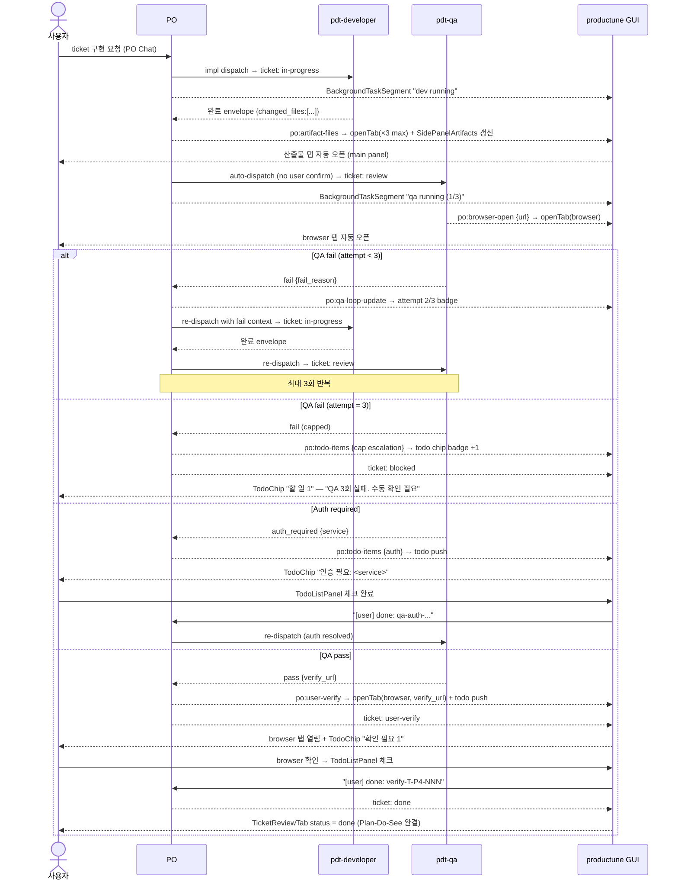

# T-P4-112 · Plan-Do-See — 산출물 자동 표시 + Dev-QA 자동 루프 + Browser Confirm

**Slug**: `plan-do-see-artifact-qa-browser-loop`
**Date**: 2026-05-14
**Round**: r4
**Author**: pdt-designer
**Artifact**: plan only (1/1 for this dispatch)
**Status**: ready
**Relates**: T-P4-068 (BackgroundTaskSegment), T-P4-113 (user TODO), T-P4-114 (impl — main panel auto open + browser)

---

## §1 Background — 사용자 verbatim + 현재 갭

### 1.1 사용자 directive (원문 그대로)

> "Side panel에 산출물 표시 필요. 작업후 파일 형태의 산출물 있을 경우 PO가 main panel에 산출물 띄워줘야함. 코드 작업의 경우 QA가 main panel에 browser를 띄워서 qa를 진행해야하며, bug가 있을 경우 자체적으로 해결 루프를 돌려야함.(dev - qa interaction) auth가 필요할 경우 유저한테 요청. 위 사항이 완료된 경우 user가 확인할 수 있는 browser link로 이동시켜주고 유저 확인 요청해야함. (Plan-do-see의 정석)"

### 1.2 현재 상태 (gap)

| 축 | 현재 | 갭 |
|:--|:--|:--|
| **산출물 표시** | ticket land 후 PO가 chat 텍스트로 "변경된 파일: …" 안내. Main panel 자동 open 없음. Side panel 표시 없음. | `changed_files[]` 자동 openTab + Side panel "산출물" sub-section 없음 |
| **Dev-QA 루프** | QA 실패 시 PO가 수동으로 dev re-dispatch 결정 (매번 사용자 confirm 필요). | 자동 dev-QA 루프 (cap N회) + GUI 상태 반영 없음 |
| **Browser 자동 open** | `'browser'` TabType 존재하나 `PlaceholderTab` render. QA가 browser 사용하려면 수동. | `BrowserTab.tsx` 미구현 + QA browser 자동 열기 없음 |
| **Auth 요청** | QA가 auth 필요 시 chat 텍스트에 묻힘. 사용자가 스크롤로 발견해야 함. | `useUserTodo` (T-P4-113) 로 자동 push 안 됨 |
| **완료 시 confirm** | QA pass 후 사용자가 직접 URL 입력해 확인. PO가 link 안내를 chat에 올리나 추적 X. | browser tab 자동 열기 + user TODO confirm 아이템 자동 push 없음 |
| **Plan-Do-See status** | ticket status: `todo → in-progress → done`. `review`는 types.ts에 있으나 UI 미활용. `user-verify` 없음. | Plan-Do-See 4단계 (planning → in-progress → review → user-verify → done) 미구현 |

### 1.3 코드베이스 현황 확인

**이미 존재하는 것:**
- `TabType` → `'browser'` 등록됨. `TabContent.tsx`에서 `PlaceholderTab`으로 fallback (구현 대기)
- `Status` type: `'review'` 이미 포함. `'user-verify'`만 없음
- `qa_loops: number` — `Ticket` + `CurrentTask` types 양쪽에 정의됨
- `useBackgroundTasks` store (T-P4-068) — BackgroundTaskSegment UI 완성
- `useUserTodo` + `TodoChip` + `TodoListPanel` (T-P4-113) — todo push 인프라 구축됨/구축 예정
- `openTab(tabId, type, props)` — workspace store에서 programmatic 열기 가능
- `artifacts` — `ActivityIcon` type에 legacy 값으로 존재. LeftSidebar i18n key도 있음 (미표시)

**없는 것 (신규 필요):**
- `BrowserTab.tsx` (panes/ 하위)
- `useArtifacts` store
- `useQaLoop` store
- `SidePanelArtifacts.tsx`
- `po-runner.ts` → `changed_files`, `browser_url`, `verify_url`, `auth_required` 파싱
- PO doctrine: dev 완료 → QA 자동 dispatch + qa-loop 프로토콜
- Developer/QA persona envelope spec 확장

---

## §2 Decisions

### 2(A) 산출물(artifact) 자동 표시

#### A-1. Source — developer persona envelope 확장

`pdt-developer.md` 출력 envelope spec에 `changed_files: string[]` 필드 추가 (doctrine 변경).

```json
// developer JSON output envelope (신규 필드)
{
  "persona": "pdt-developer",
  "summary": "...",
  "changed_files": [
    "packages/gui/src/components/Foo.tsx",
    "packages/gui/src/store/useFoo.ts",
    "docs/design/T-P4-112/plan.md"
  ],
  "confidence": "high"
}
```

- 파일 경로는 projectDir 기준 상대 경로.
- 파일이 없으면 `[]` (빈 배열) 혹은 필드 생략.
- design 산출물 (`.md` docs/design/) + code 파일 (`.tsx`, `.ts`, `.json`) 모두 포함.

#### A-2. 감지 — po-runner.ts 파싱

`po-runner.ts` `onDone` 처리 지점 (sub-agent 결과 finalText JSON.parse):

```
IF finalText contains JSON block with "changed_files" key:
  → emit IPC: 'po:artifact-files'
     payload: { files: string[], ticketId?: string, persona: 'developer' | 'designer' }
```

우선순위:
1. raw `{...}` JSON block에서 `changed_files` 키 탐색
2. ` ```json ... ``` ` 펜스 안 JSON도 동일 처리
3. 파싱 실패 / 키 없음 → noop (기존 동작 유지)

#### A-3. store — `useArtifacts`

```ts
// packages/gui/src/store/useArtifacts.ts
type ArtifactFile = {
  path: string          // projectDir 기준 상대 경로
  tabType: TabType
  addedAt: number       // epoch ms
  ticketId?: string
}

type Store = {
  files: ArtifactFile[]
  pushFiles(files: string[], ticketId?: string): void
  clearSession(): void
  // selector
  recentFiles(): ArtifactFile[]  // last 20
}
```

**확장자 → TabType 매핑 테이블:**

| 확장자 | TabType | 비고 |
|:--|:--|:--|
| `.md` | `'markdown'` | 디자인 doc / plan / PRD |
| `.ts` / `.tsx` / `.js` / `.jsx` | `'markdown'` | code (syntax highlight) |
| `.json` | `'markdown'` | config / po-state |
| `.html` | `'browser'` | mockup preview (`file://` URL) |
| `.excalidraw.json` | `'design-gate'` | 와이어프레임 |
| 그 외 | `'markdown'` | fallback |

#### A-4. 자동 openTab

`ChatPanel.tsx` (또는 dedicated `ArtifactAutoOpen` hook)에서:

```ts
useEffect(() => {
  return api.onArtifactFiles(({ files, ticketId }) => {
    useArtifacts.getState().pushFiles(files, ticketId)
    for (const art of files) {
      openTab(art.path, art.tabType, { path: art.path }, basename(art.path))
    }
  })
}, [])
```

**중복 처리**: `openTab` 기존 dedupe 로직 (같은 tabId 이미 존재 → activate existing) 그대로 동작.

**최대 자동 open 수**: 파일 ≤ 3개 → 전체 자동 open. > 3개 → 첫 3개만 자동 open, 나머지는 SidePanelArtifacts에 목록 표시 (spam 방지).

#### A-5. SidePanelArtifacts — Side panel Project tab 삽입

위치: Project tab 내 Tickets sub-items 아래, Preview 위.

```
┌──────────────────────────────┐
│ ○ Phases                     │
│ ○ Rounds                     │
│   └─ v0.4 ···                │
│      └─ 📄 PRD               │
│      └─ 🎨 Design Gate       │
│      └─ 📋 Tickets (3)       │
│         └─ T-P4-112 · ...    │
│      └─ ✓ QA Verdict         │
├──────────────────────────────┤   ← NEW ─────────────────────────────────
│ ○ 산출물   [3]               │   pp-sec-hdr + count badge (warn color)
│   └─ 📝 plan.md              │   row: ext icon + filename + click→openTab
│   └─ 🔷 BrowserTab.tsx       │   ext icon: FileCode / FileText / Globe
│   └─ 🔷 useArtifacts.ts      │   (lucide-react)
├──────────────────────────────┤   ─────────────────────────────────────
│ ○ Preview                    │
└──────────────────────────────┘
```

**Row 스펙:**
- 아이콘: lucide-react `FileText` (.md) / `FileCode` (.ts/.tsx) / `Globe` (.html) / `File` (기타)
- 파일명: `basename(path)` + hover tooltip = 전체 경로
- 클릭 → `openTab(path, tabType, { path })`
- done → row `opacity: 0.5` (열린 적 있음 표시)
- 섹션 title badge: `openCount` → warn amber (`--health-warn`)
- 세션 내 누적 표시. PO "close version" 이벤트 시 `clearSession()`

---

### 2(B) Dev-QA 자동 루프 state machine

#### B-1. PO 오케스트레이션 doctrine 변경

`~/.productune/po-instructions.md` 또는 `sections/delegation.md` §Build mode에 추가:

```
After dev impl ticket status → 'in-progress':
  1. Dev persona completes → ticket status = 'review'
  2. PO AUTOMATICALLY dispatches QA (no user confirm required)
     Model/effort: haiku/low (standard). Escalation → sonnet/high (fail-pattern 3x)
  3. QA result:
     PASS:
       → ticket qa_status = 'pass'
       → PO emits verify_url (if available) → ticket status = 'user-verify'
     FAIL (attempt < maxAttempts = 3):
       → ticket qa_status = 'fail', qa_loops += 1
       → PO dispatches dev with fail_reason context
       → Repeat from step 2
     FAIL (attempt = maxAttempts):
       → ticket status = 'blocked'
       → PO escalates to user via todo push (cap reached)
     AUTH_REQUIRED:
       → PO pauses loop, pushes auth todo to user
       → Resume after user completes auth todo
  4. Trace in chat: "→ auto-dispatching QA (attempt N/3)"
```

#### B-2. `useQaLoop` store

```ts
// packages/gui/src/store/useQaLoop.ts
type QaLoopEntry = {
  ticketId: string
  attempt: number          // 1-based
  maxAttempts: number      // 3
  status: 'dev-running' | 'qa-running' | 'pass' | 'fail' | 'capped' | 'auth-required'
  lastFailReason?: string
}

type Store = {
  entries: Record<string, QaLoopEntry>  // keyed by ticketId
  setEntry(entry: QaLoopEntry): void
  clearEntry(ticketId: string): void
}
```

IPC source: `po-runner.ts`에서 sub-agent envelope의 `qa_loops`, `qa_status`, `status` 필드 감지 → `po:qa-loop-update` emit.

#### B-3. BackgroundTaskSegment 확장 (Visual)

`BackgroundTaskSegment.tsx`의 popup row에 QA retry 표시 추가:

```
● qa   Running QA for T-P4-112
        attempt 2/3 · 0m 14s · running          ← NEW: attempt badge
```

attempt badge 색상: `--health-warn` (amber). capped (3/3 fail) → `--health-error`.

---

### 2(C) QA browser 자동

#### C-1. QA persona envelope 확장

`pdt-qa.md` 출력 envelope spec에 아래 필드 추가:

```json
{
  "persona": "pdt-qa",
  "qa_status": "fail",
  "browser_url": "http://localhost:3000",
  "fail_reason": "...",
  "verify_url": null,
  "auth_required": null
}
```

`browser_url`: QA가 Playwright MCP 또는 수동 smoke로 열어야 하는 로컬 URL.
dev server가 없으면 `null` (browser tab open skip).

#### C-2. po-runner.ts → IPC

```
IF QA envelope.browser_url != null:
  → emit 'po:browser-open' { url, ticketId, purpose: 'qa-smoke' }
```

#### C-3. BrowserTab.tsx 신규 구현

`packages/gui/src/components/workspace/main/panes/BrowserTab.tsx`:

```
┌─────────────────────────────────────────────────┐
│ [← →] [↺] [🔒 http://localhost:3000      ] [⊞] │   URL bar (address + reload + popout)
├─────────────────────────────────────────────────┤
│                                                 │
│    <webview> / <iframe src={url} />             │   Electron webview 권장
│    sandbox + allow-scripts                      │   (iframe fallback for non-Electron env)
│                                                 │
└─────────────────────────────────────────────────┘
```

- Electron 환경: `<webview>` + `nodeintegration={false}` + `sandbox`
- dev (non-Electron): `<iframe>` fallback
- `file://` URL: `<iframe src={url}>` (local HTML mockup)
- URL bar: 현재 URL 표시 + reload 버튼 + popout (OS 기본 브라우저 열기)
- 오류 상태: "이 페이지를 열 수 없습니다" + retry 버튼

#### C-4. TabContent.tsx 수정

```ts
case 'browser':
  return <BrowserTab props={tab.props} />   // PlaceholderTab → BrowserTab
```

#### C-5. pnpm dev spawn (옵션)

QA persona가 `browser_url`을 명시하면 GUI가 자동 `openTab`. pnpm dev spawn은 QA persona가 Playwright 시작 전 `start_dev_server: true` 시그널을 보낼 경우 po-runner가 `child_process.spawn('pnpm', ['dev'])` 처리. 상세는 T-P4-114 impl scope.

---

### 2(D) Auth 필요 시 사용자 요청

#### D-1. QA envelope 필드

```json
{
  "auth_required": {
    "service": "GitHub OAuth",
    "instruction": "Settings → MCP → figma 에서 인증 필요",
    "type": "manual"   // 'oauth' | 'env-var' | 'manual'
  }
}
```

`type: 'env-var'` → todo `type: 'text-input'` (값 입력 필요)
`type: 'oauth' | 'manual'` → todo `type: 'check'` (완료 표시만)

#### D-2. po-runner.ts → `po:todo-items` emit

T-P4-113 기존 `po:todo-items` IPC 채널 재사용:

```ts
if (qaEnvelope.auth_required) {
  emit('po:todo-items', [{
    id: `qa-auth-${ticketId}`,
    description: `인증 필요: ${auth_required.service} — ${auth_required.instruction}`,
    type: auth_required.type === 'env-var' ? 'text-input' : 'check',
  }])
}
```

`useUserTodo`가 수신 → `TodoChip` count badge 자동 갱신 (T-P4-113 기존 시스템).

---

### 2(E) 완료 시 browser link → 사용자 확인 요청

#### E-1. QA pass envelope 필드

```json
{
  "qa_status": "pass",
  "verify_url": "http://localhost:3000/my-feature",
  "verify_description": "신규 기능 화면에서 동작 확인"
}
```

`verify_url`이 없으면 (`null`) browser tab open 생략. user TODO confirm 아이템은 항상 push.

#### E-2. po-runner.ts → `po:user-verify` emit

```ts
// po-runner.ts
emit('po:user-verify', { url: verify_url, description: verify_description, ticketId })
```

#### E-3. GUI 연쇄 동작 (3 steps)

**Step 1 — browser tab 자동 열기** (verify_url 있을 때):
```ts
openTab('user-verify:' + ticketId, 'browser', { url: verify_url }, '확인 필요')
```

**Step 2 — user TODO push:**
```ts
useUserTodo.getState().pushItems([{
  id: `verify-${ticketId}`,
  description: `${verify_description ?? '구현 결과 확인'} 후 체크`,
  type: verify_url ? 'link' : 'check',
  href: verify_url ?? undefined,
}])
```

**Step 3 — ticket status → `'user-verify'`:**
PO가 po-state.json `current_task.status = 'user-verify'` 갱신 → `TicketReviewTab` + Side panel badge 자동 반영.

#### E-4. 사용자 완료 흐름

```
사용자 → TodoListPanel link 클릭 → browser tab 포커스 (이미 열림)
  → 화면 확인 후 → TodoListPanel 체크 클릭
  → injectUserMessage("[user] done: verify-T-P4-112")
  → PO 수신 → ticket status = 'done'
  → TicketReviewTab 상태 갱신 (Plan-Do-See 완결)
```

---

### 2(F) Plan-Do-See ticket status cycle

#### F-1. Status type 확장

`packages/gui/src/lib/types.ts`:

```ts
// Before:
export type Status = 'todo' | 'in-progress' | 'review' | 'done' | 'blocked' | 'abandoned'

// After:
export type Status = 'todo' | 'in-progress' | 'review' | 'user-verify' | 'done' | 'blocked' | 'abandoned'
```

`'review'`는 이미 존재 (T-P4-113 frontmatter에서 이미 활용됨). `'user-verify'` 신규 추가.

#### F-2. Status badge color spec

| Status | 의미 | Token | Hex |
|:--|:--|:--|:--|
| `todo` | 미시작 | `--text-muted` | `#505050` |
| `in-progress` | 개발 중 | `--health-info` | `#38BDF8` |
| `review` | QA 검토 중 | `--health-warn` | `#F59E0B` |
| `user-verify` | 사용자 확인 대기 | `--persona-designer` | `#A78BFA` |
| `done` | 완료 | `--health-ok` | `#34D399` |
| `blocked` | 차단 (auth/cap) | `--health-error` | `#EF4444` |

`TicketReviewTab` + `SidePanelCurrentVersion` ticket row 양쪽에 동일 색상 테이블 적용.

#### F-3. 전이 흐름

```
todo
 └─ (dev dispatch) ──────────► in-progress
                                   └─ (dev done) ───────────► review
                                                                └─ (QA pass) ──► user-verify
                                                                │                   └─ (user check) ► done
                                                                └─ (QA fail, retry) ► in-progress (qa_loops++)
                                                                └─ (cap reached) ──► blocked
                                                                └─ (auth needed) ──► blocked (pending auth)
```

---

## §3 Tab dispatch flow + 시각화 spec

### 3.1 전체 Plan-Do-See 시퀀스 (Mermaid)



### 3.2 Main panel 자동 오픈 시각화

```
──────────────────────────────────────────────────────────────
[ dev 완료 후 자동 open ]

┌─────────────────────────────────────────────────────────────┐
│ TabBar: [plan.md ×] [BrowserTab.tsx ×] [useArtifacts.ts ×] │
├─────────────────────────────────────────────────────────────┤
│                                                             │
│  # T-P4-112 · Plan-Do-See — 산출물 자동 표시...            │
│  (MarkdownTab — docs/design/T-P4-112/plan.md)              │
│                                                             │
└─────────────────────────────────────────────────────────────┘

──────────────────────────────────────────────────────────────
[ QA browser 자동 open ]

┌─────────────────────────────────────────────────────────────┐
│ TabBar: [...기존] [확인 필요 ×]                             │
├─────────────────────────────────────────────────────────────┤
│ [← →] [↺] [🔒 http://localhost:3000/feature  ] [⊞]        │
├─────────────────────────────────────────────────────────────┤
│                                                             │
│   (BrowserTab — webview)                                   │
│                                                             │
└─────────────────────────────────────────────────────────────┘
```

### 3.3 IPC event bus 맵

| IPC channel | 방향 | 소스 | 수신처 | payload |
|:--|:--|:--|:--|:--|
| `po:artifact-files` | main → renderer | po-runner.ts | ChatPanel (useEffect) | `{ files: string[], ticketId?: string }` |
| `po:browser-open` | main → renderer | po-runner.ts | ChatPanel (useEffect) | `{ url: string, ticketId: string, purpose: 'qa-smoke' \| 'user-verify' }` |
| `po:user-verify` | main → renderer | po-runner.ts | ChatPanel (useEffect) | `{ url?: string, description: string, ticketId: string }` |
| `po:qa-loop-update` | main → renderer | po-runner.ts | ChatPanel (useEffect) | `{ ticketId: string, attempt: number, maxAttempts: number, status: QaLoopStatus }` |
| `po:todo-items` | main → renderer | po-runner.ts | ChatPanel (useEffect) | `TodoItemRaw[]` (T-P4-113 기존 채널 재사용) |

preload.ts에 각 채널 expose (`api.onArtifactFiles`, `api.onBrowserOpen`, `api.onUserVerify`, `api.onQaLoopUpdate`).

---

## §4 Module Map

### 4.1 Doctrine 변경 (코드 아님 — doc/persona 업데이트)

| 파일 | 변경 유형 | 내용 |
|:--|:--|:--|
| `~/.claude/agents/pdt-developer.md` | **UPDATE** output envelope spec | `changed_files: string[]` 필드 추가. path = projectDir 기준 상대. 없으면 `[]` |
| `~/.claude/agents/pdt-qa.md` | **UPDATE** output envelope spec | `browser_url`, `verify_url`, `auth_required`, `fail_reason` 필드 추가. null 허용. |
| `~/.productune/po-instructions.md` 또는 `sections/delegation.md` | **UPDATE** §Build mode | dev 완료 → QA 자동 dispatch 프로토콜 + qa-loop 재시도 룰 (최대 3회) + user-verify 단계 명시 |

### 4.2 GUI 신규 파일

| 파일 | 역할 |
|:--|:--|
| `packages/gui/src/store/useArtifacts.ts` | ArtifactFile store (pushFiles, clearSession, recentFiles) |
| `packages/gui/src/store/useQaLoop.ts` | QaLoopEntry store (setEntry, clearEntry per ticketId) |
| `packages/gui/src/components/workspace/SidePanelArtifacts.tsx` | Project tab "산출물" sub-section (pp-sec-hdr + rows) |
| `packages/gui/src/components/workspace/main/panes/BrowserTab.tsx` | browser tab impl (webview + URL bar + reload + popout) |

### 4.3 GUI 수정 파일

| 파일 | 변경 유형 | 내용 |
|:--|:--|:--|
| `packages/gui/src/lib/types.ts` | **UPDATE** Status type | `'user-verify'` 추가 |
| `packages/gui/src/components/workspace/main/TabContent.tsx` | **UPDATE** case 'browser' | `PlaceholderTab` → `BrowserTab` |
| `packages/gui/electron/po-runner.ts` | **UPDATE** onDone 파싱 | `changed_files`, `browser_url`, `verify_url`, `auth_required`, `qa_loops` 감지 + IPC emit |
| `packages/gui/electron/preload.ts` | **UPDATE** contextBridge | `onArtifactFiles`, `onBrowserOpen`, `onUserVerify`, `onQaLoopUpdate` 노출 |
| `packages/gui/src/components/workspace/ChatPanel.tsx` | **UPDATE** useEffect 추가 | 4개 신규 IPC 이벤트 구독 + useArtifacts/useQaLoop store 연결 |
| `packages/gui/src/components/workspace/LeftSidebar.tsx` | **UPDATE** project tab | `<SidePanelArtifacts />` Tickets sub-items 아래 삽입 |
| `packages/gui/src/components/workspace/BackgroundTaskSegment.tsx` | **UPDATE** popup row | qa attempt badge (N/3) 표시 로직 추가 |
| i18n locale files | **UPDATE** | `workspace.artifacts.*`, `workspace.qaLoop.*`, `workspace.userVerify.*` 키 추가 |

**변경 규모 요약**: 신규 파일 4 + 수정 8 + doctrine 3.

---

## §5 §1.5 Self-check (UX principles)

§1.5 기준 — Few Things / Familiar / Predictability / Feedback / Escape.

| 원칙 | 적용 | 상태 |
|:--|:--|:--|
| **Few Things** | 산출물 자동 open은 최대 3개로 제한 (spam 방지). BackgroundTaskSegment는 기존 compact 표시 유지 — qa attempt badge만 추가. Side panel "산출물" 섹션은 접힘 상태로 시작 (pp-sec-hdr click으로 펼침). User confirm은 TodoChip 1개 아이템으로 압축. | ✓ |
| **Familiar** | openTab 패턴 기존 그대로 (Explorer 파일 클릭 → 탭 열림과 동일). BrowserTab URL bar = 브라우저 관례 (← → ↺ ⊞). Status badge 색상은 design-system §4 health token 재사용. QA loop badge = GitHub Actions retry 패턴. | ✓ |
| **Predictability** | `changed_files[]` 기반 → 탭 열리는 파일이 명확히 예측 가능. QA loop cap 3회 고정 → 무한 루프 없음. user-verify 상태 = 사용자 확인이 남았다는 명확한 신호. browser tab openTab dedupe → 같은 URL 두 번 열리지 않음. | ✓ |
| **Feedback** | dev 완료 즉시 산출물 탭 오픈 (optimistic). BackgroundTaskSegment qa attempt badge 실시간 갱신. TodoChip count badge 변화 즉각 반영. user-verify tab 열릴 때 tab 타이틀 "확인 필요" 로 주의 유도. | ✓ |
| **Escape** | browser tab popout 버튼 (OS 기본 브라우저로 열기). QA loop cap 도달 시 `blocked` + user TODO (자동 루프 중단 + 사용자 개입 진입점). auth required = loop 일시 정지, 사용자 TODO 체크 후 자동 재개 (강제 멈춤 없음). todoChip 아이템 dismissed → loop 재개 X (사용자 dismiss = skip 의사). | ✓ |

위반 없음.

---

## §6 §QA scope

| Field | Value |
|:--|:--|
| **QA invoke** | `auto pdt-qa dispatch` |
| **test target** | `po-runner.ts` changed_files/browser_url/auth_required 파싱 + `BrowserTab.tsx` webview render + `useArtifacts` pushFiles + `useQaLoop` state transitions (dev-running → qa-running → pass/fail/capped) + `SidePanelArtifacts` row render |
| **사용자 dogfood** | ① impl ticket 하나 구현 완료 → main panel에 변경 파일 탭 ≤ 3개 자동 열림 확인. ② QA fail 시뮬레이션 → BackgroundTaskSegment에 "attempt 2/3" 표시 확인. ③ QA pass → browser tab 자동 열림 + TodoChip "확인 필요 1" 노출 확인. ④ 사용자 TODO 체크 → ticket status done 전환 확인. |
| **regression check** | `packages/gui/src/components/workspace/ChatPanel.tsx` — 기존 메시지 표시 / textarea / streaming bubble 회귀 없음. `packages/gui/src/components/workspace/BackgroundTaskSegment.tsx` — 기존 task popup 동작 회귀 없음. `packages/gui/src/store/workspace.ts` openTab dedupe 로직 — 기존 탭 dedup 정상. |

---

## §7 Open Questions

| # | 질문 | 권장 |
|:--|:--|:--|
| OQ-1 | BrowserTab Electron 환경 — `<webview>` vs `<iframe>`? `<webview>` 는 Electron 전용이며 CSP 제약이 덜하다. `<iframe>` 은 CORS 문제로 localhost 제외 외부 URL에서 fail. | **`<webview>` 우선** (Electron env 가드) + `<iframe>` 개발 fallback (Vite dev preview). 구현자 Electron API 확인 후 결정. |
| OQ-2 | `changed_files[]` max 3개 자동 open — 남은 파일은 SidePanelArtifacts만에 표시. 사용자가 원하면 모두 열기 버튼 필요한가? | **"+ N개 더" 버튼** — SidePanelArtifacts 섹션 하단에 "모두 열기" 링크 (threshold 초과 시 노출). 별도 modal X. |
| OQ-3 | `pnpm dev` spawn 타이밍 — QA가 `start_dev_server: true` 시그널 내보낼 때 이미 dev server 실행 중이면 충돌. | po-runner.ts에서 `port:3000` TCP check 후 이미 열려 있으면 spawn skip. net.createConnection으로 감지. |
| OQ-4 | qa-loop cap 3회 — 사용자가 cap 수를 설정 가능하게 할지? | **현재 hardcoded 3** — Settings에서 커스터마이징은 별도 ticket (scope 아님). 3은 fail-pattern ≥3 = QA exception 기준과 align됨. |
| OQ-5 | `po:artifact-files` 를 ChatPanel에 연결할지 vs `ArtifactAutoOpen.tsx` 별도 훅 컴포넌트로 분리할지? | **ChatPanel useEffect 내 구독 권장** — 기존 `po:todo-items`, `po:health` 모두 ChatPanel에서 구독 중. 패턴 통일. 훅 분리는 ChatPanel 비대화 시 별도 ticket. |
| OQ-6 | T-P4-113 구현 완료 전에 T-P4-114가 먼저 착수될 경우 `useUserTodo.pushItems()` 인터페이스가 확정되지 않을 수 있음. | **T-P4-113 → T-P4-114 순서 권장** (§9 Dependencies). T-P4-113 land 후 T-P4-114 착수. |

---

## §8 Out of scope

- **full auth flow / OAuth UI** — J3 Browser auth screen (install-auth-consent-ux.md scope)
- **payment / PII 관련 테스트** — 별도 audit ticket
- **cross-project artifact 공유** — project-local만. cross-project = Phase 5
- **BrowserTab에서 직접 인터랙션 추적** (클릭, 폼 submit 캡처) — Phase 5 QA 강화 ticket
- **artifact 탭 자동 저장 / 편집 반영** — MarkdownTab의 edit은 기존 동작 그대로. 자동 저장은 T-P4-021 scope
- **`pnpm dev` 자동 kill on workspace close** — process lifecycle management 별도 ticket
- **QA loop cap 사용자 설정 UI** — Settings 별도 ticket (OQ-4)
- **TODO 알림 / OS notification** — T-P4-113 scope 아님. 별도 ticket
- **ROADMAP 갱신** — meta-dogfood 사이클 내 개선. ROADMAP entry 불필요
- **Activity Log** — PO mechanical append on close

---

## §9 Dependencies

| 의존성 | 관계 | Blocking? |
|:--|:--|:--|
| **T-P4-113** (user TODO — ChatPanel todo chip + list panel) | §2(D) auth_required → `po:todo-items` 채널 재사용. §2(E) user-verify TODO push. T-P4-113의 `useUserTodo.pushItems()` interface가 확정되어야 T-P4-114 구현 가능. | **Blocking for §2(D)(E)** — T-P4-113 land 우선. 단, §2(A)(B)(C)는 독립 가능. |
| **T-P4-068** (BackgroundTaskSegment + useBackgroundTasks) | §2(B) qa attempt badge는 popup row 확장. 기존 store/UI에 overlay. | **Non-blocking** — 기존 구현에 additive 수정. |
| **T-P4-114** (impl — main panel auto open + browser) | 본 plan의 impl 산출물. 별도 ticket emit 필요. GUI 신규 파일 4개 + 수정 8개 + preload IPC 추가. | **본 plan이 T-P4-114의 upstream spec** |
| **pdt-developer.md** + **pdt-qa.md** envelope spec 업데이트 | §2(A) `changed_files[]` + §2(C) `browser_url` 등 dev/QA가 실제로 필드를 출력해야 GUI가 감지 가능. | **Non-blocking for GUI** — GUI는 필드 없으면 noop. 但 실제 동작은 doctrine 업데이트 선행 필요. |
| **`pnpm dev` spawn** | §2(C) local dev server 자동 시작. OQ-3 포트 충돌 처리 확인 필요. | **Non-blocking** — dev server 이미 실행 중이면 해당 URL 사용. T-P4-114 구현자 판단. |
