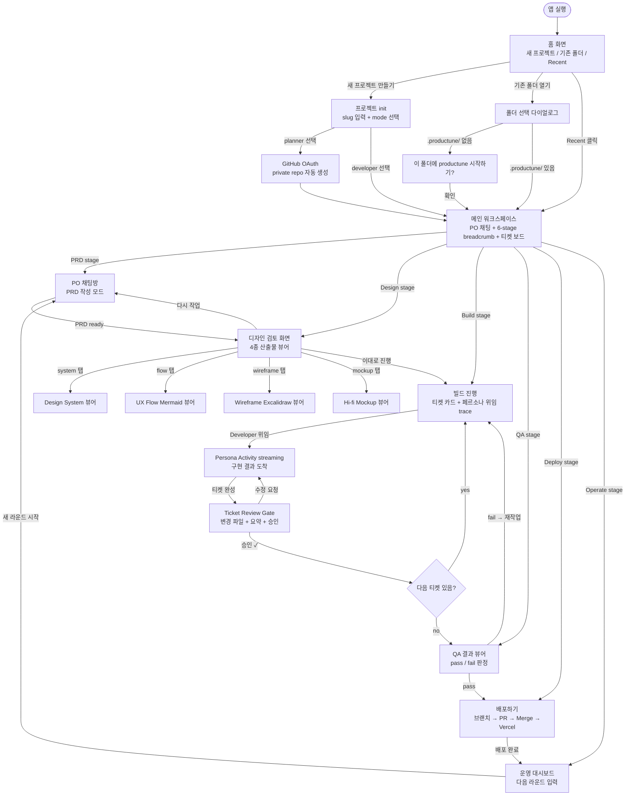
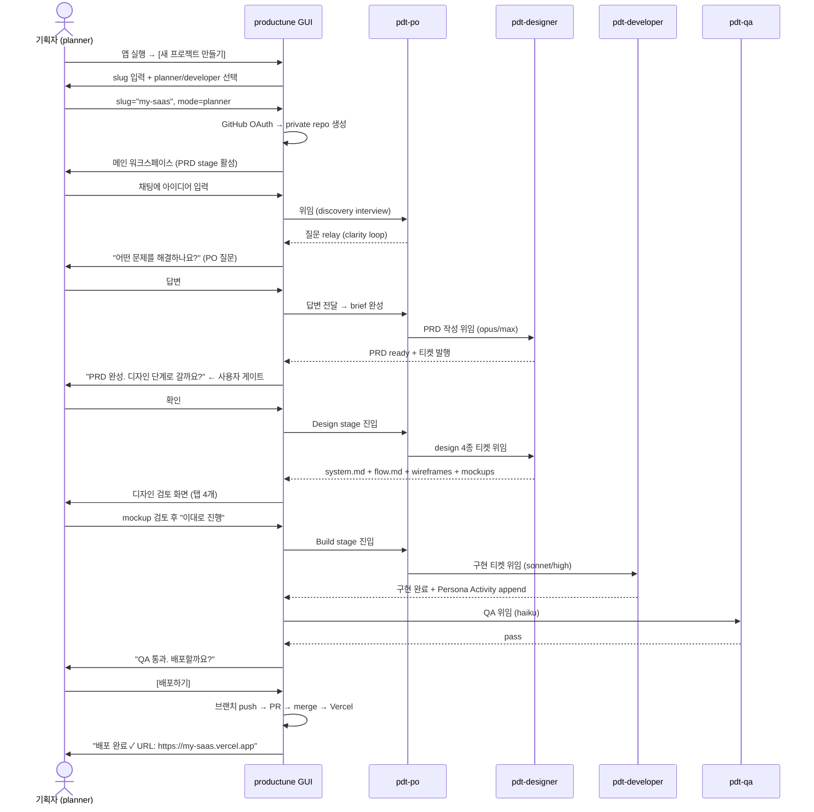
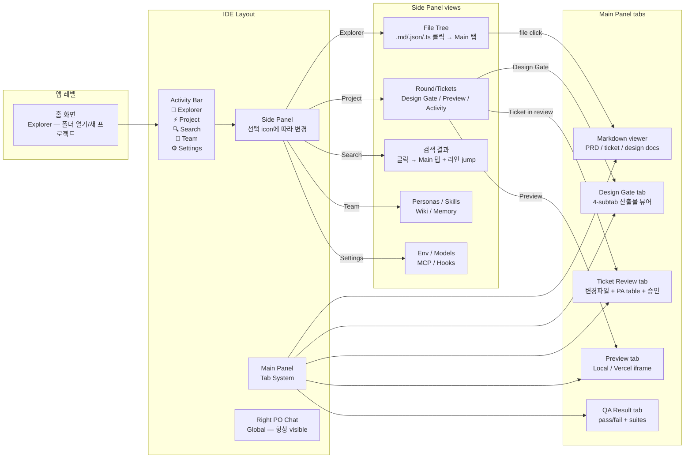
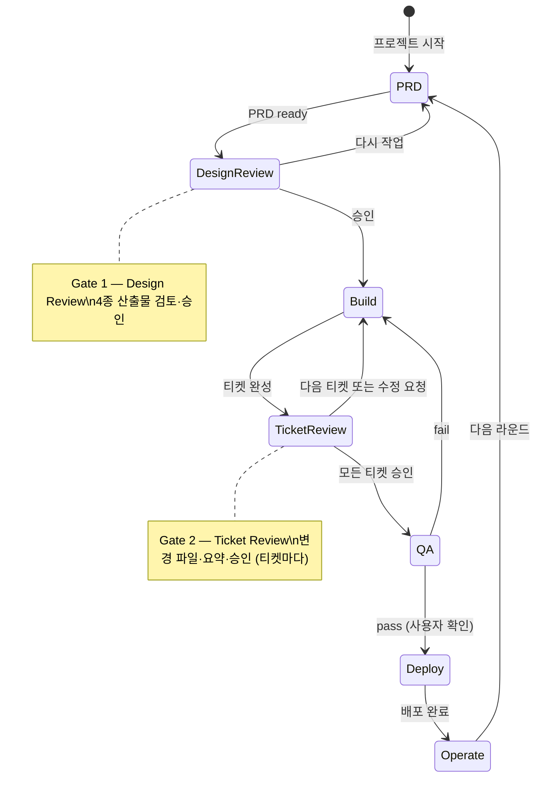

# UX Flow — productune GUI (Phase 4)

**Slug**: productune  **Created**: 2026-04-30  **Status**: draft

핵심 사용자 여정: **planner mode 기준** (terminal 무노출, GUI-only).

---

## 전체 앱 화면 전환

---

## 사용자 여정 1 — 새 프로젝트 (planner mode)

---

## 화면 계층 (IDE paradigm)

---

## 상태 전이 — 6-stage + Review Gates

---

## 핵심 화면 목록 (wireframe + mockup 대상)

| 화면 | 설명 | 우선순위 |
|---|---|---|
| **Home** | 새 프로젝트 / recent / 기존 폴더 | P0 |
| **Main workspace** | PO 채팅 + breadcrumb + 티켓 보드 | P0 |
| **Design review gate** | 4-tab 디자인 산출물 뷰어 + 승인 | P0 |
| Env panel | 3-layer env 관리 | P1 |
| Deploy flow | 배포하기 → 진행 상황 | P1 |
| Memory editor | 3-tier 메모리 inline edit | P2 |
