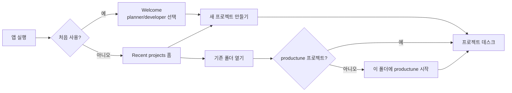
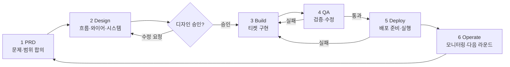
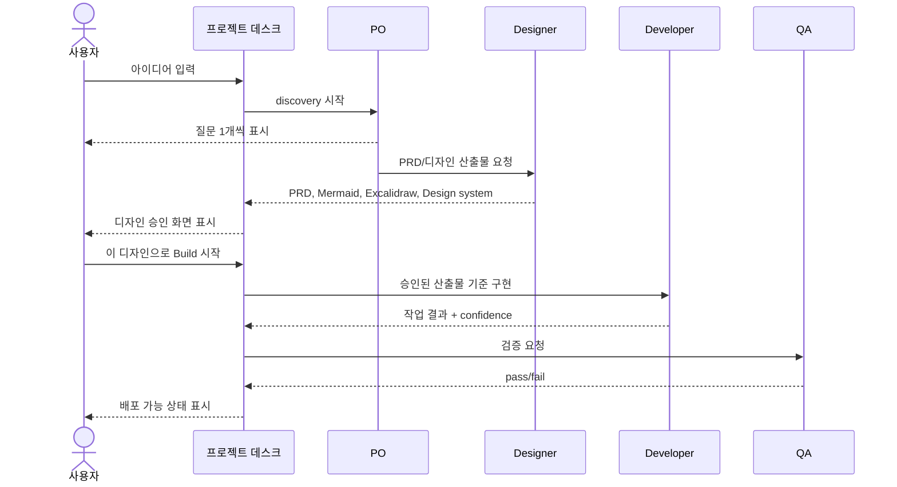
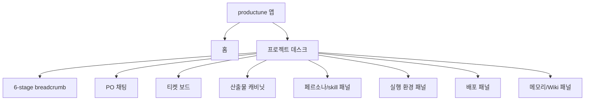
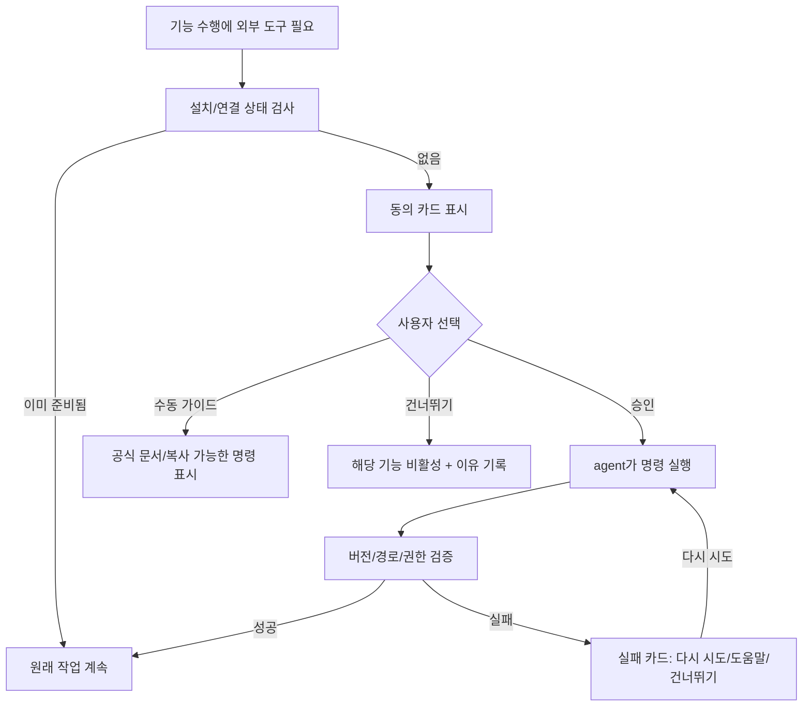
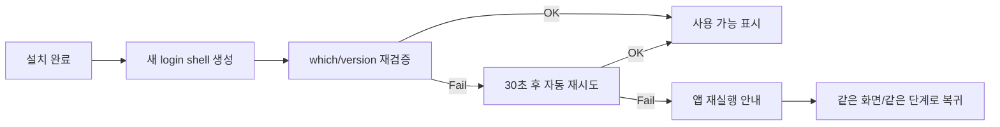
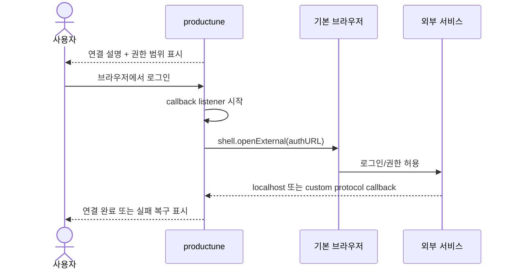
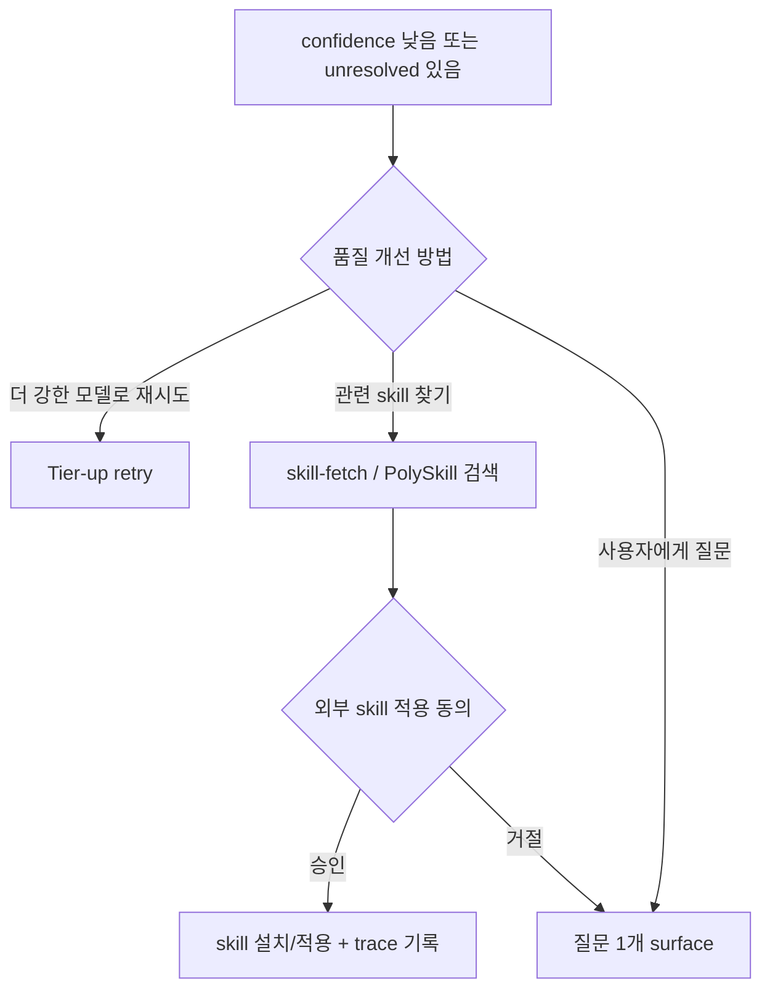

# productune Phase 4 — 전체 서비스 플로우 & 화면 설계

**Slug**: phase4-service-flow  **Created**: 2026-04-30  **Status**: Design gate draft (Build 전 사용자 승인 필요)
**PRD anchor**: [docs/prd/productune.md#phase-4--개발-비숙련-기획자-모드-planner-mode-future](../prd/productune.md#phase-4--개발-비숙련-기획자-모드-planner-mode-future)
**Companion**: [design-direction.md](./design-direction.md), [service-design-system.md](./service-design-system.md), [service-flow-wireframe.excalidraw.json](./service-flow-wireframe.excalidraw.json)

> Phase 4 GUI 구현 전 합의해야 하는 **서비스 전체 UX 흐름**. 범위는 install/auth 만이 아니라 프로젝트 시작부터 PRD → Design → Build → QA → Deploy → Operate 한 사이클 전체다. **Build 는 디자인 산출물 명시 승인 전 절대 시작하지 않는다.**

---

## 1. 제품 멘탈 모델

Phase 4 planner mode 는 개발 용어를 숨기고, 사용자가 세 가지만 머리에 넣게 한다.

| 모델 | 사용자 표현 | 화면 표현 | 내부 매핑 |
|---|---|---|---|
| **프로젝트 데스크** | “내 제품 작업 책상” | 좌측 프로젝트/라운드 사이드바 + 중앙 작업대 | project root + `.productune/` |
| **페르소나 팀** | “PO·디자이너·개발자·QA가 도와줌” | 우측 activity/skill 패널 | `pdt-po`, `pdt-designer`, `pdt-developer`, `pdt-qa` |
| **산출물 캐비닛** | “결정문서/디자인/티켓/검증 결과 모음” | Artifact cabinet 탭 | `docs/prd`, `docs/design`, `docs/tickets`, `docs/qa` |

노출하지 않는 말: branch, commit, PR, shell, sub-agent, hook, raw env. 필요하면 자연어로 바꾼다: “자동저장”, “배포 준비”, “실행 환경 값”.

---

## 2. 전체 서비스 흐름

### 2.1 앱 시작 → 프로젝트 데스크

### 2.2 한 라운드의 6-stage 사이클

**하드 게이트**: `DESIGN → BUILD` 전이는 사용자가 `[이 디자인으로 Build 시작]` 을 누른 경우만 가능. “대충 진행”, “묵시적 승인”, “시간 초과 자동 승인” 없음.

### 2.3 사용자에게 보이는 페르소나 협업

---

## 3. 정보 구조와 기본 레이아웃

### 3.1 Workspace shell

| 영역 | 역할 | 기본 내용 |
|---|---|---|
| 좌측 사이드바 | 프로젝트 데스크 내 내비게이션 | 라운드, 채팅방, 산출물 캐비닛, 설정 |
| 상단 | 현재 위치 | PRD → Design → Build → QA → Deploy → Operate breadcrumb |
| 중앙 | 현재 단계 작업 | 채팅, 디자인 리뷰, 티켓 보드, 배포 체크리스트 |
| 우측 패널 | 보조 정보 | 페르소나 활동, skill trace, env, memory |
| 하단 status | 안심 피드백 | 자동저장, 실행 상태, 외부 도구 상태 |

---

## 4. 화면 카탈로그

| ID | 화면 | 단계 | 핵심 액션 |
|---|---|---|---|
| A1 | Welcome / 모드 선택 | 시작 | planner / developer 선택 |
| A2 | Recent projects | 시작 | 새 프로젝트, 기존 폴더 열기 |
| A3 | 새 프로젝트 만들기 | 시작 | 이름, 한 줄 설명, 저장 위치 확인 |
| A4 | 기존 폴더 연결 | 시작 | `.productune/` 감지, init 실행 |
| B1 | 프로젝트 데스크 | 전체 | 6-stage 현황, 최근 작업, 다음 액션 |
| B2 | PO 채팅 | PRD | discovery 질문/답변, PRD 초안 확인 |
| B3 | 티켓 보드 | Build/QA | 상태, 담당 페르소나, 산출물 링크 |
| C1 | 디자인 리뷰 홈 | Design | Mermaid / wireframe / design system 탭 |
| C2 | Mermaid flow viewer | Design | 앱 안에서 사용자 흐름, 화면 전이, 상태도 확인. zoom/pan, source toggle/copy, 오류 fallback 포함 |
| C3 | Excalidraw wireframe viewer | Design | 저충실도 화면 스케치 확인/수정 |
| C4 | Design system viewer | Design | 색/타입/컴포넌트 규칙 확인 |
| C5 | 디자인 승인 게이트 | Design | 진행 / 다시 작업 / 특정 수정 요청 |
| D1 | Build progress | Build | 티켓 진행률, 페르소나 trace |
| E1 | QA verdict | QA | pass/fail, 재작업 이유 확인 |
| F1 | Env panel | Deploy | 로컬/미리보기/프로덕션 값 점검 |
| F2 | Deploy panel | Deploy | 배포 전 체크, 배포 실행 |
| G1 | Operate dashboard | Operate | 상태, 피드백, 다음 라운드 시작 |
| H1 | Artifact cabinet | 전체 | PRD, 디자인, 티켓, QA 문서 보기 |
| I1 | Persona/skill panel | 전체 | 보유 skill, 이번 작업 skill trace |
| J1 | External dependency consent | 필요 시 | 설치/인증 동의 |
| J2 | Install progress/failure | 필요 시 | 진행률, 실패 복구 |
| J3 | Browser auth | 필요 시 | 기본 브라우저 로그인 |
| J4 | Relaunch/PATH recovery | 필요 시 | 자동 재시도, 앱 재실행 |

---

## 5. Design stage와 승인 게이트

### 5.1 필수 산출물 3종

| 산출물 | 표현 | 저장 위치 | 승인 기준 |
|---|---|---|---|
| Flow diagrams | Mermaid.js | `docs/design/service-flow-and-screens.md` | 전체 stage, 화면 전이, state가 이해됨. 현재는 GitHub/VS Code preview 로 수동 확인, Phase 4 GUI 는 Electron/React 내장 viewer 로 inline 렌더 |
| Wireframe | Excalidraw React | `docs/design/*.excalidraw.json` | workspace, 승인 게이트, 외부 동의 화면이 보임 |
| Design system | Rich Markdown + custom React components | `docs/design/service-design-system.md` | 토큰/컴포넌트/상태 표시 규칙이 구현 가능함 |

### 5.2 게이트 상태도

### 5.3 승인 화면 액션

| 버튼 | 결과 |
|---|---|
| **이 디자인으로 Build 시작** | Build stage unlock. 승인 시각과 승인한 산출물 경로 기록 |
| 다시 작업 | Designer에게 전체 재작업 요청. Build 잠김 유지 |
| 특정 부분 수정 | 사용자가 범위를 선택해 Designer에게 수정 요청. Build 잠김 유지 |
| 나중에 검토 | 현재 라운드 Design stage에 머무름 |

---

## 6. 외부 CLI/라이브러리 설치 동의 흐름

외부 도구는 사용자 컴퓨터나 외부 계정에 영향을 준다. 그래서 항상 **설명 → 명령/위치 공개 → 되돌리기 안내 → 명시 승인 → 실행** 순서다.

### 6.1 동의 카드 필수 정보

| 필드 | 예시 |
|---|---|
| **무엇** | “Vercel CLI — Vercel 배포를 컴퓨터에서 실행하는 공식 도구” |
| **왜 필요** | “Deploy 단계에서 미리보기/프로덕션 배포를 시작하려면 필요” |
| **실행 명령** | `pnpm add -g vercel` 또는 OS별 설치 명령. 기본 접힘, 고급 보기에서 표시 |
| **설치/변경 위치** | global npm prefix, Homebrew cellar, 프로젝트 `package.json` 등 |
| **되돌리기** | `pnpm remove -g vercel`, `brew uninstall ...`, 연결 해제 위치 |
| **권한/인증** | OAuth scope, 토큰 저장 위치, 만료/철회 방법 |
| **예상 시간** | “약 1–3분” |

### 6.2 동의 문구 원칙

- 자동 설치 금지. 버튼 라벨은 항상 **설치하기**, **연결하기**, **권한 허용하기** 처럼 명시적이어야 한다.
- “권장”은 붙일 수 있지만 선택권을 숨기지 않는다.
- raw 로그는 기본 접힘. 실패 시만 자동 펼침.
- 동의 내역은 프로젝트 설정에서 조회/철회 가능해야 한다.

### 6.3 적용 대상

| 대상 | 최초 발생 | 특이사항 |
|---|---|---|
| GitHub OAuth | 새 프로젝트 저장소 연결 | 기본 브라우저 OAuth, private repo 생성 동의 |
| Vercel CLI/API | Deploy | CLI 설치 + 브라우저 로그인 + env push 동의 |
| Supabase CLI | 선택 기능 | 로컬 개발 서버 필요 시 동의 |
| Google Cloud SDK `gcloud` | GA4/Google 연동 | SDK 용량/설치 위치/권한을 특히 명확히 표시 |
| skill-fetch / PolySkill | 품질 에스컬레이션 | 외부 skill 검색 소스와 적용 위치 표시 |

---

## 7. PATH, relaunch, 브라우저 auth 처리

### 7.1 PATH/relaunch

원칙: “터미널을 다시 여세요”라고 말하지 않는다. 앱이 새 shell을 만들고, 그래도 실패할 때만 `[지금 앱 다시 시작]` 을 제공한다. 재실행 전 current project, route, pending dependency step을 저장한다.

### 7.2 브라우저 auth

내부 webview는 쓰지 않는다. 피싱 오해를 줄이기 위해 항상 사용자의 기본 브라우저를 연다.

---

## 8. OSS skill/workflow 노출

### 8.1 Skill panel 구조

| 영역 | 내용 |
|---|---|
| 보유 skill | 페르소나별 사용 가능한 skill 목록 |
| 이번 작업 사용됨 | 현재 라운드에서 실제 호출된 skill chip |
| 품질 에스컬레이션 | confidence 낮을 때 tier-up / skill 검색 / 사용자 결정 메뉴 |

### 8.2 매핑

| 워크플로 | OSS | GUI 노출 예시 |
|---|---|---|
| Real Engineering | `mattpocock/skills` | `to-prd`, `to-issues`, `tdd`, `triage-issue`, `request-refactor-plan` |
| PO/PM | `phuryn/pm-skills` | `pm-product-discovery`, `pm-market-research`, `pm-product-strategy`, `pm-execution` |
| Skill search | `skill-fetch` / PolySkill | “더 맞는 skill 찾아보기” 품질 에스컬레이션 옵션 |

---

## 9. 주요 화면별 empty/error/pending 규칙

| 상태 | 표현 | 금지 |
|---|---|---|
| Empty | 다음 행동 1개 + 짧은 설명 | 빈 표만 노출 |
| Pending | skeleton 또는 spinner + 현재 하는 일 1줄 | raw 로그 자동 노출 |
| Error | 원인 자연어 + 다음 버튼 최대 3개 | stack trace 먼저 노출 |
| Blocked | 왜 막혔는지 + 누가/무엇을 기다리는지 | “실패”로만 표시 |
| Approved | 승인한 사람/시간/산출물 링크 | 승인 근거 없는 Build 시작 |

---

## 10. Build 착수 전 체크리스트

- [ ] 사용자에게 본 문서와 wireframe, design system을 보여줬다.
- [ ] Design gate의 `[이 디자인으로 Build 시작]` 승인을 받았다.
- [ ] 승인 대상 산출물 경로가 기록됐다.
- [ ] 외부 CLI/라이브러리 동의 패턴이 구현 티켓에 포함됐다.
- [ ] PATH/relaunch/auth 예외 처리가 구현 티켓에 포함됐다.
- [ ] Figma 없이 Mermaid + Excalidraw + Rich Markdown stack으로 진행한다.
