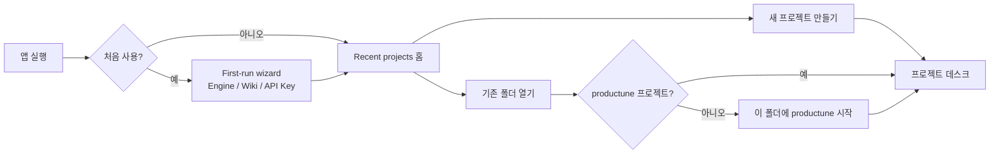
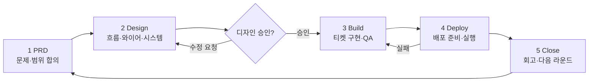
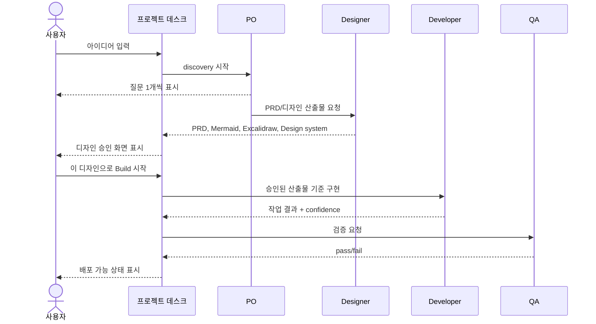
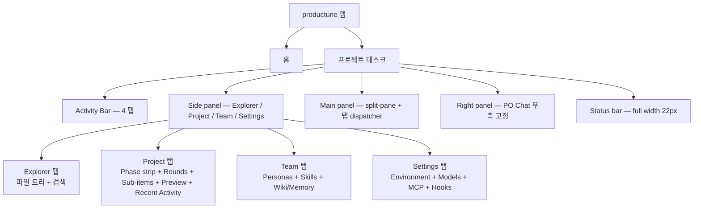
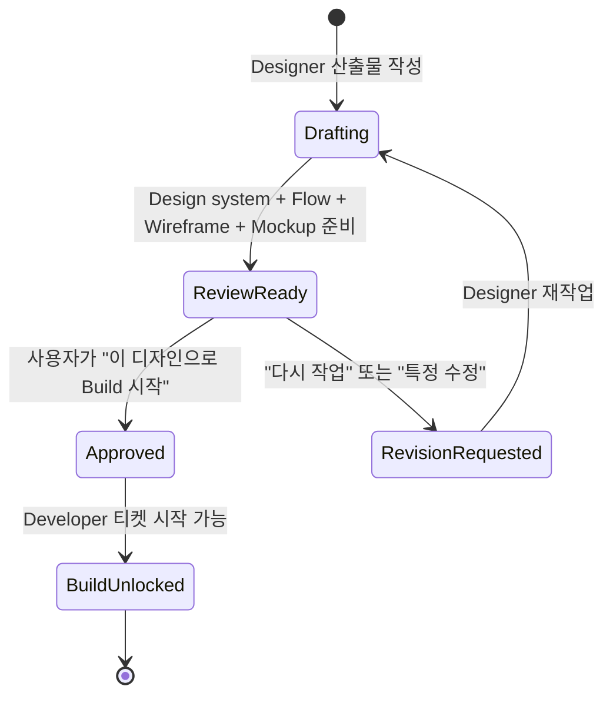
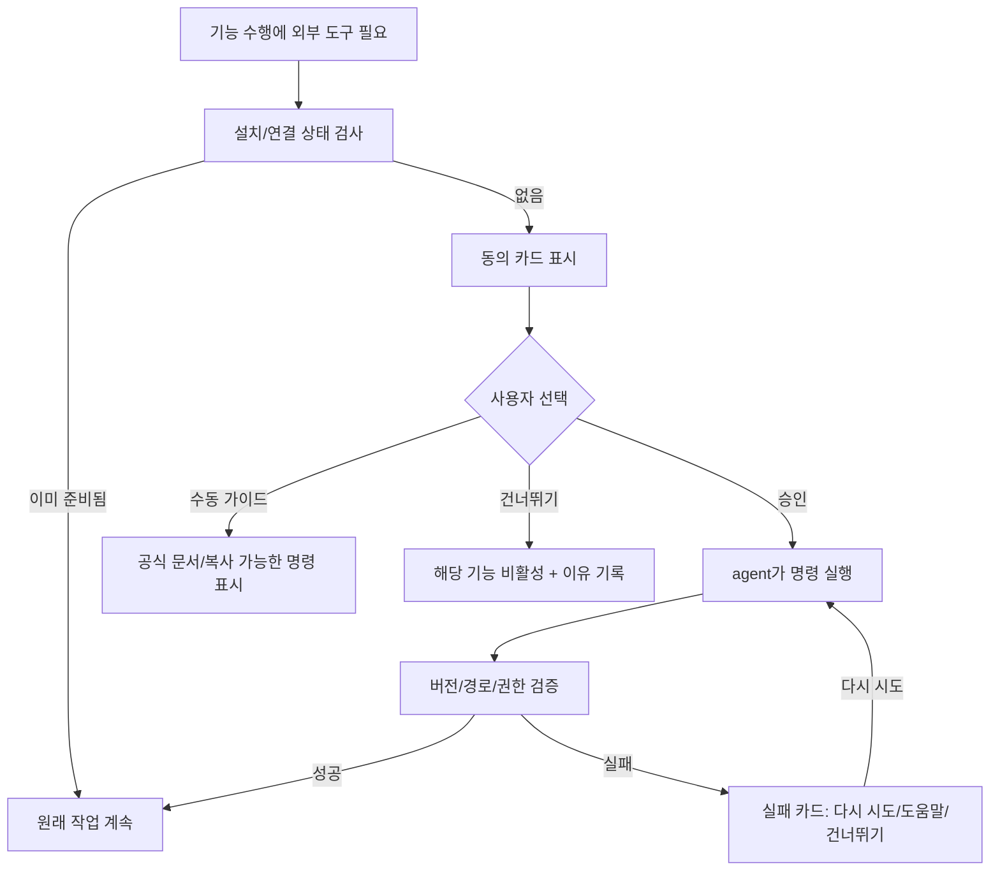
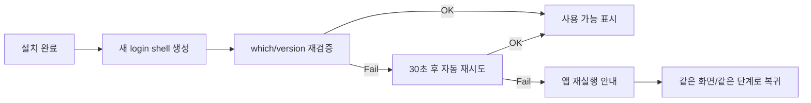
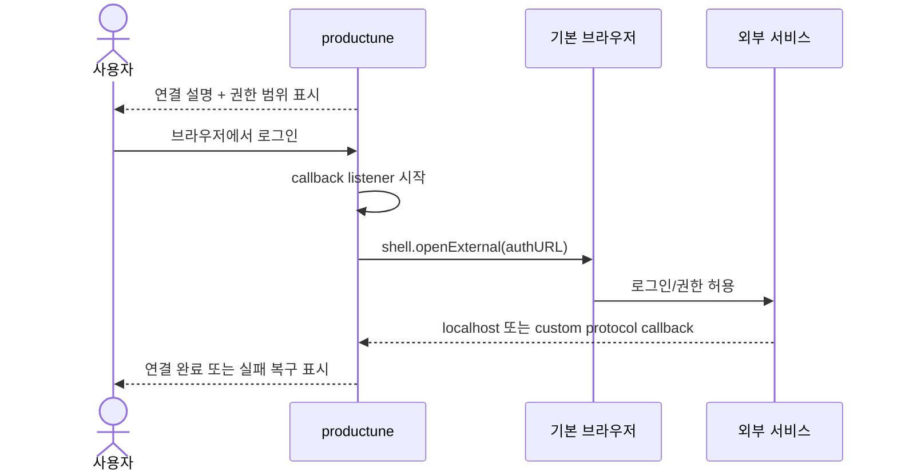
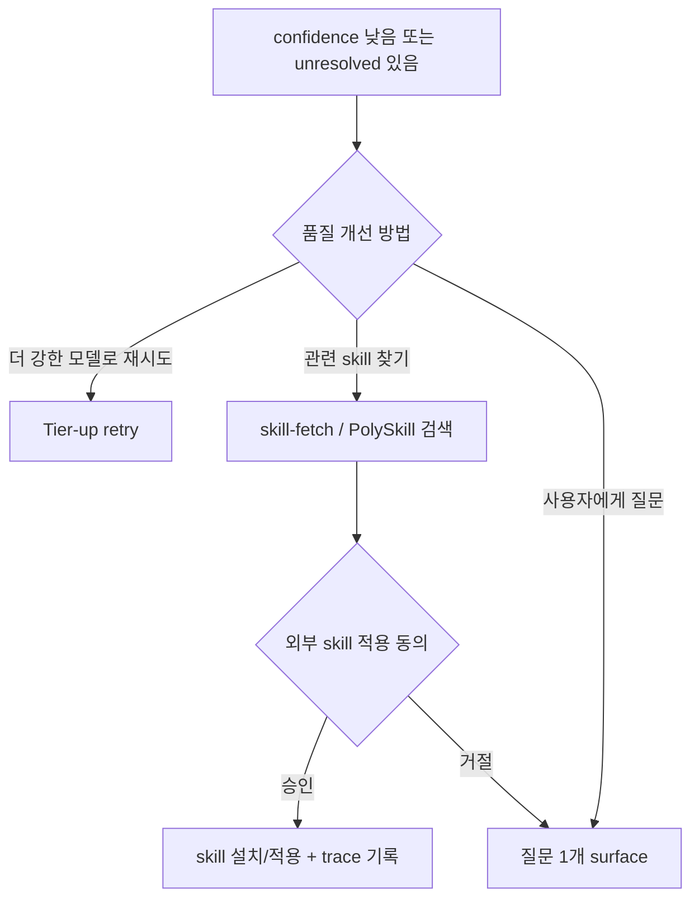

# productune Phase 4 — 전체 서비스 플로우 & 화면 설계

**Slug**: phase4-service-flow  **Created**: 2026-04-30  **Status**: Design gate draft (Build 전 사용자 승인 필요)
**PRD anchor**: [docs/prd/productune.md#phase-4--terminal-무의존-gui-풀-사이클-future](../prd/productune.md#phase-4--terminal-무의존-gui-풀-사이클-future)
**Companion**: [design-direction.md](./design-direction.md), [service-design-system.md](./service-design-system.md), [service-flow-wireframe.excalidraw.json](./service-flow-wireframe.excalidraw.json), [productune/mockups/mockup.html](./productune/mockups/mockup.html)
**Mockup-as-source**: 본 문서의 layout / panel / pane / tab / chat 스펙은 `docs/design/productune/mockups/mockup.html` 을 진실의 출처로 한다 (2026-05-06 결정). 위 6 결정 (단일 PO 세션 / lucide-react / chat-on-right / planner 모드 제거 / git workflow rule / chat.json 단일 파일) 과 충돌 시 결정 우선.

> Phase 4 GUI 구현 전 합의해야 하는 **서비스 전체 UX 흐름**. 범위는 install/auth 만이 아니라 프로젝트 시작부터 PRD → Design → Build → Deploy → Close 한 사이클 전체다. **Build 는 디자인 산출물 명시 승인 전 절대 시작하지 않는다.**

---

## 1. 제품 멘탈 모델

Phase 4 GUI 는 개발 용어를 숨기고, 사용자가 세 가지만 머리에 넣게 한다.

| 모델 | 사용자 표현 | 화면 표현 | 내부 매핑 |
|---|---|---|---|
| **프로젝트 데스크** | "내 제품 작업 책상" | Activity Bar (4 탭) + Side panel (탐색/프로젝트/팀/설정) + Main 작업대 (split-pane + 탭) + Right 패널 (PO 채팅) | project root + `.productune/` |
| **페르소나 팀** | "PO·디자이너·개발자·QA가 도와줌" | Right Panel = PO Chat (단일 세션) + Team 탭 (Personas+Skills+Memory) | `pdt-po`, `pdt-designer`, `pdt-developer`, `pdt-qa` |
| **산출물 캐비닛** | "결정문서 / 디자인 / 티켓 / 검증 결과 모음" | Project 탭의 sub-items (PRD / Design Gate / Tickets / QA Verdict) + Explorer 탭의 파일 트리 | `docs/prd`, `docs/design`, `docs/tickets`, `docs/qa` |

노출하지 않는 말: branch, commit, PR, shell, sub-agent, hook, raw env, **worktree, dev, merge, staging**. 필요하면 자연어로 바꾼다: "자동저장", "배포 준비", "배포하기", "작업공간", "검증용 중간 환경", "외부 점검 환경", "실행 환경 값". 매핑 1:1 강제 — §3.2 표 참조.

---

## 2. 전체 서비스 흐름

### 2.1 앱 시작 → 프로젝트 데스크



### 2.2 한 라운드의 5-phase 사이클



**하드 게이트**: `DESIGN → BUILD` 전이는 사용자가 `[이 디자인으로 Build 시작]` 을 누른 경우만 가능. "대충 진행", "묵시적 승인", "시간 초과 자동 승인" 없음.

### 2.3 사용자에게 보이는 페르소나 협업



---

## 3. 정보 구조와 기본 레이아웃



### 3.1 Workspace shell (mockup-as-source)

> **2026-05-06 갱신**: mockup.html 을 spec 진실로 채택. **상단 단독 breadcrumb 행 제거**. Stage = Project tab Stage strip + Right Panel ctx chip 이중 노출.

**레이아웃**:

```
┌────────────────────────────────────────────────────────────────────────────┐
│ Title bar 36px — traffic dots / Quick Open trigger (⌘P) center             │
├──┬──────────────┬───────────────────────────────────────┬──────────────────┤
│A │ Side panel   │ Main panel                            │ Right panel      │
│B │ 260px        │ (split-capable, dynamic panes + tabs) │ 340px            │
│ 4│              │                                       │                  │
│ 8│ ─ 4 tabs:    │  hbox / vbox 재귀 split tree          │  PO Chat (단일)  │
│  │   Explorer   │  각 leaf = pane (탭 bar + 컨텐츠)     │                  │
│ +│   Project    │  pane resize 4px (col / row)          │  rp-hdr (35px)   │
│ logo│ Team       │                                       │  rp-ctx (stage)  │
│  │   Settings   │  pane 컨텐츠 = tab dispatcher:        │  rp-msgs flex    │
│  │              │   markdown / preview / env-view /     │  rp-input        │
│  │              │   ticket-review / persona-def /       │                  │
│  │              │   skill-matrix / design-gate /        │  minimize / X    │
│  │              │   terminal / browser                  │  → FAB 회수      │
├──┴──────────────┴───────────────────────────────────────┴──────────────────┤
│ Status bar 22px — full width — PO-orange bg                                │
└────────────────────────────────────────────────────────────────────────────┘
```

| 영역 | 너비 | 역할 | 내용 |
|---|---|---|---|
| **Activity Bar** | 48px (고정) | Side panel 컨텐츠 전환 | 상단 logo + **4 아이콘 — Explorer / Project / Team / Settings**. 클릭 = Side panel view 교체. 동일 아이콘 재클릭 = Side panel 토글 (collapse/expand). active 표시 = 좌측 2px PO-orange bar. lucide-react 매핑: FolderTree / LayoutDashboard / Users / Settings |
| **Side panel** | 260px (고정, collapse 시 0) | Activity Bar 선택에 따라 컨텐츠 교체 | §4 의 L2 (4 탭 컨텐츠 명시) |
| **Main panel** | 1fr (가변, min 150×100/pane) | **split-capable** — 동적 pane tree (`hbox`/`vbox` 재귀) | 각 leaf pane = tab bar + 컨텐츠. tab 종류 dispatch (§4 의 L3). drag-and-drop tab reorder + cross-pane move. 빈 pane = Quick Open / 단축키 안내 empty-state |
| **Right panel (PO Chat)** | 340px (고정, collapse 시 0) | PO 와의 대화 — 항상 우측 고정 | §4 의 L4. **단일 세션, 멀티 채팅방 X**. minimize / close 후 우하단 FAB (`💬 PO`) 로 회수 |
| **Status bar** | 22px (높이, 전체 폭) | 안심 피드백 (PO-orange bg) | 좌측: 작업 식별자(내부 branch-like 값은 숨김) / PO active dot / Design Review pending. 우측: ticket count / model badge / vercel status |
| **상단 breadcrumb 행** | **제거** | — | Phase 표시는 Project tab Phase strip + Right Panel ctx chip 으로 분산 노출 |

**Activity Bar 전이 규칙**:
- Explorer (`⌘⇧E`) 클릭 → Side panel = 파일 트리 + 검색 박스 (정규식/대소문자/단어 토글).
- Project 클릭 → Side panel = Stage strip + Rounds list + sub-items + Preview + Recent Activity.
- Team 클릭 → Side panel = Personas (4) + Skills (Matrix ↗) + Wiki/Memory.
- Settings 클릭 → Side panel = Environment + Models + MCP Servers + Hooks (T-P4-024 git workflow 토글 통합).
- 동일 아이콘 재클릭 = Side panel collapse / expand 토글.

**상단 단독 breadcrumb 행 제거 근거 (2026-05-06)**: 4-region 레이아웃에서 상단 breadcrumb 가 차지하던 64px 는 Right Panel 위쪽에 시각 공백을 만들고 Main 의 split-pane 시스템과 경쟁. Phase 정보는 (a) Project tab 의 Phase strip (현재 / 이전 단계 시각화), (b) Right Panel 의 ctx 라인 phase chip (지금 보고 있는 채팅의 컨텍스트) 두 군데에서 의도적으로 중복 노출 — 사용자가 Project tab 또는 PO Chat 둘 중 하나는 항상 본다는 가정.

**PO chat 우측 고정 결정 근거**: 사용자가 어떤 stage / 어떤 main pane 컨텐츠에서든 PO 에게 즉시 질문할 수 있어야 한다. chat 이 Main 영역과 같은 split-pane 트리에 들어가면 ticket-review 나 디자인 리뷰가 표시될 때 chat 이 사라진다. 우측 고정으로 두 영역이 독립적 폭을 유지. 단 사용자가 임시로 polished view 를 원할 때 minimize → FAB 로 회수 가능.

**PO 세션 단일 모델 (2026-05-06 유지)**: GUI 는 프로젝트당 하나의 PO 세션만 운영. Right Panel 헤더 = `[P] PO Chat`, ctx 라인 = phase chip + round-N + active ticket. 세션 데이터 = `<projectDir>/.productune/chat.json` 단일 파일. CLI/non-GUI 에서는 multi-session 가능성 보존.

**페르소나 panel 위치 (2026-05-06 확정)**: Side panel 의 **Team 탭** 안에 통합 — Personas (4) row + Skills 목록 + Matrix ↗ 링크 + Wiki/Memory + Promotion candidates. 우측 별도 panel 사용 X (Right Panel 은 PO Chat 전용).

> **구현 참고 (Slice 1+2 refactor 대상)**: 현재 구현된 `WorkspaceShell` 의 grid 는 mockup 정합 X. **mockup 의 4-region (Activity Bar 48 / Side 260 / Main 가변 split-pane / Right 340) + 상단 breadcrumb 제거 + Status bar 22px full-width** 로 갱신 필요. Round 4 mockup-source 갱신 라운드의 첫 작업.

### 3.2 어휘 매핑 (내부 ↔ 사용자)

내부 어휘는 doctrine / 코드에 그대로 남되, 사용자 화면에는 절대 노출 X. 1:1 매핑 강제.

| 내부 어휘 | 사용자 표현 | 트리거 |
|---|---|---|
| branch 생성 + worktree | (보이지 않음 — Project 탭 active ticket row + Status bar "작업공간 준비됨" 배지) | ticket 발행 직후 |
| commit (자동) | **자동저장** (status bar) | persona turn end + 상태 변화 |
| push & dev merge | **배포 준비** | 사용자 확인 / skip (Option A 면 hidden) |
| main PR + squash merge + deploy | **배포하기** | 사용자 명시 클릭만 |
| dev/main 직접 push 차단 | **"보호된 환경입니다. 작업공간에서 시작해주세요."** + [새 작업 시작] CTA | 차단 hook |
| dev branch | **검증용 중간 환경** | Settings 의 `useDevBranch=true` 시 활성 |
| main branch | **프로덕션 환경** | 항상 보호 |
| staging | **외부 점검 환경** | Settings 의 `useStagingEnv=true` (첫 런칭 후) |
| feature vs fix | (보이지 않음, ticket 카드 색상/아이콘만) | ticket `risk_flags` / `stage` 자동 |
| git log | **버전 히스토리** (ticket 단위 카드 UI, 자연어) | [버전 히스토리] 탭 |
| chat rooms / multi-session | (없음 — GUI 에서 노출 X) | GUI 는 단일 PO 세션만 |
| **Explorer (mockup 영문)** | **탐색** (Activity Bar tooltip 한글) | Activity Bar UI string |
| **Project** | **프로젝트** | Activity Bar UI string |
| **Team** | **팀** | Activity Bar UI string |
| **Settings** | **설정** | Activity Bar UI string |
| **Phase / Rounds / Tickets / Preview / Recent Activity** | **단계 / 라운드 / 티켓 / 미리보기 / 최근 활동** | Project tab sp-sec-hdr |
| **Personas / Skills / Wiki / Memory / Promotion candidates** | **페르소나 / 스킬 / 위키 / 메모리 / 승급 후보** | Team tab sp-sec-hdr |
| **Environment / Models / MCP Servers / Hooks** | **환경 / 모델 / MCP 서버 / 훅** | Settings tab sp-sec-hdr |

**원칙**: 위 표 = 1:1 매핑 강제. 위반 시 design lint 에서 잡는다 — 사용자 화면 영역 (Workspace shell / 화면 카탈로그 §4 / empty/error 메시지) 에서 좌측 컬럼 어휘 노출 발견 시 차단. doctrine 영역 (`~/.productune/sections/*.md`, `docs/prd/`, `docs/tickets/`, **본 design doc 자체**) 은 영문 mockup 어휘 그대로 OK (개발자 ↔ 디자이너 reference 일관성).

---

## 4. 화면 카탈로그

| ID | 화면 | 단계 | 핵심 액션 / mockup 매핑 |
|---|---|---|---|
| A1 | First-run wizard | 최초 실행 1회 | Engine / Wiki backend / API Key 선택 (mockup 외 별도) |
| A2 | Recent projects | 시작 | 새 프로젝트, 기존 폴더 열기 |
| A3 | 새 프로젝트 만들기 | 시작 | slug 입력, GitHub OAuth (선택). mockup `modal-bg#new-project-modal` (단, mode 분기 제거 — planner/developer 버튼 무시) |
| A4 | 기존 폴더 연결 | 시작 | `.productune/` 감지, `project:installAt` 실행 |
| **B1** | **프로젝트 데스크** | 전체 | **mockup `.app` + `.sb` 전체 — Activity Bar 48 / Side 260 / Main split / Right 340 / Status 22**. 위쪽 단독 breadcrumb 행 없음. |
| **B2** | **PO 채팅 (Right Panel)** | 전체 | **mockup `.rp` 전체** — 단일 PO 세션, 프로젝트당 하나, 멀티 채팅방 X. header / ctx (phase chip + round + ticket) / msgs (페르소나별 좌측 2px accent) / textarea + Send (persona selector 제거 — sub-c). minimize / close → FAB 회수. |
| B3 | 티켓 rows / ticket-review 탭 | Build/QA | Project tab 의 Tickets sub-items + Main 의 `ticket-review` 탭 (mockup `tr-body` + `tr-actions`). 별도 보드 화면 X — sidebar 트리 + main viewer 2단 구조. |
| C1 | 디자인 리뷰 (Design Gate) | Design | Main 의 `design-gate` 탭 (mockup `dg-tabs` + `dg-body` + `dg-footer`). dg-tabs = System / Flow / Wireframe / Mockup. footer = 승인 / 다시 작업 / 특정 부분 수정. |
| C2 | Mermaid flow viewer | Design | dg-body 안 또는 markdown tab 의 inline render. zoom/pan, source toggle/copy, 오류 fallback. |
| C3 | Excalidraw wireframe viewer | Design | dg-body 안 React 컴포넌트 embed. |
| C4 | Design system viewer | Design | dg-body 안 풍부한 md (color swatch / typography preview). |
| C5 | 디자인 승인 게이트 | Design | dg-footer — 진행 / 다시 작업 / 특정 수정 요청. |
| D1 | Build progress | Build | Project tab 의 round + Tickets sub-items + ticket-review pane. |
| E1 | QA verdict | QA | Main 의 `qa-result` 탭 (mockup `qa-body` + `qa-verdict` + `qa-suite`). status badge pass/fail. |
| F1 | Env panel | Deploy | Settings 탭 의 Environment sec-hdr 클릭 → Main 의 `env-view` 탭 (mockup `env-table`). |
| F2 | Deploy panel | Deploy | Project tab 의 Preview (Local / Vercel) + Main 의 `preview` 탭 (mockup `prev-chrome` + `prev-body`). 배포 액션은 별도 [배포하기] CTA. |
| G1 | Close / Retrospective dashboard | Close | Project tab Recent Activity sec (회고 source) + Status bar 의 vercel dot (배포 결과 모니터링). retrospective 산출물 = `docs/retrospectives/<version>.md`. |
| **H1** | **산출물 캐비닛** | 전체 | **Project tab 의 Rounds → Tickets / PRD / Design Gate / QA Verdict sub-items + Explorer tab 의 파일 트리** 분산 노출. 별도 cabinet 화면 X. |
| **I1** | **페르소나 / 스킬 panel** | 전체 | **Team tab 의 Personas + Skills + Wiki/Memory** (mockup `sv-team` 전체). 우측 별도 panel 아님. Team tab 의 `Matrix ↗` → Main 의 `skill-matrix` 탭. |
| J1 | External dependency consent | 필요 시 | 모달. 설치/인증 동의. |
| J2 | Install progress/failure | 필요 시 | 진행률, 실패 복구. |
| J3 | Browser auth | 필요 시 | 기본 브라우저 로그인. |
| J4 | Relaunch/PATH recovery | 필요 시 | 자동 재시도, 앱 재실행. |
| **K1** | **작업 흐름 규칙 (Settings)** | 설정 | **Settings tab 의 Environment / Models / MCP Servers / Hooks** (mockup `sv-settings`). T-P4-024 의 `useDevBranch` / `useStagingEnv` / branch prefix 토글이 Hooks / Environment 와 함께 통합 노출. |
| K2 | 버전 히스토리 카드 | 전체 | Project tab 의 Recent Activity + Main 의 dedicated `history` 탭 (mockup 외 — Round 2 신설). |
| **L1** | **Activity Bar** | 전체 | **mockup `.ab`** — 상단 logo + 4 아이콘 (Explorer ⌘⇧E / Project / Team / Settings). active = 좌측 2px PO-orange bar. 48px 고정폭. |
| **L2** | **Side panel (4 탭 view)** | 전체 | **mockup `.sp` + 각 `.sp-view`** — Activity Bar 선택에 따라 view 전환. 각 탭의 본문은 §4.1. 260px 고정폭, collapse 시 0. |
| **L3 (신규)** | **Main panel — split-pane + 탭 dispatcher** | 전체 | **mockup `.main` + layout tree** — `hbox`/`vbox` 재귀 split. 각 leaf pane = tab bar + 컨텐츠. tab type dispatcher 9종 (§4.2). pane resize handle 4px. drag-tab cross-pane move. empty pane = Quick Open / 단축키 안내. |
| **L4 (신규)** | **Right panel — PO Chat** | 전체 | **mockup `.rp`** (B2 와 동일). 별도 entry 로 명시. |
| L5 (신규) | Status bar | 전체 | mockup `.sb` — full-width 22px PO-orange bg. 좌측: 작업 식별 / PO active / Design Review pending. 우측: ticket count / model / vercel. |
| L6 (신규) | Title bar + Quick Open trigger | 전체 | mockup `.titlebar` + `.qo-trigger` — mac traffic dots + 가운데 ⌘P trigger. clickable + kbd hint. |

### 4.1 Side panel — 4 탭 본문 명시

#### Explorer 탭 (mockup `sv-explorer`)
- `sp-hdr` 라벨 = "Explorer" (한글: "탐색") + `+` 버튼 (새 프로젝트 = `newProject()`).
- **검색 박스** (`ex-search-wrap`):
  - 검색 input + clear `×` 버튼.
  - 옵션 토글 3종: 정규식 (`.*`) / 대소문자 (`Aa`) / 전체 단어 (`W`). active 시 background 강조.
- **파일 트리** (`sp-body#explorer-body`):
  - `ft-item` 행 = 아이콘 + 라벨. hover bg #1a1a1a, active bg #1f3a5f.
  - 검색 모드 진입 시 결과 행 (`sr-file` 헤더 + `sr-line` 하위 — 줄번호 + match highlight `#daa520`).
- 단축키: ⌘⇧E (탭 토글), ⌘⇧F (검색 focus — 추론).

#### Project 탭 (mockup `sv-project`)
- `sp-hdr` = "Project" + 우측 프로젝트 slug.
- **Phase** (`pp-sec-hdr` + `phase-strip`):
  - 5 phase `pdot-item` (PRD / Design / Build / Deploy / Close).
  - 상태: done (gray dot, muted) / cur (bright text + bg + phase 색 dot) / pending (gray-300).
  - 가로 스크롤 — 좁은 폭에서는 4개 노출 + scroll.
- **Rounds** (`pp-sec-hdr Rounds`):
  - round-N pp-row + 펼침 화살표 + 상태 badge (done success / active warn).
  - 펼치기 시 sub-items (indent 34px):
    - 📄 **PRD** → `markdown` tab open
    - 🎨 **Design Gate** + status badge (review warn / approved success / pending) → `design-gate` tab
    - 📋 **Tickets (N)** + 펼치기 → 각 ticket pp-row (indent 46px) + status sbadge (todo gray / in-progress info / review warn / done success / blocked err) → `ticket-review` tab 또는 `markdown` tab
    - ✓ **QA Verdict** + status badge → `qa-result` tab
- **Preview** (`pp-sec-hdr Preview`):
  - 🌐 Local (:3000) → `preview` tab (env=local)
  - ☁ Vercel preview → `preview` tab (env=vercel)
- **Recent Activity** (`pp-sec-hdr`):
  - mono-font 1행 — 페르소나 chip (Dev/Des color) + ticket-id + model/effort + turn N.
  - 최근 N개 (5–10) 표시. 클릭 비활성 (display only).

#### Team 탭 (mockup `sv-team`)
- `sp-hdr` = "Team".
- **Personas (4)** (`pp-sec-hdr`):
  - `persona-row` × 4 (PO / Designer / Developer / QA).
  - avatar (`p-avatar` 24×24, persona color bg) + name + role + 우측 model/effort.
  - 클릭 → Main 에 `persona-def` tab open (persona 정의 md edit/preview).
- **Skills** (`pp-sec-hdr Skills`):
  - 우측 `Matrix ↗` 버튼 → Main 의 `skill-matrix` tab.
  - `skill-row-sp` 목록 일부 (5–8개) + 이하 "+ N more…".
  - 각 skill 클릭 → Main 의 `skill-matrix` 에 해당 row 강조.
- **Wiki / Memory** (`pp-sec-hdr`):
  - 🧠 **User memory** → Main 의 `markdown` tab (`~/.productune/po-memory.md`)
  - ⚙ **Project state** → Main 의 `markdown` tab (`.productune/po-state.json`)
  - 📌 **Promotion candidates** + count badge (warn) → Main 의 `markdown` tab 또는 promotion-review modal.

#### Settings 탭 (mockup `sv-settings`)
- `sp-hdr` = "Settings".
- **Environment** (`pp-sec-hdr`):
  - Project .env (12 vars) → `env-view` tab (layer=project)
  - Project secrets (3 vars) → `env-view` tab (layer=secrets)
  - User global (5 vars) → `env-view` tab (layer=global)
- **Models** (`pp-sec-hdr`):
  - Catalog → 모델 카탈로그 viewer (opus/sonnet/haiku effort matrix)
- **MCP Servers** (`pp-sec-hdr`):
  - graphiti (s-badge ok = 초록 connected)
  - figma (s-badge err = 빨강 unauth)
  - linear (s-badge err = 빨강 unauth)
  - 클릭 → MCP 설정 modal (auth + endpoint).
- **Hooks** (`pp-sec-hdr`):
  - PreToolUse (s-badge ok = 5 active)
  - PostToolUse (s-badge ok = 3 active)
  - 클릭 → hook list viewer.
- **Workflow rules (T-P4-024 통합)**: 별도 sec-hdr 또는 Hooks 섹션 안 — `useDevBranch` / `useStagingEnv` / `featureBranchPrefix` / `fixBranchPrefix` 토글. 변경 = 다음 ticket 부터 즉시 반영.

### 4.2 Main panel — pane / tab dispatcher

mockup 의 `openTab(tabId, type, props)` 호출이 active pane 에 tab 추가. 10 type:

| Tab type | mockup 섹션 | 컨텐츠 |
|---|---|---|
| `markdown` | `md-toolbar` + `md-view` / `md-edit` | edit/preview 토글, 풍부한 md 렌더 (h1/h2/code/table) |
| `preview` | `prev-chrome` + `prev-body` | URL bar + Local/Vercel toggle + iframe placeholder |
| `env-view` | `env-table` | layer 헤더 + 변수 행 (key/value/mask) |
| `ticket-review` | `tr-body` + `tr-actions` | ticket body + Persona Activity 표 + footer 액션 |
| `persona-def` | `pd-header` + `pd-edit-toggle` + `pd-content` | avatar/name/role/model + persona 정의 md edit/preview |
| `skill-matrix` | `sm-toolbar` + `sm-table` + `sm-add` | skill × persona checkbox grid + skill 추가 input |
| `design-gate` | `dg-tabs` + `dg-body` + `dg-footer` | System / Flow / Wireframe / Mockup tabs + 산출물 viewer + 승인 액션 |
| `qa-result` | `qa-body` + `qa-verdict` + `qa-suite` | overall pass/fail + 테스트 suite 펼침 |
| `terminal` / `browser` | `term-content` / `browser-wrap` | mono terminal / browser placeholder |

**Pane operations**:
- `splitRight(paneId)` — `hbox` split (mockup `splitInTree`).
- `splitDown(paneId)` — `vbox` split.
- `closePane(paneId)` — tab merge into adjacent pane → tree 재구성. 마지막 pane 은 close 시 init pane 으로 reset.
- `setActivePane(paneId)` — active border + `active-pane` class.
- Drag tab cross-pane — `drop-before` / `drop-after` / `bar-end-drop` / `pane-drop-zone` 시각 피드백.

**Empty pane** (mockup `empty-state`):
- 가운데 logo (28px, opacity .25)
- `esc-title` "Open a file or run a command" (한글: "파일을 열거나 명령을 실행하세요")
- 단축키 hint 행 (`scr` + `kbd`):
  - `⌘P` Quick Open
  - `⌘\\` Split Right
  - `⌘W` Close Tab

### 4.3 Right panel — PO Chat (mockup `.rp`)

```
┌─────────────────────────────────────┐
│ rp-hdr 35px                         │
│ [P] PO Chat            ─  ×        │
├─────────────────────────────────────┤
│ rp-ctx — [Build chip] round-3 · T-001 in review │
├─────────────────────────────────────┤
│ rp-msgs (flex 1, scroll)            │
│  ┌ trace ─ → new task ...          │
│  ┌ po (orange border-l) ─ 메시지   │
│  ┌ designer (purple)   ─           │
│  ┌ dev (sky)           ─           │
│  ┌ qa (green)          ─           │
│  ┌ user (right-aligned, no border) │
├─────────────────────────────────────┤
│ rp-ta (textarea)                    │
│                           [↑ Send] │
└─────────────────────────────────────┘
```

**Header (`rp-hdr`)**:
- 좌측 `rp-pb` (PO 페르소나 badge, 20×20 PO-orange bg, "P").
- 가운데 `rp-title` "PO Chat" (한글: "PO 대화" 또는 "PO 와 대화").
- 우측 minimize (`─`) / close (`×`) 버튼.

**Context line (`rp-ctx`)**:
- `phase-chip` — 현재 phase pill (Build = `#1f2a3a` bg + `var(--phase-build)` text).
- `round-N · T-NNN <action>` — 현재 라운드 / 활성 티켓 / 액션 상태.
- 8px gap, 10px caption font.

**Messages (`rp-msgs`)**:
- 메시지 타입별 좌측 2px accent bar:
  - `chat-msg po` — `var(--po)` `#FF6B2B` (orange)
  - `chat-msg designer` — `var(--designer)` `#A78BFA` (purple)
  - `chat-msg dev` — `var(--dev)` `#38BDF8` (sky)
  - `chat-msg qa` — `var(--qa)` `#34D399` (green)
  - `chat-msg trace` — no border, mono caption gray (시스템 trace `→ delegating to ...`)
  - `chat-msg user` — no border, **우측 정렬**, gray-overlay bg
- 헤더 (`cm-head`): persona name (페르소나 색) + timestamp.
- bubble (`cm-bubble`): 7px 10px padding, radius 0 5 5 5 (좌상 각짐 — accent bar 강조).

**Input (`rp-input`)**:
- `rp-ta` textarea — 6px 9px padding, min 48px, resize none.
- `rp-bar` — 우측 `rp-send` Send 버튼 (PO-orange bg). persona selector 제거 (sub-c — PO autonomy 회복).
- Enter = 전송, Shift+Enter = 줄바꿈.

**Minimize / Close → FAB**:
- minimize = panel 폭 0 (collapsed), Activity Bar 우측에 FAB (`rp-fab` 우하단 12 28px) `💬 PO` 노출.
- close 도 동일 동작 (전체 hide). FAB 클릭 = panel 복원.

**Streaming**:
- `claude --output-format stream-json` 또는 SSE 토큰 push.
- 자동 스크롤 to bottom + 사용자 스크롤 시 자동 스크롤 잠금.

---

## 5. Design stage와 승인 게이트

### 5.1 필수 산출물 4종

| 산출물 | 표현 | 저장 위치 | 승인 기준 |
|---|---|---|---|
| Design system | Rich Markdown + custom React components | `docs/design/<slug>/design-system.md` | 토큰/컴포넌트/상태 표시 규칙이 구현 가능함 |
| Flow diagrams | Mermaid.js | `docs/design/<slug>/flow.md` 또는 `service-flow-and-screens.md` | 전체 stage, 화면 전이, state가 이해됨. Phase 4 GUI 는 Electron/React 내장 viewer 로 inline 렌더 |
| Wireframe | Excalidraw React | `docs/design/<slug>/wireframes/*.excalidraw.json` | workspace, 승인 게이트, 외부 동의 화면이 보임 |
| **Mockup (hi-fi)** | HTML/CSS 정적 프리뷰 | `docs/design/<slug>/mockups/*.html` | non-canonical visual agreement. Build 전 현실감 있는 예시. **본 문서의 source = `productune/mockups/mockup.html`** |

### 5.2 Design Gate tab spec (mockup `design-gate`)

`design-gate` tab 의 4 sub-tab (`dg-tabs`):

| Sub-tab | 컨텐츠 |
|---|---|
| **System** | design-system.md 풍부한 md 렌더 (color swatch / typography preview / 컴포넌트 갤러리) |
| **Flow** | flow.md inline mermaid 렌더 (zoom/pan, source toggle/copy) |
| **Wireframe** | excalidraw.json React 컴포넌트 embed |
| **Mockup** | HTML 정적 프리뷰 (iframe 또는 sandboxed render) |

`dg-footer` 액션 (sticky bottom):
- **이 디자인으로 Build 시작** (primary, PO-orange) — Build stage unlock.
- **다시 작업** (secondary) — Designer 전체 재작업.
- **특정 부분 수정** (ghost) — 사용자가 범위 선택해 Designer 에 수정 요청.
- **나중에 검토** (ghost) — 현재 Design stage 머무름.

### 5.3 게이트 상태도



---

## 6. 외부 CLI/라이브러리 설치 동의 흐름

외부 도구는 사용자 컴퓨터나 외부 계정에 영향을 준다. 그래서 항상 **설명 → 명령/위치 공개 → 되돌리기 안내 → 명시 승인 → 실행** 순서다.



### 6.1 동의 카드 필수 정보

| 필드 | 예시 |
|---|---|
| **무엇** | "Vercel CLI — Vercel 배포를 컴퓨터에서 실행하는 공식 도구" |
| **왜 필요** | "Deploy 단계에서 미리보기/프로덕션 배포를 시작하려면 필요" |
| **실행 명령** | `pnpm add -g vercel` 또는 OS별 설치 명령. 기본 접힘, 고급 보기에서 표시 |
| **설치/변경 위치** | global npm prefix, Homebrew cellar, 프로젝트 `package.json` 등 |
| **되돌리기** | `pnpm remove -g vercel`, `brew uninstall ...`, 연결 해제 위치 |
| **권한/인증** | OAuth scope, 토큰 저장 위치, 만료/철회 방법 |
| **예상 시간** | "약 1–3분" |

### 6.2 동의 문구 원칙

- 자동 설치 금지. 버튼 라벨은 항상 **설치하기**, **연결하기**, **권한 허용하기** 처럼 명시적이어야 한다.
- "권장"은 붙일 수 있지만 선택권을 숨기지 않는다.
- raw 로그는 기본 접힘. 실패 시만 자동 펼침.
- 동의 내역은 프로젝트 설정에서 조회/철회 가능해야 한다.

### 6.3 적용 대상

| 대상 | 최초 발생 | 특이사항 |
|---|---|---|
| GitHub OAuth | 새 프로젝트 저장소 연결 | 기본 브라우저 OAuth, private repo 생성 동의 |
| Vercel CLI/API | Deploy | CLI 설치 + 브라우저 로그인 + env push 동의 |
| Supabase CLI | 선택 기능 | 로컬 개발 서버 필요 시 동의 |
| Google Cloud SDK `gcloud` | GA4/Google 연동 | SDK 용량/설치 위치/권한을 특히 명확히 표시 |
| skill-fetch / PolySkill | 품질 에스컬레이션 | 외부 skill 검색 소스와 적용 위치 표시 |

---

## 7. PATH, relaunch, 브라우저 auth 처리

### 7.1 PATH/relaunch



원칙: "터미널을 다시 여세요"라고 말하지 않는다. 앱이 새 shell을 만들고, 그래도 실패할 때만 `[지금 앱 다시 시작]` 을 제공한다. 재실행 전 current project, route, pending dependency step을 저장한다.

### 7.2 브라우저 auth



내부 webview는 쓰지 않는다. 피싱 오해를 줄이기 위해 항상 사용자의 기본 브라우저를 연다.

---

## 8. OSS skill/workflow 노출

### 8.1 Skill panel 구조 (Team tab + skill-matrix)

| 영역 | 내용 |
|---|---|
| 보유 skill | Team tab 의 Skills 섹션 (5–8개 + Matrix ↗) |
| 이번 작업 사용됨 | PO Chat 의 trace 메시지 ("→ skill: pm-product-discovery:interview-script") + Project tab Recent Activity |
| 품질 에스컬레이션 | confidence 낮을 때 PO Chat 안 3-option 메뉴 (tier-up / skill 검색 / 사용자 결정) |
| 전체 매트릭스 | Main 의 `skill-matrix` 탭 — skill × persona checkbox grid |

### 8.2 매핑

| 워크플로 | OSS | GUI 노출 예시 |
|---|---|---|
| Real Engineering | `mattpocock/skills` | `to-prd`, `to-issues`, `tdd`, `triage-issue`, `request-refactor-plan` |
| PO/PM | `phuryn/pm-skills` | `pm-product-discovery`, `pm-market-research`, `pm-product-strategy`, `pm-execution` |
| Skill search | `skill-fetch` / PolySkill | "더 맞는 skill 찾아보기" 품질 에스컬레이션 옵션 |



---

## 9. 주요 화면별 empty/error/pending 규칙

| 상태 | 표현 | 금지 |
|---|---|---|
| Empty | 다음 행동 1개 + 짧은 설명 | 빈 표만 노출 |
| Empty pane (Main) | logo + "파일을 열거나 명령을 실행하세요" + ⌘P 단축키 hint | 자동으로 임의 컨텐츠 채움 |
| Pending | skeleton 또는 spinner + 현재 하는 일 1줄 | raw 로그 자동 노출 |
| Error | 원인 자연어 + 다음 버튼 최대 3개 | stack trace 먼저 노출 |
| Blocked | 왜 막혔는지 + 누가/무엇을 기다리는지 | "실패"로만 표시 |
| Approved | 승인한 사람/시간/산출물 링크 | 승인 근거 없는 Build 시작 |

---

## 10. Build 착수 전 체크리스트

- [ ] 사용자에게 본 문서와 wireframe, design system, mockup.html 을 보여줬다.
- [ ] Design gate (Main `design-gate` tab) 의 `[이 디자인으로 Build 시작]` 승인을 받았다.
- [ ] 승인 대상 산출물 경로가 기록됐다.
- [ ] 외부 CLI/라이브러리 동의 패턴이 구현 티켓에 포함됐다.
- [ ] PATH/relaunch/auth 예외 처리가 구현 티켓에 포함됐다.
- [ ] Figma 없이 Mermaid + Excalidraw + Rich Markdown + HTML mockup stack으로 진행한다.
- [ ] mockup.html 의 lucide-react 매핑 표가 design-direction.md §6 에 반영됐다.

---

## Activity log

- **2026-04-30** — v1. 전체 서비스 플로우, 화면 카탈로그, 어휘 매핑, 외부 CLI 동의 흐름, OSS skill/workflow 노출 설계.
- **2026-05-04** — §3.1 Workspace shell 재작성. 레이아웃 `4-column grid 48/240/1fr/360` 확정. ActivityBar 48px (채팅방/산출물/설정 아이콘, VSCode activity bar 패턴) 신규 추가. PO chat panel 360px 우측 고정 명시 (chat-in-center 에서 chat-on-right 로 의도 변경). §4 화면 카탈로그 — B1/B2/B3/H1/K1 위치 설명 갱신, I1 "위치 TBD — Slice 5 재설계 예정" 마킹, L1 ActivityBar / L2 Side panel 신규 항목 추가. §1 멘탈 모델 표 갱신. 페르소나 panel 위치 = TBD (강한 후보: PO chat panel 위쪽 collapsible, Slice 5 designer 결정). 기존 stale 섹션: §3.1 전체 (3-column → 4-column), §4 B2 위치 ("중앙" → "우측 고정").
- **2026-05-06 (단일 PO 세션)** — GUI multi-chatroom 모델 → single PO session per project. §1 멘탈 모델 표 갱신 (Right Panel 단일 PO Chat, Side Panel 4탭). §3.1 ActivityBar 아이콘 설명 갱신 (Explorer / Project / Team / Settings), Side panel 컨텐츠 갱신 (채팅방 목록 제거). "PO 세션 단일 모델" 설명 추가. §3.2 어휘 매핑 표에 "chat rooms / multi-session → 없음" 행 추가. §4 화면 카탈로그 B2 갱신 ("단일 PO 세션, 프로젝트당 하나, 멀티 채팅방 X"), L1/L2 갱신 (채팅방 → PO 세션). §3.1 Mermaid 정보구조도 갱신 (Right Panel PO Chat 단일 세션, Side Panel 4탭).
- **2026-05-08** — 사용자 가시 phase 5단 통일 (PRD / Design / Build / Deploy / Close). 6단 (PRD/Design/Build/QA/Deploy/Operate) 폐기 — QA 는 ticket type 으로, Operate 는 Close phase 의 retrospective 가 흡수. T-P4-065 전체 (sub-a~f). §2.2 mermaid 6→5 phase, §3.1/§4.1 stage→phase 어휘 갱신, §4.3 stage-chip→phase-chip / `--stage-build`→`--phase-build`, G1 Operate→Close, persona selector 제거 반영.
- **2026-05-06 (mockup-as-source 정렬)** — `docs/design/productune/mockups/mockup.html` 을 spec 진실로 채택. **§3.1 전면 재작성** — 4-region (Activity Bar 48 / Side 260 / Main 가변 split-pane / Right 340 / Status 22 full-width). **상단 단독 breadcrumb 행 제거** — Stage = Project tab Stage strip + Right Panel ctx chip 이중 노출. ActivityBar 3 → 4 아이콘 (Explorer ⌘⇧E / Project / Team / Settings). **§3.2 어휘 매핑 표 확장** — Explorer/Project/Team/Settings + Stage/Rounds/Tickets/Preview/Recent Activity + Personas/Skills/Wiki/Memory + Environment/Models/MCP/Hooks 전 영역 한글 매핑 추가. **§4 화면 카탈로그 갱신** — B1/B2/B3/H1/I1/K1 mockup 매핑으로 재작성, L3 (Main split-pane + tab dispatcher) / L4 (Right Panel) / L5 (Status bar) / L6 (Title bar + Quick Open trigger) 신규. I1 "TBD" → "Team tab" 확정. **§4.1 Side panel 4 탭 본문 명시** 신규 — Explorer (검색 박스 + 트리), Project (Stage strip + Rounds + sub-items + Preview + Recent Activity), Team (Personas + Skills + Wiki/Memory), Settings (Environment + Models + MCP + Hooks + workflow rules 통합). **§4.2 Main pane / tab dispatcher** 신규 — 10 tab types (markdown/preview/env-view/ticket-review/persona-def/skill-matrix/design-gate/qa-result/terminal/browser) + pane operations + empty pane. **§4.3 Right panel PO Chat** 신규 — header / ctx / msgs (6 type: po/designer/dev/qa/trace/user) / input / minimize-FAB. **§5.1 산출물 4종** — mockup 추가. **§5.2 Design Gate tab spec** 신규 — dg-tabs 4 sub (System / Flow / Wireframe / Mockup) + footer 액션. **§8.1 Skill panel 구조** 갱신 — Team tab + skill-matrix tab 분리 노출. **§9 empty pane** 항목 추가. **§10 체크리스트** mockup.html / lucide-react 매핑 항목 추가.
