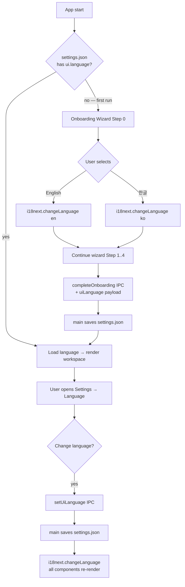

# T-P4-056: UI 언어 토글 (English / 한글) — onboarding step 추가 + GUI 전반 i18n 도입

**Round**: phase4-r4  **Stage**: impl  **Status**: todo  **Assignee**: pdt-developer
**PRD anchor**: [docs/prd/productune.md#phase-4--terminal-무의존-gui-풀-사이클-future](../../prd/productune.md#phase-4--terminal-무의존-gui-풀-사이클-future)
**Estimated complexity**: L4  **Risk flags**: i18n-migration, locale-persistence
**Design**: [`docs/artifacts/v0.4/T-P4-056-i18n-onboarding-toggle.md`](../../design/T-P4-056-i18n-onboarding-toggle.md)
**Dependencies**: T-P4-015 (onboarding wizard 존재), T-P4-024 (Settings 패널 — 본 ticket 이 Language sub-tab 추가)
**Related**: T-P4-048 (Settings 통합 — sub-tab list 갱신 동반)
**QA**: yes (light — UI 복수 언어 visual 검증, sonnet/haiku 가능)

> **번호 이력**: 처음 T-P4-049 로 발행 요청되었으나, 049 가 동일 일자 "Persona presence bar" ticket 에 점유 → 본 ticket 은 **T-P4-056** 으로 재배정 (Round 4 안 055 다음 빈 번호).

## Request

GUI 전반에 i18n 인프라 (`react-i18next` + `i18next`) 도입. 현재 한글로 박혀있는 사용자 노출 문자열 전체를 키 기반 카탈로그 (`packages/gui/src/locales/{en,ko}.json`) 로 외부화. 영어 default + 한글 opt-in. Onboarding wizard 첫 화면 (신규 **Step 0**) 에 언어 선택 토글 추가. 사용자 선택은 `~/.productune/settings.json` 에 user-global 저장. Settings 탭에 **Language sub-tab** 추가 — 사후 변경 시 즉시 반영 (앱 재시작 X).

PO 본인 (한글 사용자) dogfood 진행이 가능하면서 영어 사용자에게도 차단되지 않게 하는 것이 본 ticket 의 1차 목표. **고유어 (PO, Designer, Version, Phase, stage/status enum, schema field, productune/Vercel/Docker 등 product/tech name) 는 i18n 추출 대상에서 제외** — 두 언어 모두 동일 영문 표기.

## Inputs

- Design plan: `docs/artifacts/v0.4/T-P4-056-i18n-onboarding-toggle.md` (본 ticket 의 단일 설계 ground truth)
- 한글 추출 대상 컴포넌트 (8 + 1):
  - `packages/gui/src/components/workspace/VersionsPanel.tsx`
  - `packages/gui/src/components/workspace/TicketDashboardView.tsx`
  - `packages/gui/src/components/workspace/VersionDetailView.tsx`
  - `packages/gui/src/components/workspace/LeftSidebar.tsx`
  - `packages/gui/src/components/workspace/CenterPane.tsx`
  - `packages/gui/src/components/workspace/PhaseTransitionGate.tsx`
  - `packages/gui/src/components/workspace/StatusBar.tsx`
  - `packages/gui/src/components/workspace/ChatPanel.tsx`
  - `packages/gui/src/views/OnboardingWizard.tsx`
- 기존 settings IPC 위치: `packages/gui/electron/main.ts` (or wherever `completeOnboarding` IPC 가 정의됨) — `settings:getUiLanguage` / `settings:setUiLanguage` 추가
- 기존 settings 파일 위치 doctrine: `~/.productune/productune.env` (engine, wikiBackend) — 본 ticket 은 별도 `~/.productune/settings.json` 추가 (이유는 design doc §4.4)
- T-P4-024 Settings 패널 진입점: `packages/gui/src/views/SettingsView.tsx` (또는 그 sub-tab 라우터)

## Acceptance

### i18n 인프라

- [ ] `react-i18next` + `i18next` 패키지 추가 (`pnpm add react-i18next i18next` in `packages/gui`).
- [ ] `packages/gui/src/i18n.ts` 생성 — `i18next.init({ resources, lng: 'en', fallbackLng: 'en', interpolation: { escapeValue: false } })`. App entry (`main.tsx`) 가 import.
- [ ] 카탈로그 파일 2 개:
  - `packages/gui/src/locales/en.json`
  - `packages/gui/src/locales/ko.json`
- [ ] 키 구조 = dot-notation, screen/section prefix (예: `onboarding.step1.label`, `workspace.phaseGate.approve`). flat namespace (단일 namespace).
- [ ] 두 카탈로그의 키 set 이 정확히 일치 (build 단계에서 diff 검증 — 누락 시 fail).

### 한글 문자열 추출 + 영어 번역

- [ ] 위 9 개 파일의 모든 사용자 노출 한글 문자열을 키로 추출 → `ko.json` 채움.
- [ ] 동일 키 구조로 `en.json` 영어 번역 채움. PO review 후 land.
- [ ] 컴포넌트 코드: `useTranslation()` 훅 도입 + 한글 literal 을 `t('key')` 또는 `<Trans>` (multiline) 호출로 교체.
- [ ] 고유어 protection — 다음 토큰은 절대 카탈로그 value 의 한글/번역된 라벨 안에 들어가지 않음. 두 언어 모두 동일 영문 그대로 컴포넌트 안 string literal:
  - 페르소나 ID: PO, Designer, Developer, QA, Tracker, Investigator
  - Doctrine 단위: Version, Phase, Round, Ticket, Slot
  - stage enum: design, impl, refactor, test, qa, deploy
  - status enum: todo, in-progress, review, done, blocked, abandoned
  - schema field: north_star, observed, validation_method, created_at, started_at, completed_at, duration_min, risk_flags 등
  - product/tech name: productune, claude-code, codex, Graphiti, Vercel, Docker
- [ ] CI / build 단계에서 위 토큰 (또는 한글 번역된 대체어 — 예: status enum 의 `완료` / `진행 중` 등) 이 카탈로그에 포함되어있는지 grep 검사 — found 시 fail. (스크립트 위치: `packages/gui/scripts/check-locale-protected.sh` 또는 ESLint custom rule.)

### 온보딩 wizard — 신규 Step 0

- [ ] `OnboardingWizard.tsx` 의 step state type 을 `0 | 1 | 2 | 3 | 4` 로 확장. 기본 진입 step = `0`.
- [ ] Step indicator dots 5 개로 갱신 (현재 4 개).
- [ ] Step 0 화면:
  - 제목/설명 = 영어/한글 병기 (bilingual). design doc §4.5 의 ASCII mock 준수.
  - 옵션 2 개: `English` / `한글`. 라디오 형태.
  - **OS locale 기반 default highlight**: app 부팅 시 `app.getLocale()` (main) 또는 `navigator.language` (renderer) 가 `ko*` 면 `한글` 옵션 pre-select, 그 외에는 `English` pre-select. 사용자는 그대로 [Next →] 클릭하거나 다른 옵션으로 변경 가능. **자동 skip 은 X** — Step 0 표시 의무.
  - 옵션 클릭 즉시 `i18next.changeLanguage(lng)` 호출 → 다음 버튼 라벨 + 후속 step 의 모든 텍스트가 선택 언어로 즉시 전환.
  - [Next →] / [다음 →] 라벨도 i18n 키 사용.
- [ ] Step 4 (complete) 의 `completeOnboarding` IPC payload 에 `uiLanguage: 'en' | 'ko'` 포함. main process 가 settings.json 에 저장.
- [ ] 첫 진입 시 (settings.json 없을 때) → Step 0 노출. 기존 사용자 (settings.json 있고 ui.language 채워짐) → 기존 Step 1 부터 진입 (마이그레이션).

### Settings 탭 — Language sub-tab

- [ ] T-P4-024 의 Settings 탭에 새 sub-tab "Language / 언어" 추가 (sub-tab 위치는 마지막).
- [ ] sub-tab UI:
  - 라벨 자체도 영어/한글 병기.
  - 라디오 옵션 2 개 (English / 한글).
  - 옵션 변경 → `setUiLanguage` IPC → main 이 settings.json 저장 → renderer 가 `i18next.changeLanguage(lng)` 호출 → 모든 컴포넌트 자동 re-render.
- [ ] 변경 즉시 반영 검증 — 앱 재시작 없이 다른 화면으로 이동 시 변경된 언어로 표시.

### settings.json 인프라

- [ ] `~/.productune/settings.json` 스키마: `{ "version": 1, "ui": { "language": "en" | "ko" } }`. 없으면 onboarding 완료 시 생성.
- [ ] main process 모듈: `packages/core/src/settings/ui-settings.ts` — `loadSettings()` / `saveSettings(s)` / `getUiLanguage()` / `setUiLanguage(lng)`. atomic write (tmp + rename), read-merge-write.
- [ ] IPC 등록 (preload exposed):
  - `settings:getUiLanguage` → `Promise<'en' | 'ko'>`
  - `settings:setUiLanguage` (lng) → `Promise<{ ok: boolean; error?: string }>`
- [ ] App 부팅 시 (App.tsx 또는 i18n.ts init 시점) `getUiLanguage()` 호출 → `i18next.changeLanguage(lng)`.

### 회귀 / 빌드

- [ ] `pnpm -r build` 통과.
- [ ] 기존 4 step 의 wizard 동작 회귀 X (engine / wikiBackend / hardware detect / docker install / completeOnboarding 모두 유지).
- [ ] 9 개 변환 컴포넌트 visual 회귀 X (en/ko 양쪽 모두 기존 한글 화면 layout 유지).

## QA

**Required**: yes  **Complexity**: light  **Suggested model**: sonnet (또는 haiku — UI text 만 비교).

QA 검증 시나리오:

1. **fresh install** — settings.json 없는 상태에서 앱 실행 → Step 0 노출 → English 선택 → 후속 step 영어 표시 → 완료 → 워크스페이스 영어 표시 검증.
2. **fresh install — 한글 path** — Step 0 에서 한글 선택 → 후속 step 한글 → 워크스페이스 한글 검증.
3. **사후 변경** — 워크스페이스 진입 후 Settings → Language → 다른 언어 선택 → 즉시 모든 화면 (LeftSidebar, ChatPanel, PhaseTransitionGate 등) 텍스트 변경 검증. 앱 재시작 X.
4. **고유어 보존** — 양쪽 언어 모두에서 다음이 영문 그대로 표시되는지 시각 검증:
   - LeftSidebar 의 stage 라벨 (design/impl/test/qa/deploy)
   - PhaseTransitionGate 의 phase ID (Phase 1, Phase 2 등)
   - TicketDashboardView 의 status badge (todo/in-progress/done)
   - 페르소나 이름 (PO, Designer, Developer)
5. **누락 키 fallback** — ko.json 에 일부러 1 키 빠뜨려 빌드 시도 → CI fail 검증. (개발자 self-test, QA 는 결과만 확인.)
6. **persistence** — 언어 변경 후 앱 재시작 → 마지막 선택 언어 유지 검증.

QA evidence: 각 시나리오별 screenshot 2 매 (en/ko) + settings.json 파일 내용 확인.

## Out of scope

- 영어/한글 외 언어 (일본어, 중국어 등) — Phase 5 이후.
- OS locale 자동 감지 후 wizard skip — 사용자 명시 선택 유지. (단, OS locale 기반 default highlight 는 본 ticket 범위 안.)
- 페르소나 응답 언어 통제 — 별도 doctrine.
- markdown 렌더링 콘텐츠 (PRD, 디자인 doc, ticket md) 의 i18n — 사용자 작성 콘텐츠 그대로.
- pluralization / gender / datetime/number formatting i18n — 본 ticket 은 정적 string 만.
- 본 ticket 이 cover 하지 않는 future 컴포넌트 (Phase 4 후속 ticket 의 신규 컴포넌트) — 그 ticket 에서 본 i18n 인프라 사용.

## Notes

- 라이브러리 결정 / 키 구조 / 저장 위치 / Step 0 vs 통합 / 고유어 protection rule — 모든 결정은 design doc 에 정리. 구현 중 ambiguity 발견 시 design doc 먼저 갱신 후 진행.
- T-P4-024 의 Settings 탭이 없는 상태로 본 ticket 진행되면 — Settings/Language sub-tab 부분만 placeholder + Step 0 + 카탈로그 추출은 진행 가능 (decoupled). 단 acceptance 의 Settings 탭 항목은 T-P4-024 land 후에 close.
- T-P4-048 (Settings 통합) 와의 sub-tab list 동기화 필요 — T-P4-056 land 시 T-P4-048 의 spec 에 Language 항목 추가 PR 동반.
- 변환 순서 권장 (작은 것 → 큰 것): PhaseTransitionGate → StatusBar → ChatPanel → LeftSidebar → CenterPane → VersionsPanel → VersionDetailView → TicketDashboardView → OnboardingWizard.
- `<Trans>` 컴포넌트 사용 case: `<br />` 포함 multiline, inline `<strong>` 등 markup 포함 시.
- settings.json schema versioning (`version: 1`) 명시 — Phase 5 에서 schema 확장 시 migration hook 자리.
- README / `docs/designer/decisions.md` 에 "신규 컴포넌트 작성 시 i18n 의무" 한 줄 추가 (post-merge follow-up).

## Persona Activity

<!-- PO managed, append-only, structured — Result ≤ 80 chars -->
| When | Persona | Model/Effort | Turn | Result |
|---|---|---|---|---|
| 2026-05-07 | pdt-designer | opus/xhigh | 1 | design plan + ticket spec land (049→056 재배정) |


## §Plan

# T-P4-056 — UI 언어 토글 + i18n 도입 설계

**Slug**: phase4-r4-i18n-onboarding-toggle  **Owner**: pdt-designer  **Status**: ready
**PRD anchor**: [docs/prd/productune.md#phase-4--terminal-무의존-gui-풀-사이클-future](../prd/productune.md#phase-4--terminal-무의존-gui-풀-사이클-future)
**Created**: 2026-05-07  **Round**: phase4-r4
**Related tickets**: T-P4-015 (onboarding wizard), T-P4-024 (Settings — git-rules), T-P4-048 (Settings 통합)
**Related design**: `docs/designer/service-flow-and-screens.md` (Settings sub-tabs)

> **번호 이력**: 본 ticket 은 처음 T-P4-049 로 발행 요청되었으나, 049 가 이미 "Persona presence bar" 로 점유 (2026-05-07 동일 일자) 되어 **T-P4-056** 으로 재배정 (Round 4, 055 다음 빈 번호).

---

## 1. Context

현재 GUI 컴포넌트들은 한글 문자열을 직접 박아넣은 상태. PO 본인 (한글 사용자) 의 dogfood 편의를 위해 적용했으나, 영어 사용자에게는 사용 불가능한 상태가 됨.

한글화 적용된 파일:

- `packages/gui/src/components/workspace/VersionsPanel.tsx`
- `packages/gui/src/components/workspace/TicketDashboardView.tsx`
- `packages/gui/src/components/workspace/VersionDetailView.tsx`
- `packages/gui/src/components/workspace/LeftSidebar.tsx`
- `packages/gui/src/components/workspace/CenterPane.tsx`
- `packages/gui/src/components/workspace/PhaseTransitionGate.tsx`
- `packages/gui/src/components/workspace/StatusBar.tsx`
- `packages/gui/src/components/workspace/ChatPanel.tsx`

추가로 i18n 적용 대상:
- `packages/gui/src/views/OnboardingWizard.tsx` (이미 한글)
- 기타 `packages/gui/src/views/*.tsx` 중 사용자 노출 문자열을 가진 모든 파일

본 ticket 은 (a) i18n 인프라 도입 + (b) 기존 한글 문자열을 키로 추출 + (c) 영어 카탈로그 추가 + (d) 온보딩 wizard 에 언어 선택 step 통합 + (e) Settings 탭에서 사후 변경 가능.

## 2. Goals

- 영어 default. 한글 opt-in. PO 본인 dogfood 가능하도록 wizard 첫 step 에서 즉시 한글 선택 가능.
- 모든 사용자 노출 문자열이 키 기반으로 외부화됨. 개발자가 새 컴포넌트 작성 시 직접 박아넣기 X.
- 고유어 (PO, Designer, Version, Phase, stage/status enum, schema field) 는 i18n 추출 대상에서 제외 — 두 언어 모두 동일 영문 표기.
- 사용자 선택은 globally persistent — 프로젝트별이 아닌 user-level (`~/.productune/settings.json`).
- 언어 전환은 즉시 반영 (full reload 없이 React re-render).

## 3. Non-goals

- 영어/한글 외 언어 (일본어, 중국어 등) — Phase 5 이후.
- 사일런트 자동 적용 — OS locale 을 감지해서 default 옵션을 highlight 하지만, **사용자는 wizard Step 0 에서 명시 클릭** 해야 진행 (자동 skip X). PO 결정: 첫 인상 단계의 명시 선택은 의도 확인 차원에서 유지.
- pluralization, gender, datetime/number formatting i18n — 본 ticket 은 정적 문자열만. 날짜/숫자는 `Intl.DateTimeFormat` / `Intl.NumberFormat` 그대로 사용.
- AI 페르소나 응답의 언어 통제 — 페르소나 doctrine 별도. 본 ticket 은 GUI chrome 만.
- markdown 렌더링 콘텐츠 (PRD 본문, 디자인 doc, ticket md) 의 언어 — 사용자가 작성한 그대로. UI chrome 만 i18n.

## 4. Approach

### 4.1 라이브러리 결정 — `react-i18next` 채택

| 옵션 | 채택 | 이유 |
|---|---|---|
| **react-i18next** | ✅ | 사실상 표준. React Context + hooks (`useTranslation`). 번들 ~14KB gzip. Suspense-aware. JSON 카탈로그. namespace 분리 가능. plural / interpolation / nested 지원. lazy load 가능 (Phase 5 다국어 확장 시). |
| Lingui | ❌ | macro / babel plugin 학습비. 작은 GUI 에 과함. |
| 자체 simple dict | ❌ | 단기적으로 가벼우나 plural / interpolation / namespace 재발명 비용. 후속 확장 (3+ language, lazy load) 시 마이그레이션 비용. |

**결정**: `react-i18next` + `i18next` core. `i18next-browser-languagedetector` 는 도입 X (default = 'en' 명시 + wizard 에서 사용자 선택).

```bash
pnpm add react-i18next i18next
```

### 4.2 카탈로그 파일 구조

```
packages/gui/src/locales/
├── index.ts          # i18n init (i18next.init({ resources, lng, fallbackLng }))
├── en.json           # 영어 default
└── ko.json           # 한글
```

**namespace 미사용** (단일 GUI, ~500 키 예상 — flat 으로 충분). namespace 가 필요해지면 (Phase 5 lazy load) 추후 split.

**키 구조 — dot-notation, screen-prefix**:

```json
{
  "common": {
    "next": "다음 →",
    "previous": "← 이전",
    "skip": "지금은 건너뛰기",
    "retry": "다시 시도",
    "cancel": "취소",
    "save": "저장",
    "loading": "불러오는 중…"
  },
  "onboarding": {
    "title": "productune 초기 설정",
    "step1": {
      "label": "Step 1 / 4 — AI 엔진 선택",
      "intro": "프로덕트 팀원은 모두 Claude Code로 고정입니다.\nPO로 사용할 AI 엔진을 선택해주세요."
    }
  },
  "workspace": {
    "versions": { "...": "..." },
    "tickets": { "...": "..." },
    "phaseGate": {
      "approve": "승인 →",
      "modify": "수정…"
    }
  },
  "settings": {
    "language": {
      "title": "UI 언어",
      "description": "GUI 화면 언어를 선택합니다. 페르소나 응답 언어는 별도 설정입니다.",
      "options": { "en": "English", "ko": "한글" }
    }
  }
}
```

### 4.3 고유어 protection rule

다음 토큰은 **i18n 키로 절대 추출하지 말 것**. 컴포넌트에서 string literal 그대로 유지. 두 언어 모두 동일 영문 표기.

| 분류 | 토큰 |
|---|---|
| 페르소나 ID | `PO`, `Designer`, `Developer`, `QA`, `Tracker`, `Investigator` |
| Doctrine 단위 | `Version`, `Phase`, `Round`, `Ticket`, `Slot` |
| stage enum | `design`, `impl`, `refactor`, `test`, `qa`, `deploy` |
| status enum | `todo`, `in-progress`, `review`, `done`, `blocked`, `abandoned` |
| schema field | `north_star`, `observed`, `validation_method`, `created_at`, `started_at`, `completed_at`, `duration_min`, `risk_flags` 등 (po-state.json / frontmatter 키) |
| product/tech name | `productune`, `claude-code`, `codex`, `Graphiti`, `Vercel`, `Docker` |

**Linter rule** (T-P4-056 acceptance 에 포함): 카탈로그 추출 PR 시 위 토큰들이 `t('...')` 호출 안에 들어있는지 grep 검사. found 시 build fail.

**예시**:

```tsx
// ❌ 잘못됨 — 고유어 추출
<span>{t('workspace.tickets.statusDone')}</span>  // "완료" 로 번역하면 doctrine 위반

// ✅ 올바름 — enum 그대로
<span>{ticket.status}</span>  // "done" — 두 언어 모두 동일

// ✅ 올바름 — 사용자 노출 부가 라벨만 i18n
<span>{t('workspace.tickets.label')}: {ticket.status}</span>
// en: "Status: done"
// ko: "상태: done"
```

### 4.4 사용자 선택 저장 위치

**`~/.productune/settings.json`** (user-global). 프로젝트별 X.

이유:
- 같은 사용자가 여러 프로젝트를 옮겨다닐 때 매번 언어 재설정 X.
- onboarding wizard 의 다른 user-level 결정 (engine, wikiBackend) 과 동일 layer 에 배치 → 일관성.
- 프로젝트 협업 시나리오 (영어/한글 사용자가 같은 repo 작업) 에서 각자 본인 언어로 GUI 표시.

**파일 위치**: `~/.productune/settings.json` (없으면 onboarding 완료 시 main process 가 생성).

**스키마 (본 ticket 추가 분만)**:

```json
{
  "version": 1,
  "ui": {
    "language": "en"
  }
}
```

기존 `~/.productune/productune.env` (engine, wikiBackend) 와 별도 파일. `.env` 는 shell 변수, `settings.json` 은 GUI 사용자 선호로 분리.

읽기/쓰기:
- main process: `packages/core/src/settings/ui-settings.ts` (load / save / default)
- IPC: `settings:getUiLanguage` / `settings:setUiLanguage`
- renderer: `i18n.ts` 가 앱 부팅 시 `getUiLanguage()` 호출 → `i18next.changeLanguage(lng)`.

**Atomic write**: tmp file + rename. 다른 settings.json field 와 충돌 방지를 위해 read-merge-write.

### 4.5 온보딩 wizard 통합 — 신규 step (Step 0)

**결정: 신규 Step 0 — 언어 선택을 첫 화면에 배치**.

이유:
- wizard 의 다른 step 들 (engine, wiki backend) 자체가 사용자 노출 문자열 다수 — 언어 선택을 그 다음에 두면 wizard 전체가 영어로만 진행됨 → 한글 사용자 PO dogfood 차단.
- 첫 화면에서 즉시 언어 결정 → 이후 wizard step 1~4 가 선택 언어로 표시.
- step indicator 5 dots (0/1/2/3/4) 로 갱신.

대안 (rejected): Step 1 (engine 선택) 안에 언어 토글 inline. → 시각 복잡도 증가, 첫 사용자 mental load 가중. 분리가 더 깨끗.

**Step 0 UI spec (ASCII mock)**:

```
┌─ productune 초기 설정 ─────────────────── ●────●●●●─┐
│                                                       │
│  Step 0 / 4 — Language / 언어                         │
│                                                       │
│  Choose your interface language. /                    │
│  GUI 화면 언어를 선택해주세요.                         │
│  (You can change this later in Settings.)             │
│                                                       │
│  ┌────────────────────────────────────────────────┐  │
│  │ ◉ English (default)                             │  │
│  │   Standard interface language.                  │  │
│  └────────────────────────────────────────────────┘  │
│  ┌────────────────────────────────────────────────┐  │
│  │ ○ 한글                                           │  │
│  │   한국어 인터페이스 (페르소나 응답은 별도 설정)    │  │
│  └────────────────────────────────────────────────┘  │
│                                                       │
│                              [   Next →   /  다음 → ] │
└───────────────────────────────────────────────────────┘
```

**bilingual 표기**: Step 0 만 영어/한글 병기 — 사용자가 어느 언어를 모국어로 쓰든 두 옵션을 모두 인지 가능. step indicator 의 5 번째 dot (0) 은 별도 색 처리 X (기존 색 reuse).

**선택 즉시 동작**: 옵션 클릭 = `i18next.changeLanguage(lng)` 즉시 호출 → 다음 버튼 라벨 + 이후 step 의 모든 텍스트가 선택 언어로 즉시 전환. 사용자가 "결정 → 즉시 검증 → Next" 가능.

**저장 시점**: Step 4 (complete step) 의 `completeOnboarding` IPC payload 에 `uiLanguage` 포함. main process 가 settings.json + productune.env 를 함께 land.

### 4.6 Settings 탭 후속 변경 흐름

**위치**: T-P4-024 (작업 흐름 규칙) + T-P4-048 (Settings 통합) 의 Settings 탭 안에 sub-tab "**Language / 언어**" 추가.

**T-P4-048 의 Settings sub-tab list 갱신**:
- Environment
- Models
- MCP
- Hooks
- Workflow rules (T-P4-024)
- **Language (신규, T-P4-056)**

**Settings/Language UI**:

```
Language / 언어
─────────────────────────────────────────────────────────
GUI 화면 언어 / Interface language

  ◉ English
    Standard interface language.
  ○ 한글
    한국어 인터페이스.

저장 시 즉시 반영됩니다 (앱 재시작 불필요).
Changes apply immediately (no restart needed).
```

**즉시 반영**: 옵션 변경 → `setUiLanguage(lng)` IPC → main 이 settings.json save → renderer 가 IPC 응답 받고 `i18next.changeLanguage(lng)` 호출 → 모든 컴포넌트 자동 re-render (i18next 의 `I18nextProvider` 가 context 갱신).

**bilingual 라벨**: Settings/Language 화면의 라벨 자체도 영어/한글 병기 — 잘못 선택해서 모르는 언어로 갇혔을 때 다시 찾아오기 쉬움.

### 4.7 마이그레이션 — 기존 한글 문자열 추출

**프로세스**:

1. `packages/gui/src/locales/ko.json` 를 먼저 작성 — 위 8 개 컴포넌트 + OnboardingWizard 의 모든 한글 문자열을 키 구조로 정리. 키 명명은 화면/섹션 prefix.
2. `packages/gui/src/locales/en.json` — `ko.json` 과 동일 키 구조 + 영어 번역. PO 가 두 카탈로그를 동시에 review.
3. 컴포넌트 코드 변경 — `useTranslation()` 훅 도입 + 한글 literal 을 `t('key')` 호출로 교체.
4. 고유어 grep 검사 (4.3 의 linter rule) — 추출 후 검증.

**예상 키 수**: ~250 키 (8 컴포넌트 + wizard 5 step + settings sub-tabs).

**점진적 적용 가능**: 본 ticket 은 위 8 컴포넌트 + wizard 만 cover. 나머지 (예: phase 4 후속 ticket 으로 추가될 컴포넌트) 는 그 ticket 에서 본 i18n 인프라 사용.

### 4.8 default fallback + 누락 키 처리

- `i18next.init({ fallbackLng: 'en' })` — 한글 카탈로그에 키 누락 시 영어로 표시.
- 누락 키는 빌드 시 검출 (en.json / ko.json key set diff). CI 단계에서 fail.
- runtime 누락 시 dev 환경: 콘솔 warning + 키 자체를 그대로 표시. prod: silent fallback.

## 5. UX flow (Mermaid)



## 6. Alternatives explored

1. **OS locale 자동 감지 + 자동 적용 (skip wizard)**: rejected. 사용자는 wizard Step 0 에서 명시 선택. 단, OS locale (`navigator.language` / `app.getLocale()`) 이 ko-* 면 한글 옵션을, 그 외에는 영어 옵션을 **default highlight** — 클릭 한 번으로 진행 가능. 자동 skip 은 첫 인상의 의도 확인을 흐림.
2. **`<html lang="...">` SSR-style 분리**: Electron renderer 가 SPA — 무관.
3. **per-project language**: rejected. 4.4 참조.
4. **하나의 카탈로그 ts 파일**: rejected. JSON 분리가 PO/translator review 친화. 추가로 i18next ICU plugin 등 후속 확장 시 표준 형식 유지.
5. **Lingui macro**: rejected. 4.1 참조.
6. **Step 0 신설 vs Step 1 통합**: rejected (통합). 4.5 참조.

## 7. Open questions

- (resolved by PO directive) 라이브러리 → react-i18next.
- (resolved by PO directive) 저장 위치 → `~/.productune/settings.json` (user-global).
- (resolved by design) 온보딩 통합 방식 → 신규 Step 0.
- (resolved by PO directive) OS locale 감지 → default 옵션 highlight 용도로 본 ticket 에 포함. 자동 skip 은 X — 사용자 명시 선택 유지.
- (deferred) 페르소나 응답 언어 통제 — 별도 doctrine, 본 ticket 무관.
- (deferred) 일본어 / 중국어 등 추가 언어 지원 시점 — Phase 5 이후 dogfood 결과로 결정.

## 8. Implementation notes (for pdt-developer)

- `i18n.ts` 위치: `packages/gui/src/i18n.ts` — `i18next.init({ resources, lng: 'en', fallbackLng: 'en', interpolation: { escapeValue: false } })`. App.tsx 가 `import './i18n'` 먼저.
- `useTranslation()` 훅 사용 시 `const { t } = useTranslation()` → `t('onboarding.step1.label')`.
- multiline 한글 (예: `<br />` 포함) 은 `<Trans>` 컴포넌트 사용 권장 (i18next 표준).
- 컴포넌트 변환 순서 권장: PhaseTransitionGate (작음, 검증 쉬움) → StatusBar → ChatPanel → LeftSidebar → CenterPane → VersionsPanel → VersionDetailView → TicketDashboardView → OnboardingWizard. 작은 것부터 → wizard 마지막 (가장 큼 + step 0 신설).
- `~/.productune/settings.json` schema versioning: `{ "version": 1, "ui": { "language": "en" } }`. Phase 5 에서 schema 변경 시 migration hook.
- linter: ESLint custom rule 또는 grep CI 검사 — `t('...')` 안에 stage/status enum 들어가면 fail. 간단한 첫 구현은 shell script (`packages/gui/scripts/check-locale-protected.sh`) — 카탈로그 value 들에서 protected 토큰을 한글/한자/대체 라벨로 번역한 패턴 검출.
- 본 ticket 완료 후, Phase 4 의 후속 ticket 들이 새 컴포넌트 추가 시 i18n 의무화. README 또는 `docs/designer/decisions.md` 에 명시.

---

## Activity log

- **2026-05-07** — design plan v1 (initial T-P4-049). react-i18next 채택, `~/.productune/settings.json` user-global 저장, 온보딩 Step 0 신규 추가, Settings 탭에 Language sub-tab 추가. 고유어 protection rule + linter 명세.
- **2026-05-07** — number 재배정 049 → **056**. 049 가 동일 일자 "Persona presence bar" ticket 에 점유되어있음을 발견. 본 design doc 도 056 으로 rename. 이전 049 design doc 파일은 placeholder (redirect) 로 잔존.
