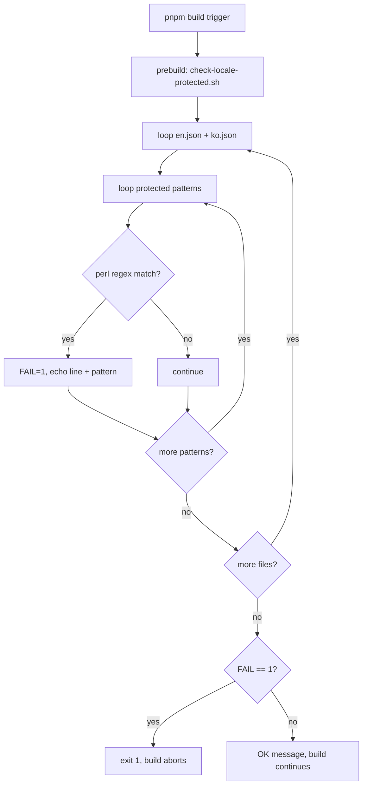

# T-P4-057: locale protected-token linter fix — BSD grep no-op 수정

**Round**: phase4-r4 (R4 fix)  **Stage**: impl  **Status**: todo  **Assignee**: pdt-developer
**PRD anchor**: [docs/prd/productune.md#phase-4--terminal-무의존-gui-풀-사이클-future](../../prd/productune.md#phase-4--terminal-무의존-gui-풀-사이클-future)
**Estimated complexity**: L2  **Risk flags**: linter-regression
**Design**: [`docs/artifacts/v0.4/T-P4-057-locale-protected-linter-fix.md`](../../design/T-P4-057-locale-protected-linter-fix.md)
**Dependencies**: T-P4-056 (locale 인프라 — `packages/gui/scripts/check-locale-protected.sh` 가 본 ticket 의 교체 대상)
**Discovered by**: T-P4-046 land 시 dev — T-P4-049 `"완료"` 추가 baseline 통과 → BSD grep `-P` 미지원 silent fail 발견
**QA**: yes (light — 의도적 보호어 위반 케이스 추가 후 fail 검증 + 정상 케이스 통과 검증)

> **번호 결정**: PO directive 는 "T-P4-050 사용" 이었으나 050 은 ROADMAP R5 stub ("PRD → Build 사이 Design stage 명시 노출") 으로 의미 점유 중. R4 fix vs R5 design-gate 분리를 위해 **T-P4-057** (056 다음 빈 번호) 채택. ROADMAP Activity log 에 사유 기록.

## Request

`packages/gui/scripts/check-locale-protected.sh` 가 macOS BSD grep 환경에서 `grep -P` 옵션 미지원으로 silent no-op 상태. 모든 보호어 패턴이 검사되지 않아 T-P4-049 가 추가한 `"완료"` (status enum `done` 의 한글 번역) 가 `pnpm build` 통과해버림 — doctrine 핵심 가드 무력화. **bash + perl one-liner** 로 교체 (macOS BSD + Linux GNU 양립) + T-P4-056 design plan §4.3 의 보호어 분류 (페르소나 / doctrine 단위 / stage enum / status enum / schema field / product/tech name) 전체 cover + 한글 번역 후보 매핑 표 기반 패턴 추가. 기존 false-negative (`"완료"`) 는 새 linter 가 잡아내야 하고, 정상 카탈로그는 통과해야 함.

## Inputs

- Design plan: `docs/artifacts/v0.4/T-P4-057-locale-protected-linter-fix.md` (본 ticket 의 단일 설계 ground truth — 새 스크립트 v2 코드 + 패턴 카탈로그 + trade-off 명시).
- 교체 대상: `packages/gui/scripts/check-locale-protected.sh` (현재 `grep -qP` 사용 — BSD 미지원).
- 검사 대상 카탈로그 (변경 X): `packages/gui/src/locales/en.json`, `packages/gui/src/locales/ko.json`.
- Baseline false-negative 증거: `ko.json` L185 `presence.doneNoArtifact: "완료"` (현재 통과 → 수정 후 fail 해야 함).
- 보호어 doctrine: `docs/artifacts/v0.4/T-P4-056-i18n-onboarding-toggle.md` §4.3 (페르소나 / doctrine 단위 / stage / status / schema / product 6 분류).

## Acceptance

### 스크립트 교체

- [ ] `packages/gui/scripts/check-locale-protected.sh` 전체 교체 — design doc §4.2 의 v2 코드 기반.
- [ ] `grep -qP` / `grep -nP` 호출 제거 — `perl -CSDA -ne 'print "$.: $_" if /.../'` 로 일괄 교체.
- [ ] match 결과를 변수에 capture 후 빈 문자열 여부로 fail 판정 (exit code 의존 X). `set -euo pipefail` 안전성 유지.
- [ ] `command -v perl >/dev/null 2>&1` graceful check — 없으면 `exit 2` + 명확 에러.
- [ ] shebang `#!/usr/bin/env bash` 유지, 실행 권한 (`chmod +x`) 보존.

### 패턴 카탈로그 확장 (design doc §4.2 + §4.3 매핑 표)

다음 한글 번역 후보가 카탈로그 value 에 등장 시 fail:

- [ ] **status enum**: `"완료"`, `"진행 중"`, `"검토 중"`, `"차단됨"`, `"포기됨"`, `"할 일"`
- [ ] **stage enum**: `"디자인"`, `"구현"`, `"리팩터"`, `"리팩토링"`, `"테스트"`, `"품질"`, `"배포"`
- [ ] **persona ID**: `"제품 책임자"`, `"기획자"`, `"디자이너"`, `"개발자"`, `"검수자"`, `"품질 담당자"`
- [ ] **doctrine units**: `"버전"`, `"단계"`, `"라운드"`, `"회차"`, `"티켓"`, `"슬롯"`
- [ ] **product/tech name**: `"프로덕튠"`, `"버셀"`, `"도커"`
- [ ] **schema field (1차)**: `"북극성"`, `"관찰값"`, `"검증 방법"`

매칭은 quote-strict (JSON value 가 정확히 해당 한글 한 단어일 때 fail) — 자연어 안에 등장하는 부분 매칭은 통과. design doc §4.3 의 false-positive trade-off 수용.

### CI / 빌드 통합

- [ ] `pnpm build` (또는 `pnpm --filter gui build`) 트리거 시 본 스크립트가 prebuild 단계에서 자동 실행. 기존 wiring 유지 (변경 시 동등 효과 보장).
- [ ] `package.json` 에 standalone alias 추가: `"check-locale": "bash scripts/check-locale-protected.sh"`.
- [ ] 스크립트 fail 시 build abort (`exit 1`).

### 회귀 검증 (구현 self-test)

- [ ] **현재 false-negative case**: `ko.json` 의 `presence.doneNoArtifact: "완료"` 를 그대로 둔 상태에서 새 linter 실행 → fail 확인. 에러 메시지에 line 번호 + 패턴 + 설명 포함.
- [ ] **fix forward**: `presence.doneNoArtifact` 값을 `"done"` (영문 — 보호어 영문 그대로) 으로 변경 → linter pass 확인. **본 ticket 안에서 ko.json 수정도 함께 진행** (linter 통과 상태로 baseline 회복).
- [ ] **의도적 위반 추가 검증**: `ko.json` 에 임시로 `"진행 중"` / `"디자이너"` / `"북극성"` 각 1개씩 추가 → 각각 fail 확인 후 revert.
- [ ] **정상 카탈로그 통과**: revert 후 baseline → linter pass 확인.

### 회귀 / 빌드

- [ ] `pnpm -r build` 통과 (linter 수정 후 정상 카탈로그에서).
- [ ] 기존 GUI 동작 회귀 X — i18n / settings / onboarding 모두 baseline 유지.
- [ ] perl 미설치 환경 graceful fail (`exit 2`) — 일반 macOS 에서는 stock perl 로 동작.

## QA

**Required**: yes  **Complexity**: light  **Suggested model**: sonnet (또는 haiku — script behavior + 카탈로그 diff 검증).

QA 검증 시나리오:

1. **fix forward verify** — main branch 합류 후 `pnpm --filter gui build` 실행 → linter pass + build 정상 진행 확인.
2. **false-negative reproduction (negative test)** — QA 가 임시 branch 에서 `ko.json` 에 `"newKey": "완료"` 추가 → `pnpm check-locale` 실행 → fail + line 번호 + 패턴 출력 확인. revert.
3. **persona token 위반** — 임시로 `ko.json` value 안에 `"디자이너"` 추가 → fail 확인. revert.
4. **stage enum 위반** — 임시로 `"디자인"` 추가 → fail. revert.
5. **doctrine unit 위반** — 임시로 `"버전"` 추가 → fail. revert.
6. **자연어 통과 확인** — `"작업 완료되었습니다"` 같이 부분 매칭 패턴 추가 → quote-strict 매칭이라 통과 확인 (false-positive 회피 검증).
7. **perl 미설치 fallback** — (선택, 환경 의존) PATH 에서 perl 제거 후 실행 → `exit 2` + 명확 에러 메시지 확인.
8. **두 카탈로그 동시 검사** — `en.json` 에 `"완료"` 추가해도 (상상 시나리오) fail 확인 — 양쪽 파일 검사 동작.

QA evidence: 각 케이스별 stdout 캡처 (script 출력 + exit code) + 통과/실패 결과 표.

## Out of scope

- ESLint custom rule 도입 — 후속 enhancement candidate (R5).
- Source code (`t('...')` 안의 보호어 매개변수) grep 검사 — T-P4-056 design doc §4.3 의 후속.
- 보호어 doctrine 자체 변경 — T-P4-056 §4.3 그대로 사용.
- Windows 호환성 — productune dev/dogfood mac 우선.
- 한글 후보 풀 자동 추출 / 사전 기반 추론 — 본 ticket 은 1차 매핑 표만 cover.
- Schema field 전체 (`risk_flags`, `duration_min`, `started_at` 등) 의 한글 후보 — 1차는 north_star / observed / validation_method 만. 후속 등장 시 추가.

## Notes

- design doc §4.3 매핑 표의 false-positive trade-off (자연어 "진행 중" / "할 일" / "버전" 등 일반 어휘 잡힐 수 있음) 는 quote-strict 매칭으로 대부분 회피. 만약 land 후 false-positive case 가 발견되면 design doc 갱신 + 패턴 미세조정 (별도 patch ticket 가능).
- perl 호출은 `perl -CSDA` 옵션으로 stdio UTF-8 활성. 한글 literal 패턴 안전.
- 현재 `ko.json` 의 `presence.doneNoArtifact` 값 변경은 본 ticket 범위 안 — 보호어 영문 (`"done"`) 으로 fix forward. T-P4-049 author 와 별도 협의 X (doctrine 자동 보존).
- 스크립트 에러 메시지는 영문 유지 — dev tool 영역, 페르소나 응답 한글 doctrine 과 분리.
- T-P4-056 design doc §4.3 Implementation notes 의 linter 항목에 본 ticket reference 추가 권장 (post-merge follow-up — design doc cross-link).
- ROADMAP `docs/tickets/v0.4/ROADMAP.md` Activity log 갱신 + `docs/developer/project-notes.md` 에 "BSD grep `-P` no-op" 발견 사실 한 줄 추가는 본 ticket land 와 동시 진행 (Designer round-close 또는 PO post-merge).

## Persona Activity

<!-- PO managed, append-only, structured — Result ≤ 80 chars -->
| When | Persona | Model/Effort | Turn | Result |
|---|---|---|---|---|
| 2026-05-07 | pdt-designer | opus/xhigh | 1 | design plan + ticket spec land (BSD grep no-op fix) |


## §Plan

# T-P4-057 — locale protected-token linter fix (BSD grep no-op 수정)

**Slug**: phase4-r4-locale-linter-fix  **Owner**: pdt-designer  **Status**: ready
**PRD anchor**: [docs/prd/productune.md#phase-4--terminal-무의존-gui-풀-사이클-future](../prd/productune.md#phase-4--terminal-무의존-gui-풀-사이클-future)
**Created**: 2026-05-07  **Round**: phase4-r4 (R4 fix)
**Depends on**: T-P4-056 (locale 인프라 — `packages/gui/scripts/check-locale-protected.sh` 생성처)
**Discovered by**: T-P4-046 land 시 dev — T-P4-049 가 `presence.doneNoArtifact: "완료"` 추가했는데 baseline 통과 → BSD grep `-P` 미지원으로 모든 패턴 silent fail

> **번호 결정**: PO directive 는 "T-P4-050 사용" 이었으나 050 은 ROADMAP R5 stub ("PRD → Build 사이 Design stage 명시 노출") 으로 의미 점유 중. R4 fix 의 의미와 R5 design-gate stub 은 분리가 깨끗 — **T-P4-057** (056 다음 빈 번호) 채택. ROADMAP Activity log 에 사유 기록.

---

## 1. Context

T-P4-056 land 시 `packages/gui/scripts/check-locale-protected.sh` 가 함께 land 했고, `pnpm build` 직전에 자동 실행되어 보호어 (i18n 추출/번역 금지 토큰) 위반을 차단하도록 설계됨. 그런데 T-P4-046 land 직후 dev 가 다음 사실을 발견:

1. 현재 스크립트는 `grep -P` (Perl-compatible regex) 를 사용.
2. **macOS 의 BSD grep 은 `-P` 옵션 미지원** → `grep -P "..."` 호출 시 `usage: grep ...` 에러로 종료.
3. 그러나 스크립트는 `2>/dev/null` 로 stderr 를 버리고 `grep -qP` 의 exit code 만 확인 → 모든 패턴이 "no match" 로 처리되어 `FAIL=0` 유지.
4. 결과: **보호어 위반이 실제로 검사되지 않음**. linter 가 사실상 no-op.

증거: T-P4-049 가 `packages/gui/src/locales/ko.json` 에 다음을 추가:

```json
"presence": {
  "chipAriaLabel": "{{persona}} — {{state}}",
  "doneNoArtifact": "완료"
}
```

`"완료"` 는 status enum `done` 의 한국어 번역. 보호어 패턴 `'"완료"'` 가 스크립트에 정의되어 있고, baseline 검사가 동작했다면 fail 했어야 함. 그러나 build 통과 = linter 가 실행 시점에 패턴 매칭 자체를 수행하지 않았음을 의미.

`grep -P` 호환 환경 (Linux GNU grep) 에서는 동작하지만, 사용자 dogfood + dev 환경 (macOS) 에서 silent no-op 인 것은 doctrine 유지 핵심 가드 (보호어 보존) 가 무력화된 상태라 즉시 수정 필요.

---

## 2. Goals

- macOS BSD + Linux GNU 양쪽 모두에서 동작하는 보호어 linter.
- 기존 false-negative 케이스 (`"완료"` 추가 → baseline 통과) 를 새 linter 가 fail 처리.
- 정상 카탈로그 (보호어 미포함) 는 통과.
- T-P4-056 design plan §4.3 의 보호어 목록을 confirm + 한글 번역 후보 매핑 표를 PO 가 review 가능한 형태로 정리.
- CI 통합은 현재와 동일 — `pnpm build` 앞에서 자동 실행. doctrine 변경 X.

## 3. Non-goals

- ESLint custom rule 도입 — 본 ticket 범위 외. 후속 enhancement candidate 로 §7 에 기록.
- 카탈로그 외 source code grep (`t('...')` 안의 보호어 추출 검출) — T-P4-056 design doc §4.3 implementation note 에 언급된 enhancement. 본 ticket 은 카탈로그 value 검사만 cover.
- 보호어 목록 자체의 doctrine 변경 — T-P4-056 §4.3 그대로 사용.
- Windows 환경 호환성 — productune dev/dogfood 는 mac 우선. 후속 ticket 에서 cover.

## 4. Approach

### 4.1 라이브러리 결정 — bash + perl one-liner 채택

세 옵션 비교:

| 옵션 | 장점 | 단점 | 채택 |
|---|---|---|---|
| **bash + perl one-liner** | macOS / Linux 모두 perl 5 stock 설치. 기존 스크립트 구조 (`check_pattern` 함수) 거의 그대로 유지. PCRE regex 호환. 의존성 추가 X. | bash 스크립트 그 자체 — perl regex 익숙도 필요. | ✅ |
| Node.js script | 카탈로그가 JSON 이라 JSON.parse 후 value tree 순회 가능 — false-positive 줄임. perl regex 보다 정밀. | `packages/gui/scripts/` 에 Node 스크립트 추가 = `pnpm build` 시점 의존성 (이미 Node 환경이지만 entry point 가 .sh 라 prebuild script 갱신 필요). 기존 .sh 폐기 → 회귀 risk. | ⚪ R5 enhancement |
| ESLint custom rule | 카탈로그 + source code 일괄 검사 가능. IDE 즉시 피드백. | 학습비 (ESLint custom rule API). 본 ticket 의 즉시-수정 의도와 mismatch. | ⚪ R5 enhancement |

**결정**: bash + perl. 변경 표면 최소 + macOS/Linux 양립.

대안으로 검토한 `grep -E` (POSIX ERE) 는 lookahead/lookbehind 미지원이라 일부 패턴 (예: 전후 컨텍스트 의존 매칭) 에서 한계. 본 linter 의 패턴은 단순 literal 한글 문자열 매칭이라 ERE 로도 동작은 하지만, 향후 패턴 확장 (예: `"완료"` 만 잡고 `"완료된"` 같은 합성어는 통과) 시 perl 이 유연. 처음부터 perl.

### 4.2 새 스크립트 — `check-locale-protected.sh` v2

```bash
#!/usr/bin/env bash
# check-locale-protected.sh v2 — macOS BSD + Linux GNU compatible
# Detects protected token Korean translations in locale catalog VALUES.
# Replaces grep -P (BSD 미지원) with perl -ne for portability.

set -euo pipefail

LOCALES_DIR="$(dirname "$0")/../src/locales"
FAIL=0

check_pattern() {
  local pattern="$1"          # perl regex (Korean literal or PCRE)
  local description="$2"
  local file="$3"

  # perl -ne: read each line; if regex matches, print + non-zero stash.
  # We capture matches with line numbers, then check if any output produced.
  local matches
  matches=$(perl -ne 'print "$.: $_" if /'"$pattern"'/' "$file" 2>/dev/null || true)

  if [ -n "$matches" ]; then
    echo "FAIL: protected pattern found in $file"
    echo "  Pattern: $pattern ($description)"
    echo "$matches" | head -5
    FAIL=1
  fi
}

echo "Checking locale catalog for protected token violations..."

for catalog in "$LOCALES_DIR/en.json" "$LOCALES_DIR/ko.json"; do
  [ -f "$catalog" ] || { echo "WARN: catalog not found: $catalog"; continue; }

  # Korean translations of protected English tokens — must NOT appear in
  # catalog VALUES of either language. (en.json keeps tokens as English
  # literals; ko.json must also keep tokens as English literals.)
  #
  # Pattern format: literal Korean string wrapped in double-quotes —
  # this matches the JSON value form `"...완료..."`.

  # status enum
  check_pattern '"완료"'       'status:done → "완료"'           "$catalog"
  check_pattern '"진행 중"'    'status:in-progress → "진행 중"' "$catalog"
  check_pattern '"검토 중"'    'status:review → "검토 중"'      "$catalog"
  check_pattern '"차단됨"'     'status:blocked → "차단됨"'      "$catalog"
  check_pattern '"포기됨"'     'status:abandoned → "포기됨"'    "$catalog"
  check_pattern '"할 일"'      'status:todo → "할 일"'          "$catalog"

  # stage enum
  check_pattern '"디자인"'     'stage:design → "디자인"'        "$catalog"
  check_pattern '"구현"'       'stage:impl → "구현"'            "$catalog"
  check_pattern '"리팩터"'     'stage:refactor → "리팩터"'      "$catalog"
  check_pattern '"리팩토링"'   'stage:refactor → "리팩토링"'    "$catalog"
  check_pattern '"테스트"'     'stage:test → "테스트"'          "$catalog"
  check_pattern '"품질"'       'stage:qa → "품질"'              "$catalog"
  check_pattern '"배포"'       'stage:deploy → "배포"'          "$catalog"

  # persona ID
  check_pattern '"제품 책임자"' 'persona:PO → "제품 책임자"'    "$catalog"
  check_pattern '"기획자"'     'persona:PO → "기획자"'          "$catalog"
  check_pattern '"디자이너"'   'persona:Designer → "디자이너"'  "$catalog"
  check_pattern '"개발자"'     'persona:Developer → "개발자"'   "$catalog"
  check_pattern '"검수자"'     'persona:QA → "검수자"'          "$catalog"
  check_pattern '"품질 담당자"' 'persona:QA → "품질 담당자"'    "$catalog"

  # doctrine units (Version / Phase / Round / Ticket / Slot)
  check_pattern '"버전"'       'unit:Version → "버전"'          "$catalog"
  check_pattern '"단계"'       'unit:Phase → "단계"'            "$catalog"
  check_pattern '"라운드"'     'unit:Round → "라운드"'          "$catalog"
  check_pattern '"회차"'       'unit:Round → "회차"'            "$catalog"
  check_pattern '"티켓"'       'unit:Ticket → "티켓"'           "$catalog"
  check_pattern '"슬롯"'       'unit:Slot → "슬롯"'             "$catalog"

  # product / tech name
  check_pattern '"프로덕튠"'   'product:productune → "프로덕튠"' "$catalog"
  check_pattern '"버셀"'       'tech:Vercel → "버셀"'           "$catalog"
  check_pattern '"도커"'       'tech:Docker → "도커"'           "$catalog"

  # schema field — 너무 일반적이라 false-positive risk. §4.4 도 참고.
  # 카탈로그 value 안에 "north_star" / "started_at" 등 한글 번역어가 자연어로
  # 들어가는 case 만 검출. 영문 그대로 등장 (예: "started_at: ..." literal) 은 OK.
  # 한글 번역 후보가 다양해서 확실한 것만:
  check_pattern '"북극성"'     'schema:north_star → "북극성"'   "$catalog"
  check_pattern '"관찰값"'     'schema:observed → "관찰값"'     "$catalog"
  check_pattern '"검증 방법"'  'schema:validation_method → "검증 방법"' "$catalog"
done

if [ $FAIL -eq 1 ]; then
  echo ""
  echo "ERROR: Locale catalogs contain protected token violations."
  echo "Protected tokens (persona IDs, doctrine units, stage/status enums,"
  echo "schema fields, product/tech names) must remain as English literals"
  echo "— never translate them in catalog values."
  exit 1
fi

echo "OK: No protected token violations found."
```

핵심 변경:
1. `grep -qP "$pattern"` → `perl -ne 'print ... if /.../'` — perl 5 PCRE 직접 호출, BSD 종속성 제거.
2. exit code 의존 X — match 결과를 변수에 capture 후 빈 문자열 여부로 판정. `set -e` 와 `pipefail` 안전.
3. 패턴 카탈로그 확장 — T-P4-056 design plan §4.3 의 보호어 분류 (페르소나/doctrine 단위/stage enum/status enum/schema field/product name) 를 모두 cover. 한글 번역 후보 1차 매핑 (§4.3 표).

### 4.3 보호어 ↔ 한글 번역 후보 매핑 (PO review)

검출 휴리스틱: 카탈로그 value 안에 다음 한글 후보가 등장하면 fail. 후보 외 (예: `"탭 닫기"`, `"활성 pane"`) 는 의도적 한글화 — UI chrome 의 일반 어휘로 통과 OK.

| 분류 | 영문 (보호) | 한글 검출 후보 | False-positive risk |
|---|---|---|---|
| status | done | 완료, 완성 | 낮음 — `done` 의미 외 일반 어휘로 거의 안 씀 |
| status | in-progress | 진행 중, 진행중 | 중간 — "다운로드 진행 중…" 같은 일반 progress 표시도 trip. trade-off: false-positive 수용 (보호어 우선) |
| status | review | 검토 중, 검토중 | 중간 — "검토" 단독은 OK (e.g. "디자인 검토하기"). `"검토 중"` literal 만 차단 |
| status | blocked | 차단됨 | 낮음 |
| status | abandoned | 포기됨 | 낮음 |
| status | todo | 할 일 | 중간 — "할 일" 일반 어휘 시 false-positive. trade-off 수용 |
| stage | design | 디자인 | **높음** — "디자인 시스템", "디자인 doc" 등 자주 등장. **현재 패턴은 `"디자인"` 로 quote 까지 포함** → JSON value 가 정확히 `"디자인"` 일 때만 fail. 부분 매칭 X. 안전 |
| stage | impl | 구현 | 높음 — 동일 quote-strict 매칭으로 통과 |
| stage | refactor | 리팩터, 리팩토링 | 낮음 |
| stage | test | 테스트 | 높음 — "테스트 실행" 등 빈도 높음. quote-strict 로 false-positive 회피 |
| stage | qa | 품질, 품질 검사 | 중간 — "품질 검사" 는 통과 (literal X), `"품질"` 단독만 fail |
| stage | deploy | 배포 | 높음 — quote-strict 매칭 |
| persona | PO | 제품 책임자, 기획자 | 낮음 |
| persona | Designer | 디자이너 | 낮음 |
| persona | Developer | 개발자 | 낮음 |
| persona | QA | 검수자, 품질 담당자 | 낮음 |
| unit | Version | 버전 | 중간 — "최신 버전" 같은 일반 표현 trip 가능. trade-off 수용 |
| unit | Phase | 단계 | **높음** — "이 단계" 같은 자연어 빈도. quote-strict (`"단계"` 단독) 만 fail. 다행히 `"Phase"` doctrine 라벨이라 단독 등장 적음 |
| unit | Round | 라운드, 회차 | 낮음 |
| unit | Ticket | 티켓 | 낮음 — productune 도메인 외 의미 거의 없음 |
| unit | Slot | 슬롯 | 낮음 |
| product | productune | 프로덕튠 | 매우 낮음 |
| product | Vercel | 버셀 | 낮음 |
| product | Docker | 도커 | 낮음 |
| schema | north_star | 북극성 | 낮음 — 일반 어휘 거의 안 씀 |
| schema | observed | 관찰값 | 낮음 |
| schema | validation_method | 검증 방법 | 중간 — "이 검증 방법은…" 같은 자연어 가능. trade-off 수용 |

**핵심 trade-off (PO confirm 필요)**:

- **False-positive 우선 차단** (현재 채택): 자연어 "완료", "진행 중" 같은 표현이 UI 에 나오면 일단 fail → 개발자가 우회 표현 사용 ("끝남", "작업 중" 등). doctrine 보호 강화.
- **False-negative 허용** (대안): quote-strict + 컨텍스트 추가 (e.g. label 형태일 때만 fail) — 정밀하지만 우회 불가.

본 design 은 1차 단순/보수적 → false-positive 발생 시 PO 가 case-by-case 로 패턴 미세조정. 검증 단계 (T-P4-057 QA) 에서 false-positive 케이스 발견 시 design doc 갱신.

**Quote-strict 매칭의 의미**: `"완료"` 패턴은 JSON value 가 정확히 `"완료"` 한 단어일 때만 매칭. `"작업 완료"`, `"완료된 항목"` 은 미매칭. 이는 **상태 라벨 (badge text) 형태의 직접 번역만 차단** 하고, 일반 자연어 안에 등장하는 한자어 "완료" 는 통과. T-P4-049 의 `"완료"` 가 정확히 이 라벨 케이스라 차단됨.

**예외 보강**: 만약 `"완료"` 가 자연어로 들어가는 정당한 case (예: "100% 완료") 가 등장하면, 카탈로그에서 quote 형태 회피 (예: `"100% 완료입니다"`) 또는 PO directive 로 패턴 완화. 본 ticket land 시점에는 quote-strict 단어만 차단.

### 4.4 en.json vs ko.json — 두 파일 모두 검사

T-P4-056 design plan §4.3 doctrine: **두 언어 카탈로그 모두 보호어를 영문 그대로 보존**. 즉 en.json 에 `"done"`, ko.json 에 `"done"` (둘 다 영문). en.json 안에 "완료" 같은 한글이 들어가는 것 자체가 이상 (영어 카탈로그). ko.json 안에 "완료" 가 status 라벨로 들어가는 건 doctrine 위반.

따라서 두 파일 모두에 동일 패턴 적용. 현재 스크립트도 두 파일 loop — 유지.

추가 고려: en.json 에 `"PO"`, `"Designer"` 등 영문 보호어가 그대로 있는 것은 OK (라벨 그대로). 이건 검출 X. 본 linter 는 "한글 번역" 만 잡음.

### 4.5 CI 통합 — 현재 동일

`packages/gui/package.json` 의 build script 가 prebuild 로 본 스크립트 호출:

```json
{
  "scripts": {
    "prebuild": "bash scripts/check-locale-protected.sh",
    "build": "..."
  }
}
```

(현재 정확한 wiring 은 dev 가 land 시점에 확인 — 본 ticket 의 acceptance 는 "build 시 자동 실행" 만 보장.)

추가로 standalone 호출 가능 — `pnpm --filter gui run check-locale` script alias 도 함께 추가 권장 (CI workflow 에서 별도 step 으로 빠르게 호출 가능).

## 5. UX flow (스크립트 동작)



## 6. Alternatives explored

1. **Node.js script 로 전면 재작성**: rejected for this ticket. JSON tree 순회로 false-positive 줄일 수 있으나, T-P4-056 의 .sh entry 와 회귀 risk. R5 enhancement 로 보류.
2. **ESLint custom rule + flat config**: rejected. 카탈로그 검사만 하는데 ESLint 도입은 과함. source code 의 `t('...')` 검사까지 확장 시점에 재고.
3. **`grep -E` POSIX ERE**: rejected. 단기적으로 동작하지만 향후 패턴 확장 (lookahead 등) 차단. perl 이 더 안전.
4. **`ggrep` (Homebrew GNU grep) 강제**: rejected. 사용자 환경 의존성 추가. macOS stock perl 이 더 안정.
5. **CI 환경 (Linux GNU grep) 만 신뢰**: rejected. 사용자 dogfood 가 macOS local — local 검사 필요.
6. **패턴 카탈로그를 별도 JSON 으로 분리**: 깨끗하지만 본 ticket 의 즉시-수정 scope 외. 향후 패턴이 50+ 늘면 검토.

## 7. Open questions

- (resolved) 라이브러리 → bash + perl one-liner.
- (resolved) en.json 도 검사 — 두 파일 동일 패턴 loop 유지.
- (resolved) Quote-strict literal 매칭 우선, 자연어 false-positive 는 trade-off 수용.
- (deferred) Schema field 한글 후보 풀 — `risk_flags`, `duration_min` 등 schema 키 중 한글 번역 후보가 안 정해진 것들. 본 ticket 은 north_star / observed / validation_method 3개만 1차 cover. 후속 등장 시 패턴 추가.
- (deferred) Source code (`t('...')` 안의 보호어 stage/status enum 매개변수 직접 사용) 검출 — R5 enhancement 후보.
- (deferred) Windows 호환 (perl 미설치 환경) — productune dev/dogfood mac 우선이라 본 ticket 범위 외.

## 8. Implementation notes (for pdt-developer)

- **파일**: `packages/gui/scripts/check-locale-protected.sh` 전체 교체. shebang `#!/usr/bin/env bash` 유지. `chmod +x` 보존.
- **macOS perl 위치**: `/usr/bin/perl` stock 5.30+. shebang `perl` 사용 시 PATH 의존 → `/usr/bin/env perl` 으로 호출하거나 직접 `perl` 명령어 사용. `set -e` + `|| true` 조합으로 perl 비존재 시 graceful fail.
- **perl 미존재 환경 fallback**: 매우 드물지만 (CI base image 등), 스크립트 시작에서 `command -v perl >/dev/null 2>&1 || { echo "ERROR: perl required for locale linter"; exit 2; }` 추가 권장.
- **pattern quoting**: perl regex 에서 `"` 는 메타가 아님 → bash variable substitution 안에서 그대로 전달 가능. 단 한글 literal 은 UTF-8 — `-CSDA` (stdio UTF-8) **+ `-Mutf8`** (regex source UTF-8 마킹) 둘 다 필요.
  ```bash
  perl -CSDA -Mutf8 -ne 'print "$.: $_" if /'"$pattern"'/' "$file"
  ```
  > **함정 (T-P4-057 dev 발견, 2026-05-07)**: macOS perl 5.30+ 에서 `-CSDA` **단독** 사용 시 파일은 Unicode char stream 으로 디코딩되지만 shell 인라인 한글 literal 패턴은 byte string 으로 남아 char/byte 불일치 → silent no-match. `-Mutf8` 병행해야 regex source 도 UTF-8 char 로 해석됨. 후속 .sh linter 작성 시 동일 trap 회피.
- **회귀 검증 시퀀스**:
  1. T-P4-049 의 `"완료"` 가 ko.json 에 있는 상태에서 새 linter 실행 → fail 확인.
  2. ko.json 에서 `"완료"` 를 `done` (영문) 으로 교체 → linter pass 확인.
  3. 의도적 추가 (`"진행 중"`, `"디자이너"`) 1개씩 → 각각 fail 확인.
  4. 정상 카탈로그 (보호어 미포함) → pass 확인.
- **package.json script 추가**:
  ```json
  "check-locale": "bash scripts/check-locale-protected.sh"
  ```
  (`prebuild` wiring 은 land 시점에 dev 가 기존 wiring 형태 확인 후 정합)
- **테스트 fixture** (선택): `packages/gui/scripts/__fixtures__/locale-{ok,fail-done,fail-persona}.json` 작성 → CI 에서 fixture 기반 unit test 실행 가능. 본 ticket 은 fixture 추가까지 권장 X (light-weight 수정 우선); R5 후속에서 검토.
- **에러 메시지 가독성**: 현재 영문 에러 메시지 유지 — dev 환경 + CI log 모두 영문 base. 한글 번역 X (페르소나 응답 doctrine 과 분리 — script error 는 dev tool 영역).

## 9. Follow-ups (post-merge)

- ROADMAP `docs/tickets/v0.4/ROADMAP.md` Activity log 갱신 — 본 ticket land + linter no-op 발견 사실 기록.
- `docs/developer/project-notes.md` 한 줄 추가 — "BSD grep `-P` 사실상 no-op — perl 로 교체. 향후 .sh linter 추가 시 perl 또는 Node.js 우선".
- T-P4-056 design doc §4.3 Implementation notes 의 linter 항목에 본 ticket reference 추가 (선택, 발견사항 cross-link).
- (future) ESLint custom rule 또는 Node.js script 로 source code 검사 확장 — R5 enhancement.

---

## Activity log

- **2026-05-07** — design plan v1. T-P4-046 land 시 dev 가 발견한 BSD grep `-P` no-op 사실 정리. bash + perl 채택, 보호어 ↔ 한글 후보 매핑 표, false-positive trade-off, R5 enhancement candidate 분리. 번호 057 (PO directive 의 050 대신 R5 stub 충돌 회피).
