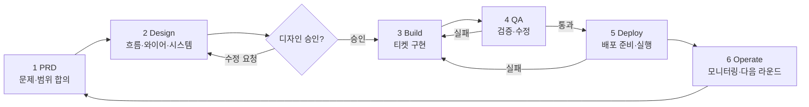
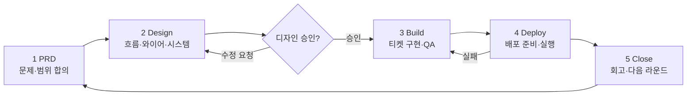

# T-P4-065: Phase 5단 통일 (PRD/Design/Build/Deploy/Close) + ticket stage→type rename + ChatPanel selector 제거 + po-state slim + PRD/service-flow/mockup 정정

> **Note**: 본 ticket frontmatter `stage:` 자체는 sub-d migration 이 land 한 후 mechanical sed 로 `type:` 으로 마이그레이션됨. 본 file 은 사후 sed 대상이라 현 시점은 `stage:impl` 로 둠 (R4 ticket 일괄 변환 시 함께 처리).

---

## §1 Background / Why

사용자 dogfood (2026-05-08) 발견된 **3-axis 충돌 + 2-axis 중복 + 1-axis 자율성 위배** 통합 정정.

### 충돌 inventory

| 충돌 | 표면 | 영향 |
|---|---|---|
| **6단 mockup vs 4단 doctrine vs ticket stage 6 enum** | mockup.html (PRD/Design/Build/QA/Deploy/Operate) ↔ doctrine `current_phase` 1..4 (PRD/Design/Build/Close) ↔ ticket frontmatter `stage:` (design/impl/refactor/test/qa/deploy) | 사용자 멘탈 모델 분열, dev 가 "어느 axis 따라야?" 매 turn 판단 |
| **po-state.json `past_tickets[]` (cap 50) 중복** | ticket md frontmatter 와 동일 데이터 inline 보관, mechanical PO write 로 동기화 — drift / bloat / "어느 게 canonical?" 혼란 | SoT 불명확. ticket md 가 이미 같은 데이터 보유 |
| **ChatPanel persona selector** | rp-input 안 4-way dropdown (`@ pdt-po / @ pdt-designer / @ pdt-developer / @ pdt-qa`) — 사용자가 직접 페르소나 지정 | PO orchestrator 의 routing autonomy 우회. doctrine `Routing — pick persona + model + effort` 위배 |

### 사용자 directive history (2026-05-08)

| Directive 1A | StageStrip 6→4 (4단 doctrine 정합) — designer 반박 → PRD AC #9 (사용자 가시 phase 명시) 위배 |
| Directive 1B | PRD AC #9 5단 채택 (PRD/Design/Build/Deploy/Close). Operate→Close 흡수, QA→ticket type 흡수 |
| Directive 2 | ticket frontmatter `stage` → `type` rename (Linear / Jira 어휘 정합) |
| Directive 3 | ChatPanel persona selector 제거 (PO autonomy 회복) |
| Directive 4 | po-state slim — option C 통째 제거 + fs derived (ticket md = SoT) |
| Directive 5 | PRD §L235 / service-flow §2.2 / mockup HTML 5단 정정 |

### 6 sub-area plan 분해

각 plan 은 독립 design plan 으로 land 완료. 본 ticket 은 6 plan 의 **impl 통합**.

- **sub-a** — Phase 1~5 doctrine. `docs/artifacts/v0.4/T-P4-065-phase-5-doctrine.md`
- **sub-b** — PhaseStrip 5단 + PhaseBreadcrumb 정렬. `docs/artifacts/v0.4/T-P4-065-sub-b-strip-unify.md`
- **sub-c** — ChatPanel persona selector 제거. `docs/artifacts/v0.4/T-P4-065-sub-c-chat-selector-remove.md`
- **sub-d** — ticket stage → type rename. `docs/artifacts/v0.4/T-P4-065-sub-d-ticket-type-rename.md`
- **sub-e** — PRD / service-flow / mockup 5단 정정. `docs/artifacts/v0.4/T-P4-065-sub-e-prd-flow-mockup.md`
- **sub-f** — po-state.json slim down (ticket md = SoT). `docs/artifacts/v0.4/T-P4-065-sub-f-po-state-slim.md`

---

## §2 Acceptance categories

각 카테고리 (A~F) 는 1 sub-area 와 1:1 매핑. 본 ticket 의 dev impl 시 카테고리별 분리 진행 권장 (본 §6 migration sequence 참고).

### A) Phase 1~5 doctrine 통합 (sub-a)

> See: `docs/artifacts/v0.4/T-P4-065-phase-5-doctrine.md`

- [ ] `current_phase` enum 정의 = 1..5 (PRD/Design/Build/Deploy/Close)
- [ ] `Phase` TypeScript type 5 entries (`'PRD' | 'Design' | 'Build' | 'Deploy' | 'Close'`)
- [ ] `PHASE_NAMES` record 5 entries (1..5)
- [ ] `phase_history[]` schema 5 entries 가능 (`phase: 1..5`)
- [ ] `pending_gate.from_phase: 1..5` / `to_phase: 2..5` (또는 null = terminal)
- [ ] doctrine sections 5단 어휘:
  - `packages/core/po/po-instructions.md` (line 52 retrospective Phase 4→5)
  - `packages/core/po/sections/stages.md` → `po-loop.md` rename (Three stages = PO 루프 = Instruction/Execution/Feedback, ticket axis 와 분리)
  - `packages/core/po/sections/lifecycle-mechanics.md` (lines 41, 69, 78 — Phase 4→5)
  - `packages/core/po/sections/tickets.md` (Layer A diagram 5 phase, MVP cycle prose, Layer B `deploy` Phase 4)
  - `packages/core/po/sections/memory.md` (`current_phase` range comment, persona product-memory Phase 4→5)
  - `packages/core/po/sections/prd-and-output.md` (검증만 — Phase 1 PRD 일관)
- [ ] persona spec 갱신 — `pdt-designer.md`, `pdt-po.md`, `pdt-qa.md`, `pdt-developer.md` 의 retrospective Phase 4→5 + Phase 4 Deploy ownership 명시 (`pdt-po.md` "Phase 4 Deploy = pdt-po+user collaborative")
- [ ] **Phase transition gate 통일** — 모든 boundary (1↔2↔3↔4↔5) 에 사용자 명시 confirm. 자동 진입 없음. `stages.md`/`po-loop.md` 의 transition gate 섹션 갱신
- [ ] Phase 4 Deploy 신규 — trigger (Build done + 사용자 confirm), 실행 (단일 `type:deploy` ticket, `pdt-po+user` collaborative `## Steps` body), exit (deploy ticket done)
- [ ] Phase 5 Close — retrospective 5a/5b/5c/5d 시퀀스 verbatim 이전 (letter 우연 정합)

### B) PhaseStrip 5단 + PhaseBreadcrumb 정렬 (sub-b)

> See: `docs/artifacts/v0.4/T-P4-065-sub-b-strip-unify.md`

- [ ] `PhaseBreadcrumb.tsx` 5단 (5 chip, `['PRD', 'Design', 'Build', 'Deploy', 'Close']`)
- [ ] `StageStrip.tsx` → **`PhaseStrip.tsx`** rename
  - [ ] **default = 1 dot** (현재 phase, label + color 만)
  - [ ] **hover** → 0.2s ease expand to **5 dot** (active highlight)
  - [ ] mouse leave → collapse 복귀
  - [ ] `variant="chip"` (rp-ctx) = 항상 1 chip pill (hover X)
- [ ] `stage-mapping.ts` → **`phase-mapping.ts`** rename, logic 단순화 (1:1 매핑, hybrid 폐기)
  - [ ] `STAGE_DEFS` → `PHASE_DEFS` (5 entries)
  - [ ] `getActiveStageIndex` → `getActivePhaseIndex`
- [ ] **5 색 토큰 정의** (CSS variable):
  - [ ] `--phase-prd: #A78BFA` (designer 페르소나 alias)
  - [ ] `--phase-design: #F472B6` (pink 400)
  - [ ] `--phase-build: #38BDF8` (dev 페르소나 alias)
  - [ ] `--phase-deploy: #FB923C` (orange-400)
  - [ ] `--phase-close: #34D399` (emerald-400, success / persona-qa alias)
  - [ ] 기존 `--stage-qa / --stage-deploy / --stage-operate` 폐기 (검색 0 매치)
- [ ] `ChatPanel.tsx` rp-ctx import path 갱신 (`<PhaseStrip variant="chip" />`)
- [ ] `LeftSidebar.tsx` Project 탭 mount 갱신
- [ ] `VersionDetailView.tsx` `PHASE_ORDER` 5 entries
- [ ] locale `workspace.stageStrip.*` → `workspace.phaseStrip.*` rename, `phaseTooltip.{prd,design,build,deploy,close}` 5개, `qa/operate` 라벨 폐기
- [ ] **design-system §2.6 갱신** — `### 2.6 Stage` → `### 2.6 Phase`, OQ-1 close ("PhaseBreadcrumb=top global / PhaseStrip=local hover-expand 차이화")

### C) ChatPanel persona selector 제거 (sub-c)

> See: `docs/artifacts/v0.4/T-P4-065-sub-c-chat-selector-remove.md`

- [ ] `ChatPanel.tsx` rp-input row = **textarea + send button only** (selector `<select>` 완전 제거, `personaSelect` style 제거)
- [ ] `poChat.ts` slice — `nextDelegate` state, `setNextDelegate` action, `delegateToKind` mapping, `DelegatePersona` type **모두 폐기**
- [ ] IPC signature 변경:
  - [ ] `preload.ts` `poSendMessage(text)` (persona 인자 제거)
  - [ ] `main.ts` `po:sendMessage` handler 의 `opts.persona` 제거
- [ ] `po-runner.ts` `runPoTurn({ text, projectDir, sessionId })` 만 — `persona` 인자 제거. spawn 항상 `claude --agent pdt-po --resume <session>`
- [ ] locale `workspace.chat.personaSelectorAria` 키 제거 (en/ko 둘 다)
- [ ] **doctrine 정합** — `T-P4-041` ticket md / design plan 의 `rp-psel` 항목 strikethrough 또는 삭제, layout 4-row 로 정정 (sub-c reference link 추가)
- [ ] PO 가 자체 dispatch 결정 — 사용자 텍스트 분석 → designer/developer/qa task 위임. dispatch 가시성은 T-P4-049 PersonaPresenceBar 가 담당

### D) ticket stage → type rename (sub-d)

> See: `docs/artifacts/v0.4/T-P4-065-sub-d-ticket-type-rename.md`

- [ ] doctrine schema enum: `current_task.type` (6 값 유지: `design / impl / refactor / test / qa / deploy`, lowercase)
  - [ ] **design / deploy 보강** — Layer B table 의 `When` / `Body shape` / `Closes by` 컬럼 모두 5단 doctrine 정합으로 갱신
- [ ] TypeScript:
  - [ ] `Stage` type → **`TaskType`**
  - [ ] `STAGE_ORDER` → **`TYPE_ORDER`**
- [ ] **모든 ticket md frontmatter mechanical sed**:
  ```bash
  find docs/tickets -name '*.md' -exec sed -i '' 's/^stage:/type:/' {} +
  ```
  - [ ] 검증: `grep -rn "^stage:" docs/tickets/` = 0 매치
  - [ ] 검증: `grep -rn "^type:" docs/tickets/` ≈ 50 매치
- [ ] **본 T-P4-065 ticket md 자체도 sed 대상** — frontmatter `stage:impl` → `type:impl`
- [ ] po-state.json migration (jq idempotent — sub-f 통합 script 안):
  - [ ] `current_task.stage` → `current_task.type`
  - [ ] `past_tickets[].stage` → `past_tickets[].type` (sub-f 가 통째 제거 전 임시 대응)
- [ ] doctrine narrative 분리 — "stage" (ticket axis) → "type" / "stage" (Phase axis) → "phase"
- [ ] doctrine 파일 rename — `packages/core/po/sections/stages.md` → **`po-loop.md`** (Three stages = PO 루프 = Instruction/Execution/Feedback)
- [ ] persona spec 갱신 — `pdt-designer.md` Output format `tickets[]` 의 frontmatter 예시 `stage:` → `type:`
- [ ] GUI 컴포넌트 갱신 — `TicketDashboardView.tsx` (stage filter / column → type), `VersionDetailView.tsx` (stage grouping → type), 기타 ticket card / list
- [ ] locale 라벨 — ko-mode 보호어 룰 따름 (T-P4-057): "type" 영문 그대로 유지, "stage" / "단계" / "종류" 폐기
- [ ] 검증:
  ```bash
  grep -rn "stage" packages/core/po/ packages/core/agents/ | grep -v node_modules | wc -l   # 0
  grep -rn "Stage" packages/gui/src/ | grep -v node_modules | grep -v "\.test\." | wc -l   # 0 (false-positive 검토)
  ```

### E) PRD / service-flow / mockup 정정 (sub-e)

> See: `docs/artifacts/v0.4/T-P4-065-sub-e-prd-flow-mockup.md`

- [ ] **PRD `docs/prd/productune.md`**:
  - [ ] §L235 acceptance #9 — "(PRD / Design / Build / QA / Deploy / Operate)" → "(PRD / Design / Build / Deploy / Close)" + "stage strip" → "phase strip"
  - [ ] grep 다른 6단 잔재 정정:
    ```bash
    grep -nE 'PRD.*Design.*Build.*QA' docs/prd/productune.md
    grep -nE 'Operate' docs/prd/productune.md
    grep -nE '6.*stage|6.*단계|6-stage' docs/prd/productune.md
    grep -nE 'stage.strip|stage strip' docs/prd/productune.md
    ```
  - [ ] `## Activity log` 1줄 append:
    ```
    2026-05-08 — 사용자 가시 phase 5단 통일 (PRD / Design / Build / Deploy / Close).
    6단 (PRD/Design/Build/QA/Deploy/Operate) 폐기 — QA 는 ticket type 으로,
    Operate 는 Close phase 의 retrospective 가 흡수. T-P4-065 전체 (sub-a~f).
    ```
- [ ] **service-flow `docs/designer/service-flow-and-screens.md`**:
  - [ ] §2.0 paragraph (L8) — "PRD → Design → Build → QA → Deploy → Operate" → "PRD → Design → Build → Deploy → Close"
  - [ ] §2.2 헤더 "한 라운드의 6-stage 사이클" → "한 라운드의 5-phase 사이클"
  - [ ] §2.2 mermaid 6 노드 → 5 노드:
    - QA 노드 제거 (Build 라벨에 "·QA" 추가)
    - Operate → Close (회고·다음 라운드)
    - BUILD→QA→BUILD 루프 제거
  - [ ] §3.1 표 `Stage strip` → `Phase strip`
  - [ ] §4.1 Project 탭 본문 (L239–L242) — `Stage` → `Phase`, `stage-strip` → `phase-strip`, `sdot-item` → `pdot-item`, "6 stage" → "5 phase"
  - [ ] §4.3 Right panel ctx (L329, L350) — `stage-chip` → `phase-chip`, `var(--stage-build)` → `var(--phase-build)`
  - [ ] §4 표 E1 entry — "QA" → "Build (QA ticket)" 또는 "Build"
  - [ ] §4 표 G1 entry — "Operate dashboard" → "Close / Retrospective dashboard", "Operate" → "Close"
  - [ ] grep 검증 (§3.8) + 발견 hit 정정
  - [ ] `## 변경 이력` 1줄 append (위 PRD entry 동일)
- [ ] **mockup `docs/artifacts/v0.4/productune/mockups/mockup.html` + `showcase.html`**:
  - [ ] HTML class rename — `stage-strip` → `phase-strip`, `sdot-item` → `pdot-item`
  - [ ] 6 dot → 5 dot 정정:
    - PRD / Design / Build / Deploy / Close
    - QA dot 제거
    - Operate dot → Close
  - [ ] data-phase / aria-label 정합
  - [ ] CSS 변수 `--stage-prd/design/build/qa/deploy/operate` → `--phase-prd/design/build/deploy/close` 5개 (sub-b 의 5 hex import)
  - [ ] ctx chip / phase chip stage 의미 정합 (Build chip 유지, QA / Operate chip 제거)
  - [ ] grep `QA` hit 마다 분류 — 사용자 가시 phase 면 제거, ticket type label 이면 유지 (sub-d 정합)
- [ ] **doctrine pre-existing 오타 fix**:
  - [ ] `packages/core/po/sections/lifecycle-mechanics.md` L41 "next Version's Phase 2 PRD authoring" → "**Phase 1** PRD authoring"
  - [ ] `packages/core/po/sections/` grep 6단 잔재:
    ```bash
    grep -nrE 'PRD.*Design.*Build.*QA' packages/core/po/sections/
    grep -nrE 'Operate' packages/core/po/sections/
    grep -nrE 'Phase 6|Phase\s*6' packages/core/po/sections/
    ```

### F) po-state slim (sub-f)

> See: `docs/artifacts/v0.4/T-P4-065-sub-f-po-state-slim.md`

- [ ] **`past_tickets[]` 통째 제거** (ticket md = SoT)
- [ ] **`versions[]` cap 5** — 이전 버전은 `outcome.retrospective_path` reference 만 (`docs/retrospectives/<version>.md`)
- [ ] **`phase_history[]` current-version only** — version close 시 PO 가 retrospective md 에 summary append + array clear
- [ ] **`persona_session_meta{}` ticket close 시 drop** (per-turn meta 는 live routing 에만 필요. audit 은 ticket md `## Persona Activity` table 이 담당)
- [ ] **ticket md frontmatter 확장**:
  - [ ] `slug: <kebab>` (NEW)
  - [ ] `qa_status: pending|pass|fail` (NEW)
  - [ ] `qa_loops: <int>` (NEW)
- [ ] **`Ticket` TypeScript type 정의** — ticket md frontmatter shape 정합 (`packages/gui/src/lib/types.ts`)
- [ ] **GUI `useTicketScan` hook 신규**:
  - [ ] `packages/gui/src/lib/useTicketScan.ts` — `(projectDir) => { tickets, loading, refresh }`
  - [ ] tauri rust `scan_tickets` command (또는 node script) — `serde_yaml` + H1 regex + `## Request` 첫 paragraph parse
  - [ ] **fs-watch debounce 500ms** — `docs/tickets/**` 변경 시 GUI re-scan
  - [ ] in-memory cache (no on-disk cache, PO bash 는 매 호출 re-scan — 100KB read · 35ms 충분)
- [ ] **GUI consumer rewrite**:
  - [ ] `VersionDetailView.tsx` `poState.past_tickets.filter(...)` → `useTicketScan(projectDir)` 의 tickets filter
  - [ ] `TicketDashboardView.tsx` 동일 swap (skeleton rows ~50ms)
  - [ ] `VersionsPanel.tsx` cap 5 footer link ("older: see `docs/retrospectives/<version>.md`")
- [ ] **PO bash routing — revival match** — `node scripts/po/scan-tickets.mjs` output 에서 slug 유사도 검색
- [ ] **migration audit script** — `scripts/po/audit-past-tickets.mjs`:
  - [ ] 각 `past_tickets[i]` 마다 ticket md 있는지 확인
  - [ ] frontmatter 에 `slug`, `qa_status`, `qa_loops` 있는지 확인
  - [ ] H1 가 title 매치하는지 확인
  - [ ] `## Request` 섹션 있는지 확인
  - [ ] MISSING report — exit non-zero if 데이터 손실 위험
- [ ] **Back-fill** — gap flagged ticket md:
  - [ ] frontmatter `slug` / `qa_status` / `qa_loops` 추가
  - [ ] `## Request` 섹션 부재 시 designer batch ticket emit (>5 gap) / inline (≤5)
- [ ] doctrine 갱신:
  - [ ] `packages/core/po/sections/tickets.md` — frontmatter 필수 필드에 `slug`, `qa_status`, `qa_loops` 추가
  - [ ] `packages/core/po/sections/memory.md` — `past_tickets[]` 설명 제거, `versions[]` cap 5 명시, `phase_history[]` current-version-only 명시, `persona_session_meta` close-drop 명시

---

## §3 Migration sequence (impl ordering)

각 step 은 독립 rollback 가능. PR 분리 권장 (1 = doctrine, 2~3 = state migration, 4~6 = GUI, 7 = 검증).

1. **doctrine 갱신** (sub-a + sub-d schema enum + sub-e PRD/flow/mockup doctrine 영역)
   - `packages/core/po/sections/*.md` 5 phase 어휘
   - `sections/stages.md` → `po-loop.md` rename
   - persona spec sweep
   - `sections/tickets.md` Layer A diagram + Layer B `deploy` Phase 4
   - PRD §L235 / `## Activity log` append
   - service-flow §2.2 mermaid + 어휘 갱신
   - **commit**: `docs(doctrine): adopt Phase 1~5 + ticket type rename + 5단 doctrine 통일`

2. **po-state.json schema 1 → 2** (sub-a + sub-d + sub-f 통합 jq, idempotent)
   ```bash
   STATE=./.productune/po-state.json
   cp "$STATE" "$STATE.bak.$(date -u +%FT%TZ)"
   jq '
     # idempotent gate
     if (.schema_version // 1) >= 2 then . else
       # sub-a: phase 4 (Close) → phase 5 (Close 의 새 위치)
       (if .current_phase == 4 then .current_phase = 5 else . end)
       | (if (.phase_history // []) | type == "array"
           then .phase_history |= map(if .phase == 4 then .phase = 5 else . end)
           else . end)
       | (if .pending_gate != null and .pending_gate.from_phase == 4
           then .pending_gate.from_phase = 5 else . end)
       | (if .pending_gate != null and .pending_gate.to_phase == 4
           then .pending_gate.to_phase = 5 else . end)
       # sub-d: stage → type rename
       | (if (.current_task // {}) | has("stage")
           then .current_task |= (.type = .stage | del(.stage))
           else . end)
       | (if (.past_tickets // []) | type == "array"
           then .past_tickets |= map(
               if has("stage") and (has("type") | not)
               then .type = .stage | del(.stage)
               else . end)
           else . end)
       # sub-f: slim
       | del(.past_tickets)
       | del(.current_task.persona_sessions)
       | del(.current_task.persona_session_meta)
       | (.versions // [] | sort_by(.started_at) | .[-5:]) as $v
       | .versions = $v
       # sub-f phase_history current-version only
       | .phase_history = (.phase_history // [])
       # bump
       | .schema_version = 2
     end
   ' "$STATE" > "$STATE.tmp" && mv "$STATE.tmp" "$STATE"
   ```
   - 검증: `jq -e '.schema_version == 2 and (.past_tickets // null) == null and (.current_task | has("stage") | not)' "$STATE"`
   - **commit**: `chore(po-state): migrate v1→v2 (Phase 1~5 + type rename + slim)`

3. **ticket md frontmatter migration** (sub-d sed + sub-f frontmatter 확장)
   - mechanical sed: `find docs/tickets -name '*.md' -exec sed -i '' 's/^stage:/type:/' {} +`
   - audit script run — gap flagged ticket md 에 `slug` / `qa_status` / `qa_loops` back-fill
   - 검증: `grep -rn "^stage:" docs/tickets/` = 0
   - **commit**: `chore(tickets): rename stage→type frontmatter + add slug/qa fields`

4. **GUI rename + 5단 통일** (sub-b PhaseStrip + sub-d Stage→TaskType + sub-c selector 제거)
   - `packages/gui/src/lib/types.ts` — `Phase` 5단, `TaskType`, `TYPE_ORDER`, `Ticket` shape, `PoState.past_tickets` 제거
   - `packages/gui/src/lib/stage-mapping.ts` → `phase-mapping.ts` rename, 1:1 매핑 logic
   - `packages/gui/src/components/workspace/StageStrip.tsx` → `PhaseStrip.tsx` rename, default 1 dot + hover 5 dot, variant=chip 1 chip
   - `packages/gui/src/components/workspace/PhaseBreadcrumb.tsx` 5단
   - `packages/gui/src/components/workspace/ChatPanel.tsx` — `<select>` 제거, rp-input = textarea + send only, `<PhaseStrip variant="chip" />` import path 갱신
   - `packages/gui/src/components/workspace/VersionDetailView.tsx` `PHASE_ORDER` 5 entries + `useTicketScan` swap
   - `packages/gui/src/components/workspace/TicketDashboardView.tsx` `useTicketScan` swap + type filter
   - `packages/gui/src/components/workspace/LeftSidebar.tsx` Project 탭 mount 갱신
   - `packages/gui/src/components/workspace/VersionsPanel.tsx` cap 5 footer link
   - `packages/gui/src/store/poChat.ts` — `nextDelegate` slice 폐기
   - `packages/gui/electron/preload.ts` `poSendMessage(text)` signature
   - `packages/gui/electron/main.ts` `po:sendMessage` handler — `opts.persona` 제거
   - `packages/gui/electron/po-runner.ts` `runPoTurn` persona 인자 제거 — 항상 pdt-po
   - locale `workspace.stageStrip.*` → `workspace.phaseStrip.*`, `chat.personaSelectorAria` 제거
   - **commit**: `feat(gui): Phase 5단 통일 + ticket type rename + selector 제거`

5. **po-state slim wiring** (sub-f useTicketScan + past_tickets read 제거)
   - `packages/gui/src/lib/useTicketScan.ts` 신규
   - tauri rust `scan_tickets` command (또는 node spawn — 벤치마크 후 결정)
   - fs-watch debounce 500ms
   - PO bash routing revival match → `node scripts/po/scan-tickets.mjs`
   - **commit**: `feat(gui+po): ticket md fs-scan as SoT (replace past_tickets)`

6. **mockup HTML 5 dot** (sub-e mockup.html / showcase.html)
   - HTML class rename + 6→5 dot
   - CSS 변수 5 hex 정합 (sub-b token import)
   - ctx chip / phase chip 정합
   - **commit**: `docs(mockup): 5 phase strip + token rename`

7. **검증**
   - [ ] `pnpm --filter gui build` 통과
   - [ ] `pnpm --filter gui typecheck` 통과
   - [ ] locale lint (en/ko 둘 다)
   - [ ] sample fixture (`ntf-games`):
     - audit script run zero gap
     - migration jq run + verify
     - GUI VersionDetailView / TicketDashboardView 시각 동일 (pre/post)
   - [ ] grep 회귀:
     ```bash
     grep -rnE '6.stage|6-stage|6 stage' docs/ packages/core/po/sections/   # 0
     grep -rnE 'stage.strip' docs/ packages/core/po/sections/                # 0
     grep -rn "^stage:" docs/tickets/                                        # 0
     grep -rnE 'PRD.*Design.*Build.*QA.*Deploy.*Operate' docs/               # 0
     ```

---

## §4 QA scenarios (light)

dev impl 완료 후 manual smoke. 본 ticket 의 acceptance 가 시각적으로 정합되는지 사용자가 확인.

| # | Scenario | Expected |
|---|---|---|
| 1 | **Phase 5단 표시** — sample fixture 의 `current_phase=3` (Build) 진입 | PhaseBreadcrumb (top) 5 chip 중 Build 강조. PhaseStrip (sidebar) default Build dot 1개 |
| 2 | **PhaseStrip hover expand** — sidebar PhaseStrip 에 마우스 hover | 0.2s ease 로 5 dot 펼침, active highlight (Build) 유지. mouse leave → collapse |
| 3 | **Phase transition gate** — `current_phase=3` 의 마지막 ticket 이 done | PO 가 Phase 3→4 gate 모달 emit ("배포 단계로 넘어갈까요?"). 사용자 승인 → Phase 4. 자동 진입 X |
| 4 | **ChatPanel selector 부재** — rp-input 영역 | textarea + send button **만**. dropdown / `<select>` 부재 |
| 5 | **ticket frontmatter type** — sample ticket md `T-P4-XXX.md` 의 frontmatter | `type: impl` (또는 design/refactor/test/qa/deploy 중 1) 정합 표시. `stage:` 키 부재 |
| 6 | **po-state slim** — `.productune/po-state.json` 내용 | `past_tickets` 키 부재. ticket 정보 fs scan 으로 표시 (VersionDetailView / TicketDashboardView 정상 render) |
| 7 | **migration idempotent** — 이미 v2 schema 인 po-state.json 에 jq 다시 실행 | 데이터 손실 X, schema_version 그대로 2, GUI render 변화 없음 |
| 8 | **회귀** — 기존 동작 영향 없음 | promotion lifecycle (T-P4-? doctrine), Settings 패널, FAB minimize/restore, 6 메시지 kind border 색, claude session resume, locale switch (en/ko) |
| 9 | **PersonaPresenceBar** (T-P4-049) | dispatch 시 4 칩 working → done 정상 갱신 (selector 제거 후에도 PO autonomy dispatch 가시화) |
| 10 | **mockup HTML** — `docs/artifacts/v0.4/productune/mockups/mockup.html` 브라우저 open | 5 dot strip, QA / Operate dot 부재, CSS 변수 `--phase-*` 사용처 모두 색 정상 |

---

## §5 Out of scope

- ~~코드 fix 자체~~ — **본 ticket 의 acceptance** (impl = 본 ticket 책임). out of scope X.
- T-P4-040 / T-P4-041 ticket md 의 spec 정정 — 본 ticket 안 D/sub-c 단계에서 진행 (별 patch ticket 불필요)
- ChatPanel rp-ctx chip `variant=chip` 의 hover 동작 — sub-b 결정 = 항상 1 chip pill, hover X (이번 ticket 에서 명시)
- light theme phase 색 — design-system Phase 5 (별 ticket)
- token 마이그레이션 (hex → CSS variable 전반) — design-system §11 명시 별 ticket
- doctrine `git-workflow.md` 부재 — pre-existing 별 follow-up ticket
- `/command` slash palette (e.g. `/persona designer 호출`) — Phase 5 candidate, 별 PRD
- `recent_turns[]` schema (sub-f 명시 — cap 10 unchanged)
- Promotion gate / `pending_promotions[]` lifecycle — sub-f 명시 별 concern
- `~/.productune/po-memory.md` calibration log — 별 file, 본 ticket 무관
- ticket type=qa 의 별도 색/아이콘 디자인 — sub-d 영역 외, 별 ticket
- storybook / chromatic — design-system out of scope
- send button label vs icon — 본 ticket 미관여 (현 land 상태 유지)

---

## §6 Notes

### 6.1 chunking ceiling 정합

본 ticket 은 6 sub-area 통합 → designer per-call 1 sub-area / 1~2 산출물 chunking 룰을 ticket 레벨에서 위반.

다만:
- ticket md 자체는 **1 산출물** (본 file)
- dev impl 시 sub-area 별 분리 진행 (§3 의 7 step 이 자연스러운 분리 단위)
- plan 6 개는 designer 호출 6회로 이미 분산 land 완료

### 6.2 dev 호출 권고

- L5 → **opus xhigh plan 먼저** (single-call impl 부적절). dev plan 안에서 sub-area 별 separate impl phase 권장.
- 본 ticket 의 §3 7-step migration sequence 가 dev plan 의 outline 으로 직접 사용 가능.
- step 1 (doctrine) 과 step 2 (state migration) 은 한 PR 묶어도 무방. step 4 (GUI) 는 단독 PR 권장 (UI 회귀 검증 격리).

### 6.3 doctrine 다른 ticket 와의 충돌 분석

| 영향 ticket | 본 ticket 과 정합 |
|---|---|
| T-P4-040 (Project 탭 시각화) | ✅ — `Stage strip` → `Phase strip` 어휘 갱신 sub-b 안에서 처리 |
| T-P4-041 (ChatPanel land) | ✅ — sub-c 가 spec 정정 (rp-psel 항목 strikethrough) |
| T-P4-049 (PersonaPresenceBar) | ✅ — selector 제거 후 dispatch 가시성 책임 명확 (presence bar 가 단독 담당) |
| T-P4-057 (ko-mode 보호어 룰) | ✅ — sub-d 의 "type" 영문 라벨 결정이 보호어 룰 따름 |
| promotion lifecycle (T-P4-? doctrine) | ✅ — sub-f 명시: promotion gate / `pending_promotions[]` 는 ticket-info dedup 와 무관 |
| chunking ceiling doctrine | ✅ — 본 ticket §6.1 명시: ticket 레벨 chunking 위반은 1 산출물 + sub-area 분리 impl 로 완화 |

### 6.4 Linear / Jira 정합

ticket type enum 값 (`design / impl / refactor / test / qa / deploy`) **유지** → 외부 PM tool sync 영향 0. rename 은 GUI / doctrine 어휘 차원만.

### 6.5 사용자 멘탈 모델

- "PO 와 대화" 단일 entry point (selector 부재) — 사용자 라우팅 부담 0
- 5단 phase = 사용자 가시 cycle 의 유일한 axis (PhaseBreadcrumb / PhaseStrip / mockup / PRD 모두 일치)
- ticket type = ticket 분류 axis (Phase 와 직교, 영문 라벨)
- 두 axis 가 어휘 차원에서 명확 분리 → "stage" 어휘 사용 0

---

## §7 Persona Activity

| When | Persona | Model/Effort | Turn | Result |
|---|---|---|---|---|
| 2026-05-07 | pdt-designer | opus/xhigh | sub-a plan | Phase 1~5 doctrine plan land (`docs/artifacts/v0.4/T-P4-065-phase-5-doctrine.md`) |
| 2026-05-07 | pdt-designer | opus/xhigh | sub-f plan | po-state slim plan land (`docs/artifacts/v0.4/T-P4-065-sub-f-po-state-slim.md`) |
| 2026-05-07 | pdt-designer | opus/xhigh | sub-d plan | ticket type rename plan land (`docs/artifacts/v0.4/T-P4-065-sub-d-ticket-type-rename.md`) |
| 2026-05-07 | pdt-designer | opus/xhigh | sub-b plan | PhaseStrip 5단 plan land (`docs/artifacts/v0.4/T-P4-065-sub-b-strip-unify.md`) |
| 2026-05-08 | pdt-designer | opus/xhigh | sub-c plan | ChatPanel selector 제거 plan land (`docs/artifacts/v0.4/T-P4-065-sub-c-chat-selector-remove.md`) |
| 2026-05-08 | pdt-designer | opus/xhigh | sub-e plan | PRD/flow/mockup 정정 plan land (`docs/artifacts/v0.4/T-P4-065-sub-e-prd-flow-mockup.md`) |
| 2026-05-08 | pdt-designer | opus/xhigh | unify | T-P4-065 통합 ticket md land (본 file) |

---

**End of ticket.**


## §Plan

# T-P4-065 sub-area a — Phase 1~5 doctrine adoption plan

**Ticket**: T-P4-065 (sub-area a only — doctrine + schema + GUI type plan)
**Author**: pdt-designer
**Date**: 2026-05-07
**Status**: plan (no code change in this turn — impl follows in dev tickets)
**Scope**: doctrine + schema + GUI type spec for 4-Phase → 5-Phase migration. **Excludes** sub-areas b/c/d/e (StageStrip, persona selector, ticket stage→type rename, PRD text fix-ups) — separate calls.

---

## §1 Decision

**Option A adopted.** Doctrine Phase enum expands from 4 to **5**:

```
Phase 1 PRD     → Phase 2 Design → Phase 3 Build → Phase 4 Deploy → Phase 5 Close
```

User-visible vocabulary equals doctrine vocabulary. The two-axis split that previously separated "user-visible 6-stage strip (PRD/Design/Build/QA/Deploy/Operate)" from "doctrine 4-Phase enum (PRD/Design/Build/Close)" collapses into a **single 5-step axis**.

### Why A over B (4-Phase + hybrid Deploy step)

- **B** kept doctrine at 4 phases (Close absorbed Deploy as a sub-step). Pros: smaller migration. Cons: persistent vocabulary mismatch — `current_phase=4` would still mean "Close" in state but user UI would render two distinct steps "Deploy" and "Close" on top of it. Bookkeeping cost (sub-step enum + GUI mapping table) recurs every time the strip is touched.
- **A** removes the mapping layer entirely. `current_phase` in state matches the strip dot, the breadcrumb, the ticket frontmatter, and the doctrine prose. One source of truth.
- User's 2026-05-08 directive locked the 5-step strip; A is the only option that lets doctrine match it 1:1.

### New Phase enum semantics

| # | Name    | Trigger entering                                                                 | Exit condition                                          |
|---|---------|----------------------------------------------------------------------------------|---------------------------------------------------------|
| 1 | PRD     | new task disposition (c) / Designer clarity loop start                           | PRD `state:"ready"` (A ≤ 0.05) + user gate              |
| 2 | Design  | PRD ready + (L≥4 ∨ user-facing ∨ risk_flags). Skipped for L1–L3 trivial          | 4 design artifacts approved by user (Phase 2 gate)      |
| 3 | Build   | Phase 2 gate passed (or skipped)                                                 | all `impl`+`refactor`+`test`+`qa` tickets `done`        |
| 4 | Deploy  | Build done + user confirms deploy intent                                         | `stage:deploy` ticket `done` (per-step verify, no smoke)|
| 5 | Close   | Deploy done                                                                      | retrospective written (5a–5d sequence) + calibration    |

**Phase 4 (Deploy) responsibilities**: existing `stage:deploy` work that today executes inside Phase 3 Build moves into its own Phase. The `pdt-po+user` collaborative `## Steps` body (per `pdt-po.md`) is unchanged — only the framing Phase number shifts from 3 to 4.

**Phase 5 (Close) responsibilities**: the current Phase 4 retrospective sequence (5a Designer measurement → 5b QA fail-pattern → 5c Designer narrative → 5d PO mechanical) renumbers verbatim under Phase 5. Step labels stay `5a/5b/5c/5d` (already match the new Phase number — accidental alignment).

---

## §2 Doctrine impact (grep-confirmed)

Files that contain Phase enum vocabulary or Phase-numbered references. All under `packages/core/po/`. Each entry annotates the change shape.

### Hard renames (Phase number 4 → 5 for retrospective)

- **`packages/core/po/po-instructions.md`**
  - line 52 — pointer `lifecycle-mechanics.md (… + Phase 4 retrospective sequence + retro template)` → `Phase 5 retrospective sequence`.
  - line 52 — pointer `git-workflow.md (Phase 4 R2 worktree)` → **see §6 Open Question**: this references doctrine that does not exist in the repo today (`git-workflow.md` is missing). Decide separately whether to drop the reference or create the file. For sub-area a we mark the reference for a follow-up audit.

- **`packages/core/po/sections/stages.md`**
  - line 53 (Section 2A) — `**Phase 4 R2 git-workflow** — patch tickets auto-spawn worktree …` → `**Phase 4/5 R2 git-workflow**` or simply drop "Phase N" framing and reference the worktree convention by name (recommended — decouple from Phase numbering so future renumbers don't ripple).
  - lines 55–117 — Section heading **2B. Phase 1 PRD** stays. **2B'. Phase 2 Design** stays. **2C. Routing tickets** stays (Phase 3 prose). **2D. Phase 4 — Version close retrospective** → renamed to **2D. Phase 5 — Version close retrospective** AND a new sub-section **2C'. Phase 4 — Deploy** is inserted between 2C and the renamed 2D, describing: trigger (Build done + user confirm), the single `stage:deploy` ticket execution, exit condition.
  - line 91 — `**Trigger**: all Phase 3 tickets … 'enter Phase 4 Version close?'` → `… 'enter Phase 5 Version close?'`. Note: trigger wording must change because Build no longer contains `stage:deploy` (Deploy is its own Phase). New trigger for Phase 5 = Phase 4 Deploy ticket `done`.
  - line 107 — `### Uniform phase-transition gate (every Phase 1↔2↔3↔4 boundary)` → `(every Phase 1↔2↔3↔4↔5 boundary)`.
  - lines 111, 113 — `pending_gate` schema doc strings keep enum range comment up to date (`from_phase: 1..5`, `to_phase: 2..5`).

- **`packages/core/po/sections/lifecycle-mechanics.md`**
  - line 27 — `Version close → mechanical status / backfill sweep` prose stays; no Phase number.
  - line 41 — `**Lazy measurement protocol** … When validation_method requires external data … Phase 4 leaves observed_result: null. Designer asks user during the next Version's Phase 2 PRD authoring` → first occurrence "Phase 4" → "Phase 5"; second occurrence "Phase 2 PRD authoring" → **"Phase 1 PRD authoring"** (this is also a pre-existing typo independent of this migration — flag for sub-area e PRD text fix-ups, but correct it here in lifecycle-mechanics since we're already touching the file). Actually: keep scope tight — only do the `4 → 5` rename in this sub-area; mark the `Phase 2 PRD` typo as a separate finding for sub-area e.
  - line 69 — `## Phase 4 retrospective sequence (PO orchestrates)` → `## Phase 5 retrospective sequence (PO orchestrates)`.
  - line 78 — table cell `5d | PO | mechanical | append calibration log; mirror retrospective_path; surface to user with next-V candidates` — step labels (5a/5b/5c/5d) keep their letters; Phase header renames only.

- **`packages/core/po/sections/tickets.md`**
  - line 9 — `stage:deploy body shape (`[PO]/[user]` steps) + Phase 4 step 5d → ~/.claude/agents/pdt-po.md` → `Phase 5 step 5d`.
  - line 10 — `Phase 4 step 5a / 5c (Designer measurement + retrospective narrative) → ~/.claude/agents/pdt-designer.md` → `Phase 5 step 5a / 5c`.
  - line 11 — `Phase 4 step 5b (QA fail-pattern aggregate) → ~/.claude/agents/pdt-qa.md` → `Phase 5 step 5b`.
  - line 12 — `(smoke gate, close rules, outcome measurement, lazy measurement, retro template, Phase 4 sequence)` → `Phase 5 sequence`.
  - lines 30–48 — **Layer A diagram block needs the most surgery**:
    ```
    Phase 1 PRD          Designer clarity loop A ≤ 0.05
    Phase 2 Design       Designer self-execute, 4 artifacts
    Phase 3 Build        ticket execution
                         · stage:impl
                         · stage:refactor
                         · stage:test
                         · stage:qa
                         · stage:deploy        ← REMOVE from Phase 3
    Phase 4 Version close retrospective + calibration
    ```
    becomes:
    ```
    Phase 1 PRD          Designer clarity loop A ≤ 0.05
    Phase 2 Design       Designer self-execute, 4 artifacts
    Phase 3 Build        ticket execution
                         · stage:impl
                         · stage:refactor
                         · stage:test
                         · stage:qa
    Phase 4 Deploy       stage:deploy ticket execution     [stage:deploy]
                         (pdt-po+user collaborative; per-step verify)
    Phase 5 Version close retrospective + calibration       [no ticket]
    ```
  - line 50 — `**MVP cycle (V1)**: PRD → Design → Build → Version close → next Version on usage data` → `PRD → Design → Build → Deploy → Version close → next Version`.
  - line 63 — Layer B table row for `deploy`: `When` column changes from `Phase 3 (required, last)` → `Phase 4 (required, sole stage)`.

- **`packages/core/po/sections/memory.md`**
  - line 102 — schema bullet `current_version, current_phase, phase_history[].{phase, started_at, completed_at, summary, user_approved_at}` — add comment `# phase ∈ 1..5` or update neighbouring text. Existing text is enum-agnostic so no rename strictly required, but adding the range comment is a good defensive hint for future contributors.
  - lines 135–138 — Persona product-memory references `Designer at Phase 4 Version close` (in the table). Second column rows: `docs/qa/fail-patterns.md … Designer at Phase 1` (stays — Phase 1 = PRD), `docs/designer/feature-history.md | Designer Write at Phase 4 Version close | Designer at Phase 1 (next Version)` → `Designer Write at Phase 5 Version close`.

- **`packages/core/po/sections/prd-and-output.md`**
  - line 5 — `mandatory Step 1 deliverable for every new task` — Step refers to PO three-stage doctrine, not Phase enum; **no change**.
  - No other Phase-number references found. PRD authoring lives in Phase 1 throughout. Confirmed safe.

- **`packages/core/po/sections/calibration.md`**
  - No "Phase 4" / "Phase 5" prose found. Calibration is task-close-driven, not Phase-driven. **No change**.

- **`packages/core/po/sections/evolution.md`** (not read in this plan — scope budget)
  - Grep target: any string `Phase 4`, `Phase 1↔2↔3↔4`, `Phase N` framing. Likely none (evolution is persona-fail-driven). Mark as audit step in §5 migration sequence.

- **`packages/core/po/sections/git-workflow.md`**
  - **File does not exist** (read attempt returned ENOENT). Pointer in `po-instructions.md` line 52 references it. Pre-existing inconsistency — not introduced by this migration. Mark for follow-up; do not block sub-area a on it.

- **`~/.productune/po-memory.md.template`** (user-home template, not in repo source — confirm path under `packages/core/po/po-memory.md.template`)
  - Likely contains no Phase enum references (template is calibration log skeleton). Audit during impl; rename only if found.

### Persona spec files

- `packages/core/personas/pdt-designer.md`, `pdt-po.md`, `pdt-qa.md`, `pdt-developer.md` — each contains scattered "Phase 4 step 5x" references mirrored from `tickets.md`. Renumber `4 → 5` per §2 above (specifically the retrospective step ownership lines). Add Phase 4 Deploy ownership notes:
  - `pdt-po.md` — explicit "Phase 4 Deploy = pdt-po+user collaborative" note (already implied by stage:deploy body shape doctrine; confirm wording aligns with new Phase number).
  - `pdt-designer.md`, `pdt-developer.md`, `pdt-qa.md` — no involvement in Phase 4 Deploy; no doctrine change needed beyond mirroring the new enum.

### Rename-class summary

| Pattern                                  | Old           | New                       | Files affected                        |
|------------------------------------------|---------------|---------------------------|---------------------------------------|
| Retrospective Phase                      | `Phase 4`     | `Phase 5`                 | tickets.md, stages.md, lifecycle-mechanics.md, memory.md, persona specs |
| Phase boundary range                     | `1↔2↔3↔4`     | `1↔2↔3↔4↔5`               | stages.md                             |
| `current_phase` enum                     | `1..4`        | `1..5`                    | memory.md (comment), GUI types        |
| `pending_gate.from_phase` / `to_phase`   | `1..4` / `2..4` | `1..5` / `2..5`         | memory.md (schema), GUI types         |
| Layer A diagram                          | 4 phases      | 5 phases (Deploy inserted)| tickets.md                            |
| MVP cycle prose                          | `… → Build → Version close`     | `… → Build → Deploy → Version close` | tickets.md |
| `stage:deploy` Phase column              | `Phase 3`     | `Phase 4`                 | tickets.md Layer B table              |
| `git-workflow.md` reference              | `Phase 4 R2`  | (decouple — name only)    | po-instructions.md, stages.md         |

---

## §3 GUI impact (TypeScript / component)

**Code edits NOT done in this turn** (designer plan only). Listed for the dev ticket that follows.

- **`packages/gui/src/lib/types.ts`**
  - line 6 — `export type Phase = 'PRD' | 'Design' | 'Build' | 'Close'` → `'PRD' | 'Design' | 'Build' | 'Deploy' | 'Close'`.
  - lines 8–13 — `PHASE_NAMES` record adds key `4: 'Deploy'`; existing `4: 'Close'` becomes `5: 'Close'`.
  - line 4 — JSDoc comment `current_phase (1..4)` → `(1..5)`.
  - line 93 — `PhaseTransition.phase: number  // 1..4` → `// 1..5`.
  - lines 102–108 — `PendingGate.from_phase: number  // 1..4` → `// 1..5`. `to_phase: number  // 2..4 (or null when terminal — Phase 4 close)` → `// 2..5 (or null when terminal — Phase 5 close)`.
  - line 129 — `PoState.current_phase?: number  // 1..4; resolves to Phase via PHASE_NAMES` → `// 1..5`.

- **`packages/gui/src/components/workspace/PhaseBreadcrumb.tsx`**
  - line 3 — `const PHASES: Phase[] = ['PRD', 'Design', 'Build', 'Close']` → `['PRD', 'Design', 'Build', 'Deploy', 'Close']`. No layout/style change beyond rendering 5 dots in the same horizontal flex container — existing `gap: 0` + chevron separator scales naturally. Visual density check: at 12 px font, 10 px horizontal padding per node, 4 nodes currently render at ~280 px; 5 nodes ≈ 350 px. Still fits within the breadcrumb bar (full-width `padding: 0 20px` parent). **No design system token change.**

- **`packages/gui/src/components/workspace/VersionDetailView.tsx`**
  - line 10 — `const PHASE_ORDER: Phase[] = ['PRD', 'Design', 'Build', 'Close']` → `['PRD', 'Design', 'Build', 'Deploy', 'Close']`.
  - line 21 — `currentPhase = isActive ? poState?.current_phase : version.ended_at ? 4 : undefined` → `… ? 5 : undefined` (terminal / ended-version sentinel becomes 5).
  - The `PhaseTimeline` sub-component's `PHASE_ORDER.map((p, i) => { const num = i + 1 … })` adapts automatically once the array length is 5. No node-style change.

- **`packages/gui/src/components/workspace/StageStrip.tsx`** — out of scope (sub-area b). Plan note only: today renders 6 user-visible steps; in sub-area b it collapses to the same 5 as `PhaseBreadcrumb`. After both changes ship together the strip and the breadcrumb represent the same axis.

- **`packages/gui/src/lib/stage-mapping.ts`** — out of scope (sub-area b). Today maps `(current_phase, current_task.stage) → strip-step`. Once strip == phase axis (5 == 5) the file's purpose collapses to identity. Decision in sub-area b: delete the file or keep a thin pass-through for migration ergonomics. Out of scope for sub-area a.

- **i18n keys** — `packages/gui/src/i18n/*.ts` (locales) likely contain `Phase` string keys and Phase-numbered messages. Audit step in §5; add a `phase.deploy` key and shift any "phase 4 close" copy to "phase 5 close".

---

## §4 Schema migration — `po-state.json`

### Affected fields

- `current_phase: number` — domain widens 1..4 → 1..5.
- `phase_history[].phase: number` — domain widens 1..4 → 1..5.
- `pending_gate.from_phase: number` / `pending_gate.to_phase: number | null` — domain widens.
- `versions[].outcome` and ticket frontmatter — **no field-level change** (no Phase number stored on those records). Tickets carry `stage`, not `phase`.

### Existing data interpretation rule

**Rule**: any pre-migration record with `phase: 4` continues to mean "Close" → re-write as `phase: 5` ("Close" in new enum). **Phase 4 (Deploy) is not back-filled** — old records had no Deploy phase; the new Deploy phase only applies to Versions started after the migration.

Rationale:
- Pre-migration tasks executed `stage:deploy` inside Phase 3 Build (per old doctrine) or skipped deploy entirely. Re-classifying any of them as "Phase 4 Deploy" retroactively would lose information about when the work actually ran.
- Mapping old 4 → new 5 preserves the "close" semantic exactly. No data is lost.

### jq idempotent transform

Idempotency contract: running the transform twice produces the same output as running it once. Achieved by checking the **schema version** field (introduced as part of this migration) before applying.

```bash
# Run from project root. STATE = ./.productune/po-state.json
STATE=./.productune/po-state.json
TARGET_VERSION=2

tmp=$(mktemp)
jq --argjson target "$TARGET_VERSION" '
  if (.schema_version // 1) >= $target then .   # already migrated — no-op
  else
    # 1. current_phase: 4 → 5 (only meaning preserved, Close)
    (if .current_phase == 4 then .current_phase = 5 else . end)
    # 2. phase_history entries: any phase==4 → 5
    | (if (.phase_history // []) | type == "array"
        then .phase_history |= map(if .phase == 4 then .phase = 5 else . end)
        else . end)
    # 3. pending_gate: from_phase / to_phase 4 → 5
    | (if .pending_gate != null and .pending_gate.from_phase == 4
        then .pending_gate.from_phase = 5 else . end)
    | (if .pending_gate != null and .pending_gate.to_phase == 4
        then .pending_gate.to_phase = 5 else . end)
    # 4. stamp new schema version
    | .schema_version = $target
  end
' "$STATE" > "$tmp" && mv "$tmp" "$STATE"
```

**Backup**: `cp "$STATE" "$STATE.bak.$(date -u +%FT%TZ)"` before the transform. Wrapper script (impl side) handles backup + transform + verify.

**Verify** (post-transform):
```bash
jq -e '.schema_version == 2
  and ((.current_phase // 5) >= 1 and (.current_phase // 5) <= 5)
  and ((.phase_history // []) | all(.phase >= 1 and .phase <= 5))
' "$STATE"
```
Exit 0 = pass, non-zero = fail → restore from backup.

### Schema version field — new

Introduce `po-state.json.schema_version: number`. Pre-migration files have it absent; jq treats absent as 1. Post-migration = 2. Future enum-shape changes bump again.

Doctrine note (sub-area a covers this): document the field in `sections/memory.md` "Per-project state" canonical schema block.

---

## §5 Migration sequence (impl ordering)

The order below is the order dev tickets must execute to keep the system consistent at every step. Each step independently reversible.

1. **Doctrine first** — patch `po/po-instructions.md` + `sections/*.md` per §2. No code/state touched yet. Doctrine refers to a 5-Phase model that the code does not yet implement; this is intentional — the next step closes the gap. Commit: `docs(doctrine): adopt Phase 1~5 enum (PRD/Design/Build/Deploy/Close)`.
2. **State migration script** (idempotent) — add `scripts/migrate/po-state-v2.sh` (or wherever migration scripts live in repo — confirm during impl). Run it on the dogfood `.productune/po-state.json` first; gate the wider rollout on success.
3. **GUI Phase TypeScript type** — `packages/gui/src/lib/types.ts` 4-enum → 5-enum + range comments. TypeScript compiles with no consumer break (consumers either iterate `PHASE_NAMES` keys or use the `Phase` literal — both extend cleanly).
4. **PhaseBreadcrumb** — render 5 dots. Smoke-check at standard viewport widths (1024 / 1280 / 1440).
5. **VersionDetailView** — `PHASE_ORDER` 5 entries; ended-version sentinel `4 → 5`. Smoke-check timeline node + line rendering.
6. **i18n audit** — add `phase.deploy` locale entry; shift any phase-4-close copy. Run app in `en` and `ko` to spot raw key leakage.
7. **Persona spec sweep** — renumber Phase 4 → 5 in retrospective ownership lines (`pdt-designer.md`, `pdt-po.md`, `pdt-qa.md`). Confirm no doctrine drift between persona files and `sections/lifecycle-mechanics.md`.
8. **Ticket md frontmatter audit** — tickets store `stage`, not `phase`. **No frontmatter migration required.** This step is a verification: grep `docs/tickets/**/*.md` for any literal `phase: 4` or `phase: 5` to be safe (likely zero hits). If any found, plan separately.
9. **Cross-check**: run `productune` against the dogfood project; confirm `current_phase` reads as 1..5 throughout, breadcrumb dot tracks correctly, gate prompts surface with right phase numbers, retrospective triggers at the new boundary (Phase 4 Deploy done).

Steps 3–6 ship in one PR (GUI bundle); step 1 in its own PR (doctrine); step 2 ships alongside step 1 with a release note. Step 7 piggybacks on step 1 PR. Step 8 is a verify-only check.

---

## §6 Rollback plan

Each step has an independent rollback path — no flag-day cutover.

| Step                                | Rollback                                                                                        |
|-------------------------------------|-------------------------------------------------------------------------------------------------|
| 1. Doctrine                         | `git revert` the doctrine commit. Pre-existing 4-Phase doctrine restored.                       |
| 2. State migration                  | Restore `$STATE.bak.<ts>` from backup. Re-running migration on restored backup is idempotent.   |
| 3. GUI types                        | `git revert`. Type narrowing is back-compat (5 → 4 means literal `'Deploy'` becomes invalid; fix any consumer code that landed in step 3+). |
| 4. PhaseBreadcrumb                  | `git revert`. Component change is isolated.                                                     |
| 5. VersionDetailView                | `git revert`. Sentinel `5 → 4` is mechanical.                                                   |
| 6. i18n                             | `git revert`. New locale key removal is harmless (no consumer would yet reference it).          |
| 7. Persona specs                    | `git revert`.                                                                                   |

Roll-forward beats rollback: if a partial bug surfaces post-deploy, fix it in a follow-up commit. Schema migration is the only step with data risk — backups are mandatory.

---

## §7 Out of scope (separate calls)

- **sub-area b** — `StageStrip.tsx` 6-step → 5-step + `stage-mapping.ts` decision (delete vs. identity pass-through).
- **sub-area c** — `ChatPanel` persona selector removal.
- **sub-area d** — ticket frontmatter `stage` → `type` rename (separate doctrine vocabulary decision).
- **sub-area e** — `docs/prd/*.md §L235` and `docs/service-flow.md §2.2` text fix-ups.
- Migration automation tooling (CLI subcommand `productune migrate-state`) — likely a follow-up ticket; the bash transform in §4 is enough for dogfood.
- Pre-existing pointer to non-existent `git-workflow.md` (audit + decide: create or drop reference).
- Pre-existing typo "next Version's Phase 2 PRD authoring" in `lifecycle-mechanics.md` line 41 (should read "Phase 1 PRD").

---

## §8 Resolutions (PO directive 2026-05-08)

1. ✅ **Phase 3→4 (Deploy) entry trigger** — **(a) automatic gate**. Last `impl/refactor/test/qa` ticket → `done` → PO emits Phase 3→4 transition gate ("티켓 다 됐는데 배포 단계로 넘어갈까요?") → user approval → Phase 4. All Phase transitions follow uniform gate pattern.
2. ✅ **Phase 4→5 (Close) entry trigger** — **gate**. Same uniform pattern — `stage:deploy` ticket → `done` → PO emits Phase 4→5 gate → user approval → Phase 5.
3. ✅ **Retrospective sequence (5a/5b/5c/5d)** — **moves as a unit into Phase 5**. Measurement post-deploy; coincidental letter alignment ("5" prefix matches Phase 5).
4. **Existing ticket frontmatter `phase: 4`** — defer to dev impl `step 8 verify`. Rule: old `4` (Close) → new `5`. Deploy forward-only (no back-fill).
5. ✅ **`schema_version` location** — **top-level key** on `po-state.json`. Simpler jq + migration scripts. Future `.meta` migration possible if more meta fields accumulate.

---

## §9 Validation checklist

- [x] Decision (§1) addresses 2026-05-08 user directive (5-step user-visible == doctrine).
- [x] Doctrine impact (§2) lists every file with confirmed `Phase 4` / `1..4` references found via direct read.
- [x] GUI impact (§3) names exact files + line numbers for the dev ticket.
- [x] Schema migration (§4) provides idempotent jq transform + verify step + backup convention.
- [x] Migration order (§5) is independently rollback-able per step.
- [x] Rollback (§6) lists every step.
- [x] Out of scope (§7) preserves sub-area boundaries.
- [x] Open questions (§8) flag every unresolved decision but none block plan acceptance.
- [x] No code edited.
- [x] Single design plan markdown produced.


### §Plan (additional spec: T-P4-065-sub-b-strip-unify)

# T-P4-065 sub-b — StageStrip + PhaseBreadcrumb 5단 통일

## §1 Decision

사용자 directive (2026-05-08) 에 의거, 사용자 가시 5단 doctrine 을 두 컴포넌트에 일괄 적용한다.

| 항목 | Decision |
|---|---|
| **5단 정의** | `PRD → Design → Build → Deploy → Close` |
| **PhaseBreadcrumb** | 유지. 4단 → 5단 (Deploy 추가). 5단 모두 표시 (global orientation) |
| **StageStrip** | 유지. 6단 → 5단. **이름 rename → `PhaseStrip`**. **default = 현재 phase 1 dot 만**, hover → 5 dot expand (full sequence with active highlight). variant=chip (rp-ctx) 은 항상 1 chip — hover X |
| **색 토큰** | `--phase-prd / --phase-design / --phase-build / --phase-deploy / --phase-close` (5개) |
| **mapping logic** | `current_phase` (1..5) 직접 매핑. `current_task.stage` hybrid 폐기 |
| **파일 rename** | `stage-mapping.ts` → `phase-mapping.ts`, `StageStrip.tsx` → `PhaseStrip.tsx` |
| **locale key** | `workspace.stageStrip.*` → `workspace.phaseStrip.*` |
| **design-system OQ-1** | 본 plan 으로 close. `--stage-qa / --stage-deploy / --stage-operate` 폐기, 5 phase token 으로 일원화 |

---

## §2 PhaseBreadcrumb vs PhaseStrip — redundancy 검토

두 컴포넌트가 같은 5단을 표시하므로 표면적 redundancy 가 존재. 그러나 **다른 surface, 다른 시각 패턴** 으로 분리되어 redundant 가 아닌 **상호 보완** 으로 정의한다.

| 컴포넌트 | 위치 | 시각 패턴 | 역할 |
|---|---|---|---|
| **PhaseBreadcrumb** | main panel 상단 (top bar) | 텍스트 chip 행 + chevron `›` | global orientation — "전체 사이클 어디?" |
| **PhaseStrip (rename)** | Project 탭 sidebar 안 + ChatPanel rp-ctx chip | dot + label (variant=strip) / pill (variant=chip) | local context — "해당 project / 채팅 맥락의 현재 단" |

**시각 차이화 + redundancy 제거 (PO directive 2026-05-08)**:
- **PhaseBreadcrumb** (top) = 5단 모두 표시 (global orientation, 전체 사이클 한눈에)
- **PhaseStrip** (sidebar) = **default 1 dot 만** (현재 phase, label + color). **hover** → 0.2s ease expand to full 5 dot (active highlight). 마우스 leave → collapse 복귀.
- **PhaseStrip variant=chip** (ChatPanel rp-ctx) = 항상 1 chip pill (현재 phase only). chip 자체가 inline text 라 hover expand 부적절.

→ redundancy 해소: top = 전체 / sidebar = 현재 + 필요 시 hover 로 전체. ✅ OQ-1 close.

---

## §3 색 토큰 5 hex

### 3.1 기존 3 token rename

| 기존 token | 신규 token | hex | 비고 |
|---|---|---|---|
| `--stage-prd` | `--phase-prd` | `#A78BFA` | designer 페르소나 색과 동일 (alias 유지) |
| `--stage-design` | `--phase-design` | `#F472B6` | pink 400 |
| `--stage-build` | `--phase-build` | `#38BDF8` | dev 페르소나 색과 동일 (alias 유지) |

### 3.2 신규 2 token (designer 권장)

| token | 권장 hex | 후보 | 사유 |
|---|---|---|---|
| `--phase-deploy` | **`#FB923C`** (orange-400) | `#FB923C` / `#FBBF24` / `#F97316` | action / warmth — release 의 활동성 환기. `--accent` (`#FF6B2B`) 와 채도 차이 있어 충돌 X. 기존 6단 `--stage-deploy` 후보값과 일치 |
| `--phase-close` | **`#34D399`** (emerald-400) | `#34D399` / `#22C55E` / `#A0A0A0` | success — `--persona-qa` / `--health-success` 와 hex 동일 (의도된 alias: "완결 = 검증 완료"). gray (`#A0A0A0`) 후보는 "묻힘" 인상 → 기각 |

### 3.3 폐기 token

- `--stage-qa` (TBD 였음) — 폐기. QA 는 phase 가 아닌 ticket type (sub-d 의 `type='qa'`)
- `--stage-deploy` (TBD) — `--phase-deploy` 로 흡수
- `--stage-operate` (TBD) — 폐기. Operate 단 자체가 5단 doctrine 에서 Close 로 흡수

### 3.4 Contrast 검증 (vs `--surface-body` `#0F0F0F`)

| token | hex | ratio | level |
|---|---|---|---|
| `--phase-prd` | `#A78BFA` | 7.6:1 | AAA |
| `--phase-design` | `#F472B6` | 7.4:1 | AAA |
| `--phase-build` | `#38BDF8` | 7.5:1 | AAA |
| `--phase-deploy` | `#FB923C` | 8.5:1 (추정) | AAA |
| `--phase-close` | `#34D399` | 9.8:1 | AAA |

5개 모두 AAA 통과 (non-text dot 은 1.4.11 의 3:1 기준만 만족하면 OK).

---

## §4 mapping logic 단순화

### 4.1 현재 (폐기 대상)

`stage-mapping.ts` `getActiveStageIndex()` — `current_phase` + `current_task.stage` hybrid:

```
phase=4 → 5 (Operate)
taskStage='deploy' → 4
taskStage='qa' → 3
taskStage in (impl/refactor/test) → 2
phase=2 OR taskStage='design' → 1
default → 0 (PRD)
```

### 4.2 신규 (sub-a 의존)

sub-a 가 `current_phase` enum 을 1..5 로 확장 후, mapping 은 1:1 인덱싱:

```
current_phase 1 → PRD     (index 0)
current_phase 2 → Design  (index 1)
current_phase 3 → Build   (index 2)
current_phase 4 → Deploy  (index 3)
current_phase 5 → Close   (index 4)
```

`current_task.stage` 는 mapping 입력에서 제외 (ticket type 은 별도 layer — sub-d 기준).

### 4.3 호환성

- sub-a 가 land 후 mapping 단순화 가능. sub-a 미land 상태에서 본 작업 진입 시: 기존 4단 enum (1..4) → 임시 매핑 `4 → Close (index 4)` 로 폴백, Deploy (index 3) 는 도달 불가 상태로 둔다 (사용자 가시 strip 은 5dot 이지만 active 는 PRD/Design/Build/Close 만).
- 마이그레이션 권장 순서: **sub-a land 선행 → sub-b 진입**.

---

## §5 GUI 변경 list (코드 fix 는 후속 ticket)

| 파일 | 변경 |
|---|---|
| `packages/gui/src/lib/types.ts` | `Phase` 유니온 5단으로 확장 (`'PRD' \| 'Design' \| 'Build' \| 'Deploy' \| 'Close'`). `PHASE_NAMES` 5 entries (1..5). sub-a 가 enum 확장하면 본 작업이 follow |
| `packages/gui/src/lib/stage-mapping.ts` → `phase-mapping.ts` | rename. `STAGE_DEFS` → `PHASE_DEFS` (5 entries). `getActiveStageIndex` → `getActivePhaseIndex`. hybrid logic 폐기. import 호출처 모두 갱신 |
| `packages/gui/src/components/workspace/StageStrip.tsx` → `PhaseStrip.tsx` | rename. 6 dot → 5 dot. variant prop (`'strip' \| 'chip'`) 유지. label/tooltip i18n key 갱신 |
| `packages/gui/src/components/workspace/PhaseBreadcrumb.tsx` | `PHASES` 배열 5단으로 갱신 (`['PRD', 'Design', 'Build', 'Deploy', 'Close']`). 시각/색 변경 X (현재 `#FF6B2B` accent active style 유지) |
| `packages/gui/src/components/workspace/ChatPanel.tsx` | rp-ctx chip 의 `<StageStrip variant="chip" .../>` → `<PhaseStrip variant="chip" .../>` import 갱신 |
| `packages/gui/src/components/workspace/VersionDetailView.tsx` | `PHASE_ORDER` 5 entries 로 확장 (Deploy 추가) |
| `packages/gui/src/components/workspace/LeftSidebar.tsx` | Project 탭 안 `<StageStrip ... />` mount → `<PhaseStrip ... />` |
| `packages/gui/src/i18n/locales/*.json` | `workspace.stageStrip.*` → `workspace.phaseStrip.*` rename. `stageTooltip.{prd,design,build,deploy,close}` 5개. `qa/operate` 라벨/툴팁 폐기 |
| `packages/gui/src/styles/tokens.css` (또는 동등 파일) | 본 plan 은 token 정의만 — 실제 hex → CSS variable 마이그레이션은 design-system §17 의 별도 ticket (out_of_scope) |

---

## §6 design-system 갱신 (`docs/designer/design-system.md`)

**§2.6 Stage** 섹션 → **§2.6 Phase** 로 rename + 내용 교체:

```md
### 2.6 Phase (PRD/Design/Build/Deploy/Close)

사용자 가시 Version Cycle 5단. po-state.json `current_phase` (1..5) 와 1:1 매핑.
QA 는 phase 가 아닌 ticket type (§ticket type) — phase token 에서 제외.

| token | hex | phase | 비고 |
|---|---|---|---|
| `--phase-prd` | `#A78BFA` | PRD | designer 페르소나 색과 동일 (PRD = designer 책임 — alias) |
| `--phase-design` | `#F472B6` | Design | pink 400 |
| `--phase-build` | `#38BDF8` | Build | dev 페르소나 색과 동일 (alias) |
| `--phase-deploy` | `#FB923C` | Deploy | release 활동성 — `--accent` 와 채도 분리 |
| `--phase-close` | `#34D399` | Close | success — `--persona-qa` / `--health-success` 와 hex 동일 (alias) |

> **OQ-1 close (2026-05-07)** — sub-b plan 의거 5단 일원화. 6단 잔재
> (`--stage-qa / --stage-deploy / --stage-operate`) 는 폐기. QA 는 ticket
> `type='qa'` 로 표현, Operate 는 Close 로 흡수.
```

추가로 §1 Principles §2 monochrome 규칙: "stage" → "phase" 표기 일치화.

---

## §7 마이그레이션 순서

1. **doctrine + design-system 갱신** — design-system §2.6 Phase 로 rename. OQ-1 close.
2. **types.ts** — `Phase` 유니온 5단, `PHASE_NAMES` 5 entries (sub-a 가 `current_phase` enum 확장 land 후)
3. **phase-mapping.ts rename** — `stage-mapping.ts` 파일 rename. logic 단순화 (1:1 매핑). export 명 갱신
4. **PhaseStrip.tsx rename + 5 dot** — `StageStrip.tsx` 파일 rename. `STAGE_DEFS` import → `PHASE_DEFS`
5. **PhaseBreadcrumb.tsx** — `PHASES` 배열 5단으로
6. **ChatPanel rp-ctx** — import path 갱신 (`PhaseStrip` from new path)
7. **VersionDetailView** — `PHASE_ORDER` 5 entries
8. **LeftSidebar** — Project 탭 mount 갱신
9. **locale 갱신** — `workspace.stageStrip.*` → `workspace.phaseStrip.*` 5단 라벨/툴팁
10. **검증** — sample fixture (각 `current_phase` 1..5 별 strip rendering snapshot, breadcrumb active state)

---

## §8 Out of scope

- **sub-c** (ChatPanel persona selector 제거) — 별도 sub-area
- **sub-e** (PRD §L235 / service-flow §2.2 / mockup.html 정정) — 별도 sub-area
- **CSS variable 마이그레이션** — hex → token 치환은 design-system §17 별도 ticket
- **light theme** — design-system Phase 5
- **storybook / chromatic** — design-system out_of_scope
- **본 호출의 코드 fix** — 본 plan 은 doctrine + design-system + ticket 발행용. 실 코드 수정은 후속 ticket

---

## §9 Open questions

| OQ | 질문 | designer 권장 | 사용자 confirm 가치 |
|---|---|---|---|
| **OQ-1** | PhaseBreadcrumb vs PhaseStrip — 시각 통일 vs 차이화 | 차이화 유지 (top crumb / sidebar dot — 다른 surface hint) | high |
| **OQ-2** | `--phase-deploy` hex | `#FB923C` (orange-400) | medium — 사용자 brand 감각 의존 |
| **OQ-3** | `--phase-close` hex | `#34D399` (emerald-400, success alias) | medium — gray (`#A0A0A0` 묻힘) 명시적으로 기각 |
| **OQ-4** | StageStrip → PhaseStrip rename 의 외부 reference (테스트 / docs / mockup link) 영향 범위 | 후속 ticket grep 검증 (`StageStrip` / `stage-mapping` / `workspace.stageStrip` 3개 토큰) — 마이그레이션 ticket 안 acceptance 항목으로 포함 | low |
| **OQ-5** | sub-a 미land 상태에서 sub-b 코드 진입 가능 여부 | **권장: sub-a land 선행**. 진입 시 `current_phase=4` 폴백 매핑 임시 처리 | high — 진행 순서 결정 필요 |

---

## §10 검증 (정합 체크)

- ✅ **sub-a 정합** — `current_phase` enum 1..5 doctrine 에 의존. 매핑 1:1
- ✅ **sub-d 정합** — QA 가 phase 가 아닌 ticket type (`type='qa'`) 으로 분리. 본 plan 의 phase 5단에서 QA 제외 정합
- ✅ **sub-f 정합** — po-state slim 후에도 `current_phase` 는 유지 필드 (sub-f 가 제거하지 않음)
- ✅ **chunking ceiling 정합** — 1 산출물 (본 markdown), 1 sub-area (sub-b only)
- ✅ **design-system OQ-1 close 가능** — §6 의거 §2.6 Phase 로 rename + 5 token 확정
- ⚠ **마이그레이션 의존** — sub-a 선행 권장 (OQ-5). 후속 ticket 발행 시 sub-a land 확인 acceptance 추가


### §Plan (additional spec: T-P4-065-sub-c-chat-selector-remove)

# T-P4-065 sub-c — ChatPanel persona selector 제거

- **Ticket**: T-P4-065 (sub-area c)
- **Round**: R5
- **Date**: 2026-05-08
- **Author**: pdt-designer
- **Status**: plan-ready
- **Related**: T-P4-041 (ChatPanel land), T-P4-049 (PersonaPresenceBar), sub-a/b/d/f (sibling plans)
- **Source directive**: 사용자 (2026-05-08) — "ChatPanel persona selector 제거. PO orchestrator 가 dispatch 결정."

---

## §1 Decision

ChatPanel 의 persona selector dropdown (`<select style={personaSelect}>`, 옵션 `@ pdt-po / @ pdt-designer / @ pdt-developer / @ pdt-qa`) 를 **완전 제거**한다. rp-input row 는 textarea + send button 두 element 만 가진다.

**사유**:

1. **Doctrine 위배** — `po-instructions` 의 `Routing — pick persona + model + effort` 섹션은 PO orchestrator 가 사용자 메시지를 분석해 dispatch persona / model / effort 를 자체 결정한다고 규정. 사용자가 직접 페르소나를 지정하면 PO autonomy 를 우회.
2. **Mental model 단순화** — 사용자는 "PO 와 대화"하는 단일 entry point 만 인지하면 됨. 4-way selector 는 사용자에게 routing 부담을 전가.
3. **Visibility 책임 분리** — dispatch 결과의 가시성은 T-P4-049 PersonaPresenceBar (4 페르소나 칩 idle/working/done) 가 담당. 입력 측 selector 는 redundant.

---

## §2 GUI 변경 list

| File | 변경 |
|---|---|
| `packages/gui/src/components/workspace/ChatPanel.tsx` | `<select>` element + `personaSelect` style + `nextDelegate`/`setNextDelegate` 사용 제거. send button + textarea 만. |
| `packages/gui/src/store/poChat.ts` | `nextDelegate` slice + `setNextDelegate` action + `delegateToKind` mapping 폐기. `DelegatePersona` type export 제거. |
| `packages/gui/electron/main.ts` | `po:sendMessage` IPC handler 의 `opts.persona` 파라미터 제거. `runPoTurn({ text, projectDir, sessionId })` 만. |
| `packages/gui/electron/preload.ts` | `poSendMessage(text, persona)` → `poSendMessage(text)` signature 변경. type 정의 동기화. |
| `packages/gui/electron/po-runner.ts` | `runPoTurn` 의 `persona` 인자 제거. spawn 은 항상 `claude --agent pdt-po --resume <session>`. PO 가 자체 dispatch 결정. |
| `packages/gui/src/locales/en/workspace.json` | `chat.personaSelectorAria` 키 제거. |
| `packages/gui/src/locales/ko/workspace.json` | `chat.personaSelectorAria` 키 제거. |
| `docs/tickets/R5/T-P4-041.md` | spec 의 `rp-input` 5-row 항목 정정 — `rp-psel` 항목 strikethrough 또는 삭제. layout 4-row 로 정정. |
| `docs/artifacts/v0.4/T-P4-041-*.md` (해당 design plan) | sub-c 결정 반영 — selector 항목 strikethrough + sub-c reference link. |

---

## §3 Layout 변경

### Before (5 element row in rp-input)

```
rp-input (auto height)
  ├─ textarea (flex-1)
  ├─ <select> persona selector (~110px)
  └─ <button> send (~64px)
```

### After (2 element row in rp-input)

```
rp-input (auto height)
  ├─ textarea (flex-1, 더 넓어짐)
  └─ <button> send (~64px)
```

### 전체 ChatPanel row 구조 (변경 없음 — 명문화)

```
rp-hdr           35 px   header (PO badge + title + minimize + close)
rp-ctx          ~28 px   stage chip + round-N · T-NNN action
rp-persona-bar   24 px   T-P4-049 PersonaPresenceBar (4 chip)
rp-msgs         flex-1   message list (6 bubble kinds)
rp-input         auto    textarea + send
```

5-row layout 자체는 유지. rp-input 내부의 element 수만 3 → 2.

---

## §4 PO routing 흐름 (변경 없음 — 명문화)

```
사용자 텍스트 입력
  └─ Enter / send button click
      └─ ChatPanel.onSend()
          └─ window.api.poSendMessage(text)              // persona 인자 X
              └─ preload.ts → ipcRenderer.invoke('po:sendMessage', { text })
                  └─ main.ts ipcMain.handle('po:sendMessage')
                      └─ runPoTurn({ text, projectDir, sessionId })
                          └─ spawn: claude --agent pdt-po --resume <session>
                              └─ PO 가 메시지 분석
                                  ├─ 단순 응답 → user 에게 직접 답변
                                  └─ dispatch 필요 → designer/developer/qa 에게 task 위임
                                      └─ PersonaPresenceBar 칩이 working → done 으로 갱신
                                          (T-P4-049 가 po-state.json subscribe 로 처리)
```

사용자 시점에서:
- 입력은 항상 PO 에게.
- dispatch 결과는 PersonaPresenceBar 칩 + chat 메시지의 6 종 kind border 색 (po/designer/developer/qa/user/system) 으로 식별.

---

## §5 마이그레이션 순서

1. **Doctrine / spec 갱신** (선행 — 코드 변경 전에 truth-source 정렬)
   - T-P4-041 ticket md 정정
   - T-P4-041 design plan 정정 (sub-c reference)
2. **ChatPanel.tsx** 의 `<select>` element + `personaSelect` style 제거. `nextDelegate` / `setNextDelegate` import 제거.
3. **poChat.ts** slice 폐기 — `nextDelegate` state, `setNextDelegate` action, `delegateToKind` mapping, `DelegatePersona` type 모두 제거.
4. **IPC signature 변경** — `preload.ts` 의 `poSendMessage(text)` 로 정정 + `main.ts` 의 `po:sendMessage` handler 에서 `opts.persona` 제거.
5. **po-runner.ts** 의 `runPoTurn` 의 `persona` 인자 제거. spawn argv 의 `--agent pdt-<persona>` → `--agent pdt-po` hardcode (또는 default constant).
6. **Locale key** 제거 — `chat.personaSelectorAria` (en/ko 둘 다).
7. **검증** — `pnpm --filter gui build`, `pnpm --filter gui typecheck`, locale lint, manual smoke (입력 → PO 응답 streaming).

순서 사유: 1 → doctrine 정렬, 2~3 → UI surface 제거, 4~5 → IPC/runner cleanup, 6 → leftover, 7 → 검증.

---

## §6 회귀 검증 (manual smoke)

| Scenario | Expected |
|---|---|
| 사용자 텍스트 입력 + Enter | PO 메시지 streaming 정상 |
| 사용자 텍스트 입력 + send button click | PO 메시지 streaming 정상 |
| 새 프로젝트 (no session) | 첫 메시지 후 session 생성, chat.json 영속화 |
| 기존 session resume | 이전 messages 복원, claude_session_id resume |
| Minimize → FAB → restore | panel state 유지 |
| PersonaPresenceBar 4 칩 | dispatch 시 칩 working → done 정상 갱신 |
| 6 메시지 kind border 색 | po/designer/developer/qa/user/system 색 유지 |
| Locale switch (en/ko) | personaSelectorAria 키 부재로 fallback 없음 (제거됨 자체가 정상) |

영향 없는 영역 (명시):
- chat.json schema (messages 자체는 그대로)
- claude session resume 로직
- StageStrip / round badge / T-NNN action
- 6 message kind 색 매핑

---

## §7 Out of scope

- **sub-a**: Phase 1~5 doctrine 통합
- **sub-b**: 5단 phase 통일 (stage taxonomy)
- **sub-d**: ticket stage → type rename
- **sub-e**: PRD / service-flow / mockup 정정
- **sub-f**: po-state slim (불필요 필드 제거)
- 코드 fix 자체 — 본 산출물은 plan only (developer 가 후속 ticket 으로 적용)
- `/command` slash palette (e.g. `/persona designer 호출`) — Phase 5 candidate, T-P4-041 Out of scope 그대로 유지

---

## §8 Open questions

1. **Send button 크기 / textarea 비율** — selector 제거로 textarea 가독 영역 증가. 두 옵션:
   - (A) 단순 fill — textarea 가 남은 공간 전부 차지. send button 은 auto width (~64px).
   - (B) max-width 제한 — textarea max-width 800px 등 제한.
   - **Designer 결정 (default)**: (A) 단순 fill. ChatPanel 자체가 right panel 의 좁은 영역이라 max-width 제한은 불필요.
2. **send button label vs icon** — 현재 land 상태 그대로 유지 (별도 결정 X). 본 ticket 은 selector 제거만 다룸.
3. **`/command` slash palette** — 향후 Phase 5 에서 사용자가 명시적으로 특정 페르소나 호출하고 싶을 때의 escape hatch. 본 ticket 미관여, 별도 PRD 필요.

---

## §9 정합성 검증 (sibling sub-area)

| Sibling | 본 plan 과 충돌 / 정합 |
|---|---|
| sub-a (doctrine 통합) | 정합 — `Routing — pick persona + model + effort` 명문이 본 결정의 근거 |
| sub-b (5단 phase 통일) | 무관 — phase taxonomy 와 input UI 는 직교 |
| sub-d (stage→type rename) | 무관 — ticket field rename 과 chat input UI 는 직교 |
| sub-f (po-state slim) | 정합 — `nextDelegate` 가 store-level 이라 po-state.json 영향 없음 (slim 작업과 무관하게 GUI store 에서만 제거) |
| T-P4-049 PersonaPresenceBar | 정합 — 사용자 가시성을 presence bar 가 담당, selector 와 책임 분리 명확 |

---

## §10 산출물 chunking 검증

- 1 산출물 (본 markdown) / 1 sub-area (sub-c). chunking ceiling 정합.
- 코드 변경 X. doctrine + spec + design plan 정정만 후속 ticket 으로 분리 가능.


### §Plan (additional spec: T-P4-065-sub-d-ticket-type-rename)

# T-P4-065 sub-d — ticket `stage` → `type` rename

> **Scope**: axis hygiene. ticket `stage` 어휘를 `type` 으로 rename. enum 값 (`design / impl / refactor / test / qa / deploy`) 유지. doctrine Phase (sub-area a 결과 5단) 와 충돌 어휘 제거.
>
> **Land 순서**: sub-d (본 문서) → sub-f. 이유: sub-d 가 frontmatter 필드명을 한 번에 rename, 그 후 sub-f 가 추가 필드 (`slug`, `qa_status`, `qa_loops`) 를 확장. 두 plan 을 묶으면 ticket md 가 두 번 touch 됨 → 1회로 압축.
>
> **연관**:
> - sub-a (Phase 1~5 doctrine) ✅ plan land
> - sub-f (po-state slim, ticket md = SoT) ✅ plan land — 본 plan 뒤
> - sub-b (StageStrip 5단) — 별 호출
> - sub-c (ChatPanel persona selector 제거) — 별 호출
> - sub-e (PRD / service-flow 정정) — 별 호출

## §1 Decision

| 항목 | Before | After |
|---|---|---|
| ticket frontmatter field | `stage:` | `type:` |
| enum 값 | `design / impl / refactor / test / qa / deploy` | **동일 유지** |
| TypeScript type | `Stage` | `TaskType` |
| TypeScript const | `STAGE_ORDER` | `TYPE_ORDER` |
| doctrine narrative | "stage" (ticket axis) | "type" (ticket axis) |
| doctrine narrative | "stage" (Phase axis) | "phase" (sub-a 가 이미 정정) |
| 사용자 가시 라벨 (ko) | "stage" / "단계" | "type" 영문 그대로 (T-P4-057 보호어 룰) |
| doctrine 파일명 | `sections/stages.md` | `sections/task-types.md` rename |
| `po-state.json` field | `current_task.stage`, `past_tickets[].stage` | `current_task.type`, `past_tickets[].type` (단 sub-f 가 `past_tickets` 제거 예정 — interim only) |

**결정 근거**:
- enum 값 유지 → Linear / Jira / 외부 PM tool 정합성 보존. Migration cost 최소.
- 사용자 가시 라벨 = "type" 영문 → T-P4-057 ko-mode 보호어 (영문 그대로 유지) 룰 따름. "종류" 한글 옵션 폐기 (보호어 정합 + 짧음).
- 파일명 `sections/stages.md` → `sections/task-types.md` rename → 파일명 자체가 axis 명확화에 기여. doctrine 안에서 "stage" 검색 → 0 매치 (Phase rename 후 + 본 rename 후) 가 종료 조건.

## §2 doctrine 영향 list

### Schema (enum 정의 정정)

- `~/.productune/sections/tickets.md` (사용자 home 사본)
- `packages/core/po/sections/tickets.md` (monorepo source)

  - **schema enum 정정**: 현재 `Layer B — stage enum` table 은 6 값 모두 정확 (`design / impl / refactor / test / qa / deploy`). 단, narrative 의 `stage` 어휘 → `type` rename 필요.
  - "Layer A — Version Cycle Phases" 의 narrative `stage:design`, `stage:impl` 등 → `type:design`, `type:impl` rename.
  - "Layer B — `stage` enum" 헤더 → "Layer B — `type` enum"
  - frontmatter 필수 필드 line: `Required: ticket_id, version, stage, status (PO mechanical), assignee, ...` → `... type, status ...`
  - PO mechanical-write whitelist line: `... assignee, stage, estimated_complexity ...` → `... assignee, type, estimated_complexity ...`

### Narrative (어휘 통일)

- `packages/core/po/sections/stages.md` → **`task-types.md` 로 파일명 rename** + 내용 갱신
  - 파일 내 narrative "stage" → context-별 분리:
    - ticket axis 의 "stage" → "type"
    - Phase axis 의 "stage" → "phase" (sub-a 가 이미 정정 — 본 plan 에서 누락분만 catch)
  - **주의**: 파일 자체는 doctrine "Three stages" 라는 워크플로 stages (Instruction / Execution / Feedback) 를 다룸. ticket type 과 무관. 본 파일은 어휘 stage→phase 또는 stage→step 정정. 파일명 rename 은 sub-a 가 이미 처리했을 수 있음 — 확인 후 재정정 또는 skip.
  - **재결정**: `sections/stages.md` 파일명은 `sections/po-loop.md` 로 rename 권장 (Three stages 가 PO 루프의 3 단계 = Instruction/Execution/Feedback). ticket type 파일은 별도 신규 만들지 않고 `sections/tickets.md` 에 통합 (이미 enum table 있음).

- `packages/core/po/po-instructions.md` — narrative 의 ticket `stage` → `type`. Phase axis 의 stage 는 sub-a 결과 따름.
- `packages/core/po/sections/lifecycle.md` — narrative
- `packages/core/po/sections/lifecycle-mechanics.md` — narrative + close rules table
- `packages/core/po/sections/routing.md` — narrative
- `packages/core/po/sections/delegation.md` — narrative
- `packages/core/po/sections/memory.md` — `po-state.json` schema 의 `stage` 필드 docs (sub-f 와 중복 — sub-f 가 past_tickets 통째 제거 예정)
- `packages/core/po/sections/calibration.md` — narrative (있다면)

### Persona spec

- `packages/core/agents/pdt-designer.md` — Output format `tickets[]` 의 ticket frontmatter 예시, "split tickets and choose stage" → "choose type"
- `packages/core/agents/pdt-developer.md` — narrative
- `packages/core/agents/pdt-qa.md` — narrative
- `packages/core/agents/pdt-po.md` — narrative

### Template / memory

- `packages/core/po/po-memory.md.template` — narrative 의 calibration log line schema 에 stage/type 노출 여부 확인

### `~/.productune/sections/` (home 사본)

- 위 monorepo source 갱신 후 home 동기화 (productune CLI 의 `productune install` 또는 `productune sync` 가 처리 — 별 ticket 불필요)

## §3 GUI 영향

### TypeScript types

- `packages/gui/src/lib/types.ts` — `Stage` type → `TaskType`. `STAGE_ORDER` → `TYPE_ORDER`.
- `packages/gui/src/lib/stage-mapping.ts` — 파일명 자체는 `phase-mapping.ts` 로 rename 권장 (sub-area b 와 정합). 본 plan 은 ticket type rename 만 다룸 — 파일명 변경은 sub-area b 에 위임. 본 plan 은 파일 안의 type 시그니처만 갱신.

### Components

- `packages/gui/src/components/workspace/TicketDashboardView.tsx` — stage filter / column → type
- `packages/gui/src/components/workspace/VersionDetailView.tsx` — stage grouping → type
- 기타 ticket 카드 / 리스트 컴포넌트의 `stage` prop / 내부 변수명

### Locale

- `packages/gui/locales/ko.json` (또는 i18n 파일) 의 `workspace.tickets.title`, `tickets.filterAll`, stage 라벨 → "type" 또는 빈 문자열 (T-P4-057 보호어 룰: 영문 그대로 유지 시 keyless)
- `packages/gui/locales/en.json` — 동일 키

## §4 ticket md frontmatter migration

### Mechanical step

```bash
# frontmatter only — `^stage:` 시작 line
find docs/tickets -name '*.md' -exec sed -i '' 's/^stage:/type:/' {} +
```

- `^` anchor 로 frontmatter line 한정. 본문 내 "stage:" prefix 가능성 낮음 (heading / list 사용).
- macOS sed `-i ''` (BSD), Linux 는 `-i` 만.

### 검증

```bash
# 0 매치 기대
grep -rn "^stage:" docs/tickets/
# 본문 내 잔존 "stage" 어휘 — manual review
grep -rn "stage" docs/tickets/ | grep -v "^docs/tickets.*type:"
```

### Body 내 "stage" 어휘

- ticket md 본문 (Request / Inputs / Acceptance / Out of scope / Persona Activity) 내 "stage" 단어:
  - context 가 **ticket axis** → "type" 으로 manual rename (사람 검토)
  - context 가 **Phase axis** → "phase" 으로 manual rename (sub-a 결과 따름)
  - false-positive 방지: stage = "무대" / "단계" 의미가 아닌, ticket 분류 또는 cycle 단계만 검토

## §5 `po-state.json` migration

### Schema 변경

```jsonc
// before
{
  "current_task": { "stage": "impl", ... },
  "past_tickets": [{ "stage": "design", ... }]
}

// after
{
  "current_task": { "type": "impl", ... },
  "past_tickets": [{ "type": "design", ... }]
}
```

### jq idempotent migration

```bash
jq '
  (.current_task // {}) as $ct
  | (.past_tickets // []) as $pt
  | .current_task = (
      if ($ct | has("stage")) and (($ct | has("type")) | not)
      then ($ct | .type = .stage | del(.stage))
      else $ct
      end
    )
  | .past_tickets = (
      $pt | map(
        if has("stage") and (has("type") | not)
        then .type = .stage | del(.stage)
        else .
        end
      )
    )
' "$STATE_PATH" > "$STATE_PATH.tmp" && mv "$STATE_PATH.tmp" "$STATE_PATH"
```

### `schema_version` 처리

- sub-a (Phase 1→5) + sub-d (stage→type) + sub-f (slim) 를 한 migration script 안에 묶음 → `schema_version: 1 → 2` (one-shot bump).
- 분리 시 사용자 환경에서 부분 migration 불일치 위험. 통합 권장.
- migration script 위치: `packages/core/po/migrations/v1-to-v2.sh` (또는 jq 단일 file). sub-f 가 owner — 본 plan 은 jq snippet 만 제공.

## §6 마이그레이션 순서

1. **doctrine 갱신** (monorepo source) — `sections/tickets.md` schema enum + narrative, `sections/stages.md` → `po-loop.md` rename, `po-instructions.md` + lifecycle / mechanics / routing / delegation / memory narrative, persona spec narrative.
2. **ticket md frontmatter rename** (mechanical sed) — `find docs/tickets -name '*.md' -exec sed -i '' 's/^stage:/type:/' {} +`.
3. **ticket md body manual review** — Phase axis vs ticket axis 어휘 분리.
4. **`po-state.json` migration** (jq) — sub-f 의 통합 script 안에 포함.
5. **TypeScript type rename** — IDE refactor (`Stage` → `TaskType`, `STAGE_ORDER` → `TYPE_ORDER`).
6. **GUI component rename** — prop / 내부 변수명, locale 라벨.
7. **검증** — `grep -rn "^stage:" docs/tickets/` empty, `grep -rn "Stage" packages/gui/src/` (false-positive 제외) clean, `po-state.json` schema_version=2.

## §7 sub-f 와의 정합

- **sub-f 가 land 시**: ticket frontmatter 에 `slug`, `qa_status`, `qa_loops` 추가. sub-d 가 먼저 land → frontmatter 의 `stage` → `type` 한 번만 touch 후 sub-f 가 추가 필드. 총 2 pass 이지만 각 pass 의 책임이 분리.
- **`po-state.json`**: sub-d 가 `stage` → `type` rename 만, sub-f 가 `past_tickets` 제거. 두 변경 모두 `schema_version 1 → 2` 안에 통합.
- **migration script ownership**: sub-f 가 owner. sub-d 는 jq snippet (§5) 을 sub-f 에 전달.

## §8 Out of scope

- StageStrip 5 단 정합 (sub-area b 별 호출)
- `stage-mapping.ts` 파일명 변경 (`phase-mapping.ts`) — sub-area b
- ChatPanel persona selector 제거 (sub-area c)
- PRD / service-flow 정정 (sub-area e)
- 코드 fix 자체 (impl ticket — assignee: pdt-developer)
- `past_tickets` 제거 (sub-f)

## §9 Open questions

해결됨 / 결정:
- ~~한글 모드 사용자 가시 라벨~~ → "type" 영문 그대로 (T-P4-057 보호어 룰).
- ~~doctrine `stages.md` 파일명~~ → `po-loop.md` rename (Three stages = PO 루프의 3 step). ticket type 파일은 별도 만들지 않고 `tickets.md` 에 통합 유지.
- ~~migration script 분리 vs 통합~~ → 통합 (`schema_version 1 → 2` one-shot, sub-f owner).

남은 questions:
- monorepo `packages/core/po/sections/stages.md` 가 home 의 `~/.productune/sections/stages.md` 와 동일 내용인지 (sync 시점 차이) 확인 필요.
- `po-state.json` `phase_history[]` 안의 entry 가 ticket type / Phase 를 어떤 어휘로 저장하는지 grep 후 확정.
- doctrine 안 "stage:design" 같은 quoted-literal 이 실제 enum 값을 가리키는지 vs narrative 어휘인지 (전자는 유지, 후자는 rename).

## §10 검증 체크리스트

```bash
# 1. doctrine 어휘
grep -rn "stage" packages/core/po/ packages/core/agents/ | grep -v "package.json\|node_modules" | grep -v "^.*:#" | wc -l
# expectation: 0 (또는 enum value `stage:impl` 같은 quoted literal 만 — 본 plan 에서는 quoted literal 도 `type:impl` 로 변경 → 진정 0)

# 2. ticket frontmatter
grep -rn "^stage:" docs/tickets/ | wc -l   # 0
grep -rn "^type:" docs/tickets/ | wc -l    # ≈50

# 3. po-state.json
jq '.schema_version' .productune/po-state.json   # 2
jq '.current_task | has("stage")' .productune/po-state.json   # false
jq '.current_task | has("type")' .productune/po-state.json    # true

# 4. TypeScript
grep -rn "Stage" packages/gui/src/ | grep -v "node_modules\|\.test\." | wc -l   # 0 (false-positive 검토)
grep -rn "TaskType\|TYPE_ORDER" packages/gui/src/ | wc -l   # ≥1

# 5. promotion lifecycle / chunking 충돌
grep -rn "promotion.*stage\|chunking.*stage" packages/core/   # 0
```

## §11 risk / 충돌 분석

- **promotion lifecycle 충돌 X** — promotion lifecycle 은 `pending_promotions[]` 큐를 사용, ticket type 과 무관.
- **chunking ceiling 충돌 X** — chunking 은 token-budget 기반, axis hygiene 와 무관.
- **Phase 1~5 충돌 X** — sub-a 가 Phase axis 어휘를 `phase` 로 명확화, 본 plan 이 ticket axis 를 `type` 으로 분리. 두 axis 가 어휘 차원에서 분리.
- **Linear / Jira 정합** — enum 값 유지 → 외부 sync 영향 0.
- **사용자 멘탈 모델** — ko-mode 라벨이 영문 "type" 으로 노출 → 보호어 룰 정합. "type" 단어가 짧고 영어 화자에게 친숙.

## §12 Implementation notes (코드 변경 X — Developer 참고용)

- IDE refactor (`Stage` → `TaskType`) 시 false-positive 발생 가능 영역:
  - `Stagewise` (Vercel 의 stagewise plugin — 외부 lib, 무관)
  - test fixture 의 `stage` key (test 가 ticket md 모킹 시 함께 변경 필요)
- sed 로 frontmatter 변환 시 `stage:` 가 한 line 만 매치 (`^stage:`). 만약 frontmatter 에 nested object (드물지만) 있으면 manual review.
- migration 후 GUI 가 구 `po-state.json` (schema_version=1) 을 읽으면 fallback 처리 필요 — sub-f migration script 가 처리.


### §Plan (additional spec: T-P4-065-sub-e-prd-flow-mockup)

# T-P4-065 sub-e — PRD / service-flow / mockup 5단 정정 plan

**Slug**: `t-p4-065-sub-e-prd-flow-mockup`  **Created**: 2026-05-07  **Status**: Plan only — code/markdown 변경 없음
**PRD anchor**: [docs/prd/productune.md#phase-4--terminal-무의존-gui-풀-사이클-future](../prd/productune.md#phase-4--terminal-무의존-gui-풀-사이클-future)
**Companion**: T-P4-065 sub-a (Phase 1~5 doctrine), sub-b (PhaseStrip 5단), sub-c (ChatPanel selector 제거), sub-d (stage→type rename), sub-f (po-state slim)
**Scope**: 사용자 가시 5단 = `PRD > Design > Build > Deploy > Close` 로 PRD §L235 / service-flow §2.2 / mockup HTML 정정. 6단 잔재 (PRD/Design/Build/QA/Deploy/Operate) 폐기.

---

## §1 Decision

### 1.1 5단 통일 결정 (2026-05-08 사용자 directive)

사용자 가시 phase 는 5단으로 고정:

| # | Phase | 사용자 표현 | 비고 |
|---|---|---|---|
| 1 | PRD | PRD | 문제·범위 합의 |
| 2 | Design | 디자인 | 흐름·와이어·시스템 |
| 3 | Build | 빌드 | 티켓 구현 (QA 는 ticket type 으로 흡수) |
| 4 | Deploy | 배포 | 배포 준비·실행 |
| 5 | Close | 마무리 | retrospective + 다음 라운드 (Operate 흡수) |

### 1.2 폐기 영역

- **"QA" phase** 폐기 — sub-d 의 stage→type rename 으로 ticket type (`type:qa`) 이 됨. ticket 흐름 안에서 QA verification 발생, phase strip 에서는 별도 단계 X.
- **"Operate" phase** 폐기 — sub-a 의 Phase 5 Close 의 retrospective sequence (5a/5b/5c/5d) 가 흡수. 모니터링 / 다음 라운드 진입은 Close 의 retrospective 결과로 자연스럽게 연결.

### 1.3 Decision log entry

본 plan 의 §6 마이그레이션 5번 단계로 decision log 1줄 추가:

```
2026-05-08 — 사용자 가시 phase 5단 통일 (PRD / Design / Build / Deploy / Close).
6단 (PRD/Design/Build/QA/Deploy/Operate) 폐기 — QA 는 ticket type 으로,
Operate 는 Close phase 의 retrospective 가 흡수. T-P4-065 전체 (sub-a~f).
```

위치는 §8 open question 1 의 결정으로 확정 — **PRD `## Activity log` 1행 + service-flow `## 변경 이력` 1행 모두 append** (변경 영역이 둘 다 걸쳐 있음).

---

## §2 PRD `docs/prd/productune.md` 정정

### 2.1 §L235 Phase 4 acceptance #9

**현재 (L235)**:
```
- [ ] 풀 사이클 UI 에서 사용자가 현재 단계 (PRD / Design / Build / QA / Deploy / Operate)
  를 Project 탭 stage strip + PO Chat ctx chip 으로 한눈에 인지 + 다음 단계 액션 버튼 제공
```

**정정 후**:
```
- [ ] 풀 사이클 UI 에서 사용자가 현재 단계 (PRD / Design / Build / Deploy / Close)
  를 Project 탭 phase strip + PO Chat ctx chip 으로 한눈에 인지 + 다음 단계 액션 버튼 제공
```

변경 포인트: (a) 6단 → 5단 어휘, (b) "stage strip" → "phase strip" (sub-d rename 정합).

### 2.2 다른 § 의 6단 잔재 grep + 정정

impl 단계에서 designer 가 다음 grep 명령으로 발견된 모든 hit 정정:

```bash
# QA / Operate 가 phase 어휘로 쓰인 곳 (ticket type 인 'qa' 와 구분)
grep -nE 'PRD.*Design.*Build.*QA' docs/prd/productune.md
grep -nE 'Operate' docs/prd/productune.md
grep -nE '6.*stage|6.*단계|6-stage' docs/prd/productune.md

# stage strip 어휘 (phase strip 으로)
grep -nE 'stage.strip|stage strip' docs/prd/productune.md
```

발견 시 다음 규칙 적용:
- 사용자 가시 phase 나열에서 "QA" → 제거 (ticket type 으로 분리됨을 명시 필요 시 별도 문장)
- 사용자 가시 phase 나열에서 "Operate" → "Close" 로 교체 (의미 변경 명시: "마무리 + 회고 + 다음 라운드 진입")
- "stage strip" UI 어휘 → "phase strip" (sub-b 와 정합)
- doctrine 영역의 `stage:` field name (코드/frontmatter) → 그대로 유지 (sub-d 의 stage→type rename 은 ticket type 영역만, lifecycle stage 는 별도)

### 2.3 §결정 history (Activity log) 1줄 추가

`## Activity log` 섹션 끝에 §1.3 의 decision log entry append.

---

## §3 service-flow `docs/designer/service-flow-and-screens.md` 정정

### 3.1 §2.2 mermaid 6-stage cycle → 5-phase cycle

**현재 (L45–L59)**:


**정정 후**:


변경 포인트:
- QA 노드 제거 — Build 노드 라벨에 "·QA" 추가 (ticket type 으로 흡수됨을 시각화)
- Operate → Close (회고·다음 라운드)
- BUILD → QA → BUILD 루프 제거 (Build 내부에서 ticket cycling)

### 3.2 §2.2 헤더 텍스트

**현재**: `### 2.2 한 라운드의 6-stage 사이클`
**정정**: `### 2.2 한 라운드의 5-phase 사이클`

### 3.3 §2.2 직전 섹션 §1 표 (L20)

**현재 L20**: `Project 탭의 sub-items (PRD / Design Gate / Tickets / QA Verdict)`

검토 결과 — `QA Verdict` 는 ticket type=qa 의 verdict 산출물로 여전히 화면 노출되므로 어휘 자체는 유지. 다만 phase 나열이 아니라 sub-item 이므로 5단 결정과 충돌 없음. **변경 없음**.

### 3.4 §2.0 페이지 첫 paragraph (L8)

**현재 L8**:
```
> Phase 4 GUI 구현 전 합의해야 하는 **서비스 전체 UX 흐름**. 범위는 install/auth 만이 아니라
> 프로젝트 시작부터 PRD → Design → Build → QA → Deploy → Operate 한 사이클 전체다.
```

**정정 후**:
```
> Phase 4 GUI 구현 전 합의해야 하는 **서비스 전체 UX 흐름**. 범위는 install/auth 만이 아니라
> 프로젝트 시작부터 PRD → Design → Build → Deploy → Close 한 사이클 전체다.
```

### 3.5 §3.1 표 / §4.1 Project 탭 / §4.3 Right panel

**§3.1 표 (L102)**:
```
SidePanel --> Project[Project 탭<br/>Stage strip + Rounds + Sub-items + Preview + Recent Activity]
```
→ `Stage strip` → `Phase strip` (sub-b 정합).

**§4.1 Project 탭 본문 (L239–L242)**:
```
- **Stage** (`pp-sec-hdr` + `stage-strip`):
  - 6 stage `sdot-item` (PRD / Design / Build / QA / Deploy / Operate).
```
정정:
```
- **Phase** (`pp-sec-hdr` + `phase-strip`):
  - 5 phase `pdot-item` (PRD / Design / Build / Deploy / Close).
```
변수명 (`sdot-item` → `pdot-item`, `stage-strip` → `phase-strip`) 은 sub-b plan 의 CSS class 와 정합. designer 가 sub-b plan 확인 후 일치하는 이름으로 재정정.

**§4.3 Right panel ctx 라인 (L329, L350)**:
```
│ rp-ctx — [Build chip] round-3 · T-001 in review │
...
- `stage-chip` — 현재 stage pill (Build = `#1f2a3a` bg + `var(--stage-build)` text).
```
정정:
```
│ rp-ctx — [Build chip] round-3 · T-001 in review │  ← Build 자체는 5단 중 하나라 유지
...
- `phase-chip` — 현재 phase pill (Build = `#1f2a3a` bg + `var(--phase-build)` text).
```
CSS 변수 `--stage-build` → `--phase-build` (sub-b 의 5 hex token 명명 정합).

### 3.6 §4 화면 카탈로그 (L191) 표

**§4 표의 "단계" 컬럼 — 검토**:
- A1/A2/A3/A4 = "최초 실행 1회" / "시작" — 사용자 가시 phase 외 영역, 변경 없음
- B1/B2 = "전체" — 변경 없음
- C1~C5 = "Design" — 변경 없음 (5단 중 하나)
- D1 = "Build" — 변경 없음
- **E1 = "QA"** → "Build (QA ticket)" 또는 "Build" 로 정정. QA verdict 가 type=qa ticket 의 산출물로 Build phase 안에서 발생함을 명시.
- F1/F2 = "Deploy" — 변경 없음
- **G1 = "Operate"** → "Close" 로 정정. "Operate dashboard" 명칭 → "Close / 회고 dashboard" 또는 "Retrospective dashboard" 로 의미 변경. Project tab 의 Recent Activity sec + Status bar 의 vercel dot 이라는 위치는 유지 (운영 모니터링 자체는 Close phase 의 retrospective 데이터로 활용).

### 3.7 §4 표의 G1 entry 의미 갱신

**현재 L209**:
```
| G1 | Operate dashboard | Operate | Project tab Recent Activity sec + Status bar 의 vercel dot. |
```

**정정 후**:
```
| G1 | Close / Retrospective dashboard | Close | Project tab Recent Activity sec (회고 source) + Status bar 의 vercel dot (배포 결과 모니터링). retrospective 산출물 = `docs/retrospectives/<version>.md` (sub-a 의 Phase 5 Close 5c). |
```

### 3.8 다른 § 의 6단 잔재 grep

```bash
grep -nE 'PRD.*Design.*Build.*QA' docs/designer/service-flow-and-screens.md
grep -nE 'Operate' docs/designer/service-flow-and-screens.md
grep -nE '6.*stage|6-stage|6 stage' docs/designer/service-flow-and-screens.md
grep -nE 'stage.strip|stage-strip|stage_strip' docs/designer/service-flow-and-screens.md
```

발견 시 §3.1–§3.7 의 규칙 동일 적용.

### 3.9 §변경 이력 1줄 추가

문서 끝 `## 변경 이력` (또는 동등 섹션) 에 §1.3 의 decision log entry append.

---

## §4 mockup `docs/artifacts/v0.4/productune/mockups/mockup.html` + `showcase.html` 정정

### 4.1 결정 — update mockup (option a)

§7 sub-e prompt 의 두 옵션 중 **(a) update mockup HTML — 항상 정합 유지** 선택.

근거:
- mockup 은 service-flow §3.1 에서 "mockup-as-source" (진실의 출처) 로 명시됨 (L6 / L107)
- doctrine 와 mockup 이 충돌하면 사용자 멘탈 모델이 깨지고, designer/dev 가 어느 쪽을 따를지 매번 판단해야 함
- (b) freeze 옵션은 historical reference 로 가치 있으나, 본 mockup 은 **active spec source** 라 freeze 부적절

### 4.2 stage-strip 6 dot → phase-strip 5 dot

**찾을 영역** (mockup.html / showcase.html 양쪽):
- HTML: `<div class="stage-strip">` 또는 동등 영역 안의 `sdot-item` × 6
- CSS class: `.stage-strip`, `.sdot-item`, `.sdot-item.cur`, `.sdot-item.done`, `.sdot-item.pending`

**정정**:
- HTML class rename: `stage-strip` → `phase-strip`, `sdot-item` → `pdot-item`
- 6 dot → 5 dot:
  1. PRD
  2. Design
  3. Build
  4. ~~QA~~ (제거)
  5. Deploy → 4 번
  6. ~~Operate~~ → Close (5 번)
- 각 dot 의 inner text / data-phase / aria-label 정합

### 4.3 CSS 색 변수 정합 (sub-b 의 5 hex)

**현재 mockup.html 변수 (예상 grep 결과)**:
```css
--stage-prd: ...;
--stage-design: ...;
--stage-build: ...;
--stage-qa: ...;
--stage-deploy: ...;
--stage-operate: ...;
```

**정정 후 (sub-b plan 의 5 hex 정합)**:
```css
--phase-prd: <sub-b 의 hex>;
--phase-design: <sub-b 의 hex>;
--phase-build: <sub-b 의 hex>;
--phase-deploy: <sub-b 의 hex>;
--phase-close: <sub-b 의 hex>;
```

`--stage-qa` 와 `--stage-operate` 변수는 제거. 사용처 grep 후 모두 phase-* 로 교체.

> impl 단계에서 sub-b plan 의 CSS 변수 정의를 import 하여 single source of truth 유지. sub-b 가 design system level 결정 → mockup 은 그 hex 를 그대로 사용.

### 4.4 ctx chip / Right panel ctx 정합

mockup 의 `rp-ctx` 안 phase chip stage 의미 → "Build" 같은 5단 중 하나만 표시. "QA" / "Operate" chip 인스턴스 발견 시 제거 (Operate → Close 로 의미 변경, QA 는 ticket type chip 으로 별도 노출 가능 — 단 sub-d plan 확인 필요).

### 4.5 ticket type 어휘 (sub-d 정합)

mockup 안 ticket card 의 type label 영역에서 "QA" 가 phase 가 아닌 ticket type 으로 노출되는 경우는 유지. designer 가 grep 으로 구분:

```bash
# phase 나열인지 ticket type 인지 context 로 구분
grep -nE 'QA' docs/artifacts/v0.4/productune/mockups/mockup.html
grep -nE 'QA' docs/artifacts/v0.4/productune/mockups/showcase.html
```

발견된 hit 마다 designer 가 1건씩 확인 후 다음 분류:
- 사용자 가시 phase 나열 (strip / breadcrumb / phase chip) → 제거
- ticket type label / filter / badge → 유지 (sub-d 의 type rename 정합)

### 4.6 showcase.html 동일 정정

`docs/artifacts/v0.4/productune/mockups/showcase.html` 도 동일 grep + rule 적용.

---

## §5 doctrine 사이드 검증 (`packages/core/po/sections/`)

### 5.1 lifecycle-mechanics.md L41 오타 정정

**현재 L41**:
```
Designer asks user during the next Version's Phase 2 PRD authoring —
measurement happens just-in-time for hypothesis re-evaluation.
```

**정정 후**:
```
Designer asks user during the next Version's Phase 1 PRD authoring —
measurement happens just-in-time for hypothesis re-evaluation.
```

근거: sub-a plan 의 Phase 1~5 doctrine — Phase 1 = PRD authoring. "Phase 2 PRD authoring" 은 sub-a 직전 designer turn 발견 오타.

### 5.2 6단 어휘 grep (`packages/core/po/sections/`)

```bash
grep -nrE 'PRD.*Design.*Build.*QA' packages/core/po/sections/
grep -nrE 'Operate' packages/core/po/sections/
grep -nrE 'Phase 6|Phase\s*6' packages/core/po/sections/
```

발견된 hit 마다 다음 규칙:
- "Operate" 가 phase 명으로 쓰인 경우 → "Close" 로 정정
- "QA" 가 phase 명으로 쓰인 경우 → 제거 또는 ticket type 으로 의미 변경
- "Phase 6" 어휘 → "Phase 5" 로 정정 (5-phase 가 최대)
- field name (`stage:` ticket frontmatter) 은 sub-d 의 type rename 결정에 따름 — 본 plan 범위 외

### 5.3 L52 git-workflow.md 부재

`po-instructions.md` L52 가 가리키는 `git-workflow.md` 부재 — **본 sub-e 외 별도 follow-up 티켓**. plan 안에서 명시만 하고 정정 X.

---

## §6 마이그레이션 순서 (impl 단계)

순차 실행. 각 단계 완료 후 grep 으로 회귀 검증.

1. **PRD §L235 + 다른 6단 잔재 정정** (§2)
   - L235 acceptance #9 정정
   - §2.2 grep + 발견 hit 정정
   - `## Activity log` 1줄 append (§1.3 entry)

2. **service-flow §2.2 + 다른 § 정정** (§3)
   - §2.2 mermaid 6→5 phase
   - §2.2 헤더 "6-stage" → "5-phase"
   - §2.0 paragraph PRD→Operate 어휘 갱신
   - §3.1 표 / §4.1 Project / §4.3 Right panel CSS 변수
   - §4 표 E1 / G1 의미 갱신
   - §3.8 grep + 발견 hit 정정
   - `## 변경 이력` 1줄 append

3. **mockup HTML 5 dot** (§4)
   - mockup.html / showcase.html 양쪽
   - HTML class rename + 6 dot → 5 dot
   - CSS 변수 6→5 (sub-b plan 의 hex import)
   - ctx chip / phase chip 정합
   - QA hit grep 분류 (phase vs ticket type)

4. **doctrine pre-existing 오타 fix** (§5)
   - lifecycle-mechanics.md L41 "Phase 2" → "Phase 1"
   - `packages/core/po/sections/` grep + 발견 hit 정정

5. **decision log** (§1.3)
   - PRD `## Activity log` + service-flow `## 변경 이력` 양쪽 append (§8 Q1 결정)

### 6.1 회귀 검증 명령 (각 단계 직후)

```bash
# 6단 어휘 잔재 0 건 확인
grep -rnE 'PRD.*Design.*Build.*QA.*Deploy.*Operate' docs/ packages/core/po/sections/
grep -rnE '6.stage|6-stage|6 stage' docs/ packages/core/po/sections/

# stage strip / phase strip 일관성
grep -rnE 'stage.strip' docs/ packages/core/po/sections/  # 0 건이어야 함
grep -rnE 'phase.strip' docs/ packages/core/po/sections/  # hit 있어야 함
```

---

## §7 Out of scope

- sub-a/b/c/d/f 의 본격 코드 구현 — 별 dev 호출 (본 plan 은 markdown/HTML 문서 영역만)
- `po-instructions.md` L52 가 가리키는 `git-workflow.md` 부재 — 별 follow-up 티켓 (본 sub-e 영역 외)
- ticket type=qa 의 별도 색/아이콘 디자인 — sub-d 의 영역
- PhaseStrip CSS 변수 hex 값 자체 결정 — sub-b 의 영역 (본 plan 은 sub-b hex 을 import 만)
- po-state.json schema 의 phase 필드 정합 — sub-f 의 영역

---

## §8 Open questions — 결정

### Q1. mockup HTML update 깊이 — strip 만 / 그 외 영역 (CSS 색 변수, persona 칩 등) 도 정합?

**결정**: **strip + CSS 변수 + ctx chip + ticket type label grep 까지 모두 정합**.

근거:
- mockup 은 "mockup-as-source" — 부분 정합은 dev 가 어느 영역이 진실인지 매번 판단해야 함
- 색 변수 (`--stage-* → --phase-*`) 는 cascade — strip 만 정정하고 변수 유지하면 다른 사용처가 깨진 변수 참조
- persona chip 은 phase 와 별개 어휘라 본 plan 범위 외 (PO/Designer/Developer/QA persona 는 그대로)

### Q2. decision log 위치 — PRD §결정 history vs service-flow §변경 이력 vs design-system §11

**결정**: **PRD `## Activity log` + service-flow `## 변경 이력` 양쪽 append**.

근거:
- 변경 영역이 PRD 와 service-flow 양쪽에 걸쳐 있음 — 한 쪽만 기록하면 다른 쪽 reader 가 누락
- design-system §11 은 design token / system 결정 영역 — phase 어휘는 service flow 영역이라 부적합
- 1줄 entry 는 비용 적음, 양쪽 append 가 안전

---

## §9 검증 — sub-a/b/c/d/f 정합

- **sub-a (Phase 1~5 doctrine)**: Phase 5 = Close (retrospective 5a/5b/5c/5d). 본 plan §1.2 의 Operate 흡수 결정과 정합. ✅
- **sub-b (PhaseStrip 5단)**: CSS 변수 5 hex (`--phase-prd/design/build/deploy/close`). 본 plan §3.5 / §4.3 의 변수명과 정합. ✅
- **sub-c (ChatPanel selector 제거)**: 본 plan 영역 외 (chat selector 는 phase 어휘 무관). 충돌 없음. ✅
- **sub-d (stage→type rename)**: ticket type field rename. QA 가 ticket type 으로 흡수되는 결정의 근거. 본 plan §1.2 / §4.5 와 정합. ✅
- **sub-f (po-state slim)**: po-state.json field 정리. phase 필드는 sub-f 가 처리. 본 plan 은 markdown/HTML 어휘만 — 충돌 없음. ✅

---

## §10 Chunking ceiling 정합

본 plan 의 impl 단계 (§6 5 단계) 는 designer/dev 호출 1회 (markdown 문서 정정 + mockup HTML 정정) 로 처리 가능.

- §6 step 1–2 (PRD + service-flow) → designer 호출 1회 (markdown only)
- §6 step 3 (mockup) → designer 호출 1회 (HTML + CSS, 사람-가시 영역이라 designer 영역)
- §6 step 4 (doctrine) → designer 호출 1회 (markdown only)
- §6 step 5 (decision log) → step 1/2 와 묶음

총 designer 3회 호출. 각 호출은 effort xhigh ceiling 안. ✅

---

**End of plan**.


### §Plan (additional spec: T-P4-065-sub-f-po-state-slim)

# T-P4-065 sub-f — po-state.json slim down (ticket md = SoT)

**Status**: design / plan only — code changes deferred to next ticket.
**Author**: pdt-designer
**Date**: 2026-05-07
**Round**: v0.4.0 (Phase 4 dogfood)
**Sub-area**: f (po-state ticket-info dedup)

---

## §0 Why this exists

Dogfood (2026-05-08) found `po-state.json` accumulates ticket info that the
ticket markdown file already owns. `past_tickets[]` (cap 50) is the worst
offender — every field there is a copy of the ticket md frontmatter, kept in
sync by mechanical PO writes that can drift, bloat the JSON, and confuse
readers ("which is canonical?"). Three smaller offenders follow the same
shape: `versions[]` outcome (retrospective md is canonical), `phase_history[]`
(retrospective md absorbs on version close), `persona_session_meta{}`
(scoped to current_task only — drop on close).

Fix doctrine: **ticket md (`docs/tickets/<version>/T-NNN.md`) = single source
of truth for ticket-scoped data. po-state.json holds only live state +
references + a small cap of recent versions.** PO / GUI derive ticket lists by
filesystem scan (50 ticket × ~2KB ≈ 100KB read, <100ms — negligible).

User directive: option C — **통째 제거 + fs derived**.

---

## §1 Decision

| What | Before | After |
|---|---|---|
| `past_tickets[]` | cap 50 inline copies of ticket md | **removed entirely**. Derived: `glob docs/tickets/**/*.md` + frontmatter parse. |
| `versions[]` | unbounded inline outcome | last 5 inline (recent-window). Older versions: `outcome.retrospective_path` reference only; full content lives in `docs/retrospectives/<version>.md`. |
| `phase_history[]` | unbounded across versions | **current version only**. On version close: PO appends summary to `docs/retrospectives/<current_version>.md` + clears the array. |
| `persona_session_meta{}` | persisted under `current_task` (turns / model_history / effort_history / complexity_level / confidence_history / ambiguity_score_history) | scope unchanged — already lives under `current_task`. On ticket close: **drop entirely** (do not migrate to `past_tickets` since that's gone). Calibration outcome already merged into `~/.productune/po-memory.md` `## Workflow preferences` log via existing promotion gate; per-turn meta has no consumer beyond live routing. |
| `recent_turns[]` | rolling 10 | **unchanged** (small, project-wide signal for fail-pattern detection). |
| `current_task` | active ticket frontmatter mirror | **unchanged** — this *is* the live cache. Cleared on close (ticket md becomes SoT for that ticket's history). |

Rationale: every removed structure has either (a) a markdown file already
acting as canonical (ticket md, retrospective md), or (b) no read consumer
beyond the live routing window. Keeping copies in JSON costs sync correctness
+ readability with zero benefit.

---

## §2 ticket md = SoT — schema sufficiency check

Current frontmatter (per `~/.productune/sections/tickets.md`):

```yaml
ticket_id, round, stage, status, assignee, created_at, started_at,
completed_at, duration_min, estimated_complexity, risk_flags, branch,
worktree_path
```

Comparing against what `past_tickets[]` retained for revival match:
`slug`, `title`, `request_summary`, `artifacts`, `persona_sessions`.

**Gap analysis**:

| past_tickets field | In ticket md? | Action |
|---|---|---|
| `ticket_id` | ✅ frontmatter | — |
| `slug` | ❌ frontmatter | **Add to frontmatter**. Trivial — already in `request_summary` lookup. |
| `title` | ✅ H1 (`# T-042: <title>`) | parse from H1 — no frontmatter dup needed. |
| `request_summary` | ✅ `## Request` body paragraph | parse first paragraph of `## Request`. |
| `artifacts` | ⚠ partial — ticket md `## Inputs` lists deps + design doc; output artifacts are scattered | **Add `## Outcome` section schema** (already designer-owned per doctrine, but make presence mandatory on close): bullet list of changed files / docs created. Designer fills on round-close call. |
| `persona_sessions` | ❌ | **Out of scope for SoT**. Live session ids only matter while ticket is active (resume continuity). Once closed, no consumer cares which uuid handled which turn. Drop. If future audit need surfaces, add to `## Persona Activity` table (already exists, append-only). |
| `qa_status`, `qa_loops` | ❌ frontmatter | **Add to frontmatter** (currently lives only in `current_task`). |

**Decided frontmatter additions** (sub-f scope):
```yaml
slug: <kebab>            # NEW
qa_status: pending|pass|fail  # NEW
qa_loops: <int>          # NEW
```

`title`, `request_summary`, `outcome` stay in markdown body — they're
prose, not metadata. Parsers extract on demand.

**Why no `T-NNN.history.md` separate file**: extra file per ticket doubles
fs entries, splits SoT, and the data we need (outcome bullets, persona
activity) fits naturally inside the existing ticket md. Single file per
ticket = simpler invariant.

---

## §3 Derived view — fs scan implementation

### Scan strategy

PO + GUI both need "list all tickets" or "find ticket by slug". Implementation:

```ts
// packages/gui/src/lib/ticketScan.ts (new)
import fs from 'node:fs/promises'
import path from 'node:path'
import matter from 'gray-matter'   // already a tauri-side dep candidate; if not, fallback to manual yaml-front parse

export interface ScannedTicket extends Ticket {
  path: string         // docs/tickets/v1.0-MVP/T-042.md
  title: string        // parsed from H1
  request_summary: string  // first paragraph of ## Request
}

export async function scanTickets(projectDir: string): Promise<ScannedTicket[]> {
  const root = path.join(projectDir, 'docs', 'tickets')
  // glob */**.md, parse frontmatter, parse H1, parse ## Request first paragraph
  // sort by created_at desc
}
```

PO side (bash) — `jq` is insufficient; needs a small node script
`scripts/po/scan-tickets.mjs` (or python equivalent already existing in
repo if present). Output JSON to stdout, PO consumes via `$(...)`.

### Caching

In-memory only. No on-disk cache. Reads:
- GUI: cache in React state per `projectDir`. Invalidate on:
  - tauri fs-watcher event under `docs/tickets/**`
  - explicit user action (refresh button — exists)
  - ticket close hook (PO writes ticket md, GUI re-fetches)
- PO bash: re-scan every call. 100ms is below human-perceptible latency for
  routing decisions; complexity of cache invalidation (file mtime tracking,
  staleness windows) outweighs savings. **No cache for PO scope.**

Cost validation:
- 50 tickets × 2KB = 100KB read · 50 frontmatter parses
- Local SSD: ~5ms read + ~30ms parse (Node.js gray-matter benchmark) = **35ms**
- Even at 200 tickets (4× safety margin): ~140ms — still fine for a panel
  that loads on demand, not per keystroke.

### Revival match

Currently: PO greps `past_tickets[].slug` for similar tokens to suggest
"T-031 was similar — reopen?". Replacement:

```bash
# in PO routing logic
SCAN_OUT=$(node scripts/po/scan-tickets.mjs "$PROJECT_DIR")
SIMILAR=$(echo "$SCAN_OUT" | jq -r --arg q "$QUERY_SLUG" '
  .[] | select(.status == "done") |
  select(.slug | ascii_downcase | contains($q | ascii_downcase)) |
  "\(.ticket_id) \(.title)"' | head -3)
```

Behaviour-equivalent. Slightly slower than in-memory `past_tickets[]` lookup,
but routing is once-per-task, not per-turn.

---

## §4 Migration

### What we're removing — data loss audit

For each `past_tickets[]` entry currently in po-state, verify same data exists
in `docs/tickets/<round>/<ticket_id>.md`:

- `ticket_id` — frontmatter: ✅
- `slug` — **MISSING** in current frontmatter. Migration step 1 must
  back-fill.
- `title` — H1: ✅
- `request_summary` — `## Request` body: ✅ (or empty if ticket was created
  without one — then derive from title)
- `artifacts` — `## Outcome` body (designer-fill required for closed
  tickets that don't have it)
- `persona_sessions` — **dropped intentionally** (no consumer post-close)
- `status / stage / started_at / completed_at / duration_min` — frontmatter: ✅

**Pre-flight script** (`scripts/po/audit-past-tickets.mjs`):
```js
// for each past_tickets[i]:
//   open docs/tickets/<round>/<ticket_id>.md
//   check frontmatter for slug, qa_status, qa_loops
//   check H1 matches title
//   check ## Request exists
//   report MISSING fields per ticket
// exit non-zero if any ticket would lose data
```

Run once before migration. Report drives back-fill.

### Back-fill

For each ticket md flagged MISSING:
1. **Add `slug:` frontmatter** — copy from `past_tickets[].slug`.
2. **Add `qa_status: pending` (or last-known) + `qa_loops: 0`** — copy from
   `past_tickets[].qa_status`/`qa_loops` if present; else default.
3. **If `## Request` missing**: emit a designer ticket (1-line) to back-fill
   from `request_summary`. Don't auto-write — maintains "PO never authors
   content" rule. Acceptable to have a few stub `## Request: <derived from
   title>` if the project is small and audit shows trivial cases; surface
   to user.

### po-state.json transform — idempotent

```bash
jq '
  del(.past_tickets) |
  del(.current_task.persona_sessions) |
  del(.current_task.persona_session_meta) |
  .versions = (.versions // [] | sort_by(.started_at) | .[-5:]) |
  .phase_history = (
    if .current_version != null then
      (.phase_history // [] | map(select(.version == .current_version or .version == null)))
    else [] end
  ) |
  .schema_version = 2
' "$STATE" > "$STATE.tmp" && mv "$STATE.tmp" "$STATE"
```

(Note: `phase_history[]` entries don't currently carry a `version` field —
because they're implicitly current-version. Migration assumes the entire
existing array is for `current_version` and keeps it. Going forward, on
version close, PO clears the array. No `version` field needed.)

### Schema version

Sub-area a (parallel ticket — not yet defined here, referenced in §7) is the
canonical introducer of `schema_version`. **Use `schema_version: 2`** for
post-sub-f shape. If sub-a lands first with `schema_version: 1`, sub-f bumps
to `2`. If sub-f lands first, it introduces `schema_version: 2` directly
(since sub-f is the larger structural change). Coordination: sub-f assumes
`schema_version: 2`; sub-a will land with whichever value matches sequence at
land time. PO migration is by structure-presence (`if .past_tickets exists →
migrate`), so version number is informational.

---

## §5 GUI impact

### `packages/gui/src/lib/types.ts`

- `Ticket` — already matches ticket-md frontmatter shape (good — sub-d
  rename to `type` is parallel, doesn't affect sub-f).
- `PoState` — **remove `past_tickets?: Ticket[]`** field. Replace consumers
  with `useTicketScan(projectDir)` hook.
- `CurrentTask` — **remove `persona_session_meta` reference** if any (none
  in current types — already absent from the interface).

### `packages/gui/src/components/views/VersionDetailView.tsx`

Currently reads `poState.past_tickets.filter(t => t.version === selectedVersion)`.
Replace:

```ts
const { tickets, loading } = useTicketScan(projectDir)
const versionTickets = useMemo(
  () => tickets.filter(t => t.version === selectedVersion),
  [tickets, selectedVersion],
)
```

### `packages/gui/src/components/views/TicketDashboardView.tsx`

Same swap. Loading-state UX: skeleton rows for ~50ms typical scan.

### `packages/gui/src/components/views/VersionsPanel.tsx`

`versions[]` read unchanged — but display logic clarifies "showing last 5;
older versions: see `docs/retrospectives/<version>.md`". Add a footer link
when `versions.length === 5` (cap reached).

### New hook: `packages/gui/src/lib/useTicketScan.ts`

```ts
export function useTicketScan(projectDir: string): {
  tickets: ScannedTicket[]
  loading: boolean
  refresh: () => void
} {
  // tauri invoke('scan_tickets', { projectDir })
  // fs-watch docs/tickets/** for invalidation
}
```

Tauri rust side: `scan_tickets` command — read dir, parse frontmatter +
H1 + first paragraph of `## Request`. Or do it node-side via existing
`spawn` infra; pick whichever has lower latency in benchmarks. Default
suggestion: rust side using `serde_yaml` + simple H1 regex — sub-millisecond
per ticket, no node spawn cost.

---

## §6 Migration sequence

1. **Doctrine update** — `packages/core/po/sections/tickets.md` frontmatter
   schema add `slug`, `qa_status`, `qa_loops`. `packages/core/po/sections/memory.md`
   §"po-state schema" remove `past_tickets[]` + `persona_session_meta`
   description; document `versions[]` cap 5; document `phase_history[]`
   current-version-only semantics.
2. **Audit script** — `scripts/po/audit-past-tickets.mjs` — run on every
   project repo with non-empty `past_tickets[]`; report gaps.
3. **Back-fill ticket md** — for each gap: add missing frontmatter (`slug`,
   `qa_status`, `qa_loops`); for missing `## Request` body, surface to user
   (don't auto-write).
4. **po-state migration** — `scripts/po/migrate-state-v2.sh` running the §4
   `jq` transform; idempotent (re-runs on already-migrated state are no-op
   since `del(.past_tickets)` on absent key is fine).
5. **GUI rewrite** — types, hook, view consumers (parallel to migration —
   GUI must be deployed *before* po-state migration runs in production
   projects, or `past_tickets` reads return `undefined` and crash).
   Compatibility window: GUI reads `past_tickets ?? scannedTickets` for one
   release, then drops the fallback.
6. **Verification** — fixture project `ntf-games`: run audit + migration;
   diff GUI screen state pre/post should be visually identical.

Coordinate with sub-area a / b / c / d / e: sub-d (ticket `stage`→`type`
rename) is the only one touching ticket md frontmatter — sequence sub-d
*before* sub-f if both are open, so frontmatter shape stabilizes once.

---

## §7 Out of scope (explicit)

- **sub-area b** — StageStrip 5-stage UI redesign.
- **sub-area c** — ChatPanel persona selector removal.
- **sub-area d** — ticket `stage` → `type` rename. Parallel axis; sequence
  before sub-f if open.
- **sub-area e** — PRD / service-flow doctrine corrections.
- **Code fixes themselves** — this doc is plan only. Implementation =
  developer ticket(s) emitted next.
- **`recent_turns[]` schema changes** — keeping cap-10 untouched.
- **Promotion gate / `pending_promotions[]` lifecycle** — separate concern,
  not ticket-info dedup.
- **`po-memory.md` calibration log** — already separate file, untouched.

---

## §8 Open questions

1. **`versions[]` cap = 5 — is 5 right?** Dogfood-tunable. 5 covers
   "current + last 4 closed" which matches typical project review window.
   If teams routinely reference 10+ versions back: bump to 10. Likely
   irrelevant since `docs/retrospectives/<version>.md` is one-click away.
   **Default 5; revisit after 1 month dogfood.**
2. **`persona_session_meta` traceability loss** — once a ticket closes and
   the meta drops, we can no longer answer "which model handled T-042's
   final designer turn?". The `## Persona Activity` table in ticket md
   already has Model/Effort + Result columns — it's a sufficient
   audit log. Decision: rely on Persona Activity table; drop session_meta.
   If audit need surfaces post-launch, add a `model` + `effort` column to
   Persona Activity (currently has `Model/Effort` combined).
3. **`outcome` in ticket md vs retrospective md duplication** — when a
   ticket lands in a closed version, its outcome bullets effectively appear
   twice: once in `## Outcome` of T-NNN.md, once aggregated in
   `docs/retrospectives/<version>.md`. **This is fine** — retrospective
   is a *summary* (one paragraph per ticket, plus version-level themes),
   not a copy. Designer authors retrospective at version close referencing
   ticket md's `## Outcome` as input.
4. **Audit script back-fill UX** — if 30 tickets are missing `## Request`,
   surfacing each to user is noisy. Alternative: emit *one* designer
   ticket "Back-fill `## Request` for T-NNN, T-NNN, T-NNN..." with the
   list as input. Designer batches in one round. Decided default: batch
   designer ticket if >5 gaps; surface inline if ≤5.
5. **fs-watch overhead** — tauri fs-watcher under `docs/tickets/**` — does
   this trigger on every PO mechanical frontmatter sed (status / lifecycle
   updates many times per ticket)? If yes: GUI re-scans frequently. Mitigation:
   debounce 500ms in `useTicketScan`. Fine for human-scale interaction.

---

## §9 Acceptance (for the implementation ticket — not this design)

- [ ] po-state.json post-migration has no `past_tickets` key, no
  `persona_session_meta` under `current_task`, `versions[]` length ≤ 5,
  `phase_history[]` only contains current-version entries.
- [ ] Audit script run on `ntf-games` fixture: zero data loss reported, or
  report enumerates exact ticket IDs needing back-fill.
- [ ] GUI VersionDetailView + TicketDashboardView render identical ticket
  lists pre/post migration on `ntf-games`.
- [ ] Ticket md frontmatter schema includes `slug`, `qa_status`, `qa_loops`
  on all newly-emitted tickets.
- [ ] Doctrine files (`packages/core/po/sections/tickets.md`,
  `packages/core/po/sections/memory.md`) updated to match.
- [ ] PO bash routing — revival match works against fs-scan output, not
  `past_tickets[]`.

---

## §10 Implementation notes (developer reference)

- Tauri rust `scan_tickets` command — prefer `serde_yaml` + small regex over
  shelling to a node script (cold-start cost dominates).
- `gray-matter` is already a node ecosystem standard; if rust path is
  rejected, node script is fine.
- fs-watch debounce: 500ms.
- Migration script idempotency tested by running twice — second run = no-op.
- Schema bump documented in `CHANGELOG.md` if repo maintains one.
